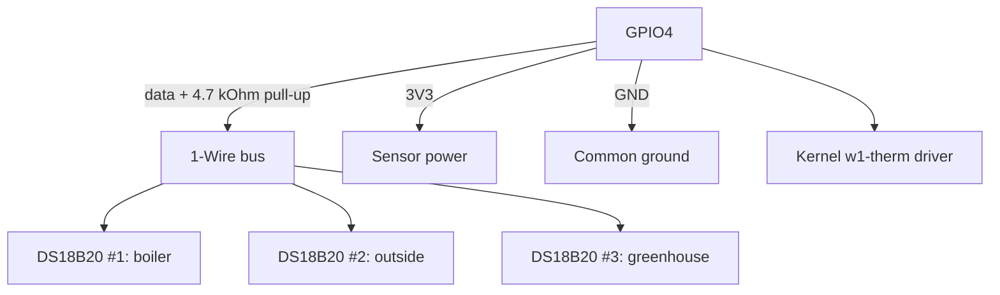

# DS18B20 Temperature on Raspberry Pi - 1-Wire Bus and Accurate Measurements

![[assets/img/rpi-ds18b20-temp-scheme.png|600]]
*Fig. 1-Wire bus: one GPIO + 4.7 kOhm pull-up - and a dozen sensors in parallel with addresses.*

> [!tip] What this note is
> The people's temperature sensor: ±0.5 °C, sealed probe, dozens on two wires. Perfect for outdoors, greenhouse, boiler. Base: [[EN/03-GPIO/01-Header-Gpiozero.en|header and gpiozero]], [[EN/10-Sensors/01-BME280-Climate.en|BME280 climate]].

## 1. Goal

Hang thermometers where needed:

- one pin - many sensors, each with its own address;
- ±0.5 °C accuracy with no calibration;
- outdoor mounting: sealed probes and long lines;
- parasitic power: when it works and when not.

| Parameter | Value |
| --- | --- |
| Range | -55...+125 °C |
| Accuracy | ±0.5 °C (-10...+85 °C) |
| Resolution | 9-12 bit (0.5-0.0625 °C) |
| Conversion time | 94-750 ms by resolution |
| Bus | 1-Wire, up to ~100 m (with nuances) |

## 2. Bus architecture



Each sensor has a unique 64-bit ROM code: the kernel creates a `/sys/bus/w1/devices/28-*/` directory per sensor. We read them as files - no libraries.

## 3. Enabling 1-Wire

- `dtoverlay=w1-gpio` in config.txt (GPIO4 pin by default);
- custom pin: `dtoverlay=w1-gpio,gpiopin=17`;
- kernel modules `w1-gpio` + `w1-therm` load themselves;
- check: `ls /sys/bus/w1/devices/` - `28-*` directories;
- reading: `cat /sys/bus/w1/devices/28-*/w1_slave`.

## 4. Response format and CRC

```text
a6 01 4b 46 7f ff 0c 10 5c : crc=5c YES
a6 01 4b 46 7f ff 0c 10 5c t=26875
```

- `YES` - checksum matches, trust the data;
- `t=26875` - millidegrees, divide by 1000;
- `NO` - repeat the read, do not write garbage to the log;
- 12 bit by default, 9 bit - 8 times faster.

## 5. Working code

```python
import glob
import time

BASE = '/sys/bus/w1/devices/'
SENSORS = {}

def discover():
    global SENSORS
    SENSORS = {}
    for d in glob.glob(BASE + '28-*'):
        name = d.split('/')[-1]
        SENSORS[name] = {'path': d + '/w1_slave', 'alias': name[-6:]}
    return SENSORS

def read_temp(path):
    try:
        with open(path) as f:
            lines = f.readlines()
        if lines[0].strip().endswith('YES'):
            t = lines[1].split('t=')[1].strip()
            return int(t) / 1000.0
    except (IndexError, ValueError, OSError):
        pass
    return None

def scan_loop():
    discover()
    print(f"found: {list(SENSORS)}")
    while True:
        for sid, s in SENSORS.items():
            t = read_temp(s['path'])
            mark = f"{t:.2f}" if t is not None else "FAIL"
            print(f"{s['alias']}: {mark}")
        time.sleep(10)

if __name__ == '__main__':
    scan_loop()
```

Aliases (`boiler`, `outside`) - a separate `{'28-xxx': 'boiler'}` dict in the config. Replugged a sensor - fix one place.

## 6. Parasitic power: yes or no

- parasitic mode (2 wires): works, but slow and fussy on long lines;
- normal (3 wires: VCC+GND+data) - always, when possible;
- length: up to 10 m with plain wire, beyond - twisted pair and stable 3.3V;
- active pull-up (MOSFET) - for dozens of sensors;
- storm and street - isolation and surge protection at the entry.

## 7. Outdoor mounting

- sealed probe in a sleeve with thermal paste - thermal contact;
- sleeve in shade, ventilated, not in the sun;
- cable - corrugated tube against UV and rodents;
- joints - soldering + adhesive heat-shrink, no twists;
- silica gel in the junction box.

## 8. Common issues

| Symptom | Cause | Fix |
| --- | --- | --- |
| No 28-* directories | overlay not enabled | `dtoverlay=w1-gpio` + reboot |
| `NO` all the time | no 4.7 kOhm pull-up | resistor between data and 3V3 |
| Always 85 °C | sensor did not convert | wait 750 ms, read again |
| Jumps on a long line | cable capacitance | twisted pair, lower speed |
| One of ten is silent | defective/swapped | check alone near the board |
| Worked, died in winter | moisture in joints | seal, silica gel |

## 9. 1-Wire quick cheat sheet

- GPIO4 pin by default, overlay in config.txt;
- 4.7 kOhm pull-up mandatory;
- read as files, check YES;
- 3 wires instead of parasitic;
- aliases - in config, not in code.

## 10. Related notes

- [[EN/03-GPIO/01-Header-Gpiozero.en|header and gpiozero]] - bus pin.
- [[EN/10-Sensors/01-BME280-Climate.en|BME280 climate]] - humidity in pair.
- [[EN/09-Firmware/03-OS-Setup.en|OS setup]] - overlays in config.txt.
- Ready weather station as a project - wave 4 note.
- [[Home.en|main map]] - full navigation.

## Official sources

- [DS18B20 (Adafruit)](https://www.adafruit.com/product/381) - probe, 1-Wire, accuracy.
- [Getting Started (Raspberry Pi docs)](https://www.raspberrypi.com/documentation/computers/getting-started.html) - 1-Wire overlays.
- [gpiozero docs (Read the Docs)](https://gpiozero.readthedocs.io/en/stable/) - pins and scripts.
