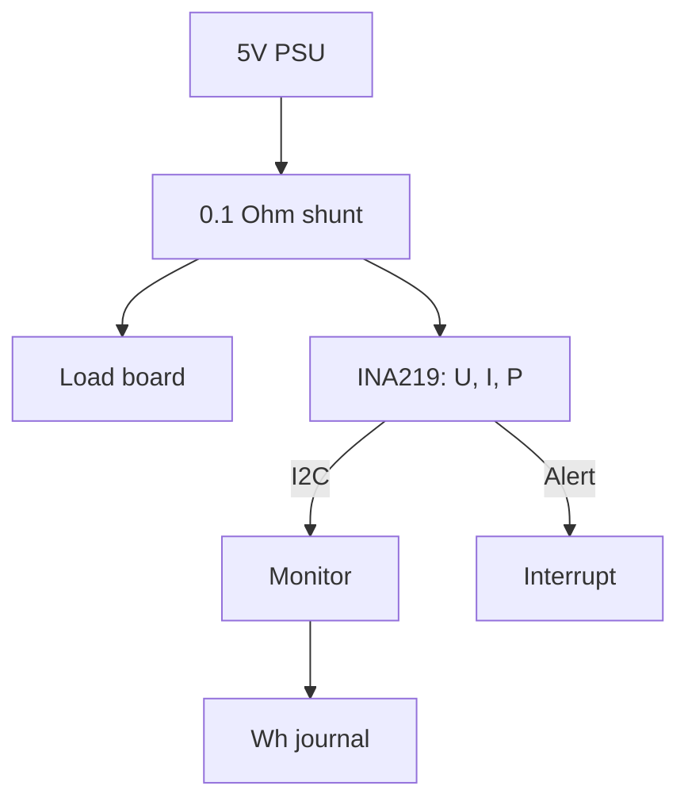

# Current on Raspberry Pi - INA219 over I2C and Energy Accounting

![[assets/img/rpi-ina219-strum-scheme.png|600]]
*Fig. INA219 on a shunt in the power plus: voltage, current and power - three registers, one bus.*

> [!tip] What this note is
> Power control of our own nodes: how much it eats, when the peak is, how many watt-hours per day. Shunt in the plus, I2C to the board, alerts on excess. Bus: [[EN/04-Interfaces/01-I2C-SPI-UART.en|I2C/SPI/UART buses]], power supply: [[EN/02-Power-Supply/01-USB-C-PD.en|USB-C power]].

## 1. Goal

Build node energy accounting:

- INA219 on a shunt: voltage, current, power;
- calibration for our shunt and range;
- excess alerts with no polling;
- watt-hour journal per day/month.

| Parameter | Value |
| --- | --- |
| Bus | I2C, addresses 0x40-0x4F |
| Bus voltage | 0-26V |
| Shunt | 0.1 Ohm by default |
| Accuracy | ~1 % after calibration |
| Alert | pin to GPIO (interrupt) |

## 2. Measurement architecture



High-side: shunt in the plus, common ground. Low-side (in the minus) - only when you know why: ground shift breaks logic.

## 3. Calibration for the task

- Calibration register = 0.04096 / (LSB × Rshunt);
- current LSB chosen for the max: 1 mA for 3.2 A;
- PGA /8 - for drops up to 320 mV on the shunt;
- averaging x128 - noise drowns with no code;
- check: lab PSU + multimeter in the break.

## 4. Alerts with no polling

- Mask/Enable register: current/power/voltage excess;
- Alert output - open drain, pull-up to 3.3V;
- route to GPIO with a falling-edge interrupt;
- in the handler - read the flag and reset;
- scenario: switch the load off with a relay on overload.

## 5. Working code

```python
import time
import board
import busio
from adafruit_ina219 import Adafruit_INA219, BusVoltageRange, Gain

i2c = busio.I2C(board.SCL, board.SDA)
ina = Adafruit_INA219(i2c)
ina.bus_voltage_range = BusVoltageRange.RANGE_16V
ina.gain = Gain.DIV_8

wh_acc = 0.0
last = time.time()

with open('/home/pi/power.csv', 'a') as log:
    while True:
        v = ina.bus_voltage + ina.shunt_voltage
        i = ina.current / 1000.0
        p = ina.power
        now = time.time()
        wh_acc += p * (now - last) / 3600.0
        last = now
        log.write(f"{time.strftime('%F %T')},{v:.2f},{i:.3f},{p:.2f},{wh_acc:.2f}\n")
        log.flush()
        print(f"{v:.2f}V {i:.3f}A {p:.2f}W total {wh_acc:.2f}Wh")
        if i > 2.5:
            print("ALARM: overcurrent!")
        time.sleep(5)
```

We append the file with `flush()` - on a blackout we lose seconds, not a day. Alert threshold - for our PSU.

## 6. Where to place the shunt

| Point | What we see | Nuance |
| --- | --- | --- |
| Node entry (after PSU) | all consumption | main meter |
| USB port | peripherals separately | shunt in the hub 5V line |
| Solar panel | generation | bidirectional not needed |
| Battery | charge/discharge | current sign shows direction |

## 7. Errors and how to suppress them

- shunt resistance drifts with temperature - take 1 % with low TCR;
- shunt self-heating at high current - power margin ×2;
- drop on the shunt lowers load voltage - compute it;
- zero calibration with the load off;
- cross-check with a multimeter every half year.

## 8. Common issues

| Symptom | Cause | Fix |
| --- | --- | --- |
| Zeros everywhere | no calibration register | library sets it, by hand - write it |
| Current twice too high | wrong shunt in the formula | check marking R100 = 0.1 Ohm |
| Noise ±50 mA | no averaging | PGA + average x128 |
| Alert never comes | pin with no pull-up | 10 kOhm to 3.3V |
| Shunt heats | small power margin | shunt ×2 in watts |
| Current sign wrong | shunt backwards | swap side or invert in code |

## 9. INA219 quick cheat sheet

- address 0x40 by default, A0/A1 - others;
- calibration - first line after init;
- alert - to GPIO with interrupt;
- journal with flush, threshold for the PSU;
- high-side, common ground.

## 10. Related notes

- [[EN/04-Interfaces/01-I2C-SPI-UART.en|I2C/SPI/UART buses]] - bus in detail.
- [[EN/02-Power-Supply/01-USB-C-PD.en|USB-C power]] - what we measure.
- [[EN/06-Analog/01-External-ADC.en|external ADCs]] - analog alternative.
- [[EN/08-Memory/02-Backup-Clone.en|backups and clones]] - journal survives the SD.
- [[Home.en|main map]] - full navigation.

## 9.1 Where accounting grows

- second channel - solar generation separately;
- daily slices in CSV for reports;
- alerts to Telegram via webhook;
- Grafana dashboard from history;
- a year of data - answers to all questions.

## Official sources

- [INA219 (Texas Instruments)](https://www.ti.com/product/INA219) - registers, calibration, alerts.
- [gpiozero docs (Read the Docs)](https://gpiozero.readthedocs.io/en/stable/) - pins and scripts.
- [Getting Started (Raspberry Pi docs)](https://www.raspberrypi.com/documentation/computers/getting-started.html) - I2C and setup.
