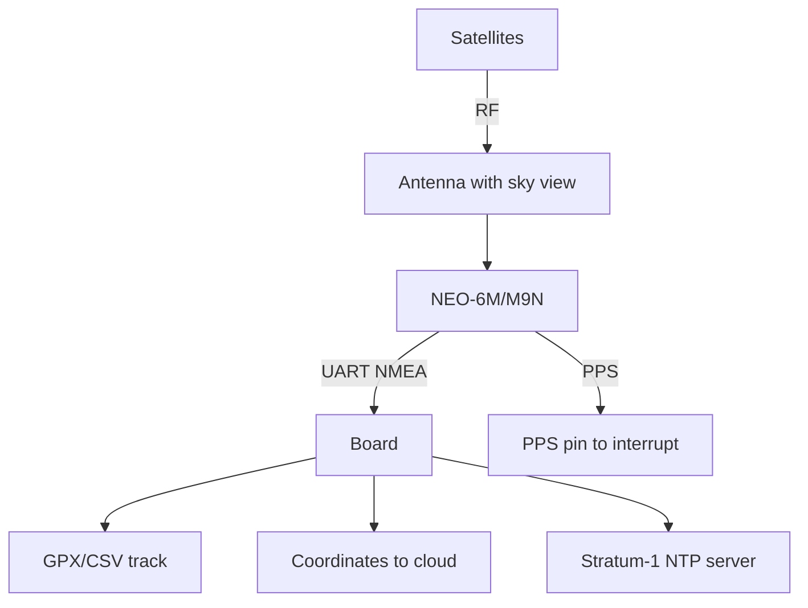

# GPS on Raspberry Pi - NEO-6M/NEO-M9N: Coordinates, Time and Tracker

![[assets/img/rpi-gps-neo-scheme.png|600]]
*Fig. GPS module on UART: NMEA stream to the board, PPS - exact second, antenna with sky view.*

> [!tip] What this note is
> Coordinates, speed and atom-accurate time from the sky: tracker, clock with no NTP, geofences. NEO-6M - cheap and enough, NEO-M9N - fast fix and more constellations. Bus: [[EN/04-Interfaces/01-I2C-SPI-UART.en|I2C/SPI/UART buses]], time: [[EN/07-Timers/01-Timers-Sleep.en|node timers and sleep]].

## 1. Goal

Get position and time from GPS:

- wiring NEO modules over UART (9600 by default);
- parsing NMEA: GGA (position), RMC (speed/date), GSV (satellites);
- PPS - exact-second pulse for an NTP server (chrony, details - [[EN/07-Timers/01-Timers-Sleep.en|timers note]]);
- tracker with logging and geofences.

| Module | Satellites | Cold start time | Antenna |
| --- | --- | --- | --- |
| NEO-6M | GPS+SBAS | ~30 s | ceramic on board |
| NEO-M9N | GPS+GLONASS+Galileo+BeiDou | ~20 s | active recommended |
| NEO-M8N | like M9N, older | ~25 s | active |

## 2. Node architecture



The antenna must see the sky: windowsill - minimum, roof - ideal. Indoors with no window there will never be a fix.

## 3. Wiring

| NEO module | Board | Note |
| --- | --- | --- |
| VCC | 5V (GY modules) / 3V3 | by module version |
| GND | ground | nearby |
| TX | RXD (pin 10) | crossed! |
| RX | TXD (pin 8) | crossed! |
| PPS | GPIO18 | exact-second interrupt |

Remove the console from UART0 (`enable_uart=1`, no `console=serial0`), otherwise the kernel litters the GPS stream.

## 4. NMEA minimum

- `$GPGGA` - time, latitude, longitude, fix quality, satellites;
- `$GPRMC` - date, speed in knots, course;
- `$GPGSV` - visible satellites and SNR;
- fix quality: 0 - none, 1 - GPS, 2 - DGPS;
- parse only valid ones (`A` in RMC), ignore the rest.

## 5. Working code: tracker

```python
import serial
import time
import math

gps = serial.Serial('/dev/serial0', 9600, timeout=1)

def nmea_to_deg(raw, hemi):
    d = int(float(raw) / 100)
    m = float(raw) - d * 100
    v = d + m / 60.0
    if hemi in 'SW':
        v = -v
    return v

def parse_gga(parts):
    if len(parts) < 10 or parts[6] == '0':
        return None
    lat = nmea_to_deg(parts[2], parts[3])
    lon = nmea_to_deg(parts[4], parts[5])
    return lat, lon, parts[7]

def parse_rmc(parts):
    if len(parts) < 10 or parts[2] != 'A':
        return None
    lat = nmea_to_deg(parts[3], parts[4])
    lon = nmea_to_deg(parts[5], parts[6])
    knots = float(parts[7] or 0)
    return lat, lon, knots * 1.852

last = None
dist = 0.0
with open('/home/pi/track.csv', 'a') as log:
    while True:
        line = gps.readline().decode('ascii', errors='ignore')
        if line.startswith('$GPGGA'):
            p = parse_gga(line.strip().split(','))
            if p:
                lat, lon, sats = p
                if last:
                    dlat = math.radians(lat - last[0])
                    dlon = math.radians(lon - last[1])
                    a = math.sin(dlat/2)**2 + math.cos(math.radians(last[0])) * math.cos(math.radians(lat)) * math.sin(dlon/2)**2
                    dist += 6371 * 2 * math.asin(math.sqrt(a))
                last = (lat, lon)
                log.write(f"{time.strftime('%F %T')},{lat:.6f},{lon:.6f},{dist:.2f}\n")
                log.flush()
                print(f"{lat:.6f},{lon:.6f} sats={sats} km={dist:.2f}")
```

Haversine computes the distance between points. Filter: ignore jumps above 200 km/h (urban canyons lie).

## 6. PPS and exact time

- PPS pin to GPIO with a rising-edge interrupt;
- `pps-gpio` overlay + `chrony` with a PPS source;
- accuracy - microseconds, our own Stratum-1 server;
- check: `chronyc sources` shows PPS with a star;
- home NTP clients - to our server, not to the internet.

## 7. Geofences and alerts

- circle: distance from base under radius - inside;
- entry/exit - event to MQTT;
- speed above threshold - alert;
- parking longer than N minutes - separate event;
- always write the track, alerts - on events.

## 8. Common issues

| Symptom | Cause | Fix |
| --- | --- | --- |
| No fix for hours | antenna indoors | window/roof, sky view |
| Garbage instead of NMEA | wrong speed | 9600 by default, check |
| Console lines in the stream | getty on UART0 | disable console, keep UART |
| Coordinate jumps | few satellites | wait for 3D fix (4+ satellites) |
| No PPS | pin not wired | PPS to GPIO + pps-gpio overlay |
| Year 1970 time | no fix + no NTP | wait for fix, chrony picks up |

## 9. GPS quick cheat sheet

- antenna sees the sky - no other way;
- TX→RX crossed, console away;
- parse only valid frames;
- PPS - for exact time;
- speed-jump filter mandatory.

## 10. Related notes

- [[EN/04-Interfaces/01-I2C-SPI-UART.en|I2C/SPI/UART buses]] - UART in detail.
- [[EN/10-Sensors/02-MPU6050-Motion.en|MPU6050 motion]] - heading with no satellites.
- [[16-Projects/02-GPS-Treker|ready GPS tracker]] - full project.
- [[EN/09-Firmware/03-OS-Setup.en|OS setup]] - chrony and time.
- [[Home.en|main map]] - full navigation.

## Official sources

- [NEO-6 series (u-blox)](https://www.u-blox.com/en/product/neo-6-series) - NMEA, PPS, sensitivity.
- [NEO-M9N module (u-blox)](https://www.u-blox.com/en/product/neo-m9n-module) - constellations, cold start.
- [Getting Started (Raspberry Pi docs)](https://www.raspberrypi.com/documentation/computers/getting-started.html) - UART and overlays.
