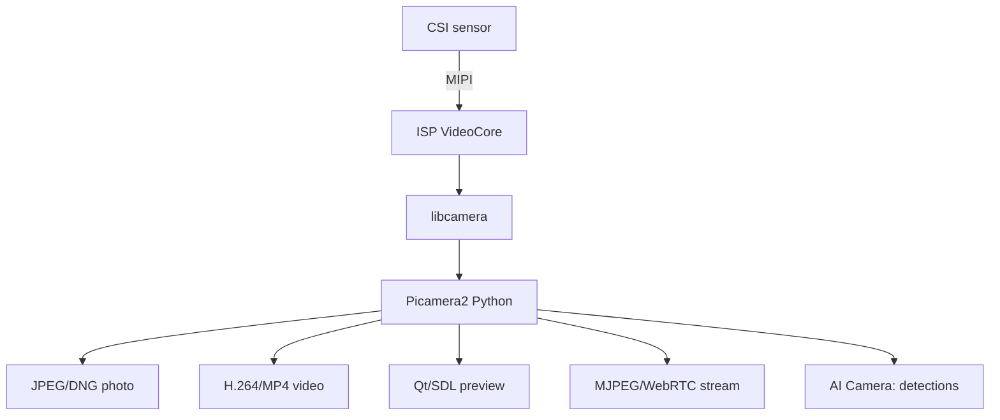

# CSI Camera on Raspberry Pi - Picamera2, Autofocus and Streaming

![[assets/img/rpi-kamera-csi-scheme.png|600]]
*Fig. Camera with a CSI cable to the CAMERA port: Picamera2 controls, files to disk, stream to the network.*

> [!tip] What this note is
> Eyes of the board: photo, video, stream, timelapse, recognition. The libcamera + Picamera2 stack replaced the old raspistill - learn the new one. Cables: [[EN/00-Start/04-Dev-Boards.en|boards and accessories]], media: [[EN/08-Memory/01-SD-eMMC-NVMe.en|storage media]].

## 1. Goal

Get a picture in 10 minutes and squeeze the max:

- modules: Camera Module 3, AI Camera, HQ, compatibles;
- Picamera2: photo, video, preview, controls;
- stream to a browser and timelapse to disk;
- motion detection with no neural networks.

| Module | Sensor | Focus | For what |
| --- | --- | --- | --- |
| Camera Module 3 | IMX708 12 MP | autofocus | universal |
| Camera Module 3 NoIR | IMX708 no IR filter | autofocus | night with illumination |
| HQ Camera | IMX477 12 MP | interchangeable lenses | quality |
| AI Camera | IMX500 + Hailo | autofocus | analytics on camera |
| Zero cameras | small cables | fixed | Zero traps |

## 2. Stack architecture



Old stack (raspistill/vcgencmd) is dead on Bookworm - do not look for 2020 guides. Only libcamera + Picamera2.

## 3. Wiring

- cable blue stripe to the port, latch fully;
- CAM0/CAM1 on Pi 5 - both 4-lane, cameras anywhere;
- on old ones - one full + one cut-down;
- cable length up to 2 m (shielded extenders);
- `libcamera-hello --list-cameras` - camera visible? work.

## 4. Picamera2: modes and controls

- `create_still_configuration` / `create_video_configuration` / `create_preview_configuration`;
- controls: `AfMode`, `ExposureTime`, `AnalogueGain`, `AwbMode`, `Brightness`;
- autofocus: `AfMode.Continuous` for video, `Auto` for photo;
- autofocus ROI - rectangle on the object;
- DNG (raw) - for processing, JPEG - for people.

## 5. Working code

```python
from picamera2 import Picamera2
from picamera2.encoders import H264Encoder
from picamera2.outputs import FileOutput
import time

picam = Picamera2()
still_cfg = picam.create_still_configuration(main={"size": (4608, 2592)})
video_cfg = picam.create_video_configuration(main={"size": (1920, 1080)})

def photo(path):
    picam.configure(still_cfg)
    picam.set_controls({"AfMode": 2})
    picam.start()
    time.sleep(1)
    picam.capture_file(path)
    picam.stop()

def clip(path, seconds=10):
    picam.configure(video_cfg)
    picam.start()
    enc = H264Encoder(bitrate=5000000)
    out = FileOutput(path)
    picam.start_encoder(enc, out)
    time.sleep(seconds)
    picam.stop_encoder()
    picam.stop()

def timelapse(n=144, every=600):
    picam.configure(still_cfg)
    picam.start()
    time.sleep(2)
    for i in range(n):
        picam.capture_file(f"/home/pi/tl/frame_{i:04d}.jpg")
        time.sleep(every)
    picam.stop()

if __name__ == '__main__':
    photo('/home/pi/shot.jpg')
```

Timelapse 144 frames every 10 min - a day. Stitch: `ffmpeg -framerate 24 -i frame_%04d.jpg out.mp4`.

## 6. Stream to a browser

- Picamera2 MJPEG server from examples - 5 lines of code;
- WebRTC - fractions of a second delay (media server);
- HLS - for many viewers via nginx;
- port and password - do not expose the stream to the world with no auth;
- night: NoIR + 850 nm IR spotlight (invisible to humans).

## 7. Motion detection with no neural networks

- frame difference at low resolution (320×240);
- threshold + morphology - cut noise and leaves;
- ROI zones: doors yes, road no;
- clip recording only on event - disk space;
- AI Camera - people/animal detections on the camera itself.

## 8. Common issues

| Symptom | Cause | Fix |
| --- | --- | --- |
| `no cameras available` | cable/incompatible module | replug, `list-cameras` |
| Black frame | autoexposure too slow | 1-2 s delay after start |
| Pink picture | NoIR with no IR in day | NoIR - only with filter/at night |
| Old code broken | raspistill removed | rewrite for Picamera2 |
| Stream lags | bitrate/WiFi | lower bitrate, wire |
| Disk full overnight | video with no rotation | event clips + rotation |

## 9. Camera quick cheat sheet

- cable blue side to the port, latch;
- `list-cameras` - first command;
- Bookworm = Picamera2 only;
- photo: pause for autofocus;
- stream: MJPEG for simplicity.

## 10. Related notes

- [[EN/08-Memory/01-SD-eMMC-NVMe.en|storage media]] - where to write video.
- [[EN/04-Interfaces/01-I2C-SPI-UART.en|I2C/SPI/UART buses]] - focus control of old modules.
- [[EN/11-Vivid/01-DSI-HDMI-Displays.en|image output to displays]] - screens.
- [[15-Protocols/01-MQTT|MQTT notifications]] - broker and topics.
- [[Home.en|main map]] - full navigation.

## Official sources

- [picamera2 (Raspberry Pi, GitHub)](https://github.com/raspberrypi/picamera2) - library and examples.
- [Picamera2 Manual (Raspberry Pi)](https://datasheets.raspberrypi.com/camera/picamera2-manual.pdf) - configurations and controls.
- [Getting Started (Raspberry Pi docs)](https://www.raspberrypi.com/documentation/computers/getting-started.html) - camera wiring.
