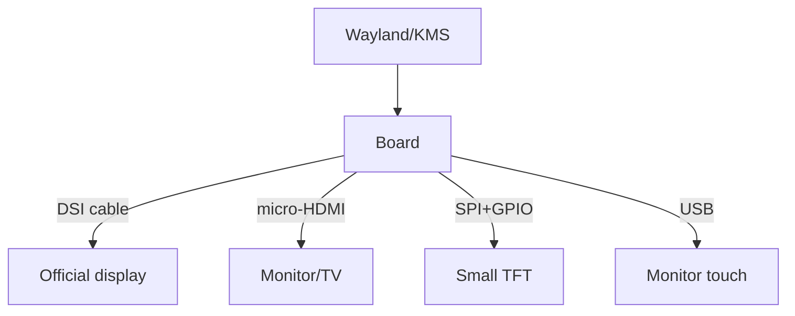

# Raspberry Pi Displays - DSI, HDMI and Touch Panels

![[assets/img/rpi-dsi-hdmi-displeyi-scheme.png|600]]
*Fig. Three image paths: DSI cable, HDMI cable, SPI module - choice by size and task.*

> [!tip] What this note is
> Screen for the board: official DSI panels, any HDMI monitor and small SPI displays. Touch, kiosk mode, rotation. Camera pair: [[EN/10-Sensors/06-CSI-Camera.en|CSI camera]], system: [[EN/09-Firmware/03-OS-Setup.en|OS setup]].

## 1. Goal

Choose and launch a display:

- DSI: official 7" and 5" with touch - work out of the box;
- HDMI: monitors and TVs, including 4K;
- SPI: tiny TFTs for instruments;
- touch calibration, rotation, kiosk mode.

| Display | Connection | Resolution | Touch |
| --- | --- | --- | --- |
| Official 7" DSI | DSI + power from board | 800×480 | yes |
| Official 5" DSI | DSI | 800×480 | yes |
| HDMI monitor | micro-HDMI | up to 4Kp60 | separate USB |
| SPI TFT 2-3.5" | SPI + GPIO | 320×480 | resistive |
| E-paper | SPI | varies | none |

## 2. Output architecture



Bookworm: Wayland by default, old `display_rotate` does not work - rotation via `wlr-randr` or KMS parameters.

## 3. DSI panels in detail

- power goes via cable + separate wires from the board (per manual!);
- touch - USB line in the same cable, do not wire separately;
- backlight brightness - in software (`backlight` class);
- two DSI on Pi 5 - two displays at once;
- SmartiPi cases hold the board behind the display.

## 4. HDMI nuances

- HDMI0 - main (sound, CEC, 4Kp60);
- `hdmi_force_hotplug=1` for headless VNC;
- CEC: TV remote controls Kodi;
- cable length up to 3 m at 4K with no amplifier;
- micro-HDMI adapters with shielding, not foil.

## 5. Working code: kiosk

```bash
#!/bin/bash
# kiosk.sh — браузер на весь екран після входу
export DISPLAY=:0
export XDG_RUNTIME_DIR=/run/user/1000
chromium-browser \
  --noerrdialogs \
  --disable-infobars \
  --kiosk http://localhost:8080 \
  --incognito \
  --disable-translate \
  --overscroll-history-navigation=0 &
```

```ini
[Unit]
Description=Kiosk browser
After=graphical.target
Wants=graphical.target

[Service]
User=pi
Environment=DISPLAY=:0
Environment=XDG_RUNTIME_DIR=/run/user/1000
ExecStart=/home/pi/kiosk.sh
Restart=always

[Install]
WantedBy=graphical.target
```

Autologin to the graphical session via `raspi-config` (Boot → Desktop Autologin). The page is served by a local dashboard server.

## 6. Touch calibration

- capacitive (DSI/HDMI-USB) - usually accurate out of the box;
- resistive (SPI) - calibration with `xinput_calibrator` or evdev parameters;
- screen rotation + touch rotation - two different commands!;
- multitouch - gestures in the Wayland compositor;
- gloves - only resistive or special capacitive.

## 7. Small SPI displays

- fbtft drivers in the kernel (ili9341, st7735 and others);
- overlay `dtoverlay=piscreen` (+ speed/rotation parameters);
- SPI frequency 30-60 MHz - smooth refresh;
- framebuffer `/dev/fb1` - console or X server on it;
- enough for instruments, not for video.

## 8. Common issues

| Symptom | Cause | Fix |
| --- | --- | --- |
| DSI black | no panel power | power wires per display manual |
| Touch mirrors | screen rotation with no touch | rotate the transformation matrix |
| Old commands broken | `display_rotate` dead | KMS/wlr-randr under Wayland |
| HDMI no signal | cable/wrong port | HDMI0, quality cable |
| SPI white screen | wrong driver/speed | overlay for the display chip |
| Kiosk shows error | server not up yet | `After` + retry in script |

## 9. Display quick cheat sheet

- DSI: power per manual + cable;
- HDMI0 - main for 4K and sound;
- rotation: screen and touch separately;
- kiosk: autologin + systemd + chromium;
- SPI - for instruments, not video.

## 10. Related notes

- [[EN/10-Sensors/06-CSI-Camera.en|CSI camera]] - eye+screen pair.
- [[EN/11-Vivid/02-NeoPixel-Servo-Relay.en|NeoPixel and servo]] - LED output.
- [[EN/09-Firmware/03-OS-Setup.en|OS setup]] - autologin and services.
- [[EN/02-Power-Supply/01-USB-C-PD.en|USB-C power]] - display eats current.
- [[Home.en|main map]] - full navigation.

## 9.1 Second screen: when needed

- instrument status panel - SPI TFT;
- big dashboard - HDMI monitor;
- two screens: DSI + HDMI at once;
- console on the small, graphics on the big;
- brightness by light sensor.

## Official sources

- [Touch Display (Raspberry Pi)](https://www.raspberrypi.com/products/raspberry-pi-touch-display/) - DSI panel, power, touch.
- [Getting Started (Raspberry Pi docs)](https://www.raspberrypi.com/documentation/computers/getting-started.html) - displays and configuration.
- [Raspberry Pi OS (Raspberry Pi)](https://www.raspberrypi.com/software/) - kiosk and Wayland.
