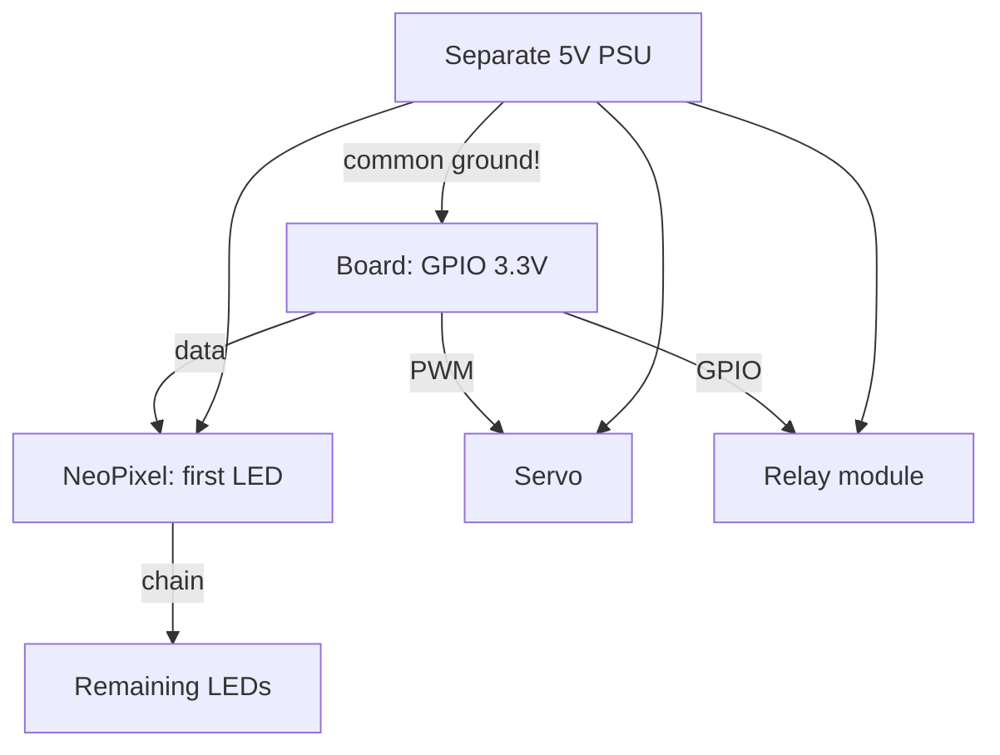

# NeoPixel, Servo and Relay on Raspberry Pi - Power through GPIO

![[assets/img/rpi-neopixel-servo-rele-scheme.png|600]]
*Fig. A weak pin drives strong light: NeoPixel - by data, servo - by pulses, relay - via transistor.*

> [!tip] What this note is
> Power peripherals: light, motion, 220V switching. GPIO only controls - current comes from separate power. Base: [[EN/03-GPIO/02-PWM-Interrupts.en|PWM and interrupts]], power supply: [[EN/02-Power-Supply/01-USB-C-PD.en|USB-C power]].

## 1. Goal

Move the real world safely:

- NeoPixel: hundreds of LEDs on one pin;
- servo: angles with no jitter;
- relay: 220V via optoisolation;
- powering the power stage separately from the board.

| Load | Control | Power supply |
| --- | --- | --- |
| NeoPixel strip | 1 data pin 800 kHz | 5V, 60 mA per LED |
| Servo SG90/MG996R | PWM 50 Hz | 5-6V separate |
| Relay module 5V | GPIO + transistor on module | 5V, coil 70 mA |
| MOSFET load | PWM to gate | by load |

## 2. Power architecture



Common ground mandatory: without it signals float and everything behaves oddly. Board and power fed from one PSU, but with different wires.

## 3. NeoPixel in detail

- `rpi_ws281x` library: DMA-driven, no jitter;
- data pin: GPIO18 (PWM channel) - most stable;
- first LED - no further than 1 m from the board, beyond - signal amplifier;
- brightness 255 on hundreds of LEDs = amps: compute (60 mA × N);
- 1000 uF capacitor on strip power + 300 Ohm resistor in data.

## 4. Servo in detail

- gpiozero Servo: angles -1..1, min/max calibration;
- separate power: current surge resets the board via a shared PSU;
- MG996R - metal gearbox, SG90 - plastic for toys;
- more than 2 servos - PCA9685 over I2C (16 channels);
- start position - in code before servo power-up.

## 5. Working code

```python
import time
import board
import neopixel
from gpiozero import Servo, OutputDevice
from gpiozero.pins.lgpio import LGPIOFactory

factory = LGPIOFactory()
pixels = neopixel.NeoPixel(board.D18, 30, brightness=0.3, auto_write=False)
servo = Servo(12, pin_factory=factory, min_pulse_width=0.001, max_pulse_width=0.002)
relay = OutputDevice(23, pin_factory=factory, active_high=True)

def set_strip(r, g, b):
    pixels.fill((r, g, b))
    pixels.show()

def alarm():
    for _ in range(3):
        set_strip(255, 0, 0)
        relay.on()
        time.sleep(0.3)
        set_strip(0, 0, 0)
        relay.off()
        time.sleep(0.3)

if __name__ == '__main__':
    servo.mid()
    set_strip(0, 255, 0)
    time.sleep(3600)
```

Brightness 0.3 - eye and PSU protection. Relay clicks only in emergency, not in a loop (contact life!).

## 6. Relay and 220V: safety

- modules with optoisolation: 3.3V control ok;
- 220V switching - only in a housing, Wago terminals;
- snubber (RC) on inductive load;
- fuse in phase before the relay;
- marking: what each relay switches off - on the housing.

## 7. Powering the power stage

| Load | Current | Source |
| --- | --- | --- |
| 30 NeoPixel, brightness 0.3 | ~0.5A | board PSU is enough |
| 300 NeoPixel, full | ~18A | separate 5V 20A PSU |
| 2×SG90 | ~1A peak | 5V 2A PSU |
| Relay 4 channels | ~0.3A | from board via USB PSU |

## 8. Common issues

| Symptom | Cause | Fix |
| --- | --- | --- |
| First LEDs lit, rest not | strip supply sag | feed every 50 LEDs |
| Servo jerks | shared weak PSU | separate servo power |
| Relay clicks alone | floating input | pull-down, shielded wire |
| Colors wrong | GRB vs RGB order | library pixel_order parameter |
| Board reboots at start | inrush current | soft-start: brightness ramps |
| Pin burnt | 5V on GPIO | level converter, pin is gone |

## 9. Power quick cheat sheet

- ground always common;
- power stage fed separately;
- NeoPixel: capacitor + resistor;
- servo: calibration + separate PSU;
- 220V: housing, terminals, fuse.
- wire marking: colors and tags.
- photo of assembly before closing the housing.

## 10. Related notes

- [[EN/03-GPIO/02-PWM-Interrupts.en|PWM and interrupts]] - control signals.
- [[EN/11-Vivid/01-DSI-HDMI-Displays.en|DSI/HDMI displays]] - visual output.
- [[EN/11-Vivid/03-Audio-HAT.en|audio and HAT]] - sound to light.
- [[EN/02-Power-Supply/01-USB-C-PD.en|USB-C power]] - current budget.
- [[Home.en|main map]] - full navigation.

## Official sources

- [NeoPixel Uberguide (Adafruit Learn)](https://learn.adafruit.com/adafruit-neopixel-uberguide) - power, timings, topologies.
- [gpiozero docs (Read the Docs)](https://gpiozero.readthedocs.io/en/stable/) - Servo, PWMLED, relay.
- [Getting Started (Raspberry Pi docs)](https://www.raspberrypi.com/documentation/computers/getting-started.html) - pins and power.
