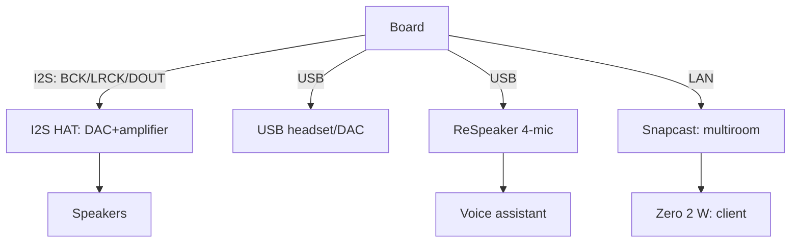

# Audio on Raspberry Pi - I2S HAT, USB Sound and Multiroom

![[assets/img/rpi-audio-hat-scheme.png|600]]
*Fig. Three sound paths: I2S HAT board for quality, USB - for simplicity, microphone array - for voice.*

> [!tip] What this note is
> Pi has no built-in sound (a PWM buzzer does not count): I2S HAT boards and USB give quality. Media center, notifications, voice assistant, multiroom. Displays: [[EN/11-Vivid/01-DSI-HDMI-Displays.en|DSI/HDMI displays]], buses: [[EN/04-Interfaces/01-I2C-SPI-UART.en|I2C/SPI/UART buses]].

## 1. Goal

Get sound for the task:

- I2S HAT (HiFiBerry/DAC+): music with no compromises;
- USB audio: headset, speaker, microphone - plug-and-play;
- microphone arrays: ReSpeaker for voice commands;
- multiroom: synchronous sound across rooms.

| Path | Quality | Latency | Price |
| --- | --- | --- | --- |
| I2S HAT DAC | excellent | low | medium |
| USB audio | good | medium | low |
| HDMI audio | good | low | zero (to monitor) |
| BT audio | compressed | high | convenience |

## 2. Path architecture



An I2S HAT board sits on the header like a HAT: overlay in config.txt, then - a plain ALSA card.

## 3. I2S HAT in detail

- HiFiBerry DAC+ / DAC2 HD: de-facto standard;
- overlay: `dtoverlay=hifiberry-dacplus` + reboot;
- check: `aplay -l` shows the card;
- Amp2/Amp+ amplifiers: speakers directly, no receiver;
- power: clean 5V, PSU noise heard in pauses.

## 4. USB audio and microphones

- USB headsets and DACs - no drivers (UAC1/UAC2);
- card choice: `pavucontrol` or `raspi-config` (audio);
- ReSpeaker 4-Mic: DOA (sound direction) + noise suppression;
- udev rule - fixed card index with two USB;
- levels: `alsamixer -c N`, save with `alsactl store`.

## 5. Working code: notifications and multiroom

```bash
#!/bin/bash
# announce.sh — голосове сповіщення поверх музики
CARD="plughw:0,0"
MP3="$1"
mpg123 -a "$CARD" -q "$MP3"
```

```python
import subprocess
import paho.mqtt.client as mqtt

def on_message(client, userdata, msg):
    text = msg.payload.decode()
    subprocess.run(['espeak-ng', '-v', 'uk', '-s', '150', text])

cl = mqtt.Client()
cl.connect('broker.local', 1883, 60)
cl.subscribe('home/say')
cl.on_message = on_message
cl.loop_forever()
```

Snapcast: server on Pi 4/5 (`snapserver`), clients on Zero 2 W (`snapclient`) - millisecond sync over LAN.

## 6. Voice assistant minimum

- wake-word: openWakeWord on ReSpeaker;
- STT: Vosk offline (Ukrainian model!);
- intents: simple rules or Home Assistant;
- TTS: Piper with a Ukrainian voice offline;
- all local - the cloud does not hear the kitchen.

## 7. HDMI audio and BT

- sound to a monitor/TV over HDMI - zero hardware;
- output switching: right-click on volume;
- BT speaker: pair once, autoconnect;
- BT delay ~200 ms - video desyncs, audio ok.

## 8. Common issues

| Symptom | Cause | Fix |
| --- | --- | --- |
| HAT silent | no overlay | dtoverlay for the model + reboot |
| Hoarse at peaks | weak power | separate PSU, not USB hub |
| USB card vanishes | index floats | udev rule by VID:PID |
| Microphone noisy | AGC + cheap PSU | disable AGC, clean power |
| BT stutters | WiFi and BT on one antenna | split channels, wire for music |
| Snapcast desync | client WiFi lag | wire to clients, bigger buffer |

## 9. Audio quick cheat sheet

- I2S HAT: overlay + `aplay -l`;
- USB: udev index pinning;
- save levels with `alsactl store`;
- voice: ReSpeaker + Vosk + Piper;
- multiroom: Snapcast over wire.

## 10. Related notes

- [[EN/11-Vivid/01-DSI-HDMI-Displays.en|DSI/HDMI displays]] - image to sound.
- [[EN/11-Vivid/02-NeoPixel-Servo-Relay.en|NeoPixel and servo]] - light music.
- [[EN/04-Interfaces/01-I2C-SPI-UART.en|I2C/SPI/UART buses]] - HAT control.
- [[EN/03-GPIO/03-HAT-EEPROM.en|HAT and EEPROM]] - HAT board mechanics.
- [[Home.en|main map]] - full navigation.

## 9.1 Quiet room: fighting noise

- ground star from one point;
- USB audio away from the WiFi antenna;
- ferrites on speaker power cables;
- night mode: software volume limiter;
- silence test: ear to speaker with no signal.
- L/R cables not next to power ones.
- start volume - 50 %, not 100 %.
- second room - second Snapcast client.
- backup copy of asound.state after setup.

## Official sources

- [MAX98357A I2S Amp (Adafruit)](https://www.adafruit.com/product/3006) - 3W I2S amplifier.
- [Raspberry Pi Configuration (Raspberry Pi docs)](https://www.raspberrypi.com/documentation/computers/configuration.html) - audio and overlays.
- [Getting Started (Raspberry Pi docs)](https://www.raspberrypi.com/documentation/computers/getting-started.html) - HAT and extensions.
