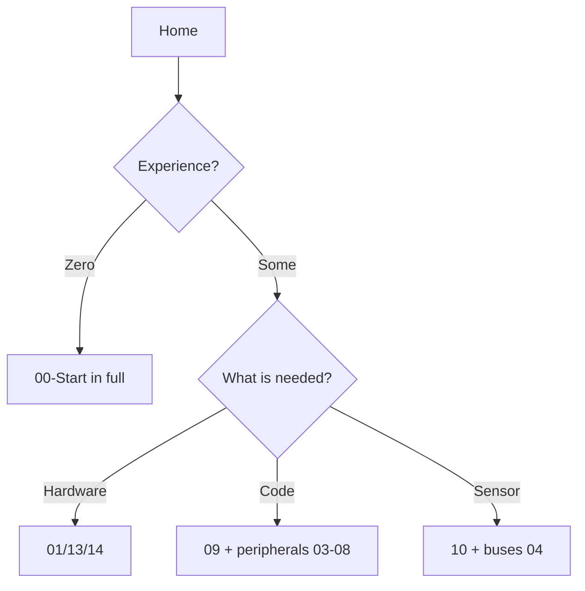

# How to use the reference

![[assets/img/stm32-howto-map-scheme.png|600]]
*Fig. Movement map: Home → section → note → code → hardware.*

> [!tip] Purpose of this note
> Explain the base layout in 3 minutes: where to go with a specific task.

## 1. Purpose

The base is built as a MOC (Map of Content): [[Home.en]] is the entry, 18 sections are topics, notes are answers with code. Every note looks the same inside: purpose → specs → pins → schematic → code → issues → sources. The `scripts/` validators check the standard - all report zero.

## Task paths

| Task | Path |
| --- | --- |
| First Blink | [[00-Start/04-Devkit-plati| DevKit boards]] → [[00-Start/05-Vibir-seredovischa| Environment choice]] |
| Pick a chip | [[00-Start/03-Porivnyannya-chipiv| Chip comparison]] |
| Sensor over I2C | Section 10 (queue 4) → a specific sensor |
| Board does not work | FAQ + logic + ST-Link debug (queues 1, 5) |

```text
Правило 5 хвилин: не знайшов відповідь за 5 хвилин навігацією —
користуйся пошуком Obsidian за тегом або назвою чипа/модуля.
```

## Mermaid: where to go



## Common issues

| # | Issue | Cause | Fix |
| --- | --- | --- | --- |
| 1 | Reading cover to cover like a book | The base is a reference, not a textbook | Start from a task via the path table |
| 2 | Old revision of a note | Information may be outdated | Check the date and CHANGELOG |
| 3 | Ignoring "See also" | Same questions duplicated across notes | Follow the cross links |

## Official sources

- [STM32 Documentation (ST)](https://www.st.com/en/microcontrollers-microprocessors/stm32-32-bit-arm-cortex-mcus.html) - entry point into the docs.
- [STM32CubeMX (ST)](https://www.st.com/en/development-tools/stm32cubemx.html) - configurator and selector.

## Note anatomy in detail

| Block | Contents | Purpose |
| --- | --- | --- |
| Purpose + tip | One sentence of goal | Know in 10 seconds whether this is your note |
| Specs | Parameter table | Compare options without reading everything |
| Pins / ASCII schematic | Text wiring diagram | Assemble without a picture |
| PNG figure | Generated schematic | Verify with your eyes |
| Code | HAL/LL/Arduino fragments | Copy and run |
| Common issues | Table of pitfalls | Avoid stepping twice |
| Official sources | ST documentation | Primary source instead of forums |
| See also | Cross links | Go further on the topic |

## Tags and search

Every note has tags: `stm32` + topic (`gpio`, `adc`, `power`...). Search by chip tag (`f4`, `g0`), peripheral (`i2c`, `dma`) or board (`bluepill`, `nucleo`). Frontmatter holds `description` - a condensed summary for listings.

## Versions and dates

The header block holds `date-created` and `date` (last update). ST releases new silicon revisions and HAL versions every quarter: compare the note date against your CubeIDE/HAL version. Outdated content is flagged in CHANGELOG.

## Note walkthrough on an example

Take a sample sensor note. Reading top to bottom:

1. **Header frontmatter** - `title` (what it is), `description` (brief), `tags` (for search), `date` (freshness). Stale date + new HAL version = check relevance.
2. **H1 + figure** - topic at one glance. The figure is script-generated, single style: header, bullets, footer.
3. **Purpose + tip** - whether this is your task. Not yours - follow the links onward, do not read everything.
4. **Specs** - "parameter → value" table. Compare columns, not paragraphs.
5. **Pins and ASCII schematic** - assemble straight from the text, without opening the picture.
6. **Code** - copy in blocks, but read the comments: traps live there (timings, init order).
7. **Common issues** - read BEFORE assembling, not after the smoke. Every row is someone's burnt board.
8. **Official sources** - when the note is not enough: Reference Manual by section number, datasheet by table.

## Base abbreviation dictionary

| Abbreviation | Meaning | Where you meet it |
| --- | --- | --- |
| HAL / LL | Hardware Abstraction / Low-Layer | All code examples |
| MOC | Map of Content (this page!) | Navigation |
| SWD | Serial Wire Debug | Flashing and debug |
| DFU | Device Firmware Upgrade | Flashing over USB |
| OB / RDP | Option Bytes / Readout Protection | Firmware protection |
| HSE/HSI/LSE/LSI | Clock generators | Frequency setup |
| AF | Alternate Function | Pins and peripherals |
| DNP / NC | Do Not Populate / Not Connected | Schematics and BOM |

## FAQ

| Question | Answer |
| --- | --- |
| Where to start from zero? | "Newcomer" path on [[Home.en]]: guide → chips → boards → environment |
| Where is code for my board? | In the topic note, "Code" section; adapt pins to your board |
| Is the note outdated? | Check `date` in the header and CHANGELOG; ST docs are the primary source |
| My board is missing? | Search by chip, not by board name (the same F103 sits on hundreds of boards) |
| Issue not covered by a note? | FAQ + OpenOCD logic + a question with a debug log |

## How to suggest edits

Found an issue - record it: file, line, what is wrong, what you checked (board, chip, HAL version). An edit unverified on hardware is not accepted.

## Section map at a glance

| Section | About | When to go |
| --- | --- | --- |
| 00-Start | Chip, board, environment choice | You are here |
| 01-Hardware | Families, packages, errata | Picking hardware |
| 02-Zhivlennya | Power supply and sleep | Budgeting a battery |
| 03-GPIO | Pins and alternate functions | A pin does not work |
| 04-Shini | I2C/SPI/UART/CAN/USB | Connecting a module |
| 05-Radio | Wireless modules | Needing a link |
| 06-Analog | ADC/DAC/comparators | Measuring analog |
| 07-Timeri-Son | Timers, RTC, sleep | Precise time or PWM |
| 08-Pamyat | Flash, OB, bootloader | Storing settings |
| 09-Proshivka | IDE, HAL/LL, debug | Writing code |
| 10-Sensori | Sensors | Measuring the world |
| 11-Vivid | Outputs and actuators | Displaying/moving |
| 12-Moduli | Comms modules | Extending capability |
| 13-Moduli | Power supply and levels | Powering a node |
| 14-Devboards | Boards | Picking a carrier |
| 15-Protokoli | USB, CANopen, Modbus | Speaking protocols |
| 16-Proekti | Finished builds | Repeating whole |
| 17-Lab | Instruments | Debugging |
| 99-Dodatki | Tables, FAQ, errata | Quick lookup |

## See also

- [[Home.en]]
- [[00-Start/03-Porivnyannya-chipiv| Chip comparison]]
