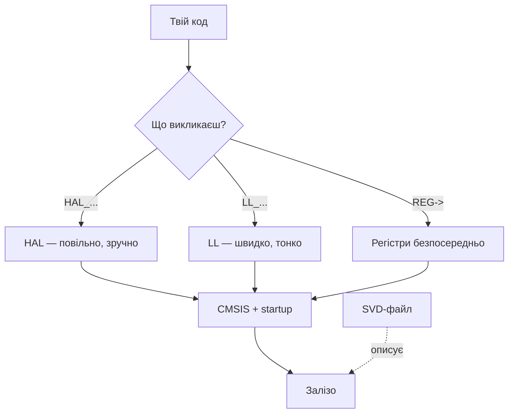

# Глосарій STM32 - терміни

EN version: `00-Start/02-Glosariy.en.md`

![[assets/img/stm32-glossary-terms-scheme.png|600]]
*Рис. Шари STM32: залізо → CMSIS → HAL/LL → твій код; збоку - інструменти.*

> [!tip] Призначення ноти
> Розшифрувати абревіатури, які ST сипле в кожному документі: чим HAL відрізняється від LL, що таке SVD і чому без нього немає дебагу.

## 1. Призначення

Новачок в STM32 тоне не в регістрах, а в словнику: HAL, LL, CMSIS, SVD, OCD, SWD, DFU, OB - усе це різні шари і інструменти, які треба розрізняти до першого проєкту. Ця нота - словник з прив'язкою «де це живе».

## Середовище і шари коду

| Термін | Розшифровка | Пояснення |
| --- | --- | --- |
| HAL | Hardware Abstraction Layer | Обгортки ST: читабельно, переносимо між чипами, повільніше |
| LL | Low-Layer | Тонкі інлайни близько до регістрів: швидко, менше портованості |
| CMSIS | Cortex Microcontroller Software Interface Standard | Стандарт ARM: мапа регістрів, startup, системні функції |
| SVD | System View Description | XML-опис регістрів чипа - по ньому дебагер показує периферію |
| BSP | Board Support Package | Драйвери конкретної плати (кнопки, дисплей Discovery) |
| Middleware | Проміжне ПЗ | USB-стек, FATFS, LwIP, mbedTLS поверх HAL |

## Прошивка і дебаг

| Термін | Розшифровка | Пояснення |
| --- | --- | --- |
| SWD | Serial Wire Debug | 2 дроти (SWDIO/SWCLK) замість 5 JTAG; стандарт для STM32 |
| SWO | Serial Wire Output | Третій дріт: printf-дебаг без UART (ITM) |
| OCD | On-Chip Debugger | Вбудований дебаг-модуль кристала |
| DFU | Device Firmware Upgrade | Прошивка по USB без програматора (режим в ROM) |
| OB | Option Bytes | Одноразово-налаштовувані біти: захист читання, boot-джерело, watchdog |
| RDP | Readout Protection | Рівні захисту прошивки від зчитування (0/1/2, 2 - назавжди!) |
| RTC backup | Батарейний домен | Регістри і RTC, що живуть від VBAT при вимкненому живленні |

## Тактування і живлення

| Термін | Розшифровка | Пояснення |
| --- | --- | --- |
| HSE / HSI | High-Speed External / Internal | Кварц ззовні / внутрішній RC-генератор |
| LSE / LSI | Low-Speed External / Internal | 32.768 кГц кварц / ~32 кГц RC для RTC |
| PLL | Phase-Locked Loop | Помножувач частоти: з 8 МГц робить 72/170/480 |
| HSE bypass | Обхід генератора | Тактування від зовнішнього генератора замість кварцу |
| PVD / BOR | Programmable Voltage Detector / Brown-Out Reset | Пороги стеження за живленням і ресет при просадці |
| SMPS | Switched-Mode Power Supply | Вбудований імпульсний регулятор (H7/H5 - менше нагріву) |
| VCAP / VDD11 | Виводи внутрішнього ядра | Конденсатори стабілізації 1.xV домену - обов'язкові! |

## Периферія

| Термін | Розшифровка | Пояснення |
| --- | --- | --- |
| AF | Alternate Function | Призначення піна на периферію (AF0-AF15 через GPIOx_AFRL/AFRH) |
| EXTI | External Interrupt | Зовнішні переривання з пінів |
| DMA / BDMA / MDMA | Direct Memory Access | Перекачування без CPU; стріми/канали, арбітр, пріоритети |
| DMAMUX | DMA Multiplexer | Маршрутизатор запитів до каналів (нові чипи) |
| FDCAN | Flexible Data CAN | CAN-FD: гнучка швидкість даних, наступник bxCAN |
| SAI | Serial Audio Interface | Аудіошина крутіша за I2S: кілька слотів, TDM |
| QUADSPI / OCTOSPI | Quad/Octal SPI | Зовнішня Flash/PSRAM з XIP (виконання коду прямо з неї) |
| FMC / FSMC | Flexible Memory Controller | Зовнішня SRAM/NOR/LCD по паралельній шині |
| LTDC | LCD-TFT Display Controller | RGB-дисплеї до XGA без навантаження CPU |
| CRC / HASH / RNG | Апаратні обчислення | CRC, SHA/HMAC, генератор випадкових чисел |
| CORDIC | Coordinate Rotation Computer | Апаратні sin/cos/arctan (G4!) |
| FMAC | Filter Math Accelerator | FIR/IIR фільтри залізом (G4!) |

```text
Мінімум для старту: HAL, SWD, HSE/PLL, AF, OB, RDP.
Решта — у міру появи периферії в проєкті, повертайся сюди.
```

## Mermaid: шари коду



## Типові помилки

| # | Помилка | Чому погано | Як правильно |
| --- | --- | --- | --- |
| 1 | HAL плутають з LL | Чекають швидкості HAL в ISR | Гаряче - LL/регістри |
| 2 | Немає SVD для свого чипа | Дебагер показує лише регістри CPU | Підключити SVD схожого чипа |
| 3 | RDP рівень 2 «спробувати» | Захист назавжди, чип тільки виконувати | Рівень 2 - ніколи на розробці |
| 4 | Плутають DFU і bootloader | DFU - USB-режим ROM, свій bootloader - окремо | Читати AN2606 для свого чипа |

## Офіційні джерела

- [STM32 MCUs overview (ST)](https://www.st.com/en/microcontrollers-microprocessors.html) - розшифровки від інженерів ST.
- [CMSIS Documentation (ARM)](https://www.keil.arm.com/components/cmsis/) - стандарт шарів.

## Терміни плати

| Термін | Розшифровка | Пояснення |
| --- | --- | --- |
| BOOT0 | Boot mode pin | 0 = Flash (робота), 1 = System bootloader (DFU/UART) |
| NRST | Reset | Активний низький ресет, кнопка + RC-ланцюг |
| SWDIO / SWCLK | Debug lines | Прошивка і дебаг двома дротами |
| VCAP | Ядро-конденсатор | 2.2 мкФ на VCAP, без нього - нестабільність |
| VBAT | Батарейний вхід | CR2032 для RTC/бекапу при вимкненому живленні |
| PVD | Детектор живлення | Переривання при просадці (зберегти контекст!) |
| BOR | Brown-out reset | Апаратний ресет при просадці |
| TAMPER | Антивандальний вхід | Стирання секретів при відкритті корпусу |
| JTAG-DP / SW-DP | Debug ports | Два режими дебаг-порту, SW - типовий |

## Протоколи і шини

| Термін | Розшифровка | Пояснення |
| --- | --- | --- |
| UART | Universal Async Receiver-Transmitter | TX/RX, боди до Мбіт, основа дебаг-логу |
| SPI | Serial Peripheral Interface | MOSI/MISO/SCK/CS, десятки МГц, дисплеї/Flash |
| I2C | Inter-Integrated Circuit | SDA/SCL + pull-up, датчики |
| CAN / FDCAN | Controller Area Network | Диференційна пара, авто, потрібен трансивер |
| USB CDC/HID/MSC | Класи USB-пристроїв | Віртуальний COM / клавіатура / флешка |
| DFU / DUFU | USB-прошивка | Режим ROM для заливки без програматора |
| MODBUS RTU/TCP | Промисловий протокол | RS485 або Ethernet, регістри |
| CANopen | Профіль поверх CAN | Об'єктний словник, SDO/PDO, промисловість |

## Живлення і корпуси

| Термін | Розшифровка | Пояснення |
| --- | --- | --- |
| LDO | Лінійний стабілізатор | Тихо, гріється на різниці напруг |
| Buck / Boost | Імпульсні перетворювачі | ККД високий, шумлять (ферит!) |
| VBAT | Батарейний вхід | RTC + backup-регістри живуть без основного живлення |
| LQFP / QFN / BGA | Типи корпусів | Паяння: паяльник / фен / тільки завод |
| PTH / SMD | Монтаж в отвори / на поверхню | PTH - міцніше, SMD - щільніше |

## Див. також

- [[Home]]
- [[00-Start/03-Porivnyannya-chipiv|Порівняння чипів]]
- [[00-Start/05-Vibir-seredovischa|Вибір середовища]]
