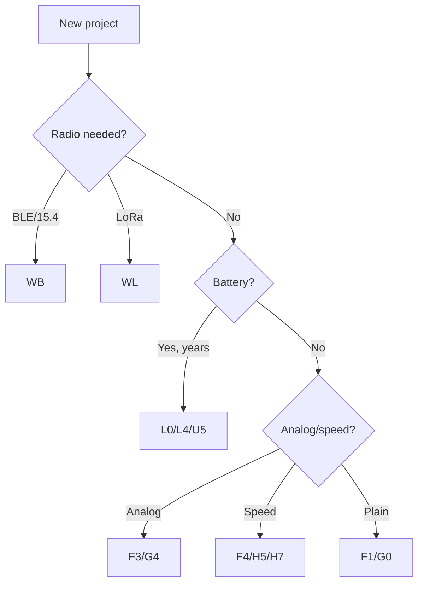

# STM32 family comparison

![[assets/img/stm32-families-compare-scheme.png|600]]
*Fig. STM32 families: from budget G0 to flagship H5, wireless WB/WL on the side.*

> [!tip] Purpose of this note
> Answer "which STM32 to take" in 5 minutes: family table, task-based choice rule, clone traps.

## 1. Purpose

The ST lineup is 10+ families and thousands of part numbers. The choice rule is simple: start from the task (pins → peripherals → performance → power supply), not from the price. A cheaper chip without the timer you need costs more than a pricey one with it.

## Family specs (2026 guide)

| Family | Core | Max clock | Flash | Trick | Take when |
| --- | --- | --- | --- | --- | --- |
| F0 | Cortex-M0 | 48 MHz | 16-256 KB | Cheap, 5V-tolerant pins | Simple logic, buttons, relays |
| F1 | Cortex-M3 | 72 MHz | 16-1024 KB | Classic (Blue Pill), tons of examples | Learning, legacy projects |
| F3 | Cortex-M4F | 72 MHz | 16-512 KB | Analog peripherals (ADC+DAC+comparators) | Measurements, power control |
| F4 | Cortex-M4F | 84-180 MHz | 256-2048 KB | Performance + FPU, cameras/DSP | Displays, audio, signal processing |
| G0 | Cortex-M0+ | 64 MHz | 16-512 KB | Modern F0 replacement, USB-C PD, low price | New simple nodes |
| G4 | Cortex-M4F | 170 MHz | 32-512 KB | Analog monster: 5x 4 Msps ADC, DAC, op-amps, HRTIM | Power electronics, FOC |
| H5 | Cortex-M33 | 250 MHz | 128-2048 KB | Flagship: TrustZone, OCTOSPI, FDCAN | Complex HMI, security |
| H7 | Cortex-M7/M4 | 240-600 MHz | up to 2 MB | Maximum: LTDC, 2x USB, Ethernet | Video, gateways, heavy ML |
| L0/L4 | Cortex-M0+/M4 | 32-120 MHz | 16-1024 KB | Low consumption (nA-uA sleep) | Battery years of life |
| U5 | Cortex-M33 | 160 MHz | up to 4 MB | Low-power flagship + security | Battery + protection |
| WB/WL | Cortex-M4+M0+ | 64 MHz | 256-1024 KB | BLE/802.15.4 (WB) / Sub-GHz LoRa (WL) on board! | Wireless nodes without a second chip |

```text
Швидкий вибір:
  Кнопки+реле+дешево ......... G0 (новий) або F1 (приклади)
  Аналог/вимірювання ......... F3 або G4
  Дисплей/камера/звук ........ F4 / H7
  Батарея на роки ............ L0 / L4 / U5
  BLE/LoRa з коробки ......... WB / WL
  Безпека/TrustZone .......... H5 / U5
```

## Mermaid: choice in 4 questions



## Common issues

| # | Issue | Cause | Fix |
| --- | --- | --- | --- |
| 1 | F1 because "everyone does it" | Old prices/shortage, no FDCAN/USB-C | New projects - G0/G4 |
| 2 | H7 for a blinker | Price, BGA, complex core supply | Take the minimum for the task |
| 3 | Ignoring errata | Silicon bugs of a specific revision | Read errata BEFORE routing the board! |
| 4 | CS32F103 clone instead of STM32 | Different peripherals/bugs, no support | Marking + CubeMX test |

## Official sources

- [STM32 MCU Selector (ST)](https://www.st.com/en/microcontrollers-microprocessors/stm32-32-bit-arm-cortex-mcus.html) - parametric search.
- [STM32F103C8T6 datasheet (ST)](https://www.st.com/en/microcontrollers-microprocessors/stm32f103c8.html) - Blue Pill reference.

## Power supply and packages by family

| Question | What to know |
| --- | --- |
| Voltages | Most are 3.3V (some pins 5V-tolerant, see the datasheet of the specific chip, not the family!) |
| 1.xV core | VCAP/VDD11 - capacitors mandatory, otherwise instability |
| H7/H5 SMPS | Inner buck: less heating, but its own inductor wiring |
| Packages | LQFP (hand-solderable) → QFN → BGA (factory/hot air only) |
| L0/L4/U5 sleep | RAM retention + wakeup timers: microamps are real, not marketing |

## Clones and authenticity check

| Sign | ST original | Clone (CS32/GD32/remarked) |
| --- | --- | --- |
| Marking | Laser, even | Print, crooked, text errors |
| Flash | As in datasheet | Often more/less than claimed |
| USB/UART | Per datasheet | Glitches at odd baud rates |
| Price | Market | "Half price" = first alarm bell |

Check: `st-info --probe` (chip ID + flash size), then a CubeMX blink, then a test of exactly your peripheral (timer/USB/ADC). A clone is fine for learning, not for production.

## Errata practice

1. Find your exact part number + revision (case marking, `DBGMCU_IDCODE`).
2. Open the errata sheet of exactly that revision on st.com.
3. Check the items about your peripheral (I2C lockups, ADC calibration, USB resume - the classics!).
4. Workarounds go into code from day one, not "later".

## Packages and routing: what affects the choice

| Question | Answer |
| --- | --- |
| Soldering by hand with an iron | LQFP only (0.5 mm pitch is real, 0.4 is already sport) |
| Need many pins cheap | LQFP-100 in F4/G4 instead of BGA in H7 |
| High-speed USB/RMII | Short differential pairs, crystal close to OSC_IN/OUT |
| Precise ADC | Separate VDDA + VREF+, ferrite from digital, star ground |
| Crystal or inner RC | HSI +-1% is fine for UART; USB/CAN need crystal/HSE only |
| Where to get a footprint | CubeMX library + caliper check of the pitch on the board |

## "Task → 2 candidates" matrix

| Task | Option A (cheap) | Option B (with margin) |
| --- | --- | --- |
| Relays/LEDs | G0 | F1 (if one lies in the drawer) |
| I2C sensors + screen | G0/C3? no - G031 | F401 |
| I2S audio | F411 | F446 |
| FOC / motors | G431 | F405 |
| Camera | F427 + DCMI | H743 |
| BLE beacon | WB55 (ready) | NRF + any STM32 |

## Prices and availability (guide)

| Segment | Chip price | Comment |
| --- | --- | --- |
| G0/F0 | ~$1 | Only clones are cheaper |
| F1/F3 | $1.5-3 | F1 holds on volumes |
| F4 | $4-10 | Depends on memory |
| G4 | $3-7 | Good value for on-board analog |
| H5/H7 | $8-20+ | Plus BGA assembly in the unit price |
| WB/WL | $4-8 | Cheaper than two chips (MCU+radio) |

> Prices are small-batch retail, drift with rates and shortages. Before production - a request to 3 distributors + lifecycle check (ST states longevity for industrial chips).

## Quick choice diagnostics

| Symptom of a wrong choice | Diagnosis | Fix |
| --- | --- | --- |
| Ran out of pins | Counted "tight" | Next time +20% pin margin |
| Ran out of Flash | Libraries ate everything | Move to a neighbor with x2 memory in the same package |
| ADC is noisy | No separate VDDA | Board revision or an external ADC |
| Project grew to F4, started at F0 | Architecture does not scale | HAL code ports easily - do not tie to registers early |

## See also

- [[Home.en]]
- [[00-Start/04-Devkit-plati.en | DevKit boards]]
- [[00-Start/05-Vibir-seredovischa.en | Environment choice]]
