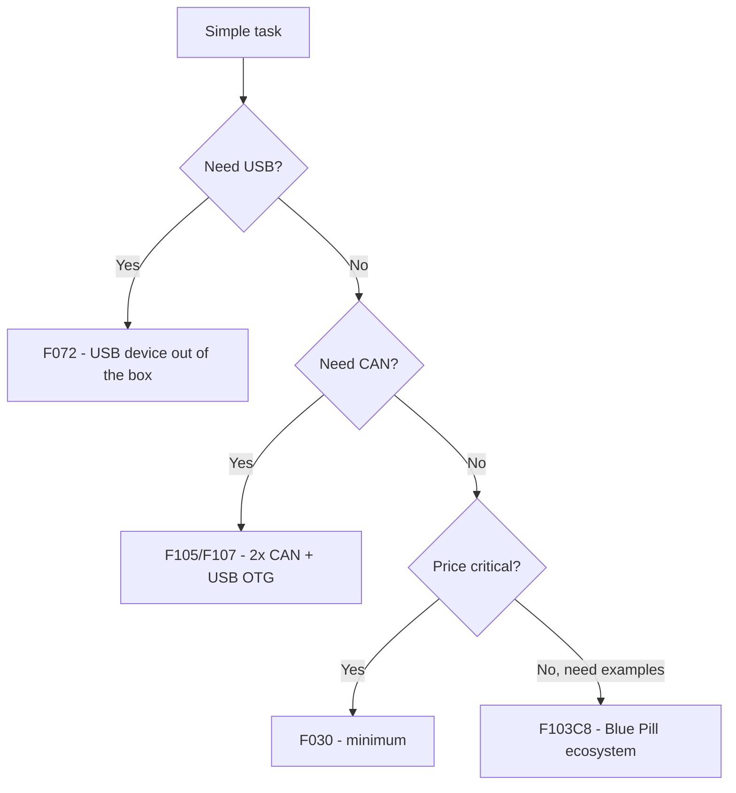

# STM32 F0 / F1 - Classic and Blue Pill

![[assets/img/stm32-f0-f1-classic-scheme.png|600]]
*Fig. F0/F1: power supply, bootloader, limits of the classic.*

![[assets/img/stm32-f0-f1-classic-scheme.png|600]]
*Fig. F0/F1: 2.0-3.6V power supply, SWD flashing, BOOT0 modes, USB only in selected models.*

> [!tip] Purpose of this note
> Close 90% of questions about the most widespread chips: what F0/F1 can do, how Blue Pill differs from clones, and when this classic is no longer enough.

## 1. Purpose

F0 (Cortex-M0) and F1 (Cortex-M3) are the entry gates to STM32: cheap LQFP48 packages, tons of examples, Blue Pill for $2. F0 adds modern extras (HDMI-CEC, touch controller, USB in F072), F1 holds on with example volume and compatibility. Both have no FPU - float is computed in software, slowly.

## Family characteristics

| Parameter | STM32F0 (F030/F051/F072) | STM32F1 (F101/F102/F103/F105/F107) |
| --- | --- | --- |
| Core | Cortex-M0, 48 MHz | Cortex-M3, 24-72 MHz |
| Flash / RAM | 16-256 KB / 4-32 KB | 16-1024 KB / 4-96 KB |
| Power supply | 2.0-3.6 V | 2.0-3.6 V |
| USB | Only F072 (device) | F105/F107 (OTG), rest - no |
| CAN | Only bxCAN in selected ones | F105/F107 (2x CAN) |
| ADC | 12-bit, up to 1 Msps | 12-bit, up to 1 Msps (F1 - 2x ADC in higher models) |
| DMA / CRC | Yes / Yes | Yes / Yes |
| Typical packages | TSSOP20 - LQFP64 | LQFP48/64/100 |
| When to choose | Cheap logic, buttons, relays | Learning, legacy, tons of ready examples |

```text
Швидкий вибір усередині:
  Мінімум ніжок і ціни ......... F030F4 (TSSOP20)
  USB-девайс дешево ............ F072C8
  Класика під приклади ......... F103C8 (Blue Pill)
  CAN + USB OTG ................ F105R8 / F107VC
```

## Mermaid: F0 or F1



## Blue Pill: board map

| Item | Where | Note |
| --- | --- | --- |
| Chip | STM32F103C8T6, 64 KB Flash (often 128 KB in fact!) | Check with programmer, do not trust marking |
| USB | Micro-USB power only | No data - flash via ST-Link/UART |
| Buttons | RESET + BOOT0 jumper | BOOT0=1 - boot into System bootloader |
| LED | PC13, active low | First Blink |
| LDO | Weak (often 100-150 mA) | WiFi modules and motors - separate power supply |
| Crystal | 8 MHz HSE | Accurate USB/UART possible |

## Boot modes (BOOT0/BOOT1)

| BOOT0 | BOOT1 | Mode | How to flash |
| --- | --- | --- | --- |
| 0 | x | Flash (run) | ST-Link SWD |
| 1 | 0 | System bootloader (factory) | UART1 (PA9/PA10) via stm32flash |
| 1 | 1 | SRAM boot | Rare, for debugging without Flash |

## Common issues

| # | Issue | Why it is bad | Fix |
| --- | --- | --- | --- |
| 1 | Float math in 1 kHz loop | M0/M3 without FPU - tens of microseconds per operation | Fixed point or compute less often |
| 2 | Flashing Blue Pill over USB | There is no data there, power only | ST-Link or UART bootloader |
| 3 | BOOT0 left at 1 | Board always in bootloader | Move jumper back after flashing |
| 4 | 5V on non-tolerant pin | ESP habit kills the input | Check FT column in pin datasheet! |
| 5 | Clone with smaller Flash | Firmware does not fit / glitches | `st-info --probe` before work |

## Official sources

- [STM32F103C8T6 datasheet (ST)](https://www.st.com/en/microcontrollers-microprocessors/stm32f103c8.html) - memory, pins, 5V tolerance.
- [STM32F072C8 datasheet (ST)](https://www.st.com/en/microcontrollers-microprocessors/stm32f072c8.html) - USB, modes.

## Peripherals in detail: what is really there

| Block | F0 | F1 |
| --- | --- | --- |
| Timers | 16-bit + 32-bit (some), PWM / input capture | Same + motor control in higher models |
| I2C / SPI / UART | 2 / 1-2 / 2-8 (depends!) | 2 / 2-3 / 2-5 |
| ADC details | 12-bit, temperature sensor and Vrefint inside | Same + 2x ADC with dual mode (F103xE) |
| DMA | 5-7 channels | 7-12 channels (two buses in higher models) |
| CRC / UID | Yes / 96-bit unique ID | Yes / 96-bit ID |
| RTC + backup | VBAT domain, PC13-PC15 | Same |

## Migration F1 to G0 (when Blue Pill is too small)

| Step | What to do |
| --- | --- |
| 1 | Open CubeMX, select G030/G070 |
| 2 | Port Clock tree (note: different APB/AHB bus names!) |
| 3 | Rewrite direct register accesses (maps differ!) |
| 4 | HAL code ports almost unchanged |
| 5 | Recheck 5V tolerance of each pin |

## UART bootloader practice (without ST-Link)

```text
1. BOOT0 → 1 (перемичка на 3.3V), BOOT1 → 0, натисни RESET.
2. Підключи USB-UART: TX→PA10(RX), RX→PA9(TX), GND спільна.
3. stm32flash -w firmware.bin -v -g 0x0 /dev/ttyUSB0
4. BOOT0 → 0, RESET — плата стартує з Flash.
```

| Question | Answer |
| --- | --- |
| Speed | Auto-baud: start at 115200, lower if needed |
| USB DFU on F1 | None (except F105/107 OTG) - UART only |
| RDP protection enabled | Bootloader stays silent - clear via ST-Link + mass erase |
| Clone does not respond | Different UART pinout or broken bootloader - try ST-Link |

## DMA practice: when CPU does not touch data

| Scenario | Setup |
| --- | --- |
| UART packet reception | DMA circular + idle interrupt (end of packet without timeouts) |
| ADC channel scanning | DMA + timer trigger, buffer in RAM |
| SPI display | DMA from memory to SPI, CPU draws next frame |
| Configuration mistake 1 | Missing `__HAL_RCC_DMA1_CLK_ENABLE()` - silence without errors |

## AN2606: bootloader mode table (read this!)

AN2606 is an ST document with a list of factory bootloaders for EACH chip: which interfaces are active (USART/SPI/I2C/USB/CAN) and on which pins. Before flashing a bare board without ST-Link - open AN2606, find your part number, check the columns.

## Part numbers: what to order

| Part number | Flash/RAM | Package | Purpose |
| --- | --- | --- | --- |
| STM32F030F4P6 | 16/4 KB | TSSOP20 | Minimum pins and price |
| STM32F051K8U6 | 64/8 KB | QFN32 | Cheap USB device |
| STM32F072CBT6 | 128/16 KB | LQFP48 | USB + CAN |
| STM32F103C8T6 | 64/20 KB | LQFP48 | Blue Pill, examples |
| STM32F103RCT6 | 256/48 KB | LQFP64 | More memory and pins |
| STM32F107VCT6 | 256/64 KB | LQFP100 | Ethernet + USB OTG |

```text
Розшифровка імені F103C8T6:
  F103 — родина, C — 48 ніг, 8 — 64 КБ Flash;
  T — LQFP корпус, 6 — індустріальний діапазон.
```

## Errata: what to know before the board

| Topic | Practice |
| --- | --- |
| Crystal revision | Letter on package, IDCODE via debugger |
| I2C errata F1 | Known lockups - keep software bus reset ready |
| ADC drift | Calibration at startup is mandatory |
| Where to look | Errata document for exact part number on st.com |

## See also

- [[Home.en]]
- [[00-Start/03-Porivnyannya-chipiv.en | Chip comparison]]
- [[00-Start/04-Devkit-plati.en | DevKit boards]]
