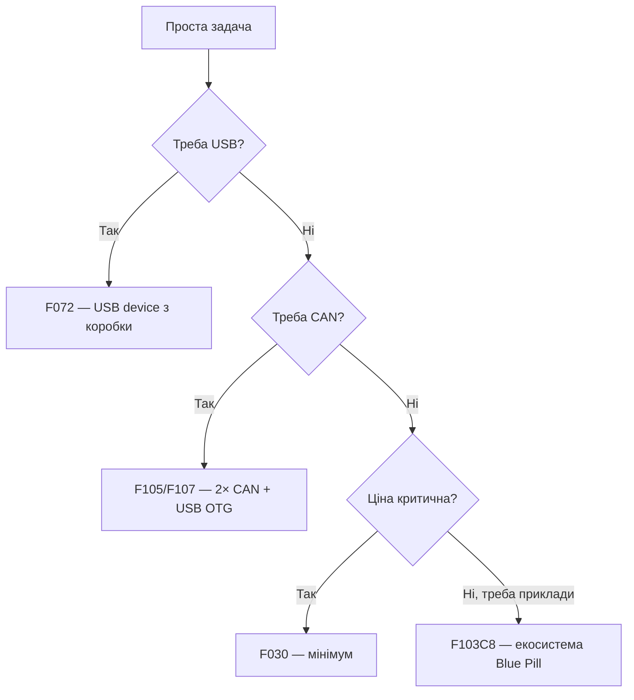

# STM32 F0 / F1 - класика і Blue Pill

![[assets/img/stm32-f0-f1-classic-scheme.png|600]]
*Рис. F0/F1: живлення, bootloader, межі класики.*

![[assets/img/stm32-f0-f1-classic-scheme.png|600]]
*Рис. F0/F1: живлення 2.0-3.6V, SWD-прошивка, BOOT0-режими, USB тільки в окремих моделях.*

> [!tip] Призначення ноти
> Закрити 90% питань про наймасовіші чипи: що вміють F0/F1, чим Blue Pill відрізняється від клонів і коли цієї класики вже мало.

## 1. Призначення

F0 (Cortex-M0) і F1 (Cortex-M3) - вхідні ворота в STM32: дешеві корпуси LQFP48, тони прикладів, Blue Pill за $2. F0 додає сучасні дрібниці (HDMI-CEC, Touch-контролер, USB у F072), F1 тримається обсягами прикладів і сумісністю. Обидві без FPU - float рахується програмно, повільно.

## Характеристики родин

| Параметр | STM32F0 (F030/F051/F072) | STM32F1 (F101/F102/F103/F105/F107) |
| --- | --- | --- |
| Ядро | Cortex-M0, 48 МГц | Cortex-M3, 24-72 МГц |
| Flash / RAM | 16-256 КБ / 4-32 КБ | 16-1024 КБ / 4-96 КБ |
| Живлення | 2.0-3.6 В | 2.0-3.6 В |
| USB | Тільки F072 (device) | F105/F107 (OTG), решта - ні |
| CAN | Тільки bxCAN в окремих | F105/F107 (2× CAN) |
| АЦП | 12 біт, до 1 Msps | 12 біт, до 1 Msps (F1 - 2× АЦП в старших) |
| DMA / CRC | Так / Так | Так / Так |
| Типові корпуси | TSSOP20 - LQFP64 | LQFP48/64/100 |
| Коли брати | Дешева логіка, кнопки, реле | Навчання, legacy, тони готових прикладів |

```text
Швидкий вибір усередині:
  Мінімум ніжок і ціни ......... F030F4 (TSSOP20)
  USB-девайс дешево ............ F072C8
  Класика під приклади ......... F103C8 (Blue Pill)
  CAN + USB OTG ................ F105R8 / F107VC
```

## Mermaid: F0 чи F1



## Blue Pill: карта плати

| Елемент | Де | Нотатка |
| --- | --- | --- |
| Чип | STM32F103C8T6, 64 КБ Flash (часто 128 КБ фактично!) | Перевірити програматором, не вірити маркуванню |
| USB | Micro-USB тільки живлення | Даних немає - прошивка через ST-Link/UART |
| Кнопки | RESET + BOOT0-перемичка | BOOT0=1 - завантаження в System bootloader |
| LED | PC13, активний низький | Перший Blink |
| LDO | Слабкий (часто 100-150 мА) | WiFi-модулі і мотори - окреме живлення |
| Кварц | 8 МГц HSE | Точний USB/UART можливий |

## Режими завантаження (BOOT0/BOOT1)

| BOOT0 | BOOT1 | Режим | Як шити |
| --- | --- | --- | --- |
| 0 | × | Flash (робота) | ST-Link SWD |
| 1 | 0 | System bootloader (заводський) | UART1 (PA9/PA10) через stm32flash |
| 1 | 1 | SRAM boot | Рідко, для налагодження без Flash |

## Типові помилки

| # | Помилка | Чому погано | Як правильно |
| --- | --- | --- | --- |
| 1 | Float-математика в циклі 1 кГц | M0/M3 без FPU - десятки мікросекунд на операцію | Фіксована кома або рідше рахувати |
| 2 | Прошивка Blue Pill по USB | Там немає даних, тільки живлення | ST-Link або UART-bootloader |
| 3 | BOOT0 лишився в 1 | Плата завжди в bootloader | Перемичку назад після прошивки |
| 4 | 5V на не-толерантний пін | ESP-звичка вбиває вхід | Дивитись колонку FT у даташиті пінів! |
| 5 | Клон з меншим Flash | Прошивка не влазить / глюки | `st-info --probe` перед роботою |

## Офіційні джерела

- [STM32F103C8T6 datasheet (ST)](https://www.st.com/en/microcontrollers-microprocessors/stm32f103c8.html) - пам'ять, піни, 5V-толерантність.
- [STM32F072C8 datasheet (ST)](https://www.st.com/en/microcontrollers-microprocessors/stm32f072c8.html) - USB, режими.

## Периферія детально: що реально є

| Блок | F0 | F1 |
| --- | --- | --- |
| Таймери | 16-біт + 32-біт (деякі), PWM/ input capture | Ті ж + motor-control у старших |
| I2C / SPI / UART | 2 / 1-2 / 2-8 (залежить!) | 2 / 2-3 / 2-5 |
| АЦП деталі | 12 біт, температурний сенсор і Vrefint всередині | Те саме + 2× АЦП з dual-режимом (F103xE) |
| DMA | 5-7 каналів | 7-12 каналів (дві шини в старших) |
| CRC / UID | Так / 96-біт унікальний ID | Так / 96-біт ID |
| RTC + backup | VBAT-домен, PC13-PC15 | Те саме |

## Міграція F1 → G0 (коли Blue Pill замалий)

| Крок | Що робити |
| --- | --- |
| 1 | Відкрити CubeMX, вибрати G030/G070 |
| 2 | Перенести Clock tree (увага: інші назви шин APB/AHB!) |
| 3 | Переписати прямі звернення до регістрів (мапи відрізняються!) |
| 4 | HAL-код переноситься майже без змін |
| 5 | Перевірити 5V-толерантність кожного піна заново |

## UART-bootloader практика (без ST-Link)

```text
1. BOOT0 → 1 (перемичка на 3.3V), BOOT1 → 0, натисни RESET.
2. Підключи USB-UART: TX→PA10(RX), RX→PA9(TX), GND спільна.
3. stm32flash -w firmware.bin -v -g 0x0 /dev/ttyUSB0
4. BOOT0 → 0, RESET — плата стартує з Flash.
```

| Питання | Відповідь |
| --- | --- |
| Швидкість | Авто-бод: почни з 115200, за потреби нижче |
| USB DFU на F1 | Немає (крім F105/107 OTG) - тільки UART |
| Захист RDP увімкнено | Bootloader мовчить - знімати через ST-Link + mass erase |
| Клон не відповідає | Інша розпіновка UART або битий bootloader - пробуй ST-Link |

## DMA-практика: коли CPU не чіпає дані

| Сценарій | Налаштування |
| --- | --- |
| UART-прийом пакетів | DMA circular + idle-преривання (кінець пакета без таймаутів) |
| АЦП-сканування каналів | DMA + таймер-тригер, буфер у RAM |
| SPI-дисплей | DMA з пам'яті у SPI, CPU малює наступний кадр |
| Помилка конфігурації №1 | Забутий `__HAL_RCC_DMA1_CLK_ENABLE()` - тиша без помилок |

## AN2606: таблиця bootloader-режимів (читати!)

AN2606 - документ ST зі списком заводських завантажувачів для КОЖНОГО чипа: які інтерфейси активні (USART/SPI/I2C/USB/CAN) і на яких пінах. Перед прошивкою голої плати без ST-Link - відкрити AN2606, знайти свій партномер, подивитись стовпці.

## Партномери: що замовляти

| Партномер | Flash/RAM | Корпус | Для чого |
| --- | --- | --- | --- |
| STM32F030F4P6 | 16/4 КБ | TSSOP20 | Мінімум пінів і ціни |
| STM32F051K8U6 | 64/8 КБ | QFN32 | Дешевий USB-девайс |
| STM32F072CBT6 | 128/16 КБ | LQFP48 | USB + CAN |
| STM32F103C8T6 | 64/20 КБ | LQFP48 | Blue Pill, приклади |
| STM32F103RCT6 | 256/48 КБ | LQFP64 | Більше памяті і пінів |
| STM32F107VCT6 | 256/64 КБ | LQFP100 | Ethernet + USB OTG |

```text
Розшифровка імені F103C8T6:
  F103 — родина, C — 48 ніг, 8 — 64 КБ Flash;
  T — LQFP корпус, 6 — індустріальний діапазон.
```

## Errata: що знати до плати

| Тема | Практика |
| --- | --- |
| Ревізія кристала | Літера на корпусі, IDCODE через дебагер |
| I2C errata F1 | Відомі клини - програмний ресет шини в запасі |
| АЦП дрейф | Калібрування при старті обов'язкове |
| Де шукати | Errata-документ за точним партномером на st.com |

## Див. також

- [[Home]]
- [[00-Start/03-Porivnyannya-chipiv|Порівняння чипів]]
- [[00-Start/04-Devkit-plati|DevKit плати]]
