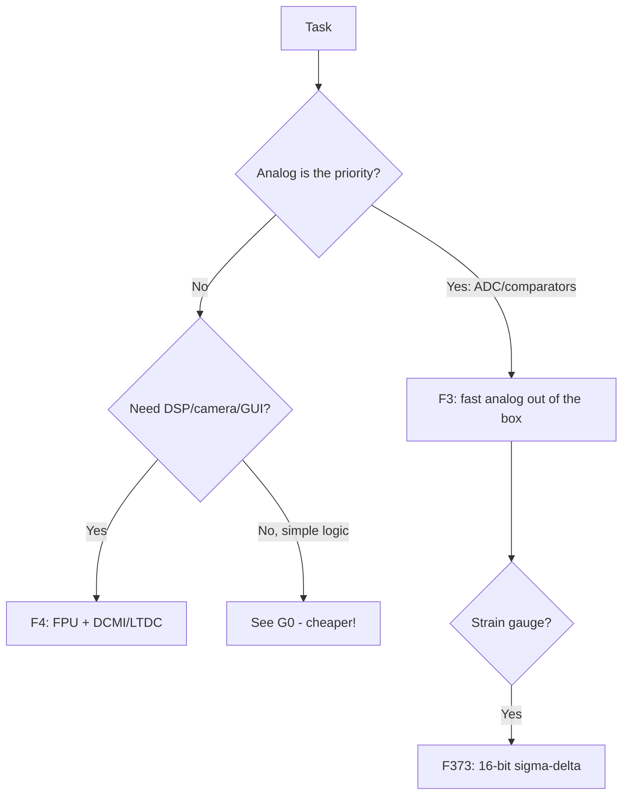

# STM32 F3 / F4 - Analog and Performance

![[assets/img/stm32-f3-f4-perf-scheme.png|600]]
*Fig. F3 measures, F4 computes.*

![[assets/img/stm32-f3-f4-perf-scheme.png|600]]
*Fig. F3 - analog front end (ADC/DAC/comparators), F4 - speed (FPU, cameras, displays).*

> [!tip] Purpose of this note
> Choose between measuring accurately (F3) and computing fast (F4): what the analog peripherals can do and where FPU is needed.

## 1. Purpose

F3 is a measurement chip: fast 12-bit ADCs (up to 5 Msps each, up to 10 Msps as a pair in interleaved mode), comparators, DAC, and in F373 even a sigma-delta ADC. F4 is a workhorse: Cortex-M4F up to 180 MHz, hardware single-precision FPU, DSP instructions, cameras (DCMI), displays (LTDC/FSMC). Both run on 1.8-3.6 V, 5V-tolerant pins - per datasheet.

## Family characteristics

| Parameter | STM32F3 (F303/F373) | STM32F4 (F401/F405/F427/F446) |
| --- | --- | --- |
| Core | Cortex-M4F, 72 MHz | Cortex-M4F, 84-180 MHz |
| Flash / RAM | 16-512 KB / 4-80 KB | 256-2048 KB / 64-384 KB |
| FPU / DSP | Yes / Yes | Yes / Yes + ART accelerator (Flash cache) |
| ADC | Up to 4x 12-bit, 5 Msps interleaved | 3x 12-bit, 2.4 Msps |
| DAC | 2-3 channels 12-bit | 2 channels 12-bit |
| Comparators / OpAmps | Up to 7 / present (F3!) | 2 (some) / none |
| Sigma-delta ADC | F373 (3 channels, 16-bit) | None |
| Camera/display | No | DCMI (F4x7), LTDC (F429), FSMC |
| USB / CAN / Ethernet | USB device, CAN | USB OTG FS/HS, CAN, Ethernet (F407) |
| When to choose | Accurate measurements, power control | DSP, audio, cameras, GUI |

```text
Швидкий вибір усередині:
  Вимірювач з компараторами ...... F303K8 / F303CBT6
  Сигма-дельта (тензодатчики) .... F373VCT6
  Звук/DSP дешево ................ F401CCU6 (Black Pill!)
  Камера + дисплей ............... F427VIT6 / F429NIH6
  Ethernet-шлюз .................. F407VET6
```

## Mermaid: F3 or F4



## Power supply and clocking

| Question | Answer |
| --- | --- |
| VDDA | Separate analog domain + VREF+; without it ADC is noisy |
| HSE | 4-26 MHz crystal; USB needs 0.25% accuracy - crystal only! |
| PLL | From 8 MHz - 72 (F3) / 84-180 (F4); USB 48 MHz - separate divider |
| VCAP | 2.2 uF capacitors on core - mandatory |

## Common issues

| # | Issue | Why it is bad | Fix |
| --- | --- | --- | --- |
| 1 | VDDA not connected | ADC returns garbage or zeros | VDDA + VREF+ always, even if ADC looks unneeded |
| 2 | Start from HSI for USB | RC error breaks USB timings | HSE crystal for everything with USB |
| 3 | Float-double instead of float | Double is computed in software even with FPU! | Only `float` in hot paths |
| 4 | F429 without SDRAM for LTDC | Frame buffer does not fit in RAM | External SDRAM via FMC |
| 5 | Expecting sigma-delta on F4 | It is not there - only F373 | See F373 or external ADC |

## Official sources

- [STM32F303VC datasheet (ST)](https://www.st.com/en/microcontrollers-microprocessors/stm32f303vc.html) - analog peripherals.
- [STM32F407VG datasheet (ST)](https://www.st.com/en/microcontrollers-microprocessors/stm32f407vg.html) - performance, Ethernet.

## ADC practice F3: interleaved mode

Two ADCs sample the same signal with half-clock offset - doubled sampling rate (up to 10 Msps total on F303). Setup: ADC1 master + ADC2 slave, dual interleaved mode (interleaved doubles the rate, not simultaneous), DMA collects pairs. Uses: measuring switch current in every PWM cycle (motor control!), pulse responses.

| Parameter | Value |
| --- | --- |
| Resolution | 12-bit + oversampling up to 16-bit (hardware!) |
| Trigger | Timer (TIM1 CC) - synchronous with PWM |
| Calibration | Factory coefficients + self-calibration at startup |
| VREF | External accurate one or VREFBUF-like circuit |

## FPU/DSP practice F4

| Topic | Practice |
| --- | --- |
| FPU enable | CPACR register at startup (startup does it, verify!) |
| DSP instructions | `__SMUAD`, `__SMLAD` for FIR; CMSIS-DSP library is ready |
| ART accelerator | 0-wait-state Flash at 168 MHz - do not disable! |
| CCM RAM | 64 KB tightly coupled memory: critical code/data here |
| FPU context | FreeRTOS saves FPU registers only if task touched them |

## F3 comparators: analog protection without CPU

| Parameter | Value |
| --- | --- |
| Count | Up to 7 (F303), speed about 50 ns |
| Output | To pin / to timer BKIN (emergency PWM stop!) / to interrupt |
| Reference | Internal (VREFINT/4/2/3/4) or external |
| Hysteresis | Programmable - no comparator chatter |

```text
Застосування: струм мотора через шунт → компаратор → BKIN таймера →
ШІМ гасне залізякою за наносекунди, CPU дізнається потім з переривання.
```

## DAC practice: two channels are few but enough

| Topic | Practice |
| --- | --- |
| Resolution/speed | 12-bit, about 1 Msps; enable output buffer under load |
| Waves without CPU | DMA from sample array on timer trigger (sine/saw) |
| Calibration | Factory trimming + software offset |
| No DAC in chip | PWM + RC filter (slow) or external MCP4725 |

## FMC practice: external memory without pain

| Topic | Practice |
| --- | --- |
| SDRAM for LTDC | Timings from memory datasheet (CAS latency!), FMC clock max 90 MHz |
| NOR-Flash | XIP possible, but slower than internal |
| SRAM as mailbox | Fast exchange between cores/peripherals |
| GPIO conflict | FMC pins fixed by alternate functions - plan layout with CubeMX |

```c
// Перевірка SDRAM після ініціалізації: пишемо патерн, читаємо назад
for (uint32_t i = 0; i < 1024; i++) ((uint32_t*)0xD0000000)[i] = i ^ 0xA5A5A5A5;
for (uint32_t i = 0; i < 1024; i++)
    if (((uint32_t*)0xD0000000)[i] != (i ^ 0xA5A5A5A5)) Error_Handler();
```

## Part numbers: what to order

| Part number | Core/Flash | Feature | Purpose |
| --- | --- | --- | --- |
| STM32F303K8T6 | M4F/64 KB | Comparators, DAC | Small measurement unit |
| STM32F303CCT6 | M4F/256 KB | 4 ADCs, 7 comparators | Power control |
| STM32F373VCT6 | M4F/256 KB | Sigma-delta ADC | Strain gauges |
| STM32F401CCU6 | M4F/256 KB | FPU, USB | Black Pill, audio |
| STM32F407VGT6 | M4F/1 MB | Ethernet, DCMI | Gateway with camera |
| STM32F429NIH6 | M4F/2 MB | LTDC, SDRAM | 7 inch display |

## Errata: what to know before the board

| Topic | Practice |
| --- | --- |
| ADC interleaved early revisions | Check offset between channels |
| USB on HSI | Only with HSE crystal for stability |
| CCM-RAM | Not all memory is DMA-capable - buffers in SRAM! |

## See also

- [[Home.en]]
- [[00-Start/03-Porivnyannya-chipiv.en | Chip comparison]]
- [[01-Hardware/01-F0-F1-Classic.en | F0/F1]]
