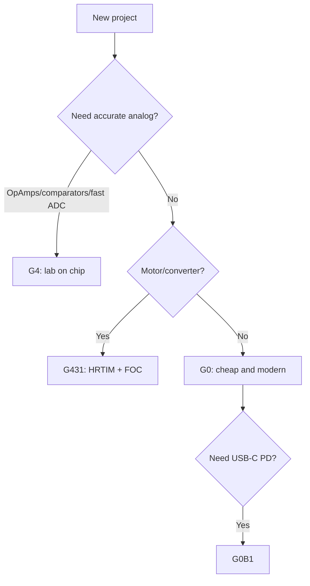

# STM32 G0 / G4 - Modern Budget and Analog Monster

![[assets/img/stm32-g0-g4-modern-scheme.png|600]]
*Fig. G0 - price, G4 - analog and HRTIM.*

![[assets/img/stm32-g0-g4-modern-scheme.png|600]]
*Fig. G0 - cheap and modern; G4 - analog, HRTIM and math in hardware.*

> [!tip] Purpose of this note
> Explain why new projects start with G0/G4 and not with F0/F1: prices, USB-C, analog and hardware math.

## 1. Purpose

G0 is an F0 redesigned correctly: Cortex-M0+ up to 64 MHz, USB-C Power Delivery in selected chips, 5V-tolerant pins, price from about $1. G4 answers the question what happens if a measurement lab is put into a microcontroller: 5x ADC at 4 Msps, 7 comparators, 6 op amps with programmable gain, HRTIM with 184 ps resolution, hardware CORDIC (sin/cos) and FMAC (filters).

## Family characteristics

| Parameter | STM32G0 (G030/G070/G0B1) | STM32G4 (G431/G474) |
| --- | --- | --- |
| Core | Cortex-M0+, 64 MHz | Cortex-M4F, 170 MHz |
| Flash / RAM | 16-512 KB / 8-144 KB | 32-512 KB / 22-128 KB |
| ADC | 1-2x 12-bit, 2.5 Msps | 5x 12-bit, 4 Msps each! |
| DAC / Comparators | 2 / 2 | 7 DAC / 7 comparators |
| OpAmps | None | 6x OPAMP with PGA |
| HRTIM | None | Yes: 184 ps PWM for converters! |
| CORDIC / FMAC | None | Yes / Yes |
| USB | Device (some) + USB-C PD (G0B1) | USB device |
| FD-CAN | G0B1 | Yes |
| VREFBUF | Present (internal reference!) | Present |
| When to choose | Everything simple, new, cheap | Power electronics, FOC, measurement units |

```text
Швидкий вибір усередині:
  Мінімум ніжок ................. G030F6 (TSSOP20/SO8!)
  USB-девайс .................... G070KB + кристал з USB
  USB-C з Power Delivery ......... G0B1 (зарядки, доки)
  Мотор/FOC ..................... G431KB (CTTC-плата — класика жанру)
  Багатофазний перетворювач ..... G474RE (HRTIM на повну)
```

## Mermaid: G0 or G4



## HRTIM in short (why 184 ps is a lot)

HRTIM (High-Resolution Timer) is a PWM timer with 184 ps step versus about 6 ns in normal timers at 170 MHz. Why: LLC resonant converters, digital PSU, accurate phase control. Practice: master timer sets period, slave channels set phases with dead-time; Fault inputs shut everything in hardware without CPU.

## Common issues

| # | Issue | Why it is bad | Fix |
| --- | --- | --- | --- |
| 1 | G0 as drop-in F103 replacement by pins | Pinout is different! | Remap with CubeMX, not from memory |
| 2 | G4 ADC without calibration | Zero offset ruins current measurement | `HAL_ADCEx_Calibration_Start` at startup |
| 3 | OPAMP without PGA setup | Gain is wrong | Set PGA gain explicitly, pins - per datasheet |
| 4 | Expecting HRTIM on G0/F1 | It is not there | Only G4/H5 |
| 5 | VREFBUF not enabled | ADC drifts with supply | Enable VREFBUF at 2.048/2.5V |

## Official sources

- [STM32G431KB datasheet (ST)](https://www.st.com/en/microcontrollers-microprocessors/stm32g431kb.html) - analog, HRTIM.
- [STM32G030F6 datasheet (ST)](https://www.st.com/en/microcontrollers-microprocessors/stm32g030f6.html) - budget chip.

## OPAMP practice G4: PGA without external op amps

Internal G4 op amps support programmable gain (PGA x2/4/8/16/32/64) and follower/comparator modes. Typical case: motor current shunt to OPAMP x16 to ADC, without a single external chip.

| Parameter | Value |
| --- | --- |
| Count | Up to 6 (depends on package!) |
| GBW | About 1-3 MHz (not for radio, plenty for sensors) |
| Calibration | Self-calibration at startup (zero offset!) |
| Limit | Input range not rail-to-rail in all modes - see datasheet |

## CORDIC and FMAC: when to recall

| Block | What it computes | Example |
| --- | --- | --- |
| CORDIC | sin/cos/arctan/sqrt in about 10 clocks | FOC Park/Clarke transforms without tables |
| FMAC | FIR/IIR filters | Motor current filtering on the fly |
| Both | Work via DMA | CPU free for control |

## USB-C PD practice (G0B1)

| Topic | Practice |
| --- | --- |
| UCPD peripheral | Hardware PD protocol controller, CPU only handles events |
| Roles | Sink (we charge) / Source (we power) / Dual |
| Typical contracts | 5V/3A, 9V, 12V, 20V - request via PD messages |
| Protection | OVP on VBUS mandatory - 20V on 5V circuit means smoke |

## Code: ADC + OPAMP start (G4, LL)

```c
LL_ADC_EnableInternalRegulator(ADC1);
while (!LL_ADC_IsInternalRegulatorStabilized(ADC1));
LL_ADC_StartCalibration(ADC1, LL_ADC_SINGLE_ENDED);
while (LL_ADC_IsCalibrationOnGoing(ADC1));
LL_ADC_Enable(ADC1);
// OPAMP1: follower на шунт
LL_OPAMP_SetFunctionalMode(OPAMP1, LL_OPAMP_MODE_FOLLOWER);
LL_OPAMP_Enable(OPAMP1);
```

## VREFBUF practice

| Topic | Practice |
| --- | --- |
| Voltages | 2.048V / 2.5V to choose, accuracy about 0.1% |
| Capacitor | 0.47-4.7 uF on VREF+ (per datasheet!) |
| When to disable | In deep sleep - plus stabilization time on wakeup |
| Check | Measure VREF+ with multimeter: drifts - check load/capacitor |

## FD-CAN practice (G0B1/G4)

| Topic | Practice |
| --- | --- |
| Classic vs FD | FD frames faster on data field (up to 8 Mbit), arbitration as in classic |
| Transceiver | Normal CAN transceiver fits up to about 2 Mbit; above - margin on edges |
| Termination | 120 Ohm at bus ends, as always |
| Filters | Standard + extended ID, masks - configure, else interrupt flood |

## G0/G4 debug specifics

| Topic | Practice |
| --- | --- |
| SWD | Standard, but check debugger supply equals board supply |
| Watchdog in debug | Stop together with core, else reset under breakpoint |
| OPAMP/HRTIM in debug | Core halt does not stop power stage - careful with motor! |

## Part numbers: what to order

| Part number | Core/Flash | Feature | Purpose |
| --- | --- | --- | --- |
| STM32G030F6P6 | M0+/32 KB | TSSOP20, price | Buttons and relays |
| STM32G070KBT6 | M0+/128 KB | USB device | Cheap USB node |
| STM32G0B1CET6 | M0+/512 KB | USB-C PD, FD-CAN | Chargers and docks |
| STM32G431KBT6 | M4F/128 KB | HRTIM, OPAMP | Motor and FOC |
| STM32G474RET6 | M4F/512 KB | 5 ADCs, HRTIM | Converter |
| STM32G491KCT6 | M4F/256 KB | CORDIC math | Filters in hardware |

## Errata: what to know before the board

| Topic | Practice |
| --- | --- |
| OPAMP zero offset | Self-calibration at every startup |
| HRTIM fault inputs | Check polarity in revision errata |
| VREFBUF startup time | Stabilization delay before first measurement |

## See also

- [[Home.en]]
- [[00-Start/03-Porivnyannya-chipiv.en | Chip comparison]]
- [[01-Hardware/01-F0-F1-Classic.en | F0/F1]]
