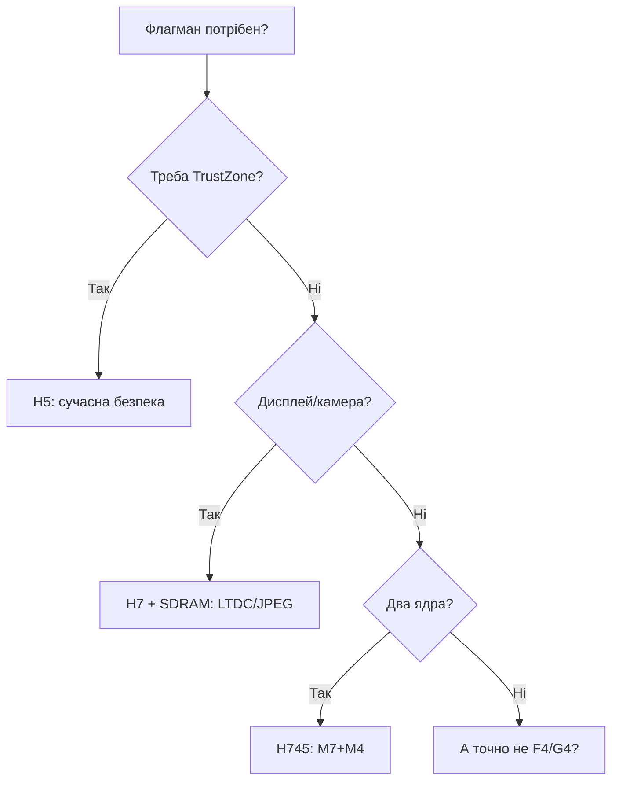

# STM32 H5 / H7 - флагмани з TrustZone і швидкістю

EN version: `01-Hardware/04-H5-H7.en.md`

![[assets/img/stm32-h5-h7-flagship-scheme.png|600]]
*Рис. Флагмани: безпека, швидкість, складне живлення.*

![[assets/img/stm32-h5-h7-flagship-scheme.png|600]]
*Рис. H5 - безпека і сучасність; H7 - груба сила: два ядра, LTDC, Ethernet.*

> [!tip] Призначення ноти
> Розібратися, за що платиш у флагманах: TrustZone, домени живлення, швидкі інтерфейси - і коли це зайве.

## 1. Призначення

H5 (Cortex-M33, 250 МГц) - «все сучасне одразу»: TrustZone, Secure Boot, OCTOSPI, FDCAN, USB HS, I3C. H7 (Cortex-M7 до 480 МГц, у H745/H755 - плюс друге ядро M4) - груба обчислювальна сила: LTDC-дисплеї, JPEG-кодек, Ethernet, Chrom-ART. Ціна питання - складне живлення (домени D1/D2/D3, LDO/SMPS/bypass) і BGA-корпуси.

## Характеристики родин

| Параметр | STM32H5 (H563/H573) | STM32H7 (H743/H745/H750) |
| --- | --- | --- |
| Ядра | M33 250 МГц (single) | M7 240-480 МГц (+M4 240 у dual-core) |
| Flash / RAM | 128-2048 КБ / 256-1408 КБ | 128-2048 КБ / до 1.4 МБ |
| TrustZone / Secure Boot | Так / Так | H735 і новіші (старі H743 - без!) |
| Зовнішня пам'ять | OCTOSPI + FMC | OCTOSPI/QSPI + FMC (SDRAM!) |
| Дисплей | LTDC (H573), MIPI-DSI (H757) | LTDC, JPEG, Chrom-ART |
| USB / Ethernet | USB FS/HS | USB FS/HS + Ethernet (H743) |
| CAN | FDCAN | FDCAN |
| Живлення | LDO / SMPS / bypass | Домени D1/D2/D3 + VCAP! |
| Коли брати | Захищені HMI, шлюзи, нове | Важка графіка, два ядра, максимум |

```text
Швидкий вибір усередині:
  Захищений вузол ................ H563 (TrustZone з коробки)
  Дисплей 7" + камера ............ H743 + SDRAM через FMC
  Два ядра (M7 обчислення + M4 реалтайм) ... H745
  Дешевий H7 без зайвого ......... H750 (без flash — тільки з зовнішньої!)
```

## Mermaid: H5 чи H7



## Домени живлення H7 (головний біль!)

| Домен | Що живить | Правило |
| --- | --- | --- |
| D1 (CPU) | M7-ядро, ART, ITCM/DTCM | VCAP-конденсатори обов'язкові |
| D2 (периферія) | Більшість периферії | Окремі виводи живлення |
| D3 (backup) | RTC, backup-SRAM | VBAT для ходу годинника |
| LDO / SMPS / Bypass | Внутрішній регулятор | SMPS - холодніше; bypass - зовнішній БЖ ядра |

> 90% «H7 не стартує» - це живлення: забутий VCAP, неправильний PWR-конфіг або порядок подачі доменів. Читай PWR-розділ Reference Manual першим, код - другим.

## Типові помилки

| # | Помилка | Чому погано | Як правильно |
| --- | --- | --- | --- |
| 1 | Немає VCAP-конденсаторів | Нестабільність/нестарт | 2.2 мкФ на кожен VCAP за даташитом |
| 2 | H750 як звичайний H743 | У H750 немає внутрішньої Flash! | Тільки з зовнішньою QSPI/OCTOSPI |
| 3 | TrustZone очікують на старому H743 | Немає апаратно | H735/H5 для TrustZone |
| 4 | LTDC без SDRAM | Кадр не влазить | SDRAM через FMC мінімум 8 МБ |
| 5 | Два ядра без IPCC | Конфлікт ресурсів M7/M4 | IPCC + HSEM для синхронізації |

## Офіційні джерела

- [STM32H563ZI datasheet (ST)](https://www.st.com/en/microcontrollers-microprocessors/stm32h563zi.html) - TrustZone, OCTOSPI.
- [STM32H743ZI datasheet (ST)](https://www.st.com/en/microcontrollers-microprocessors/stm32h743zi.html) - домени, LTDC.

## OCTOSPI/XIP-практика: виконання з зовнішньої Flash

XIP (eXecute In Place): код виконується прямо з зовнішньої OCTOSPI-Flash без копіювання в RAM. Налаштування: memory-mapped режим, dummy cycles за даташитом Flash, кешування увімкнено.

| Параметр | Значення |
| --- | --- |
| Швидкість | До 200+ МБ/с (DDR, 8 ліній) |
| Кеш | Інструкцій/даних - увімкнути, інакше гальма |
| H750 | Взагалі без внутрішньої Flash - тільки так і працює! |
| Шифрування | OTFDEC - розшифровка на льоту (захист прошивки) |

## TrustZone-практика H5: з чого почати

| Крок | Дія |
| --- | --- |
| 1 | Розбити пам'ять: Secure (ключі, crypto) / Non-secure (застосунок) |
| 2 | Старт завжди з Secure-світу, виклик через veneer-таблицю |
| 3 | Периферію поділити: UART для логу - Non-secure, crypto - Secure |
| 4 | Перевірити атаку: Non-secure код НЕ читає Secure-пам'ять (HardFault інакше) |

## Кеш M7: увімкнути і не страждати

| Тема | Практика |
| --- | --- |
| I-Cache / D-Cache | Увімкнути обидва при старті (`SCB_EnableICache`, `SCB_EnableDCache`) |
| DMA + D-Cache | Когерентність! Чистити/інвалідувати кеш навколо DMA-буферів |
| MPU | Налаштувати регіони: кешований Flash/RAM, некешована периферія |
| Симптом вимкненого кешу | Все працює, але в 3-5 разів повільніше |

```c
// Мінімум при старті H7:
SCB_EnableICache();
SCB_EnableDCache();
// DMA-буфер: вирівняти на 32 байти + чистити перед передачею:
SCB_CleanDCache_by_Addr((uint32_t*)buf, size);
```

## Dual-core H745: поділ праці

| Тема | Практика |
| --- | --- |
| Завантаження | M7 стартує першим, відпускає M4 |
| Спільна пам'ять | D3-SRAM + HSEM-семафори (без них - гонки!) |
| IPCC | Пошта між ядрами + пробудження зі сну |
| Дебаг | Два OpenOCD-підключення або один з перемиканням ядер |

## OCTOSPI vs FMC: що коли

| Критерій | OCTOSPI | FMC |
| --- | --- | --- |
| Швидкість | Вище (DDR, 8 ліній) | Нижче, але простіше |
| SDRAM | Ні | Так (для LTDC!) |
| XIP | Так, з кешем | NOR - так |
| Складність розводки | Висока (довжини пар!) | Середня |

## Дебаг-специфіка H5/H7

| Тема | Практика |
| --- | --- |
| Два ядра (H745) | Підключайся до обох, став брейкпоінти з урахуванням соседа |
| TrustZone у дебагу | Secure-світ видно тільки з правами; плануй заздалегідь |
| SWO-трасування | printf без UART, але налаштувати TPIU/ITM |

## Партномери: що замовляти

| Партномер | Ядра/Flash | Особливість | Для чого |
| --- | --- | --- | --- |
| STM32H563ZIT6 | M33/2 МБ | TrustZone, OCTOSPI | Захищений шлюз |
| STM32H573RIT6 | M33/2 МБ | LTDC, TrustZone | Захищений HMI |
| STM32H743ZIT6 | M7/2 МБ | LTDC, Ethernet | Дисплей і мережа |
| STM32H745BIT6 | M7+M4/2 МБ | Два ядра | Обчислення + реалтайм |
| STM32H750VBT6 | M7/128 КБ | Дешевий, без великої Flash | Тільки з QSPI! |
| STM32H7A3VIT6 | M7/2 МБ | Графіка, MIPI | Великі екрани |

## Errata: що знати до плати

| Тема | Практика |
| --- | --- |
| VCAP-конденсатори | Без них нестарт - перевірити кожну ногу! |
| H750 без Flash | Тільки зовнішня QSPI з лоадером |
| Кеш і DMA | Clean і invalidate навколо буферів |
| Ревізія TrustZone | Старі H743 без TrustZone апаратно! |

## Див. також

- [[Home]]
- [[00-Start/03-Porivnyannya-chipiv|Порівняння чипів]]
- [[01-Hardware/02-F3-F4|F3/F4]]
