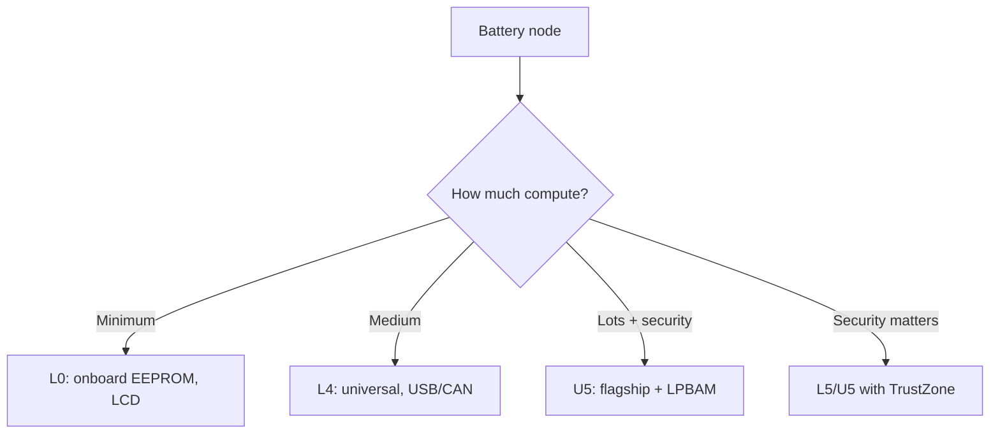

# STM32 L0 / L4 / U5 - Low Power and Batteries

![[assets/img/stm32-l0-l4-u5-lowpower-scheme.png|600]]
*Fig. Sleep modes and battery rule.*

![[assets/img/stm32-l0-l4-u5-lowpower-scheme.png|600]]
*Fig. Sleep in microamps: modes, what stays alive, battery for years.*

> [!tip] Purpose of this note
> Calculate autonomy before buying a chip: sleep modes, what lives in them, and why onboard EEPROM saves money.

## 1. Purpose

L0/L4/U5 are chips designed around the battery: microamp sleeps with RAM retention, autonomous peripherals (LPBAM in U5 works without CPU at all!), built-in EEPROM (L0) instead of external Flash for settings. L5 adds TrustZone to low power, U5 is a flagship that also eats little.

## Family characteristics

| Parameter | L0 (L031/L072) | L4 (L431/L452/L496) | L5 (L552) | U5 (U585/U599) |
| --- | --- | --- | --- | --- |
| Core | M0+ 32 MHz | M4 80-120 MHz | M33 110 MHz | M33 160 MHz |
| Flash / RAM | 16-192 KB / 2-20 KB | 128-1024 KB / 32-320 KB | 256-512 KB | up to 4 MB / up to 3 MB |
| EEPROM | Present (built-in!) | None (emulation in Flash) | None | None |
| LCD | Present (segment) | Present | None | None |
| USB / CAN | L072: USB | USB, CAN | USB | USB HS/FS |
| LPBAM | None | None | None | Yes! (autonomous peripherals) |
| TrustZone | None | None | Yes | Yes + Secure Boot |
| Typical sleep | About 1 uA Stop+RAM | About 1-2 uA Stop2 | About 100 nA Shutdown | About 300 nA Shutdown |
| When to choose | Long-life sensor | Universal battery unit | Protected battery unit | Maximum + battery |

## Sleep modes: what stays alive

| Mode | CPU | RAM | Wakeup | Current (guide) |
| --- | --- | --- | --- | --- |
| Sleep | Stop | Alive | Any interrupt | About 100 uA |
| Stop 0/1/2 | Stop | Alive (Stop2 partly) | EXTI/RTC/some peripherals | 1-20 uA |
| Standby | Stop | Clear (except backup) | WKUP pins/RTC/NRST | About 0.5 uA |
| Shutdown | Stop | Clear | WKUP/RTC | About 100-300 nA |

```text
Рахуй бюджет: I_сер = (I_акт × t_акт + I_сон × t_сон) / T_циклу.
Датчик раз на 10 хв: актив 100 мс × 10 мА + сон 599.9 с × 2 мкА ≈ 3.7 мкА середнього.
CR2450 (620 мАг) / 3.7 мкА ≈ 19 років (реально менше — саморозряд!).
```

## Mermaid: low-power chip choice



## Common issues

| # | Issue | Why it is bad | Fix |
| --- | --- | --- | --- |
| 1 | Stop instead of Standby out of habit | Extra microamps for years | Deepest mode the task allows |
| 2 | EEPROM written in a loop | 100k cycle wear | Write on change, not every second |
| 3 | USB/CAN left on in sleep | Milliamps instead of microamps | Disable PHY/transceivers separately |
| 4 | Wakeup every second | Average current as in active mode | Less often + more work at once |
| 5 | No real sleep measurement | Marketing numbers differ from board | Ammeter in battery break (see Lab) |

## Official sources

- [STM32L452RE datasheet (ST)](https://www.st.com/en/microcontrollers-microprocessors/stm32l452re.html) - modes, EEPROM emulation.
- [STM32U585AI datasheet (ST)](https://www.st.com/en/microcontrollers-microprocessors/stm32u585ai.html) - LPBAM, security.

## EEPROM practice L0: memory without wear stress

| Topic | Practice |
| --- | --- |
| Size | 2-6 KB depending on chip (states, calibration, counters) |
| Wear | About 100k cycles - write on change, not in loop |
| Speed | Slower than Flash, not for buffers |
| Emulation on L4/U5 | ST EEPROM-emulation library: two Flash pages + wear-leveling |

## LPBAM practice U5: peripherals without CPU

| Topic | Practice |
| --- | --- |
| Idea | DMA + peripherals run in Stop modes, CPU sleeps |
| Scenario | ADC samples to DMA buffer - threshold wakes CPU |
| Setup | CubeMX: LPBAM peripheral config, LPTIM triggers |
| Benefit | Microamps instead of milliamps in background tasks |

## Measuring real sleep (mandatory!)

```text
1. Розірви перемичку живлення (IDD на Nucleo!) або живи від батареї через амперметр.
2. Вимкни дебаг (ST-Link тримає домени!) — міряй без підключеного дебагера.
3. Дочекайся усталення: перші секунди брешуть (конденсатори, UART-флеш).
4. Порівняй з даташитом: розбіжність ×10 — шукай неувімкнену периферію.
```

## LCD practice (L0/L4 with driver)

| Topic | Practice |
| --- | --- |
| Segments | Up to 8x44 (L4), contrast - internal step-up |
| LCD supply | VLCD separate + capacitors per datasheet |
| In sleep | LCD can run in Stop - clock without CPU! |
| Library | HAL + Cube examples, fonts - own bitmaps |

## RTC and backup domain: details

| Topic | Practice |
| --- | --- |
| VBAT | CR2032/supercap: RTC + backup registers + tamper live |
| LSE vs LSI | LSE 32.768 kHz crystal - accuracy; LSI - percent drift |
| Calibration | Smooth calibration against mains/GPS PPS |
| Tamper | Erase secrets on case open (medical/payment) |

## Battery chemistries for L0/L4/U5

| Chemistry | Voltage | Nuance |
| --- | --- | --- |
| CR2032 | 3.0V | Only RTC/backup + rare measurements (current!) |
| Li-SOCl2 (ER14505) | 3.6V | 10+ years on sensors, not rechargeable! |
| Li-Ion 18650 | 4.2-3.0V | LDO/buck with small dropout, else underuse |
| LiFePO4 | 3.6-2.5V | Flat curve - need fuel gauge, not voltmeter |
| 2xAA alkaline | 3.0-1.8V | Boost mandatory, leak when discharged - holder with contacts |

## Typical node configurations

| Node | Chip | Peripherals | Battery |
| --- | --- | --- | --- |
| Temperature sensor/once per hour | L031 | ADC + RTC | CR2450 for years |
| Tracker/logger | L452 | UART + SPI-Flash + USB | Li-SOCl2 |
| Protected sensor | L552 | TrustZone + tamper | Li-Ion + solar charge |
| Battery gateway | U585 | FDCAN + OCTOSPI + USB-HS | Li-Ion 18650 |

## Part numbers: what to order

| Part number | Core/Flash | Feature | Purpose |
| --- | --- | --- | --- |
| STM32L031K6T6 | M0+/32 KB | Onboard EEPROM | Long-life beacon |
| STM32L072CZT6 | M0+/192 KB | USB + LCD | Sensor with screen |
| STM32L431RCT6 | M4/256 KB | USB, CAN | Universal node |
| STM32L452RET6 | M4/512 KB | USB, LCD | Logger with screen |
| STM32L552ZET6 | M33/512 KB | TrustZone | Protected sensor |
| STM32U585AIT6 | M33/2 MB | LPBAM, OCTOSPI | Flagship on battery |

## Errata: what to know before the board

| Topic | Practice |
| --- | --- |
| Early revision sleep modes | Check Stop2 current errata |
| LSE crystal | Load capacitance per resonator datasheet |
| EEPROM wear | 100 thousand cycles - write on change |

## See also

- [[Home.en]]
- [[00-Start/03-Porivnyannya-chipiv.en | Chip comparison]]
- [[01-Hardware/04-H5-H7.en | H5/H7]]
