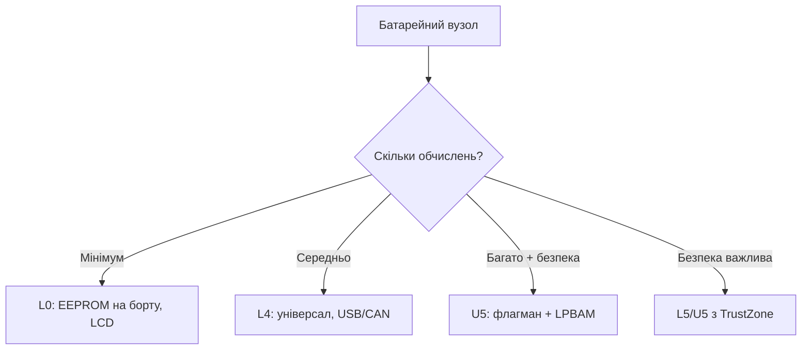

# STM32 L0 / L4 / U5 - низьке споживання і батарейки

EN version: `01-Hardware/05-L0-L4-U5.en.md`

![[assets/img/stm32-l0-l4-u5-lowpower-scheme.png|600]]
*Рис. Режими сну і правило батареї.*

![[assets/img/stm32-l0-l4-u5-lowpower-scheme.png|600]]
*Рис. Сон у мікроамперах: режими, що лишається живим, батарейка на роки.*

> [!tip] Призначення ноти
> Порахувати автономність до покупки чипа: режими сну, що в них живе, і чому EEPROM на борту економить гроші.

## 1. Призначення

L0/L4/U5 - чипи, спроектовані навколо батареї: мікроамперні сни зі збереженням RAM, автономна периферія (LPBAM в U5 працює взагалі без CPU!), вбудований EEPROM (L0) замість зовнішньої Flash під налаштування. L5 додає TrustZone до низького споживання, U5 - це флагман, який ще й мало їсть.

## Характеристики родин

| Параметр | L0 (L031/L072) | L4 (L431/L452/L496) | L5 (L552) | U5 (U585/U599) |
| --- | --- | --- | --- | --- |
| Ядро | M0+ 32 МГц | M4 80-120 МГц | M33 110 МГц | M33 160 МГц |
| Flash / RAM | 16-192 КБ / 2-20 КБ | 128-1024 КБ / 32-320 КБ | 256-512 КБ | до 4 МБ / до 3 МБ |
| EEPROM | Є (вбудований!) | Немає (емуляція у Flash) | Немає | Немає |
| LCD | Є (сегментний) | Є | Немає | Немає |
| USB / CAN | L072: USB | USB, CAN | USB | USB HS/FS |
| LPBAM | Немає | Немає | Немає | Так! (автономна периферія) |
| TrustZone | Немає | Немає | Так | Так + Secure Boot |
| Сон типовий | ~1 мкА Stop+RAM | ~1-2 мкА Stop2 | ~100 нА Shutdown | ~300 нА Shutdown |
| Коли брати | Датчик-довгожитель | Універсальний батарейний | Захищений батарейний | Максимум + батарея |

## Режими сну: що лишається живим

| Режим | CPU | RAM | Пробудження | Струм (орієнтир) |
| --- | --- | --- | --- | --- |
| Sleep | Стоп | Жива | Будь-яке переривання | ~100 мкА |
| Stop 0/1/2 | Стоп | Жива (Stop2 частково) | EXTI/RTC/деякі периферії | 1-20 мкА |
| Standby | Стоп | Чиста (крім backup) | WKUP-піни/RTC/NRST | ~0.5 мкА |
| Shutdown | Стоп | Чиста | WKUP/RTC | ~100-300 нА |

```text
Рахуй бюджет: I_сер = (I_акт × t_акт + I_сон × t_сон) / T_циклу.
Датчик раз на 10 хв: актив 100 мс × 10 мА + сон 599.9 с × 2 мкА ≈ 3.7 мкА середнього.
CR2450 (620 мАг) / 3.7 мкА ≈ 19 років (реально менше — саморозряд!).
```

## Mermaid: вибір low-power чипа



## Типові помилки

| # | Помилка | Чому погано | Як правильно |
| --- | --- | --- | --- |
| 1 | Stop замість Standby «за звичкою» | Зайві мікроампери роками | Найглибший режим, який дозволяє задача |
| 2 | EEPROM пишуть у циклі | Знос 100k циклів | Писати при зміні, не щосекунди |
| 3 | USB/CAN лишаються увімкненими в сні | Міліампери замість мікроампер | Вимикати PHY/трансивери окремо |
| 4 | Пробудження кожну секунду | Середній струм як в активі | Рідше + більше роботи за раз |
| 5 | Немає виміру реального сну | Маркетингові цифри ≠ плата | Амперметр у розрив батареї (див. Lab) |

## Офіційні джерела

- [STM32L452RE datasheet (ST)](https://www.st.com/en/microcontrollers-microprocessors/stm32l452re.html) - режими, EEPROM-емуляція.
- [STM32U585AI datasheet (ST)](https://www.st.com/en/microcontrollers-microprocessors/stm32u585ai.html) - LPBAM, безпека.

## EEPROM-практика L0: пам'ять без зносу-стресу

| Тема | Практика |
| --- | --- |
| Обсяг | 2-6 КБ залежно від чипа (статуси, калібрування, лічильники) |
| Знос | ~100k циклів - писати при зміні, не в циклі |
| Швидкість | Повільніше за Flash, не для буферів |
| Емуляція на L4/U5 | Бібліотека EEPROM-emulation ST: дві сторінки Flash + wear-leveling |

## LPBAM-практика U5: периферія без CPU

| Тема | Практика |
| --- | --- |
| Ідея | DMA + периферія працюють у Stop-режимах, CPU спить |
| Сценарій | АЦП семплить → DMA складає → поріг будить CPU |
| Налаштування | CubeMX: LPBAM-конфіг периферії, тригери LPTIM |
| Вигода | Мікроампери замість міліампер у фонових задачах |

## Вимірювання реального сну (обов'язково!)

```text
1. Розірви перемичку живлення (IDD на Nucleo!) або живи від батареї через амперметр.
2. Вимкни дебаг (ST-Link тримає домени!) — міряй без підключеного дебагера.
3. Дочекайся усталення: перші секунди брешуть (конденсатори, UART-флеш).
4. Порівняй з даташитом: розбіжність ×10 — шукай неувімкнену периферію.
```

## LCD-практика (L0/L4 з драйвером)

| Тема | Практика |
| --- | --- |
| Сегменти | До 8×44 (L4), контраст - внутрішнім step-up |
| Живлення LCD | VLCD окремо + конденсатори за даташитом |
| У сні | LCD може працювати в Stop - годинник без CPU! |
| Бібліотека | HAL + приклади Cube, шрифти - свої растрові |

## RTC і backup-домен: деталі

| Тема | Практика |
| --- | --- |
| VBAT | CR2032/іоністор: RTC + backup-регістри + tamper живуть |
| LSE vs LSI | LSE-кварц 32.768 кГц - точність; LSI - дрейф у відсотках |
| Калібрування | Smooth calibration проти мережі/GPS PPS |
| Tamper | Стирання секретів при відкритті корпусу (медицина/платежі) |

## Батарейні хімії під L0/L4/U5

| Хімія | Напруга | Нюанс |
| --- | --- | --- |
| CR2032 | 3.0V | Тільки RTC/backup + рідкісні виміри (струм!) |
| Li-SOCl2 (ER14505) | 3.6V | 10+ років на датчиках, не перезаряджається! |
| Li-Ion 18650 | 4.2-3.0V | LDO/buck з малим dropout, інакше недовикористання |
| LiFePO4 | 3.6-2.5V | Плоска крива - потрібен fuel-gauge, не вольтметр |
| 2×AA лужні | 3.0-1.8V | Boost обов'язковий, течуть при розряді - тримач з контактами |

## Типові конфігурації вузлів

| Вузол | Чип | Периферія | Батарея |
| --- | --- | --- | --- |
| Датчик температури/раз на годину | L031 | ADC + RTC | CR2450 на роки |
| Трекер/логер | L452 | UART + SPI-Flash + USB | Li-SOCl2 |
| Захищений датчик | L552 | TrustZone + tamper | Li-Ion + сонячна підзарядка |
| Шлюз з батареєю | U585 | FDCAN + OCTOSPI + USB-HS | Li-Ion 18650 |

## Партномери: що замовляти

| Партномер | Ядро/Flash | Особливість | Для чого |
| --- | --- | --- | --- |
| STM32L031K6T6 | M0+/32 КБ | EEPROM на борту | Маяк-довгожитель |
| STM32L072CZT6 | M0+/192 КБ | USB + LCD | Датчик з екраном |
| STM32L431RCT6 | M4/256 КБ | USB, CAN | Універсальний вузол |
| STM32L452RET6 | M4/512 КБ | USB, LCD | Логер з екраном |
| STM32L552ZET6 | M33/512 КБ | TrustZone | Захищений датчик |
| STM32U585AIT6 | M33/2 МБ | LPBAM, OCTOSPI | Флагман на батареї |

## Errata: що знати до плати

| Тема | Практика |
| --- | --- |
| Режими сну ранніх ревізій | Перевірити errata Stop2-струмів |
| Кварц LSE | Ємність навантаження за даташитом резонатора |
| EEPROM знос | 100 тисяч циклів - писати при зміні |

## Див. також

- [[Home]]
- [[00-Start/03-Porivnyannya-chipiv|Порівняння чипів]]
- [[01-Hardware/04-H5-H7|H5/H7]]
