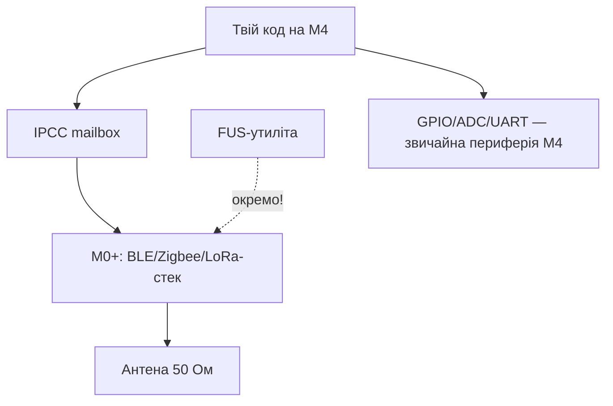

# STM32 WB / WL - бездротові чипи

![[assets/img/stm32-wb-wl-radio-scheme.png|600]]
*Рис. M4 - код, M0+ - радіо, FUS окремо.*

![[assets/img/stm32-wb-wl-radio-scheme.png|600]]
*Рис. Два ядра: прикладне M4 + радіо M0+, пошта IPCC між ними, антена 50 Ом.*

> [!tip] Призначення ноти
> Зрозуміти двійникову архітектуру WB/WL: що робить кожне ядро, як оновлюються радіо-стеки і де живе антена.

## 1. Призначення

WB55 (BLE + 802.15.4: Zigbee/Thread/Matter) і WL55 (Sub-GHz: LoRa) - це два процесори в одному корпусі: прикладний Cortex-M4 (твій код) і радіо Cortex-M0+ (закритий стек ST). Спілкуються через поштову скриньку IPCC і спільну пам'ять. Радіо-стек оновлюється окремо утилітою FUS (Firmware Upgrade Services) - не разом з твоєю прошивкою!

## Характеристики

| Параметр | STM32WB55 | STM32WL55 |
| --- | --- | --- |
| Ядра | M4 64 МГц + M0+ 32 МГц (радіо) | M4 48 МГц + M0+ 48 МГц (радіо) |
| Flash / RAM | 1 МБ / 256 КБ (спільна!) | 256 КБ / 64 КБ |
| Радіо | BLE 5.4 + 802.15.4 (Zigbee/Thread/Matter) | Sub-GHz LoRa/(G)FSK/MSK (SX126x-блок!) |
| Одночасно | BLE + Zigbee (concurrent!) | LoRaWAN + P2P |
| Антена | 50 Ом, PCB/чіп-антена + pi-ланцюг | 50 Ом, sub-GHz антена |
| FUS / Stacks | FUS + BLE-stack + Thread (окремі бінарники!) | FUS + LoRaWAN-стек |
| Живлення | SMPS-конфігурація для економії | До 22 дБм TX (струм!) |
| Коли брати | BLE-маяк/шлюз/розумний дім | LoRaWAN-вузол без зовнішнього радіо |

```text
Швидкий вибір усередині:
  BLE-периферія ................. WB55CG (базовий)
  Zigbee/Thread ................. WB55 + відповідний стек
  LoRaWAN вузол ................. WL55JC (вбудований DC-DC)
  P2P-радіо без стеку ........... WL + bare-metal драйвер SX126x
```

## Mermaid: хто що робить



## Прошивка радіо-стека (важливо!)

1. Підключи ST-Link, відкрий STM32CubeProgrammer.
2. Вкладка Firmware Upgrade Services: спочатку онови FUS, потім залий wireless stack під свою задачу (BLE_full / Thread_FTD / Zigbee_FFD / LoRaWAN).
3. Тільки потім ший свою M4-прошивку. Невірний стек = мовчання радіо при живому M4!
4. Версії FUS і стека мають бути сумісні (таблиця сумісності в релізноуті!).

## Типові помилки

| # | Помилка | Чому погано | Як правильно |
| --- | --- | --- | --- |
| 1 | Свій код без FUS/стека | Радіо мовчить | Спочатку FUS, потім stack, потім код |
| 2 | Антена «яка була» | КСХ вбиває дальність і PA | 50 Ом на свою частоту + pi-підстроювання |
| 3 | Вся Flash під M4 | Стек нікуди класти | Розкладка пам'яті за AppNote (частина - стеку!) |
| 4 | BLE і Zigbee «якось самі» | Конфлікт таймінгів | Concurrent-режим з прикладу ST |
| 5 | LoRa без ліцензії на потужність | Штрафи/глушіння | Duty-cycle і EIRP за регіоном |

## Офіційні джерела

- [STM32WB55CG datasheet (ST)](https://www.st.com/en/microcontrollers-microprocessors/stm32wb55cg.html) - dual-core, стеки.
- [STM32WL55JC datasheet (ST)](https://www.st.com/en/microcontrollers-microprocessors/stm32wl55jc.html) - LoRa-блок.

## IPCC-практика: пошта між ядрами

| Тема | Практика |
| --- | --- |
| Канали | TX/RX черги в спільній SRAM, прапорці зайнятості |
| HSEM | Апаратні семафори проти одночасного доступу |
| Черга подій | M4 кладе команду, M0+ забирає; відповідь - навпаки |
| Дебаг | Логувати обидва боки з мітками часу - інакше не зрозуміти, хто завис |

## Антена 50 Ом практика (обидва чипи)

| Тема | Практика |
| --- | --- |
| Pi-ланцюг | Два конденсатори + індуктивність біля виводу ANT |
| Налаштування | VNA або мінімум - вимір RSSI на фіксованій дистанції до/після |
| Keepout | Ніякої міді/металу під chip-антеною |
| Sub-GHz (WL) | Антена довша фізично; не плутати 433/868 МГц версії |
| Сертифікація | Модульні версії (з екраном) спрощують RED/FCC |

## Concurrent BLE + Zigbee (WB): як уживаються

| Тема | Практика |
| --- | --- |
| Принцип | Time-slicing радіо між стеками (один трансивер!) |
| Обмеження | Пікова пропускна падає; real-time BLE-аудіо + mesh - погана пара |
| Налаштування | Приклад concurrent з пакету CubeWB, таймслоти за замовчуванням |
| Діагностика | Сніффер 802.15.4 + BLE одночасно, дивитись колізії |

## LoRa-практика WL: SX126x-блок зсередини

| Тема | Практика |
| --- | --- |
| Режими | LoRa / (G)FSK / MSK / BPSK - регістрами радіо |
| LoRaWAN-стек | Приклад end-node з пакета CubeWL: OTAA, duty-cycle, ADR |
| P2P без стеку | Прямі регістри + DIO-переривання, свій протокол |
| TX-потужність | До +22 дБм, але струм і нагрів; EIRP за регіоном! |
| TCXO vs XTAL | TCXO-версії тримають частоту в мороз/спеку |

## OTA для радіо-вузлів (WB/WL специфіка)

| Тема | Практика |
| --- | --- |
| Два образи | M4-застосунок і радіо-стек оновлюються окремо! |
| BLE OTA | Служба OTA в BLE-профілі вузла |
| LoRaWAN FUOTA | Фрагментована прошивка ефіром (довго, для парку) |
| Відкат | Дві M4-слоти або зовнішня Flash з golden-образом |

## Сертифікація радіо: що замовляти

| Питання | Відповідь |
| --- | --- |
| Модуль vs чип | Сертифікований модуль (з екраном) - тести простіші і дешевші |
| Антена своя | Пересертифікація випромінювання майже напевно |
| Прошивка впливає? | Потужність/частота/протокол зашиті - міняєш, перетестовуєш |
| Документи | ФCC/CE/RED + TELEC для Японії - закладати бюджет і час |

## Типові конфігурації вузлів

| Вузол | Чип | Стек | Живлення |
| --- | --- | --- | --- |
| BLE-маяк | WB55 | BLE peripheral | CR2450 |
| Zigbee-датчик | WB55 | Zigbee FFD/ED | 2×AA |
| LoRaWAN-датчик | WL55 | LoRaWAN end-node | Li-SOCl2 |
| P2P-пульт | WL55 | Bare-metal | Li-Ion |

## Партномери: що замовляти

| Партномер | Радіо | Особливість | Для чого |
| --- | --- | --- | --- |
| STM32WB55CGU6 | BLE + 802.15.4 | 1 МБ Flash | Маяк, шлюз, розумний дім |
| STM32WB55CEU5 | BLE + 802.15.4 | 512 КБ, маленький | Компактний датчик |
| STM32WB5MMGH6 | BLE-модуль | Екран + антена | Сертифікація простіше |
| STM32WL55JC56 | LoRa sub-GHz | 256 КБ | Вузол LoRaWAN |
| STM32WLE5CCU6 | LoRa sub-GHz | Без M4 зайвого | Радіо-модем |

## Errata і стеки: що знати до плати

| Тема | Практика |
| --- | --- |
| FUS і стек з одного пакета | Інакше радіо мовчить |
| Ревізія радіо-частини | Errata чутливості приймача |
| Сертифікований модуль | Тести дешевші, ніж чип з нуля |

## Див. також

- [[Home]]
- [[00-Start/03-Porivnyannya-chipiv|Порівняння чипів]]
- [[01-Hardware/05-L0-L4-U5|Low-power]]
