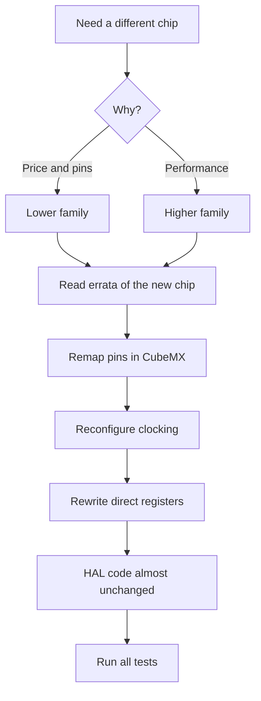

# Errata and Migration - Moving Between STM32 Families

![[assets/img/stm32-families-compare-scheme.png|600]]
*Fig. Painless migration: what to read before the board and what to change in code.*

> [!tip] Purpose of this note
> Learn to read errata before ordering the board and port projects between families without surprises.

## 1. Purpose

No chip is perfect: every chip has errata - a list of hardware bugs with workarounds. And moving between families breaks pins, registers and clocking. This note gives the order: first the errata of your chip, then a map of differences, then code.

## How to Read Errata

| Step | Action |
| --- | --- |
| 1 | Find the errata by exact part number and silicon revision! |
| 2 | Go through the peripherals you use |
| 3 | Mark the bugs that affect your schematic |
| 4 | Apply the workaround from the document |

```text
Типові сюрпризи з errata:
  АЦП дає зсув у певному режимі — калібрування частіше;
  I2C клинить на певній послідовності — програмний ресет шини;
  Flash потребує більше wait states, ніж у даташиті.
```

## Silicon Revision: Where to Look

| Topic | Practice |
| --- | --- |
| Marking | Revision letter on the package |
| Reading from code | IDCODE and revision via the debugger |
| Batch | Different batches have different revisions, check each one! |
| Purchasing | Confirm the revision with the supplier for production |

## Mermaid: Migrating Between Families



## Difference Map: F1 to G0

| Topic | F1 | G0 |
| --- | --- | --- |
| Core | M3, 72 MHz | M0+, 64 MHz |
| Pin remap | MAPR register | AFR tables |
| USB | Only higher models | Device in many |
| Power supply | 2.0-3.6 V | 1.8-3.6 V, wider |
| HAL | Old, familiar | Newer, small API differences |

## Difference Map: F4 to H5

| Topic | F4 | H5 |
| --- | --- | --- |
| Core | M4F, up to 180 MHz | M33, 250 MHz + TrustZone |
| Power supply | Simple | SMPS and domains! |
| Memory | Internal is enough | OCTOSPI for large volumes |
| FPU | Single precision | Same, code ports over |
| Security | RDP | RDP + secure boot |

## What Ports Over and What Does Not

| Layer | Portability |
| --- | --- |
| Application logic | Yes, almost unchanged |
| HAL calls | Yes, with small name fixes |
| LL and registers | No, rewrite for the new Reference Manual! |
| Clock tree | No, configure from scratch |
| Linker and startup | No, take from the new CubeMX project |

```c
// Приклад різниці: увімкнення тактування GPIO
// F1:
RCC->APB2ENR |= RCC_APB2ENR_IOPCEN;
// G0/F4:
RCC->AHBENR |= RCC_AHBENR_GPIOCEN;   // інша шина!
// Висновок: тактування завжди звіряти з новим чипом.
```

## Common issues

| # | Issue | Why it is bad | Fix |
| --- | --- | --- | --- |
| 1 | Errata not read | A hardware bug takes weeks to cure in code | Errata before the first board! |
| 2 | Pins copied 1-to-1 from the old board | Pinout is different | New CubeMX project from scratch |
| 3 | Registers copied over | Different addresses and bits | Only via the new Reference Manual |
| 4 | Clocking copied over | Different buses and dividers | Clock tree from scratch |
| 5 | Old startup file | Wrong vectors | Startup from the new package |
| 6 | Revision not checked | Different errata | IDCODE of every batch |
| 7 | Tests not run | Regression in the field | Full test cycle after migration |

## Official sources

- [STM32 errata search (ST)](https://www.st.com/en/microcontrollers-microprocessors.html) - errata by part number.
- [AN2154 Migration guide (ST)](https://www.st.com/resource/en/application_note/an2154.pdf) - migration between families.

## Migration Checklist: Item by Item

| Number | Item |
| --- | --- |
| 1 | Errata of the new chip read, bugs accounted for |
| 2 | New CubeMX project created from scratch |
| 3 | Pins remapped, conflicts resolved |
| 4 | Clock tree configured and verified with MCO |
| 5 | Direct registers rewritten per the new manual |
| 6 | HAL code ported and built without warnings |
| 7 | Peripherals tested one by one: UART, I2C, SPI, ADC |
| 8 | Stress test for a day without resets |

## Clock Change: Example Thinking

```text
Було на F103 (72 МГц):
  HSE 8 МГц -> PLL x9 -> SYSCLK 72;
  APB1 /2 = 36 МГц (таймери x2 = 72!).

Стало на G070 (64 МГц):
  HSI16 -> PLL -> SYSCLK 64;
  APB /1 = 64 МГц (таймери без множника!);
  бодрейти UART перерахувати — шина інша!
```

## Typical Errata Workarounds: Examples

| Bug | Workaround |
| --- | --- |
| I2C lockup at start | Software bus reset with 9 clocks |
| ADC offset in oversampling | Calibration before every batch |
| Flash wait states understated | Add one WS over the datasheet |
| WWDG early trigger | Window wider than calculated |

```text
Оформлення workaround у коді:
  коментар з номером errata і ревізією;
  умовна компіляція під ревізію, де треба;
  тест, що ловить саме цей баг.
```

## Purchasing for Production: What to Confirm

| Item | Why |
| --- | --- |
| Exact part number with letters | Package, temperature, packing |
| Silicon revision | Errata of the exact revision! |
| Second-source alternative | Pin-to-pin compatible candidate |
| Datasheet revision | Store together with the board Gerbers |

## See also

- [[Home.en]]
- [[01-Hardware/01-F0-F1-Classic.en | Chip classics]]
- [[01-Hardware/03-G0-G4.en | Modern families]]
- [[01-Hardware/04-H5-H7.en | Flagships]]
- [[00-Start/03-Porivnyannya-chipiv.en | Chip comparison]]
