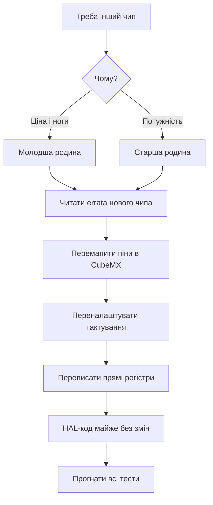

# Errata і міграція - переїзд між родинами STM32

EN version: `01-Hardware/07-Errata-Migration.en.md`

![[assets/img/stm32-families-compare-scheme.png|600]]
*Рис. Переїзд без болю: що читати до плати і що міняти в коді.*

> [!tip] Призначення ноти
> Навчити читати errata до замовлення плати і переносити проєкт між родинами без сюрпризів.

## 1. Призначення

Жоден кристал не ідеальний: у кожного є errata - список апаратних багів з обхідними шляхами. А переїзд між родинами ламає піни, регістри і тактування. Ця нота дає порядок: спочатку errata свого чипа, потім карта відмінностей, потім код.

## Як читати errata

| Крок | Дія |
| --- | --- |
| 1 | Знайти errata за точним партномером і ревізією кристала! |
| 2 | Пройтись по периферії, яку використовуєш |
| 3 | Позначити баги з впливом на твою схему |
| 4 | Впровадити workaround з документа |

```text
Типові сюрпризи з errata:
  АЦП дає зсув у певному режимі — калібрування частіше;
  I2C клинить на певній послідовності — програмний ресет шини;
  Flash потребує більше wait states, ніж у даташиті.
```

## Ревізія кристала: де дивитись

| Тема | Практика |
| --- | --- |
| Маркування | Літера ревізії на корпусі |
| Читання з коду | IDCODE і ревізія через дебагер |
| Партія | Різні партії - різні ревізії, перевіряти кожну! |
| Закупівля | Уточнювати ревізію у постачальника для серії |

## Mermaid: переїзд між родинами



## Карта відмінностей: F1 - G0

| Тема | F1 | G0 |
| --- | --- | --- |
| Ядро | M3, 72 МГц | M0+, 64 МГц |
| Remap пінів | MAPR-регістр | AFR-таблиці |
| USB | Тільки старші | Device у багатьох |
| Живлення | 2.0-3.6 В | 1.8-3.6 В, ширше |
| HAL | Старий, звичний | Новіший, дрібні відмінності API |

## Карта відмінностей: F4 - H5

| Тема | F4 | H5 |
| --- | --- | --- |
| Ядро | M4F, до 180 МГц | M33, 250 МГц + TrustZone |
| Живлення | Просте | SMPS і домени! |
| Пам'ять | Внутрішня вистачає | OCTOSPI для великих |
| FPU | Одинарна | Та сама, код переноситься |
| Безпека | RDP | RDP + secure boot |

## Що переноситься, а що ні

| Шар | Переносимість |
| --- | --- |
| Прикладна логіка | Так, майже без змін |
| HAL-виклики | Так, з дрібними правками імен |
| LL і регістри | Ні, переписувати під новий Reference Manual! |
| Clock tree | Ні, налаштовувати заново |
| Лінкер і startup | Ні, брати з нового CubeMX-проєкту |

```c
// Приклад різниці: увімкнення тактування GPIO
// F1:
RCC->APB2ENR |= RCC_APB2ENR_IOPCEN;
// G0/F4:
RCC->AHBENR |= RCC_AHBENR_GPIOCEN;   // інша шина!
// Висновок: тактування завжди звіряти з новим чипом.
```

## Типові помилки

| # | Помилка | Чому погано | Як правильно |
| --- | --- | --- | --- |
| 1 | Errata не читали | Баг у залізі лікується кодом тижнями | Errata до першої плати! |
| 2 | Піни 1-в-1 зі старої плати | Розпіновка інша | Новий CubeMX-проєкт з нуля |
| 3 | Регістри скопійовано | Інші адреси і біти | Тільки через новий Reference Manual |
| 4 | Тактування скопійовано | Інші шини і дільники | Clock tree заново |
| 5 | Старий startup-файл | Вектори не ті | Startup з нового пакета |
| 6 | Ревізію не перевірили | Errata інша | IDCODE кожної партії |
| 7 | Тести не прогнали | Регресія в полі | Повний цикл тестів після переїзду |

## Офіційні джерела

- [STM32 errata search (ST)](https://www.st.com/en/microcontrollers-microprocessors.html) - errata за партномером.
- [AN2154 Migration guide (ST)](https://www.st.com/resource/en/application_note/an2154.pdf) - переїзд між родинами.

## Чекліст переїзду: по пунктах

| Номер | Пункт |
| --- | --- |
| 1 | Errata нового чипа прочитано, баги враховано |
| 2 | Новий CubeMX-проєкт створено з нуля |
| 3 | Піни перемаплено, конфлікти розв'язано |
| 4 | Clock tree налаштовано і перевірено MCO |
| 5 | Прямі регістри переписано за новим мануалом |
| 6 | HAL-код перенесено і зібрано без ворнінгів |
| 7 | Периферія протестована по черзі: UART, I2C, SPI, АЦП |
| 8 | Стрес-тест добу без скидань |

## Зміна тактування: приклад мислення

```text
Було на F103 (72 МГц):
  HSE 8 МГц -> PLL x9 -> SYSCLK 72;
  APB1 /2 = 36 МГц (таймери x2 = 72!).

Стало на G070 (64 МГц):
  HSI16 -> PLL -> SYSCLK 64;
  APB /1 = 64 МГц (таймери без множника!);
  бодрейти UART перерахувати — шина інша!
```

## Типові workarounds з errata: приклади

| Баг | Обхід |
| --- | --- |
| I2C клин на старті | Програмний ресет шини 9 клоками |
| АЦП зсув у OVSR | Калібрування перед кожною серією |
| Flash wait states занижено | Додати один WS понад даташит |
| WWDG раннє спрацьовування | Вікно ширше, ніж розрахунок |

```text
Оформлення workaround у коді:
  коментар з номером errata і ревізією;
  умовна компіляція під ревізію, де треба;
  тест, що ловить саме цей баг.
```

## Закупівля під серію: що уточнити

| Пункт | Навіщо |
| --- | --- |
| Точний партномер з літерами | Корпус, температура, упаковка |
| Ревізія кристала | Errata конкретної ревізії! |
| Альтернатива другого джерела | Сумісний пін-у-пін кандидат |
| Даташит ревізії | Зберігати разом з герберами плати |

## Див. також

- [[Home]]
- [[01-Hardware/01-F0-F1-Classic|класика чипів]]
- [[01-Hardware/03-G0-G4|сучасні родини]]
- [[01-Hardware/04-H5-H7|флагмани]]
- [[00-Start/03-Porivnyannya-chipiv|порівняння чипів]]
