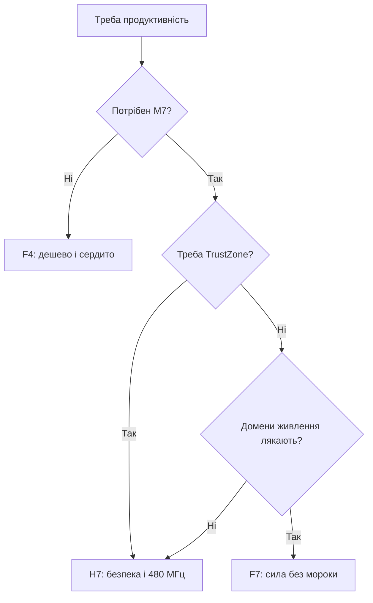

# STM32F7 - міст між F4 і H7

![[assets/img/stm32-f7-scheme.png|600]]
*Рис. F7: сила M7 без складнощів H7.*

> [!tip] Призначення ноти
> Пояснити місце F7: коли це розумний вибір, а коли брати H7 одразу.

## 1. Призначення

STM32F7 - перший Cortex-M7 у ST: 216 МГц, подвійна точність FPU, кеші інструкцій і даних, ART-акселератор. По суті це F4 з ядром рівня H7, але без доменів живлення і TrustZone. Для графіки, камер і DSP, де H7 надлишковий за ціною і складністю.

## 2. F7 проти F4 проти H7

| Параметр | F4 | F7 | H7 |
| --- | --- | --- | --- |
| Ядро | M4F 180 МГц | M7 216 МГц | M7 до 480 МГц |
| FPU | Одинарна | Одинарна + подвійна! | Одинарна + подвійна |
| Кеш I/D | Немає | Є! | Є |
| Живлення | Просте | Просте | Домени D1/D2/D3! |
| TrustZone | Немає | Немає | H735 і новіші |
| Камера/дисплей | DCMI/LTDC | DCMI/LTDC | Те саме + більше |
| Ціна | Найнижча | Середина | Вища |

```text
Правило вибору:
  вистачає F4 ......... бери F4, дешевше;
  треба M7 без мороки .. бери F7;
  треба TrustZone/два ядра/480 МГц .. тільки H7.
```

## 3. Кеш M7: увімкнути обов'язково

| Тема | Практика |
| --- | --- |
| I-Cache і D-Cache | Вмикати при старті, інакше повільно! |
| D-Cache + DMA | Чистити і інвалідувати навколо буферів |
| MPU | Некешована периферія, кешована пам'ять |
| ART | Працює разом з кешем, не вимикати |

```c
// Мінімум старту F7:
SCB_EnableICache();
SCB_EnableDCache();
// DMA-буфер: вирівняти на 32 байти + clean/invalidate!
```

## 4. Партномери і errata

| Партномер | Flash | Для чого |
| --- | --- | --- |
| STM32F746NGH6 | 1 МБ | Дисплей + камера, класика |
| STM32F769NIH6 | 2 МБ | Максимум графіки, DSI! |
| STM32F722ZET6 | 512 КБ | Дешевий вхід у M7 |
| STM32F732VET6 | 512 КБ | Без LTDC, під обчислення |

| Тема | Практика |
| --- | --- |
| Ревізія кристала | Errata кешу ранніх ревізій! |
| Double float | Повільніше одинарного - тільки де треба |
| Discovery F769 | Готова платформа з дисплеєм |

## Mermaid: F4, F7 чи H7



## Типові помилки

| # | Помилка | Чому погано | Як правильно |
| --- | --- | --- | --- |
| 1 | Кеш не увімкнено | У рази повільніше | I+D Cache при старті! |
| 2 | DMA без чистки кешу | Старі дані | Clean/invalidate завжди |
| 3 | Double скрізь | Повільніше одинарного | Double тільки де треба |
| 4 | Новий проєкт без оцінки H7 | H7 дешевшим виявляється | Порівняти ціни перед стартом! |
| 5 | Буфери DMA в CCM | CCM не для DMA | Буфери у звичайному SRAM |
| 6 | Ревізію не перевірили | Баг кешу ранніх | Errata за ревізією! |
| 7 | F7 замість H7 заради TrustZone | Його там немає | Тільки H735+/H5 |

## Звук на F7: I2S і SAI

| Тема | Практика |
| --- | --- |
| SAI-блоки | Два незалежні аудіо-інтерфейси |
| DMA circular | Потік без розривів і ядра |
| MCLK від PLL | Точна частота дискретизації |
| Discovery F7 | Аудіо-ЦАП і мікрофони на платі! |

## Офіційні джерела

- [STM32F746NG datasheet (ST)](https://www.st.com/en/microcontrollers-microprocessors/stm32f746ng.html) - ядро, кеші, LTDC.
- [AN4839 Cache on M7 (ST)](https://www.st.com/resource/en/application_note/an4839.pdf) - кеш і DMA-практика.

## Живлення і тактування: простіше за H7

| Тема | Практика |
| --- | --- |
| Домени | Звичайні VDD/VDDA/VBAT, без D1/D2/D3! |
| VCAP | Конденсатори за даташитом, як завжди |
| Over-drive | Режим підвищеної частоти до 216 МГц |
| HSE + PLL | USB 48 МГц окремою гілкою |

## LTDC і DSI: дисплейна практика

| Тема | Практика |
| --- | --- |
| LTDC шари | Два шари з прозорістю без ядра! |
| SDRAM під кадр | Через FMC, таймінги з даташита памяті |
| DSI (F769) | Послідовний дисплей тонким шлейфом |
| Chrom-ART | Копії і заливки залізом, ядро вільне |

```text
Бюджет кадру 800x480x2 байти:
  ~768 КБ — у внутрішню RAM не влізе;
  SDRAM 8+ МБ через FMC обовязкова.
```

## Міграція F4→F7: що міняється

| Тема | Дія |
| --- | --- |
| Піни | Перемапити в CubeMX, сумісності 1-в-1 немає |
| Кеш | Додати увімкнення при старті! |
| DMA-буфери | Додати clean/invalidate |
| FPU double | Перевірити, де виграє, де гальмує |
| Тести | Прогнати все: таймінги інші! |

## Див. також

- [[Home]]
- [[01-Hardware/02-F3-F4|продуктивні F3 і F4]]
- [[01-Hardware/04-H5-H7|флагмани]]
- [[01-Hardware/07-Errata-Migratsiya|errata і переїзди]]
- [[09-Proshivka/07-Performance-Optimization | вимір швидкодії]]
