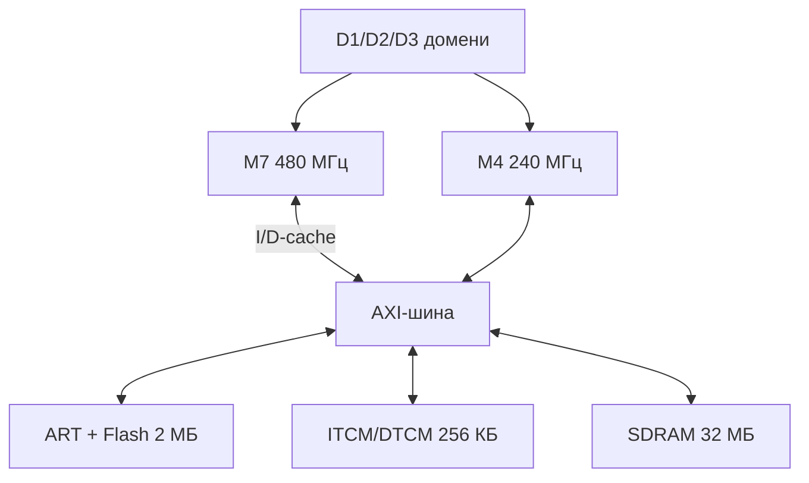

# STM32H7 глибоко - M7/M4, кеші, ART і швидка пам'ять

![[assets/img/stm32-h7-deep-scheme.png|600]]
*Рис. H7: M7 з кешами + ART, другий M4, три домени живлення, FMC веде на SDRAM.*

> [!tip] Що це за нота
> Флагманська серія для тих, кому F4 мало: 400+ МГц, DSP/FPU подвійної точності, мегабайти пам'яті. Міст від F4: [[01-Hardware/08-F7-Bridge|міст F7]], родини: [[01-Hardware/04-H5-H7|H5/H7 оглядово]].

## 1. Мета

Освоїти H7 без граблів швидкості:

- M7 проти M4: що де виконується;
- I/D-кеші + MPU: без них флеш гальмує в рази;
- ART і ITCM/DTCM: нульовий wait-state;
- домени живлення D1/D2/D3 і VOS-рівні;
- FMC + SDRAM: мегабайти під дисплеї і буфери.

| Параметр | STM32H743 | STM32F407 (для порівняння) |
| --- | --- | --- |
| CPU | M7 480 МГц + M4 240 МГц | M4 168 МГц |
| Flash | 2 МБ, ART | 1 МБ |
| RAM | 1 МБ + TCM | 192 КБ |
| Кеші | I16К+D16К + MPU | немає |
| FMC | SDRAM 32-біт 100+ МГц | є, повільніше |

## 2. Архітектура



Кеш увімкнений - M7 летить; вимкнений - повільніше за F4. MPU налаштовує кешованість регіонів (SDRAM кешуємо, периферію - ні!).

## 3. Розпіновка живлення (LQFP144)

| Сигнал | Призначення | Примітка |
| --- | --- | --- |
| VDD ×N | 1.62-3.6V цифра | 100 нФ біля кожного! |
| VDDA/VREF | аналог + опора АЦП | LC-фільтр від VDD |
| VCAP | ядро 1.2V (внутрішній LDO) | 2.2 мкФ кераміка поруч |
| VBAT | RTC + backup | батарейка/суперкап |
| NRST/BOOT0 | ресет і boot-режим | кнопки плати |
| PDR_ON | вибір регулятора | SMPS-версії - індуктивність |

SMPS-версії (H743BI) економлять вати, але вимагають індуктивність і розводку за мануалом.

## 4. Кеші і MPU: обов'язковий мінімум

- `SCB_EnableICache()`, `SCB_EnableDCache()` - першими в main;
- MPU-регіон 0: весь простір no-access (пастка помилок);
- SDRAM: write-back кешований + clean/invalidate при DMA;
- периферія і буфери DMA: non-cacheable або write-through;
- забуті invalidate - «магія» зі старими даними.

## 5. Робочий код (C, HAL)

```c
#include "stm32h7xx_hal.h"
#include "core_cm7.h"

static MPU_Region_InitTypeDef mpu_sdram = {
  .Enable = MPU_REGION_ENABLE,
  .BaseAddress = 0xC0000000,
  .Size = MPU_REGION_SIZE_32MB,
  .AccessPermission = MPU_REGION_FULL_ACCESS,
  .IsBufferable = MPU_ACCESS_BUFFERABLE,
  .IsCacheable = MPU_ACCESS_CACHEABLE,
  .IsShareable = MPU_ACCESS_NOT_SHAREABLE,
  .TypeExtField = MPU_TEX_LEVEL0,
  .SubRegionDisable = 0,
  .DisableExec = MPU_INSTRUCTION_ACCESS_DISABLE,
};

void system_fast(void) {
  SCB_EnableICache();
  SCB_EnableDCache();
  HAL_MPU_Disable();
  HAL_MPU_ConfigRegion(&mpu_sdram);
  HAL_MPU_Enable(MPU_PRIVILEGED_DEFAULT);
  __HAL_RCC_FMC_CLK_ENABLE();
  sdram_init_seq();
}
```

Порядок: кеші → MPU → FMC → SDRAM-ініціалізація (precharge/refresh/mode). Без MPU DMA в кешовану SDRAM - лотерея.

## 6. Робочий код (MicroPython)

```python
# MicroPython: H7 як швидкий логер (периферія через mem32)
import time
import machine

SRAM_ADDR = 0x24000000
SAMPLES = 1000

def mem32(addr, val=None):
    import uctypes
    if val is None:
        return uctypes.bytes_at(addr, 4)
    uctypes.bytes_at(addr, 4)[:4] = val.to_bytes(4, 'little')

machine.freq(480000000)
t0 = time.ticks_us()
for i in range(SAMPLES):
    mem32(SRAM_ADDR + i * 4, i)
dt = time.ticks_diff(time.ticks_us(), t0)
print('write', SAMPLES, 'in', dt, 'us')

while True:
    print('tick', time.ticks_ms())
    time.sleep(1)
```

Чесно: MicroPython на H7 - тести і скрипти, не 480-МГц продакшн. Прямий доступ mem32 - для регістрів без драйвера.

## 7. Домени і VOS

- D1 (CPU): VOS0 - 480 МГц, VOS3 - економія;
- D2 (периферія): вимикається окремо в сні;
- D3 (backup): RTC + SRAM4 живі завжди;
- Stop з SRAM - мікроампери, прокидання EXTI/RTC;
- PWR-конфіг першим, частоти - потім.

## 8. Типові помилки

| Симптом | Причина | Лікування |
| --- | --- | --- |
| Повільніше за F4 | кеші вимкнені | SCB_Enable I/D в main |
| DMA повертає старе | кеш не скинутий | clean/invalidate перед/після |
| HardFault на старті | MPU закрив стек/вектори | регіон 0 останнім, перевірити карту |
| SDRAM сміття | не та ініціалізація | послідовність з CubeMX-коду |
| Не стартує на своїй платі | VCAP без конденсатора | 2.2 мкФ біля кожного VCAP |
| Гріється в простої | VOS0 + 480 МГц завжди | DVFS: знижувати в простої |

## 9. Швидка шпаргалка H7

- кеші + MPU - день перший;
- SDRAM: clean/invalidate при DMA;
- VCAP-конденсатори обов'язково;
- VOS за навантаженням, не максимум завжди;
- FMC-таймінги з калькулятора CubeMX.

## 10. Суміжні ноти

- [[01-Hardware/08-F7-Bridge|міст F7]] - сходинка до H7.
- [[01-Hardware/04-H5-H7|H5/H7 оглядово]] - місце в лінійці.
- [[07-Timeri-Son/01-GPTIM-ADTIM|таймери STM32]] - тригери і DMA.
- [[08-Pamyat/02-Zovnishni-Loadery|зовнішні завантажувачі]] - XIP з QSPI.
- [[Home|головна карта]] - повна навігація.

## Офіційні джерела

- [STM32CubeF7 (STMicroelectronics, GitHub)](https://github.com/STMicroelectronics/STM32CubeF7) - HAL, приклади FMC/кешів.
- [STM32F4 (ST)](https://www.st.com/en/mcus-mpus/stm32f4.html) - база для порівняння.
- [MQTT Specification (OASIS)](https://mqtt.org/mqtt-specification/) - телеметрія вузла.
