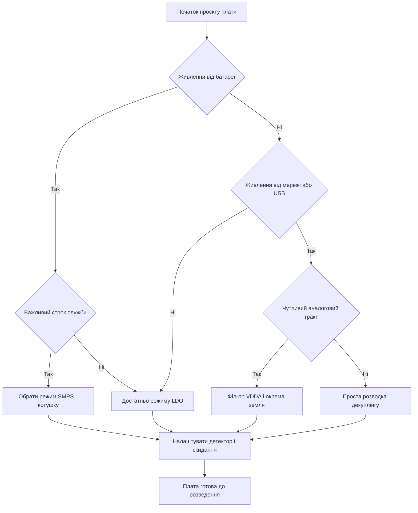

# Живлення STM32 - домени, декуплінг і нагляд

EN version: `02-Zhivlennya/01-Power-Supply-Rails.en.md`

![[assets/img/stm32-power-rails-scheme.png|600]]
*Рис. Домени живлення, декуплінг, нагляд за просадкою і порядок запуску.*

> [!tip] Призначення ноти
> Дати карту живлення плати: які домени є всередині чипа, як розвести конденсатори, коли обрати вбудований стабілізатор, а коли обхід, і як наглядати за просадкою.

## 1. Призначення

Живлення визначає стабільність ядра, точність аналогового тракту і коректний старт після подачі напруги. Ця нота збирає разом домени всередині кристала, вимоги до розв'язуючих конденсаторів, вибір між вбудованим стабілізатором і зовнішнім перетворювачем, а також нагляд за рівнем напруги засобами детектора і схеми скидання.

Нота корисна на етапі розведення плати, коли вирішується кількість шарів, місце конденсаторів біля виводів, ширина доріжок живлення і точка сполучення земель. Окремо розібрано слабкі місця дешевих плат, де малопотужний стабілізатор не тримає стрибки струму при увімкненні радіомодуля.

Матеріал доповнює опис батарейного живлення вузлів і опис режимів зниженого споживання, куди винесено сон і пробудження.

## 2. Домени живлення всередині чипа

| Домен | Призначення | Діапазон | Коментар |
| --- | --- | --- | --- |
| VDD | Ядро, цифрова логіка, памяті, порти | 1,71 В - 3,6 В | Основний домен, живить майже все цифрове |
| VDDA | Аналогова частина, АЦП, ЦАП, компаратори | 1,62 В - 3,6 В | Потребує чистого живлення без цифрових завад |
| VREF+ | Опора для АЦП і ЦАП | 1,62 В - VDDA | Від точності опори залежить точність вимірювання |
| VBAT | Годинник реального часу, резервні регістри | 1,2 В - 3,6 В | Живе від батареї коли основне живлення зникло |
| VCAP | Вихід внутрішнього стабілізатора ядра | 1,0 В - 1,2 В | Тільки конденсатор на землю, ніяких навантажень |
| VSS і VSSA | Цифрова і аналогова земля | 0 В | Сполучаються в одній точці біля чипа |

Головне правило: VDDA не має бути нижчою за VDD більше ніж на малу різницю, інакше можливі паразитні струми через захисні діоди. На практиці обидва домени живлять від однієї шини 3,3 В, але VDDA ведуть через окремий фільтр.

Опора VREF+ може бути внутрішньою або зовнішньою. Внутрішня зручна для логіки і порогів, зовнішня прецизійна потрібна для точних вимірювань. Якщо зовнішньої опори немає, вивід VREF+ сполучають з VDDA безпосередньо; конденсатор 100 нФ ставлять з VREF+ на землю, а не послідовно в коло (послідовний рве DC).

Домен VBAT живить годинник і резервну область коли плата знеструмлена. До нього підключають батарею або суперконденсатор через діодну розв'язку. Без батареї вивід VBAT сполучають з VDD через резистор або безпосередньо за рекомендацією для конкретного чипа.

## 3. Декуплінг: малі біля кожного виводу, великі біля входу

| Конденсатор | Де ставити | Навіщо |
| --- | --- | --- |
| 100 нФ кераміка | Біля кожного виводу VDD і VDDA, максимально близько | Гасить високочастотні стрибки струму ядра |
| 1 мкФ кераміка | Поряд з групою виводів живлення | Підтримує середні частоти і згладжує провали |
| 4,7 мкФ - 10 мкФ | На вході шини 3,3 В біля чипа | Загальний запас заряду для імпульсних навантажень |
| 47 мкФ - 100 мкФ | На вході плати після стабілізатора | Гасить повільні просадки і пускові струми |
| Феритова намистина | Між VDD і VDDA разом з конденсатором | Відсікає цифровий шум від аналогу |

Кераміку 100 нФ ставлять так щоб доріжка від виводу до конденсатора і до землі була найкоротшою. Кожен зайвий міліметр додає індуктивність і зменшує користь. Перехідні отвори до шару землі ставлять поруч з майданчиком конденсатора.

```text
Правильне розміщення декуплінгу біля чипа:

  Шина 3,3 В ----+----+----+---- вивід VDD
                 |    |    |
                10у  1у  100н
                 |    |    |
  Шар землі -----+----+----+---- вивід VSS

  Окрема гілка для аналогу:

  Шина 3,3 В -- намистина -- VDDA -- 100н -- земля
                                   + 1у -- земля
```

Малу кераміку не замінюють одним великим електролітом. Великий конденсатор має велику власну індуктивність і не працює на десятках мегагерц. Тому завжди пара: малий швидкий поряд, великий повільний трохи далі.

Танталові конденсатори на вході дають велику ємність у малому корпусі, але бояться перенапруги. Кераміка надійніша, проте ємність пливе від напруги зміщення. Закладають запас за ємністю удвічі.

## 4. Конденсатори VCAP на старших родинах

На чипах з внутрішнім стабілізатором ядра виводи VCAP потребують окремого конденсатора на землю. Зазвичай це 2,2 мкФ кераміка з малим послідовним опором. Без цього конденсатора ядро не стартує стабільно і можливі довільні скидання.

| Родина | Особливість VCAP |
| --- | --- |
| F0 і F1 | Зовнішнього VCAP немає, ядро живиться безпосередньо від VDD |
| F3 і F4 | Є вивід VCAP, потрібен конденсатор 2,2 мкФ на землю |
| G0 і G4 | Аналогічно потрібен конденсатор на VCAP, дивитись даташит за номіналом |
| H5 і H7 | Кілька виводів VCAP, кожен зі своїм конденсатором, трасування симетричне |

На H5 і H7 виводів VCAP кілька. Кожен шунтують окремим конденсатором і ведуть короткими доріжками до спільної землі. Сполучати виводи VCAP між собою довгою доріжкою небажано, бо зявляються коливання контуру регулювання.

Конденсатор VCAP не можна використовувати для живлення зовнішніх схем. Це вихід внутрішнього стабілізатора з обмеженим струмом. Будь яке навантаження зовні порушує стабільність ядра.

Детальніше про старші чипи дивись опис за посиланням [[01-Hardware/04-H5-H7|флагмани H5 і H7]].

## 5. Вбудований стабілізатор: LDO проти SMPS проти обходу

Сучасні чипи мають програмований вибір джерела живлення ядра: лінійний стабілізатор, імпульсний перетворювач або пряме живлення від зовнішнього джерела.

| Режим | Коли обрати | Переваги | Недоліки |
| --- | --- | --- | --- |
| LDO | Проста плата, струми до сотень міліампер | Мінімум деталей, тихий спектр, стабільний запуск | Гріється на перепаді напруг, менший ККД |
| SMPS | Живлення від батареї, тривала робота, великі струми | Високий ККД, менше нагрівання, довше життя батареї | Потребує котушки і уважного розведення, дає пульсації |
| Bypass | Зовнішній прецизійний стабілізатор 1,2 В | Найчистіше живлення ядра для чутливих вимірювань | Додатковий корпус на платі і складніша послідовність запуску |

Вибір задається з'єднанням виводів живлення і бітами конфігурації. Неправильна комбінація призводить до того що чип не стартує або перегрівається. Перед розведенням звіряються з розділом живлення в даташиті конкретної моделі.

Для родин з низьким споживанням вибір режиму впливає на струм сну. Докладніше дивись [[01-Hardware/05-L0-L4-U5|низькоспоживчі чипи]] і [[07-Timeri-Son/03-Sleep-Stop-Standby|режими сну]].

Перетворювач SMPS потребує зовнішньої котушки вказаного номіналу і конденсаторів фільтра. Котушку ставлять близько до чипа, петлю струму роблять мінімальною. Під котушкою не ведуть чутливі аналогові доріжки.

## 6. Нагляд: детектор PVD і схема скидання BOR

| Засіб | Що робить | Як налаштовується |
| --- | --- | --- |
| PVD | Програмований детектор падіння напруги, видає переривання | Поріг вибирається з таблиці рівнів, вмикається в блоці живлення |
| BOR | Апаратне скидання при просадці нижче порога | Поріг прошивається в опційних байтах, працює без програми |
| POR | Скидання при подачі живлення | Працює завжди, утримує чип у скиданні доки напруга не в нормі |
| Внутрішнє джерело опори | Контроль напруги живлення через АЦП | Канал внутрішньої опори вимірюється періодично |

Детектор PVD попереджає програму що живлення сідає. Програма встигає зберегти параметри в памяті, зупинити запис у флеш і перевести вузол у безпечний стан. Без цього можливий запис пошкоджених даних у момент просадки.

Схема BOR утримує чип у скиданні доки напруга нестабільна. Це захист від виконання коду на заниженій напрузі коли флеш читається з помилками. Поріг BOR обирають вище мінімальної робочої напруги для заданої частоти.

```text
Послідовність подій при просадці живлення:

  Напруга падає
       |
       +--> Спрацьовує PVD --> переривання --> зберегти стан
       |
       +--> Падає нижче BOR --> апаратне скидання
       |
       +--> Напруга росте --> вихід зі скидання --> старт з початку
```

Пороги PVD і BOR узгоджують між собою. Поріг PVD ставлять вище за поріг BOR щоб програма мала час на збереження. Якщо пороги переплутати, чип піде у скидання без попередження.

## 7. Порядок подачі і моніторинг на платі

| Крок | Дія |
| --- | --- |
| 1 | Подати 5 В або батарею на вхід стабілізатора плати |
| 2 | Дочекатись стабільної шини 3,3 В, світлодіод живлення як індикатор |
| 3 | Ядро стартує з внутрішнього генератора, схема скидання утримує старт |
| 4 | Програма налаштовує тактування, потім вмикає PVD і контроль напруги |
| 5 | Періодичний контроль через АЦП фіксує повільний розряд батареї |

На платі передбачають контрольні точки для вимірювання шин мультиметром і осцилографом. Поряд з розємом живлення ставлять захисний діод від переполюсування і супресор від стрибків.

Моніторинг шини через АЦП описано в ноті [[06-Analog/01-ADC|вимірювання через АЦП]]. Там же показано як виміряти внутрішню опорну напругу і перерахувати рівень живлення без зовнішнього дільника.

Прошивку плати після монтажу виконують через налагоджувальний інтерфейс, деталі за посиланням [[09-Proshivka/03-ST-Link-Proshivka|прошивка через ST-Link]].

## 8. Аналогова земля і сполучення в одній точці

Цифрові струми ядра мають гострі фронти і створюють стрибки на землі. Якщо аналогову землю сполучити з цифровою в кількох місцях, ці стрибки протікають під АЦП і додають шум у вимірювання.

| Правило | Пояснення |
| --- | --- |
| Роздільні полігони | Аналогова і цифрова земля йдуть окремими ділянками |
| Одна точка сполучення | Полігони злучають перемичкою під чипом або поруч |
| Фільтр VDDA | Намистина плюс конденсатори відсікають високі частоти |
| Короткі повернення | Сигнали АЦП ведуть над аналоговою землею без розрізів |
| Екранування | Чутливі доріжки опори оточують землею з двох боків |

```text
Топологія земель для точного АЦП:

  +---------------- цифрова земля ----------------+
  |  ядро  порти  кварц  інтерфейси               |
  +----- перемичка в одній точці під чипом -------+
  +---------------- аналогова земля --------------+
     АЦП  опора  фільтр  розєм сенсора
```

Розріз під дільником опори неприпустимий. Зворотний струм шукає обхід і наводить заваду. Суцільний полігон під аналоговим трактом важливіший за красиву симетрію.

## 9. Живлення дешевих плат і слабкий стабілізатор

На популярній дешевій платі лінійний стабілізатор часто має малий граничний струм і слабке тепловідведення. Плата живить сам чип і світлодіод, але підключення радіомодуля або яскравого дисплея садить шину.

| Симптом | Причина |
| --- | --- |
| Скидання при старті радіо | Стрибок струму передавача просаджує шину 3,3 В |
| Нагрівання стабілізатора | Великий перепад від 5 В до 3,3 В на малому корпусі |
| Пульсації при записі флеш | Брак ємності bulk на вході шини |
| Нестарт від довгого кабелю USB | Падіння напруги на тонких дротах кабелю |

Лікування: окремий стабілізатор або перетворювач для навантаження, товсті доріжки живлення, bulk конденсатор біля розєму радіомодуля. Живлення двигунів і реле завжди окреме, спільна тільки земля.

## 10. Mermaid: вибір ланцюга живлення



Схема читається згори вниз. Спочатку вирішується джерело енергії, потім чутливість аналогу, потім нагляд за просадкою. Пропуск останнього кроку залишає плату без попередження про розряд.

## 11. Код: налаштування переривання PVD

```c
#include "stm32f4xx_hal.h"

static void PVD_Config(void)
{
    __HAL_RCC_PWR_CLK_ENABLE();

    PWR_PVDTypeDef cfg;
    cfg.PVDLevel = PWR_PVDLEVEL_6;
    cfg.Mode = PWR_PVD_MODE_IT_RISING_FALLING;
    HAL_PWR_ConfigPVD(&cfg);

    HAL_NVIC_SetPriority(PVD_IRQn, 0, 0);
    HAL_NVIC_EnableIRQ(PVD_IRQn);
    HAL_PWR_EnablePVD();
}

void PVD_IRQHandler(void)
{
    HAL_PWR_PVD_IRQHandler();
}

void HAL_PWR_PVDCallback(void)
{
    if (__HAL_PWR_GET_FLAG(PWR_FLAG_PVDO) != 0U)
    {
        HAL_GPIO_WritePin(GPIOC, GPIO_PIN_13, GPIO_PIN_SET);
    }
    else
    {
        HAL_GPIO_WritePin(GPIOC, GPIO_PIN_13, GPIO_PIN_RESET);
    }
}

int main(void)
{
    HAL_Init();
    PVD_Config();
    while (1)
    {
        HAL_PWR_EnterSLEEPMode(PWR_MAINREGULATOR_ON, PWR_SLEEPENTRY_WFI);
    }
}
```

У прикладі поріг шостого рівня відповідає напрузі близько 2,9 В для цієї родини. Точний поріг звіряють з даташитом конкретного чипа. Зворотний виклик розрізняє фронт і спад: на спаді зберігають параметри, на наростанні повертаються до роботи.

Переривання PVD має високий пріоритет щоб встигнути до спрацювання схеми скидання. У обробнику не пишуть у флеш довгі масиви, лише короткий буфер налаштувань у резервну область або зовнішню памяті з буфером.

## 12. Перевірка після монтажу

| Перевірка | Як робити |
| --- | --- |
| Коротке замикання | Продзвонити шини до подачі живлення, опір не нульовий |
| Напруга без чипа | Подати живлення, перевірити 3,3 В на майданчиках VDD |
| Споживання | Виміряти струм у розриві перемички, порівняти з очікуванням |
| Пульсації | Осцилографом на виводі VDD при роботі ядра і периферії |
| Нагрівання | Торкнутись пальцем або тепловізором після десяти хвилин роботи |
| Скидання BOR | Плавно знизити живлення лабораторним блоком, зафіксувати поріг |

Якщо плата споживає у рази більше за розрахунок, шукають вивід у короткому замиканні, непідтягнутий вхід у повітрі або незапрограмований порт у боротьбі рівнів. Деталі сну і пробудження дивись у ноті [[07-Timeri-Son/03-Sleep-Stop-Standby|режими сну]].

Батарейне продовження теми з хіміями і зарядом викладено в ноті [[02-Zhivlennya/02-Batareyne-zhivlennya|батарейне живлення вузлів]].

## Типові помилки

| # | Помилка | Чому погано | Як правильно |
| --- | --- | --- | --- |
| 1 | Немає кераміки 100 нФ біля кожного VDD | Стрибки струму дають провали і довільні скидання | Поставити 100 нФ біля кожного виводу живлення |
| 2 | Конденсатор на VCAP використано як джерело для схеми | Внутрішній стабілізатор втрачає стійкість | Тільки вказаний конденсатор на землю, без навантажень |
| 3 | VDDA злучено з брудною цифровою шиною без фільтра | Шум ядра потрапляє в АЦП і псує вимірювання | Намистина плюс конденсатори і окрема траса до VDDA |
| 4 | Поріг PVD нижчий за поріг BOR | Чип іде у скидання без попередження програми | Поріг детектора ставити вище за поріг скидання |
| 5 | Потужне радіо живиться від слабкого стабілізатора плати | Просадка при передачі перезапускає чип | Окремий стабілізатор і bulk біля модуля |
| 6 | Землі сполучено в кількох місцях навколо АЦП | Контурні струми наводять шум у вимірюванні | Одна точка сполучення під чипом |
| 7 | Режим SMPS увімкнено без котушки на платі | Ядро без живлення, плата не стартує | Розвести котушку за даташитом або лишитись на LDO |

## Офіційні джерела

- [STM32 power overview (ST)](https://www.st.com/en/microcontrollers-microprocessors/stm32-32-bit-arm-cortex-mcus.html) - огляд родин, документація на живлення і режими ядра.
- [AN4938 Power management (ST)](https://www.st.com/resource/en/application_note/an4938-power-management-of-stm32-h5-mcus-stmicroelectronics.pdf) - живлення, VCAP, LDO і SMPS на прикладі H5.
- [AN2824 PVD and BOR (ST)](https://www.st.com/resource/en/application_note/an2824-stm32-reset-and-clock-control-rcc-stmicroelectronics.pdf) - скидання, детектор напруги і керування тактуванням.

## Див. також

- [[Home]]
- [[02-Zhivlennya/02-Batareyne-zhivlennya|батарейне живлення вузлів]]
- [[01-Hardware/04-H5-H7|флагмани H5 і H7]]
- [[01-Hardware/05-L0-L4-U5|низькоспоживчі чипи]]
- [[06-Analog/01-ADC|вимірювання через АЦП]]
- [[07-Timeri-Son/03-Sleep-Stop-Standby|режими сну]]
- [[09-Proshivka/03-ST-Link-Proshivka|прошивка через ST-Link]]
