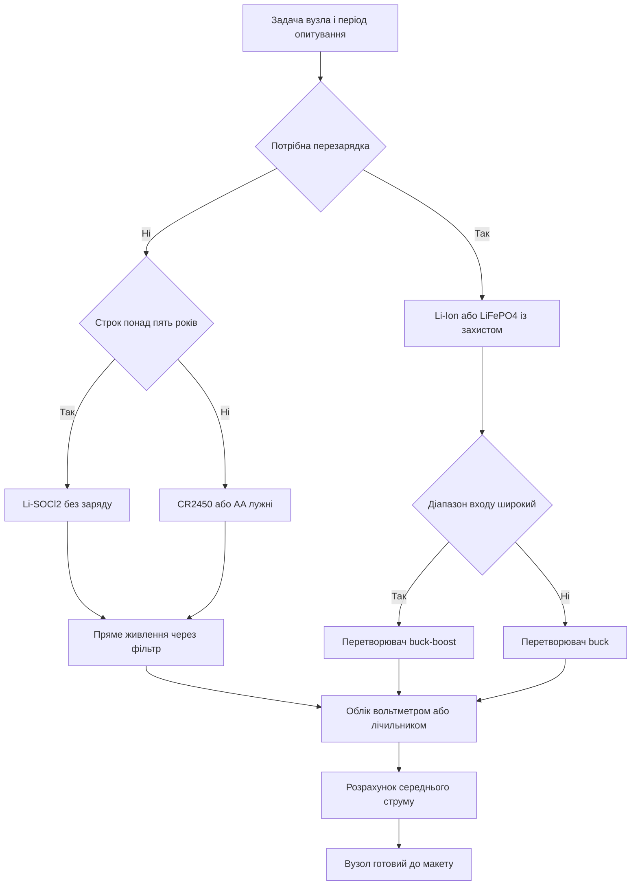

# Батарейне живлення - хімії, заряд і облік

![[assets/img/stm32-battery-scheme.png|600]]
*Рис. Хімії батарей, заряд літію, домен резерву і облік заряду вузла.*

> [!tip] Призначення ноти
> Допомогти обрати батарею під автономний вузол: яка хімія живе роками, як безпечно заряджати літій, як живити чип без втрат і як чесно порахувати строк служби.

## 1. Призначення

Автономний вузол на STM32 роками спить, зрідка прокидається, міряє сенсор і передає пакет. Батарея при цьому віддає мікроампери у сні і десятки міліампер в імпульсі передачі. Неправильна хімія або лінійний стабілізатор з великим власним струмом зїдають запас задовго до розрахункового строку.

Нота збирає практику: порівняння хімій від монетної літієвої до літієвої з вбудованим захистом, правила заряду за профілем струм напруга, різницю між імпульсним перетворювачем і лінійним стабілізатором, а також облік залишку за напругою проти спеціалізованої мікросхеми.

Окремо показано розрахунок бюджету середнього струму і перерахунок у роки роботи від поширеної монетної батареї. Приклад легко адаптувати під свій період пробудження і свій пакет.

Живлення плати від мережі і декуплінг описані в ноті [[02-Zhivlennya/01-Lancjugi-zhivlennya|ланцюги живлення плати]], а режими зниженого споживання в ноті [[07-Timeri-Son/03-Sleep-Stop-Standby|режими сну]].

## 2. Хімії батарей для вузлів STM32

| Хімія | Номінальна напруга | Діапазон робочих напруг | Ємність типова | Нюанси |
| --- | --- | --- | --- | --- |
| CR2032 | 3,0 В | 3,2 В - 2,0 В | 220 мАг | Дешева, малий імпульсний струм, просідає на радіо |
| CR2450 | 3,0 В | 3,2 В - 2,0 В | 620 мАг | Більша за CR2032, краще тримає імпульси |
| Li-SOCl2 | 3,6 В | 3,6 В - 3,3 В | 2400 мАг | Дуже малий саморозряд, роки служби, не заряджається |
| Li-Ion | 3,7 В | 4,2 В - 3,0 В | 1000 мАг - 3000 мАг | Заряджається, потребує захисту від перезаряду |
| LiFePO4 | 3,2 В | 3,6 В - 2,8 В | 600 мАг - 1500 мАг | Безпечніша, плоска крива розряду, довгі цикли |
| AA лужна | 1,5 В | 1,6 В - 0,9 В | 2500 мАг | Два елементи дають 3 В, дешева заміна в полі |

Монетні літієві батареї зручні для компактних вузлів, але мають великий внутрішній опір. Пряма передача радіопакета від CR2032 без буферного конденсатора часто закінчується скиданням через просадку.

Хімія Li-SOCl2 тримає напругу майже сталою весь строк і має саморозряд близько одного відсотка на рік. Ідеальна для датчиків що передають рідко. Недолік: пасивація поверхні після довгого зберігання дає тимчасовий провал напруги при першому струмі.

Лужні елементи AA доступні всюди і прощають помилки заряду бо не заряджаються взагалі. Два елементи послідовно дають старт близько 3,2 В і кінець близько 1,8 В, тому потрібен широкий діапазон входу або підвищувальний перетворювач.

```text
Вибір хімії за сценарієм роботи:

  Раз на годину маленький пакет .... CR2450 + конденсатор 470 мкФ
  Раз на добу роками без обслуговування .... Li-SOCl2 типорозміру AA
  Перезаряджуваний вузол з USB .... Li-Ion + захист + заряд
  Безпечний вуличний датчик .... LiFePO4 + сонячна панель
  Дешевий прототип на столі .... 2 x AA лужні
```

Напругу батареї завжди звіряють з допустимим входом чипа і перетворювача. Повністю заряджений Li-Ion має 4,2 В що вище за межу 3,6 В для більшості STM32, тому пряме підключення без стабілізатора заборонене.

## 3. Домен VBAT: годинник і резерв при зникненні живлення

| Питання | Відповідь |
| --- | --- |
| Що живиться від VBAT | Годинник реального часу, резервні регістри, частина схеми пробудження |
| Діапазон | 1,2 В - 3,6 В залежно від родини, точне значення за даташитом |
| Струм споживання | Частки мікроампера до кількох мікроампер з увімкненим годинником |
| Що підключити | Монетну батарею, суперконденсатор або шину VDD через діод |
| Без батареї | Сполучити з VDD за рекомендацією для конкретного чипа |
| Резервні регістри | Зберігають лічильники, ключі, стан вузла між скиданнями |

Діодна розв'язка дозволяє живити домен від основної шини коли вона є і від батареї коли шина зникла. Падіння на діоді Шотткі близько 0,3 В залишає достатній запас для годинника.

Суперконденсатор на 0,47 Ф тримає годинник годинами після зникнення живлення. Цього досить щоб пережити заміну батареї без втрати часу. Струм витоку суперконденсатора більший за саморозряд літієвої батареї, тому для років автономності обирають батарею.

Резервні регістри не замінюють флеш. Вони тримають десятки байтів стану: номер пакета, час наступного вимірювання, прапорці калібрування. Великі масиви пишуть у флеш рідко щоб не зношувати памяті.

## 4. Заряд Li-Ion: профіль CC і CV, модулі і захист

Літій заряджають у два етапи. Спочатку стабільним струмом доки напруга не дійде до 4,2 В, потім стабільною напругою доки струм не впаде до десятини від початкового. Пропуск другого етапу недозаряджає батарею, перевищення напруги руйнує хімію.

| Етап | Режим | Умова переходу |
| --- | --- | --- |
| Попередній | Малий струм при глибокому розряді нижче 3,0 В | Перехід на повний струм після підйому напруги |
| CC | Стабільний струм 0,5C - 1C | Перехід при досягненні 4,2 В на виводах |
| CV | Стабільна напруга 4,2 В | Зупинка при падінні струму до 0,1C |
| Завершення | Вимкення заряду | Не тримати літій на плавучому заряді тижнями |

Мікросхема TP4056 реалізує профіль самостійно: струм задається резистором, кінець заряду сигналізується виводом. Модулі на цій мікросхемі зручні для прототипів, але потребують перевірки струму і тепловідведення.

Звязка DW01 плюс подвійний транзистор вимкає батарею при перезаряді, перерозряді і перевантаженні за струмом. Без захисту глибокий розряд нижче 2,5 В незворотно псує банку. Захист не замінює правильний заряд, а лише страхує від аварії.

```text
Мінімальний ланцюг заряджання вузла:

  USB 5 В --> TP4056 --> [захист DW01] --> Li-Ion 3,7 В
                                                   |
                                            перетворювач --> 3,3 В --> STM32
                                                   |
                                            дільник --> АЦП контроль напруги
```

Заряд LiFePO4 має іншу кінцеву напругу близько 3,6 В. Заряджати LiFePO4 модулем для звичайного Li-Ion заборонено. Для LiFePO4 беруть профільну мікросхему під цю хімію або сонячний контролер з перемикачем хімії.

Температурний контроль обов'язковий. Заряд на морозі нижче нуля і на спеці вище 45 градусів прискорює деградацію. Термістор батареї заводять на вхід заборони заряду.

## 5. Перетворювач для батареї: імпульсний проти лінійного

| Варіант | ККД на малому струмі | Власний струм | Шум | Коли брати |
| --- | --- | --- | --- | --- |
| LDO | Низький при великій різниці входу і виходу | Від одиниць до десятків мікроампер | Майже немає | Дешеві вузли від двох AA, малі струми |
| Buck | Високий навіть при різниці у вольти | Від сотень наноампер до мікроампер у сучасних | Пульсації десятки мілівольт | Батарея 4,2 В, довгий строк, часті передачі |
| Buck-boost | Високий у всьому діапазоні | Трохи більший за чистий buck | Складніший спектр | Два AA від 3,2 В до 1,8 В без заміни батареї |
| Пряме живлення | Максимальний бо втрат немає | Нуль | Немає | LiFePO4 або CR2450 у межах допуску чипа |

Лінійний стабілізатор спалює різницю напруг у тепло. При живленні від 4,2 В на вихід 3,3 В третина енергії втрачається. На мікроамперних струмах сну важливіший власний струм стабілізатора ніж ККД під навантаженням.

Імпульсний перетворювач з малим власним струмом окупається на роках служби. Шукають моделі з режимом пропуску імпульсів при малому навантаженні. Пульсації фільтрують керамікою біля виводу живлення чипа.

```text
Орієнтир вибору за входом:

  Вхід 4,2 В Li-Ion ......... buck на 3,3 В
  Вхід 3,0 В монетна ........ пряме живлення + буферна ємність
  Вхід 3,6 В Li-SOCl2 ....... пряме живлення через фільтр
  Вхід 3,0 В - 1,8 В 2xAA ... buck-boost на 3,3 В
  Вхід 3,6 В - 2,8 В LiFePO4  пряме живлення, контроль порогів
```

Піковий струм радіо враховують окремо від середнього. Перетворювач має тримати імпульс 100 мА без просадки нижче порога скидання. Буферний конденсатор 100 мкФ - 470 мкФ біля радіомодуля згладжує фронт.

Деталі вимірювання напруги шини через вбудований канал описані в ноті [[06-Analog/01-ADC|вимірювання через АЦП]].

## 6. Облік заряду: вольтметр проти мікросхеми fuel-gauge

Простий вольтметр перераховує напругу в відсотки за таблицею. Метод дешевий і достатній для крутих кривих розряду де напруга помітно падає. Для плоских кривих метод дає велику похибку.

| Метод | Точність | Складність | Коли достатньо |
| --- | --- | --- | --- |
| Вольтметр з дільником | 10 відсотків на крутих хіміях | Один дільник і канал АЦП | Лужні AA, Li-Ion у середині шкали |
| Вольтметр з усередненням | Краще на повільних змінах | Фільтр в програмі | Монетні батареї без імпульсів у момент вимірювання |
| Лічильник кулонов | 2 відсотки при калібруванні | Спеціальна мікросхема з шунтом | Часті цикли заряд розряд, платні пристрої |
| Імпедансний алгоритм | 3 відсотки навіть на плоских кривих | Готова мікросхема з моделлю хімії | LiFePO4 де напруга майже не змінюється |

Плоска крива LiFePO4 підступна: від 80 відсотків до 20 відсотків напруга змінюється лише на десяті вольта. Похибка АЦП і дільника зїдає весь запас. Тут потрібна мікросхема обліку з моделлю або хоча б кулонівський підрахунок.

Дільник для вольтметра обирають високоомним щоб не розряджати батарею. Опір у сотні кілоом плюс конденсатор паралельно нижньому плечу дають стабільне вимірювання при імпульсному опитуванні. Постійно підключений низькоомний дільник споживає більше за сон чипа.

Вимірювання роблять у паузі між радіоімпульсами коли напруга відновилась. Серія з восьми вимірювань з медіаною відсікає викиди. Результат згладжують експоненційним фільтром.

## 7. Саморозряд і старіння

| Хімія | Саморозряд | Термін зберігання | Старіння |
| --- | --- | --- | --- |
| CR2032 і CR2450 | 1 відсоток на рік | До 10 років | Втрата ємності на спеці понад 40 градусів |
| Li-SOCl2 | Близько 1 відсотка на рік | До 15 років | Пасивація, потрібен депасиваційний імпульс |
| Li-Ion | 3 відсотки на місяць | 3 роки до помітної втрати | 500 циклів, зберігання при 40 відсотках заряду |
| LiFePO4 | 2 відсотки на місяць | 5 років | 2000 циклів, спокійно переносить повний заряд |
| AA лужна | 2 відсотки на рік | До 7 років | Протікання при глибокому розряді і спеці |

Висока температура подвоює швидкість старіння на кожні 10 градусів. Вуличний корпус під сонцем гріється до 60 градусів, тому закладений строк ділять навпіл або додають козирок і вентиляцію.

Струм витоку конденсаторів і захисних діодів додається до саморозряду. Електроліт з витоком у мікроампери за рік зїдає сотні міліампер годин. Для вузлів на роки беруть кераміку і плівку замість електролітів там де можливо.

## 8. Приклад бюджету: роки від CR2450

Задача: датчик температури прокидається раз на 10 хвилин, міряє сенсор і передає короткий пакет. Порахувати середній струм і строк від батареї 620 мАг.

| Фаза | Струм | Тривалість | Заряд за цикл |
| --- | --- | --- | --- |
| Сон з годинником | 2 мкА | 600 с | 1200 мкКл |
| Вимірювання сенсором | 1 мА | 0,05 с | 50 мкКл |
| Передача пакета | 30 мА | 0,02 с | 600 мкКл |
| Обробка і запис стану | 5 мА | 0,01 с | 50 мкКл |

Сума за цикл: 1900 мкКл за 600 секунд. Середній струм дорівнює 1900 поділити на 600, тобто близько 3,2 мкА. Додаємо власний струм стабілізатора 1 мкА і витік конденсаторів 0,5 мкА, отримуємо близько 4,7 мкА середнього.

Строк служби: 620 мАг поділити на 0,0047 мА дає близько 131900 годин, тобто близько 15 років за арифметикою. Реальність обмежують саморозряд 1 відсоток на рік, пасивація, деградація контактів і холодні ночі з просадкою. Чесна оцінка: 7 років з запасом.

```text
Перерахунок під свій період опитування:

  Середній струм = (сон * час сну + суми імпульсів) / період
  Години служби = ємність мАг / середній струм мА
  Роки служби = години / 8760 з поправкою на саморозряд

  Приклад вище:
    (2 мкА * 600 с + 50 + 600 + 50 мкКл) / 600 с = 3,2 мкА
    + 1,5 мкА накладних = 4,7 мкА
    620 / 0,0047 = 131900 год = 15 років теорії = 7 років практики
```

Зменшення періоду до 1 хвилини піднімає середній струм приблизно вшестеро і скорочує строк до року. Збільшення пакета втричі так само ріже строк. Бюджет рахують до розведення плати, а не після.

Для наочності будують графік струму в часі: довга полиця сну, короткий пік вимірювання, високий пік передачі. Площа під графіком і є заряд циклу.

## 9. Mermaid: шлях автономного вузла



Гілка перезарядки веде до літію з контролером заряду. Гілка довгого строку веде до первинної хімії без циклів. Облік обирають після перетворювача бо від пульсацій залежить точність.

## 10. Код: періодичне вимірювання напруги батареї

```c
#include "stm32l0xx_hal.h"

#define VDIV_TOP_KOHM   (820U)
#define VDIV_BOT_KOHM   (270U)
#define ADC_MAX_CODE    (4095U)
#define VREF_MV         (3000U)

static uint32_t Battery_Median(ADC_HandleTypeDef *hadc)
{
    uint32_t s[8];
    for (uint32_t i = 0U; i < 8U; i++)
    {
        HAL_ADC_Start(hadc);
        HAL_ADC_PollForConversion(hadc, 10U);
        s[i] = HAL_ADC_GetValue(hadc);
        HAL_ADC_Stop(hadc);
    }
    for (uint32_t i = 0U; i < 8U; i++)
    {
        for (uint32_t j = i + 1U; j < 8U; j++)
        {
            if (s[j] < s[i])
            {
                uint32_t t = s[i];
                s[i] = s[j];
                s[j] = t;
            }
        }
    }
    return (s[3] + s[4U]) / 2U;
}

uint32_t Battery_Millivolts(ADC_HandleTypeDef *hadc)
{
    uint32_t code = Battery_Median(hadc);
    uint32_t vadc = (code * VREF_MV) / ADC_MAX_CODE;
    uint32_t vbat = vadc * (VDIV_TOP_KOHM + VDIV_BOT_KOHM) / VDIV_BOT_KOHM;
    return vbat;
}

void Battery_Task(ADC_HandleTypeDef *hadc)
{
    uint32_t mv = Battery_Millivolts(hadc);
    if (mv < 2800U)
    {
        HAL_GPIO_WritePin(GPIOB, GPIO_PIN_0, GPIO_PIN_SET);
    }
    else
    {
        HAL_GPIO_WritePin(GPIOB, GPIO_PIN_0, GPIO_PIN_RESET);
    }
}
```

Дільник 820 кОм і 270 кОм дає коефіцієнт близько чотирьох і споживає лише мікроампери від батареї 3,6 В. Конденсатор 10 нФ паралельно нижньому плечу зменшує шум вибірки. Калібрування виконують за мультиметром один раз і зберігають поправку.

Вимірювання запускають після паузи 20 мс від радіоімпульсу щоб напруга відновилась. Медіана з восьми відкидає поодинокі викиди від завад. Поріг 2800 мВ сигналізує про розряд монетної батареї.

## 11. Сонячна підзарядка згадкою

Невелика сонячна панель 5 В і 0,5 Вт через контролер заряду підтримує LiFePO4 у вуличному датчику. Контролер обмежує напругу і струм, вночі вузол живе від акумулятора. Діод Шотткі не дає струму текти назад у панель в темряві.

Панель орієнтують на південь під кутом широти місцевості. Затінення деревом ріже виробіток у рази сильніше за площу тіні бо послідовні секції втрачають струм. Скло миють раз на сезон від пилу.

Потужність панелі розраховують за зимовим сонцем, а не літнім. Якщо вузол споживає 5 мАг на добу, а взимку є лише дві години слабкого сонця, панель має віддати цей заряд за дві години з урахуванням ККД контролера. Закладають запас утричі.

## Типові помилки

| # | Помилка | Чому погано | Як правильно |
| --- | --- | --- | --- |
| 1 | Пряме живлення чипа від Li-Ion 4,2 В | Перевищення межі 3,6 В псує кристал | Перетворювач buck на 3,3 В між батареєю і чипом |
| 2 | Передача від CR2032 без буферного конденсатора | Просадка в імпульсі викликає скидання | Конденсатор 470 мкФ біля модуля і короткі доріжки |
| 3 | Заряд LiFePO4 модулем для Li-Ion | Перезаряд вище 3,6 В руйнує хімію | Контролер з профілем саме під LiFePO4 |
| 4 | Відсотки за напругою на плоскій кривій LiFePO4 | Похибка десятки відсотків, раптова зупинка | Мікросхема обліку з моделлю хімії |
| 5 | Низькоомний дільник постійно на батареї | Дільник їсть більше за сон чипа | Високоомний дільник і опитування імпульсами |
| 6 | Заряд на морозі без контролю температури | Деградація анода і втрата ємності | Термістор і заборона заряду поза вікном температур |
| 7 | Ігнорування саморозряду в розрахунку строку | Теорія 15 років, практика 3 роки | Додати саморозряд і запас удвічі до бюджету |

## Офіційні джерела

- [AN4452 Battery charger (ST)](https://www.st.com/resource/en/application_note/an4452-lithium-battery-charger-for-prestigio--stmicroelectronics.pdf) - заряд літію і контроль процесу.
- [STM32L0 ultra-low-power (ST)](https://www.st.com/en/microcontrollers-microprocessors/stm32l0-series.html) - режими сну, VBAT і струми резерву для автономних вузлів.
- [UM2305 STBC02 charger (ST)](https://www.st.com/resource/en/user_manual/um2305-stbc02-battery-charger-evaluation-board-stmicroelectronics.pdf) - профіль CC і CV на прикладі мікросхеми заряду.

## Див. також

- [[Home]]
- [[02-Zhivlennya/01-Lancjugi-zhivlennya|ланцюги живлення плати]]
- [[01-Hardware/05-L0-L4-U5|низькоспоживчі чипи]]
- [[06-Analog/01-ADC|вимірювання через АЦП]]
- [[07-Timeri-Son/03-Sleep-Stop-Standby|режими сну]]
- [[01-Hardware/04-H5-H7|флагмани H5 і H7]]
- [[09-Proshivka/03-ST-Link-Proshivka|прошивка через ST-Link]]
