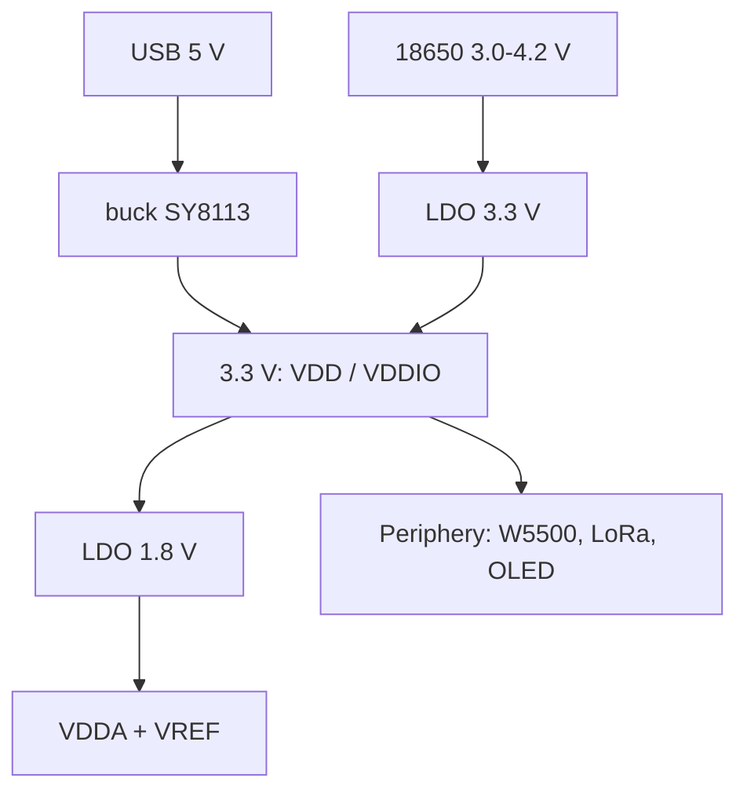

# STM32 Board Power Supply - Calculation, Layout, Protection

![[assets/img/stm32-power-scheme.png|600]]
*Fig. Power tree: USB 5 V to buck SY8113 to 3.3 V to VDDA LDO 1.8 V plus VDDIO domains.*

> [!tip] What this note is
> A deep dive above [[02-Zhivlennya/01-Lancjugi-zhivlennya.en | Power supply chains]] and [[02-Zhivlennya/02-Batareyne-zhivlennya.en | Batteries]]: there - "how to connect", here - "how much to give and why this choice". All with numbers: currents, losses, layout, protection.

A typical board power tree:

*Fig. Two power trees: USB 5 V to buck, battery to LDO.*

## 1. STM32 currents: where we start

Datasheet estimates (Run mode, 25 °C, core plus active peripherals):

| Family | Frequency | Core I, ~3.3 V | Peak (RAM/PS burst) |
| --- | --- | --- | --- |
| F030/F103 | 48-72 MHz | 40-80 mA | +50 mA |
| F407 | 168 MHz | ~170 mA | +100 mA |
| F767 | 216 MHz | ~230 mA | +150 mA |
| H743 | 600 MHz | ~400 mA | +300 mA |
| L431 | 80 MHz | ~30 mA | +20 mA |
| U553 | 400 MHz | ~250 mA | +200 mA |

Plus peripherals: LoRa radio peak 300 mA, W5500 ~100 mA, OLED 128x64 ~50 mA, Wi-Fi module peak 350 mA.

## 2. Topologies: LDO vs buck

Example: USB 5 V, STM32F4 + W5500 + OLED + LoRa peak = ~550 mA.

| Option | Loss at 550 mA, 5 V to 3.3 V | Efficiency | Heat |
| --- | --- | --- | --- |
| AMS1117 (LDO, drop ~1.1 V) | (5-3.3)x0.55 = 0.94 W | ~66 % | 0.94 W in SOT-223 - hot |
| ME6211 (LDO, low drop) | ~0.85 W | ~69 % | still hot |
| SY8113 (buck 3 A, 500 kHz) | ~0.07 W | ~94 % | cold, +4...+6 °C |

Conclusion: at I > 200 mA from 5 V - buck only. LDO - for VDDA and for input from 18650 (3 V to 3.3 V: unlike 5 V, the loss is very small).

## 3. Worked example: 5 V to 3.3 V on SY8113

| Part | Value | Why |
| --- | --- | --- |
| IN | 4.7-5.5 V (USB) | input range 4.5-18 V |
| L | 2.2 uH, 3 A, low DC | 500 kHz, f-L |
| C_OUT | 22 uF X5R + 100 nF MLCC near VOUT | PLL loop, output noise |
| FB | 45.4 kOhm / 10 kOhm | Vout = 0.6 x (1 + R1/R2) = 3.3 V |
| GND return | single-point under L and COUT | minimal current loop |

VDDA: a separate LDO (ME6211A18 at 1.8 V or a 3.3 V regulator on VDDA), ferrite + 100 nF on the output, VREFINT - a divider from VDDA. On F4 VDDIO = VDD (no separate isolators).

## 4. Layout: seven rules

1. 4x 100 nF near VDD/VSS of each die (neighboring QFN/BGA pins).
2. 2x 22 uF on VOUT output + 100 uF bulk near MCU.
3. L and COUT source chain: short, wide, GND plane under it.
4. VDDA - a separate output, LC filter, VREF divider from VDDA.
5. USB D+/D- - parallel, diff ~90 Ohm, no stubs or crossings.
6. "Long wires" to DC-DC - the worst current loop: L, COUT, GND in one board corner.
7. Input protection: TVS/ESD on USB (USBLC6-2), reverse-polarity (see section 5).

## 5. Protection

- reverse polarity: P-MOSFET (for example, IRFB7199) or a diode with loss calculation;
- overvoltage: TVS SMBJ5.0A on USB and on terminals;
- overload: 500 mA fuse on the 5 V line;
- sag: Brownout Detection (PWR, BOR1-BOR4 thresholds) - MCU resets deterministically instead of "hanging";
- temperature: NTC on the board (channel [[06-Analog/01-ADC | ADC]]) - above 85 °C lower radio duty.

## 6. Measurements

- INA219 on the 5 V line shunt - covered in [[10-Sensori/04-INA219-HX711 | INA219]];
- multimeter in the + break: peaks at SPI/I2C bursts and at radio start;
- thermal camera: where LDO heats vs buck - "heat does not lie";
- oscilloscope: ripple on VOUT (buck < 20 mV), sags at SPI bursts and at ESC turn-on.

## 6.1 LDO thermal calculation: example

AMS1117 at 5 V to 3.3 V, I = 550 mA:

- loss: P = (5 - 3.3) x 0.55 = 0.94 W;
- θJA (SOT-223) approx 80 °C/W to ΔT approx 75 °C;
- package temperature at 25 °C ambient: ~100 °C - not allowed.

Conclusion: LDO from 5 V - only when I < 150 mA (loss < 0.25 W). Otherwise - buck.

## 6.2 Board power checklist

| Item | Acceptance criterion |
| --- | --- |
| VDD on MCU pin | 3.13-3.47 V under load |
| Sag at SPI burst | < 5 % |
| Ripple on VOUT (buck) | < 20 mV |
| VDDA / VREF noise | < 1 mV |
| Battery voltage (18650) | > 3.0 V |
| LDO temperature | < 60 °C after an hour of work |
| USB current before config | 100 mA (descriptor) |

> [!warning] Battery + buck
> LiPo (4.2 V) to buck 3.3 V: respect the input range, and keep load below 50 % of buck current, otherwise thermal protection.

## 6.3 Autonomy calculation: example

Board: F407 + LoRa (30 % duty), average load 200 mA at 3.3 V.

| Parameter | Value |
| --- | --- |
| Battery | 18650 3000 mAh, usable ~2400 mAh |
| Autonomy without sleep | 2400 / 200 = 12 h |
| 10 % duty (deep-sleep 90 % of time) | ~3 days |
| L4-class deep-sleep current | ~30 uA |
| 2x18650 (7.4 V) + buck | ~14 h at 300 mA, eta 94 % |

Rules:

- VBAT - divider + ADC, not "trust" in a counter alone;
- BOR cutoff below the threshold where peripherals start erring;
- 18650 end voltage - 3.0 V, not 2.5 V;
- solar panel - Schottky diode + minimal MPPT.

## Common issues

| Symptom | Cause | Fix |
| --- | --- | --- |
| MCU resets at I2C burst | LDO enters dropout | buck, larger COUT, check VDD |
| ADC "floats" | VDDA noisy from digital | separate VDDA LDO, LC filter, layout |
| Board "falls" off battery | sag under radio peak | bulk capacitor, smaller LoRa peak (duty) |
| Electrolytic "sings" | microphonic | ceramic instead of electrolytic, smaller current loop |
| LED dims at SPI burst | LDO too slow: 300 mA burst | larger COUT, move to buck |
| USB "drops" under load | 100 mA limit before SET_CONFIGURATION | 500 mA descriptor, external power |

## 8. Related notes

- [[13-Moduli-zhivlennya-rivniv/01-Buck-Boost | Buck/Boost]] - modules of ready regulators.
- [[02-Zhivlennya/02-Batareyne-zhivlennya.en | Batteries]] - LiPo, 18650, solar.
- [[06-Analog/01-ADC | ADC]] - VREF noise and calibration.
- [[06-Analog/05-Shunt-OPAMP | Current shunt]] - shunt current measurement.

## Official sources

- [SY8113 application note (PDF, via Olimex)](https://www.olimex.com/Products/Breadboarding/BB-PWR-8113/resources/SY8113.pdf) - buck 3 A 500 kHz.
- [MP1584 (Monolithic Power)](https://www.monolithicpower.com/en/mp1584.html) - buck calculation.
- [ME6211 datasheet (Microne, PDF)](https://github.com/Edragon/Datasheet/blob/master/Microne/ME6211.pdf) - LDO, low drop.
- [AMS1117 datasheet (Advanced Monolithic, PDF)](http://www.advanced-monolithic.com/pdf/ds1117.pdf) - 1 A LDO classic.
- [STM32F4 product page (ST)](https://www.st.com/en/mcus-mpus/stm32f4.html) - currents, power domains.
