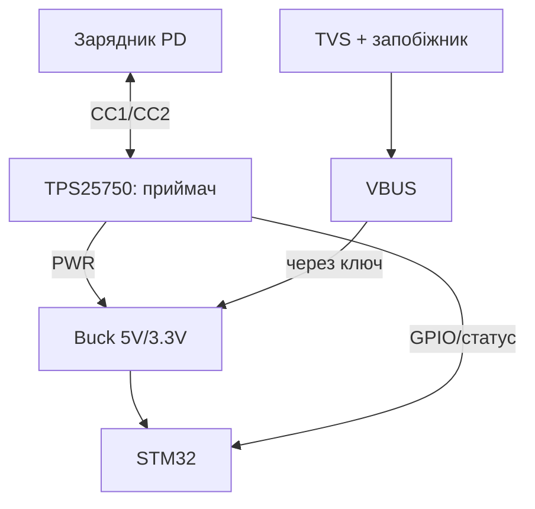

# STM32 USB-C Power Delivery - приймач TPS25750 і домовленість про вати

EN version: `02-Zhivlennya/04-USB-C-PD.en.md`

![[assets/img/stm32-usb-c-pd-scheme.png|600]]
*Рис. PD-ланцюг: зарядник → CC-лінії → TPS25750 → домовлені 15V → buck → 5V/3.3V плати.*

> [!tip] Що це за нота
> Сучасне живлення замість «тупого» 5V: плата просить у зарядника потрібний профіль і отримує вати з запасом. База: [[02-Zhivlennya/01-Lancjugi-zhivlennya|ланцюги живлення]], [[02-Zhivlennya/03-Power-Design|розрахунок живлення]].

## 1. Мета

Отримати чесні вати по USB-C:

- PD-контракт: запит → контракт → живлення;
- TPS25750 як PD-приймач без прошивки;
- профілі 5V/9V/15V/20V: що просити під задачу;
- CC-лінії, Rp/Rd і орієнтація кабелю;
- захист: перенапруга і неправильний профіль.

| Профіль PD | Напруга/струм | Для чого |
| --- | --- | --- |
| 5V 3A | базовий | плата + датчики |
| 9V 3A | 27W | плата + мотори/дисплей |
| 15V 3A | 45W | серверний вузол |
| 20V 5A | 100W | не для STM32, межа |

## 2. Архітектура



TPS25750 домовляється сам (конфіг резисторами/EEPROM), STM32 лише читає статус. VBUS вмикається ключем після контракту.

## 3. Розпіновка приймача

| Сигнал TPS25750 | Куди | Примітка |
| --- | --- | --- |
| CC1/CC2 | роз'єм USB-C | Rp/Rd всередині, кабель будь-якою стороною |
| VBUS sense | дільник | контроль факту напруги |
| PWR (5V out en) | ключ VBUS | вмикати після контракту |
| GPIO статус | PB5 (вхід) | контракт укладено |
| I2C (опційно) | PB6/PB7 | телеметрія і логи |
| GND | спільна | товста доріжка струму |

## 4. Конфігурація без прошивки

- профіль вибирається пінами/резисторами (таблиця даташита);
- EEPROM-опція - для серії з однаковими вимогами;
- запитуємо мінімум, що закриває пік + 30 %;
- fallback 5V - якщо зарядник не PD (звичайний порт);
- світлодіод контракту - видно, що домовились.

## 5. Робочий код (C, HAL)

```c
#define PD_OK_PIN GPIO_PIN_5

int pd_wait_contract(uint32_t timeout_ms) {
  uint32_t t0 = HAL_GetTick();
  while (HAL_GetTick() - t0 < timeout_ms) {
    if (HAL_GPIO_ReadPin(GPIOB, PD_OK_PIN) == GPIO_PIN_SET) {
      return 1;
    }
    HAL_Delay(50);
  }
  return 0;
}

void power_init(void) {
  VBUS_KEY_OFF();
  if (pd_wait_contract(3000)) {
    VBUS_KEY_ON();
    power_rail_enable();
  } else {
    power_rail_enable();
    log_warn("PD no contract, fallback 5V");
  }
}
```

Правило: навантаження вмикаємо ПІСЛЯ контракту. Інакше просадка в момент переговорів скидає плату.

## 6. Робочий код (MicroPython)

```python
# MicroPython: монітор PD-контракту і живлення
import time
from machine import Pin, ADC

pd_ok = Pin('PB5', Pin.IN)
vbus = ADC(Pin('PA4'))
relay = Pin('PB6', Pin.OUT, value=0)

def vbus_volts(n=16):
    s = 0
    for _ in range(n):
        s += vbus.read_u16()
    return s * 3.3 * 4.0 / (n * 65535)

t0 = time.ticks_ms()
while not pd_ok.value():
    if time.ticks_diff(time.ticks_ms(), t0) > 3000:
        print('PD no contract, fallback')
        break
    time.sleep_ms(50)
else:
    print('PD contract OK')

relay.value(1)
while True:
    print('VBUS', round(vbus_volts(), 2))
    time.sleep(1)
```

Дільник VBUS 4:1 - 20V вміщуються в 3.3V АЦП. Перевірка контракту перед увімкненням реле обов'язкова.

## 7. Безпека ліній

- TVS на VBUS - стрибки гарячого підключення;
- запобіжник самовідновлюваний на вхід;
- неправильний профіль (20V на 5V-схему) - виключаємо конфігом;
- CC-лінії - без конденсаторів, що ламають переговори;
- сертифікований кабель - частина безпеки, не аксесуар.

## 8. Типові помилки

| Симптом | Причина | Лікування |
| --- | --- | --- |
| Завжди 5V, хоч просили 15V | зарядник не PD / кабель без CC | PD-зарядник + повний кабель |
| Скидання в момент контракту | навантаження увімкнено рано | ключ VBUS після контракту |
| Працює через раз | CC-контакт забруднений | чистка роз'єму, інший кабель |
| Гріється buck | ККД на межі струму | запас 30 %, радіатор |
| Статус бреше | підтяжка GPIO | явний pull-down, фільтр |
| 20V на платі | помилка конфігу | перевірити профіль до вмикання! |

## 9. Швидка шпаргалка PD

- профіль = пік + 30 %;
- навантаження після контракту;
- TVS + запобіжник на VBUS;
- fallback 5V завжди передбачений;
- кабель - частина системи.

## 10. Суміжні ноти

- [[02-Zhivlennya/01-Lancjugi-zhivlennya|ланцюги живлення]] - база живлення.
- [[02-Zhivlennya/03-Power-Design|розрахунок живлення]] - струми і тепло.
- [[13-Moduli-zhivlennya-rivniv/01-Buck-Boost|модулі Buck/Boost]] - перетворювачі.
- [[06-Analog/01-ADC|аналоговий АЦП]] - вимір VBUS.
- [[Home|головна карта]] - повна навігація.

## Офіційні джерела

- [TPS25750 (Texas Instruments)](https://www.ti.com/product/TPS25750) - PD-приймач, конфігурація, профілі.
- [STM32F4 (ST)](https://www.st.com/en/mcus-mpus/stm32f4.html) - живлення і GPIO доменів.
- [MQTT Specification (OASIS)](https://mqtt.org/mqtt-specification/) - телеметрія живлення.
