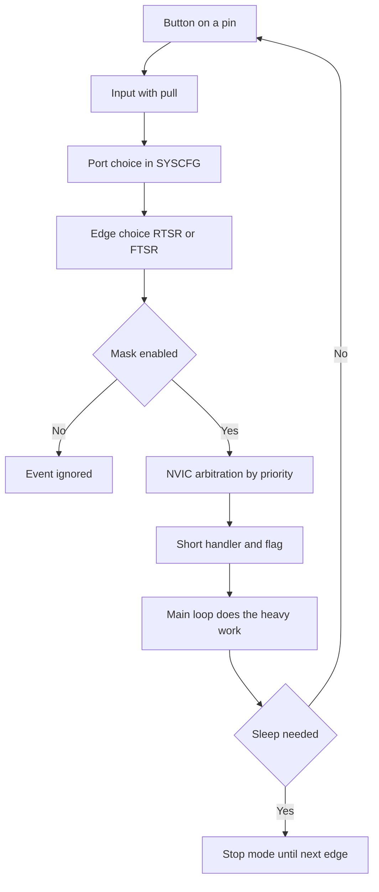

# EXTI and NVIC - STM32 External Interrupts

![[assets/img/stm32-exti-nvic-scheme.png|600]]
*Fig. Signal path: port pin, SYSCFG multiplexer, EXTI lines, NVIC controller.*

> [!tip] Purpose of this note
> Show the full external interrupt path: from a button on a pin through port choice, edges, priorities and a short handler to wakeup from sleep.

## 1. Purpose

EXTI is the external interrupt controller that watches pin levels and edges and wakes the core with an event. NVIC is the nested interrupt controller in the Cortex core that decides which interrupt runs first and whether the current handler may be preempted. Together they give reaction to a button, motion sensor and encoder pulse with no constant polling in a loop.

The price of reaction is complexity: shared lines across ports, edge setup, priorities and contact bounce. The note covers each step and shows how to write short handlers with no delays.

## 2. EXTI0-EXTI15 lines shared across ports

The lower EXTI0-EXTI15 lines connect to same-numbered pins of all ports, but only one is active at a time. PA0 or PB0 or PC0 can raise EXTI0, yet the SYSCFG multiplexer in EXTICR registers makes the pick. So two sensors must not hang on PA0 and PB0 at once.

| EXTI line | Sources | Choice | Limit |
| --- | --- | --- | --- |
| EXTI0 | PA0 PB0 PC0 PD0 and on | EXTICR1 EXTI0 field | One port at a time only |
| EXTI1 | PA1 PB1 PC1 and on | EXTICR1 EXTI1 field | One port at a time only |
| EXTI2-EXTI3 | Likewise by number | EXTICR1 | One port per line only |
| EXTI4-EXTI7 | Likewise by number | EXTICR2 | One port per line only |
| EXTI8-EXTI11 | Likewise by number | EXTICR3 | One port per line only |
| EXTI12-EXTI15 | Likewise by number | EXTICR4 | One port per line only |
| EXTI16+ | Inner events PVD RTC USB | No SYSCFG | Analog detector, alarm, USB |

```text
Мультиплексор SYSCFG спрощено:
  PA5 --+
  PB5 --+--> EXTICR вибір --> EXTI5 --> NVIC --> ядро
  PC5 --+
  Тільки один вхід проходить, решта ігнорується
  Помилка новачка: кнопка на PA0 і датчик на PB0 разом
```

After port choice the pin is set as input with pull, and the EXTI line is enabled with the IMR mask. Without SYSCFG clocking an EXTICR write has no effect, so SYSCFG clocking turns on first.

## 3. RTSR and FTSR edges and event mask

RTSR enables rising-edge interrupts, FTSR enables falling-edge interrupts. Both can turn on for reaction to any change, for example for an encoder. PR is the pending flag, cleared by writing one.

| Register | Purpose | Typical values |
| --- | --- | --- |
| RTSR | Rising edge enable | 1 for a grounded button on release |
| FTSR | Falling edge enable | 1 for a grounded button on press |
| IMR | Interrupt mask to NVIC | 1 to enable, 0 to disable |
| EMR | Event mask without interrupt | 1 for wakeup with no handler entry |
| PR | Pending flag | Clear with one in the handler |
| SWIER | Software imitation | 1 to raise an interrupt from code for tests |

For a grounded button with pull-up, press gives a falling edge, release gives a rising edge. When only the press fact matters, FTSR alone turns on. To count encoder pulses, both edges turn on and direction is decoded from the second channel in the handler.

## 4. From pin to handler in five steps

| Step | Action | Register or call |
| --- | --- | --- |
| 1 | Enable GPIO and SYSCFG clocking | RCC for GPIOA and SYSCFG |
| 2 | Pin as input with pull | MODER 00 plus PUPDR up or down |
| 3 | Pick the port for the line | SYSCFG EXTICR field for the pin number |
| 4 | Pick edge and enable | RTSR or FTSR plus IMR |
| 5 | Enable in NVIC and write callback | EnableIRQ plus HAL_GPIO_EXTI_Callback |

In CubeMX steps 1-4 are done by the generator for the GPIO_EXTI_RISING, GPIO_EXTI_FALLING or GPIO_EXTI_RISING_FALLING mode choice. Step 5 is priority in the NVIC tab and a short callback with no heavy logic.

## 5. NVIC: priorities and grouping

NVIC owns priorities from zero to max depending on core, where zero is most urgent. Priority grouping splits bits into preemption and subpriority. Preemption priority decides whether a new interrupt preempts the current one, subpriority decides order among waiters with equal preemption.

| Term | What it means | Practice |
| --- | --- | --- |
| Preemption | Whether it may preempt another handler | Emergency stop button above UART |
| Subpriority | Queue inside one level | Encoder ahead of menu button on one level |
| Priority grouping | How many bits per part | Group 4, that is 4 preemption bits on F4 |
| Zero priority | Most urgent | Critical events only |
| Equal priority | No preemption | Handlers never preempt each other |
| Long handler | Blocks lower priorities | Keep short, heavy work to queue |

The priority principle: fewer levels are better. A learning project needs two levels: high for measurements and encoder, low for buttons and comms. A deep hierarchy of five levels is hard to debug.

```text
Приклад розподілу:
  Група 4, всі біти це витіснення:
    EXTI енкодер ........ пріоритет 1, високий
    TIM вимірювання ..... пріоритет 2, середній
    USART прийом ........ пріоритет 3, низький
    Кнопка меню ......... пріоритет 3, низький
  Енкодер перериває UART, кнопки між собою не перериваються
```

## 6. HAL callback and flags

HAL hides vectors behind a shared EXTI handler. User code goes in HAL_GPIO_EXTI_Callback by pin number. The lower HAL level clears the PR flag, so writing one by hand is needed only in register-level code.

```c
// Ініціалізація кнопки PA0 на спад через HAL
__HAL_RCC_GPIOA_CLK_ENABLE();
GPIO_InitTypeDef b = {0};
b.Pin = GPIO_PIN_0;
b.Mode = GPIO_MODE_IT_FALLING;
b.Pull = GPIO_PULLUP;
HAL_GPIO_Init(GPIOA, &b);
HAL_NVIC_SetPriority(EXTI0_IRQn, 3, 0);
HAL_NVIC_EnableIRQ(EXTI0_IRQn);

// Короткий колбек: тільки прапорець і черга, ніяких затримок
volatile uint8_t btn_event = 0;
void HAL_GPIO_EXTI_Callback(uint16_t GPIO_Pin)
{
  if (GPIO_Pin == GPIO_PIN_0)
  {
    btn_event = 1;
  }
}

// Головний цикл розбирає подію без поспіху
// if (btn_event) { btn_event = 0; menu_next(); }

// Той самий фронт на регістрах: FTSR плюс IMR плюс SYSCFG
// SYSCFG->EXTICR[0] &= ~(0xF << 0);
// EXTI->FTSR |= EXTI_FTSR_TR0;
// EXTI->RTSR &= ~EXTI_RTSR_TR0;
// EXTI->IMR  |= EXTI_IMR_MR0;
// EXTI->PR    = EXTI_PR_PR0;
// NVIC_EnableIRQ(EXTI0_IRQn);
```

The callback holds no delays, console prints, or long loops. Heavy work goes to the main loop via a flag or event queue. Otherwise lower priorities wait and repeat edges are lost.

## 7. Button bounce: filter and timer

A mechanical contact bounces for milliseconds and gives a burst of edges instead of one. A hardware RC filter smooths short spikes, and a software timer ignores repeat firing inside a window, for example 30 ms. A delay inside the handler is forbidden.

| Method | Circuit | Parameters |
| --- | --- | --- |
| RC filter | 10 kOhm resistor plus 100 nF capacitor to ground | Time constant about 1 ms |
| Pull | Built-in 40 kOhm or external 10 kOhm | External more stable on cables |
| Schmitt trigger | Built into digital input | Already present, hysteresis helps |
| Software window | Timestamp of last firing | 20-50 ms ignore after first edge |
| Timer polling | State check every 5 ms three times in a row | For very dirty buttons |

```text
Програмний антидребезг без затримки:
  EXTI фронт -> записати час t0 і виставити подію
  Головний цикл: якщо зараз мінус t0 більше 30 мс і пін стабільний,
  тоді це справжнє натискання, інакше ігнорувати
  У самому EXTI ніякого очікування
```

## 8. Stop wakeup via EXTI

In Stop mode the core and most clocks halt, but EXTI can wake the controller with an edge on an enabled line. A button or motion sensor becomes a power button: sleep, wait for an edge, wake and work on. The EMR mask wakes with no handler entry, the IMR mask with a handler.

Before sleep, extra peripherals turn off, the wakeup edge is picked and the PR flag cleared. After wakeup clocking must be set again, because PLL halted. Wakeup time is measured with an oscilloscope on a pin toggled right after sleep exit.

## 9. False firing from noise

A long button cable with no twist catches relay and motor pulses. A floating input with no pull fires on touch. Steep edges of neighbor outputs couple into the input through board capacitance. Treatment is the same: pull, filter, shield and short handlers.

| Symptom | Cause | Fix |
| --- | --- | --- |
| Burst of interrupts with no press | Bounce or pickup | RC filter plus 30 ms window |
| Firing when motor turns on | Ground spike | Separate ground, twist, ferrite |
| Night wakeups from Stop | Pickup on a long cable | External 10 kOhm pull-up, capacitor |
| Lost encoder pulses | Handler too long | Shorten callback, raise priority |
| Hang in callback | Delay inside ISR | Remove wait loops, flag to loop |

## 10. Mermaid: EXTI event path



## 11. On PWM and timers in brief

Brightness and motor speed control go through timers in pulse-width modulation mode, not EXTI. A timer generates pulses of set duty with no core help, while EXTI stays for buttons and sensors. Full timer and PWM channel coverage lives in section 07 on timers and sound, here only the boundary: EXTI reacts to events, timers create signals.

## Common issues

| # | Issue | Why it is bad | Fix |
| --- | --- | --- | --- |
| 1 | PA0 and PB0 together on EXTI0 | One line, only the last SYSCFG pick works | Spread sensors across line numbers |
| 2 | Delay inside handler | Blocks core and lower priorities, loses edges | Flag only, heavy work in main loop |
| 3 | PR flag not cleared in register code | Interrupt enters endlessly | Write one to PR right on entry |
| 4 | Button with no pull and filter | False firing and bounce | Pull plus RC plus 30 ms window |
| 5 | Same high priority for all | No preemption, urgent work waits | Two levels: measurements above, buttons below |
| 6 | Stop sleep with no EXTI enable | Controller never wakes | Enable edge and wakeup mask |
| 7 | Heavy console print from callback | UART is slow, handler stretches | Copy data to buffer, print in loop |

## Official sources

- [STM32F401 Reference Manual RM0368, EXTI and SYSCFG (ST)](https://www.st.com/resource/en/reference_manual/rm0368-stm32f401xbc-and-stm32f401xde-advanced-armbased-32bit-mcus-stmicroelectronics.pdf) - lines, edges, EXTICR.
- [STM32G0 Reference Manual, EXTI wakeup from Stop (ST)](https://www.st.com/en/microcontrollers-microprocessors/stm32g0-series.html) - wakeup and sleep modes.
- [Cortex-M4 Generic User Guide, NVIC priorities (ARM)](https://developer.arm.com/documentation/dui0553/latest/) - preemption, subpriorities, grouping.
- [EXTI in RM0444 for STM32G0 (ST)](https://www.st.com/resource/en/reference_manual/rm0444-stm32g0x1-advanced-armbased-32bit-mcus-stmicroelectronics.pdf) - interrupt sources and wakeup.

## See also

- [[Home.en]]
- [[03-GPIO/01-GPIO-rezhimi.en | GPIO modes]]
- [[03-GPIO/02-AF-maping.en | Alternate function mapping]]
- [[01-Hardware/01-F0-F1-Classic.en | F0/F1 classics]]
- [[09-Proshivka/02-HAL-LL | HAL and LL layers]]
- [[09-Proshivka/03-ST-Link-Proshivka | ST-Link flashing]]
- [[00-Start/03-Porivnyannya-chipiv.en | Chip comparison]]
