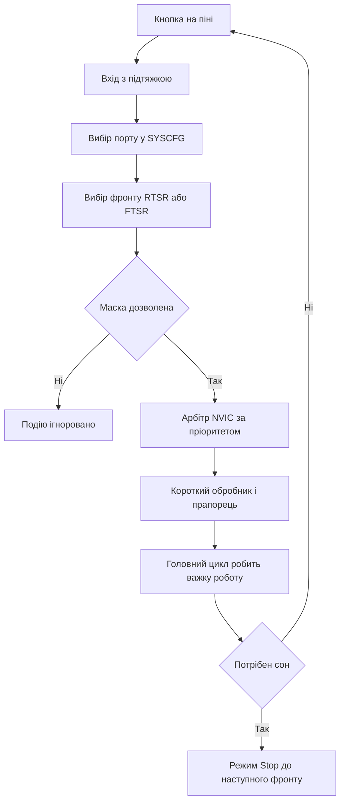

# EXTI і NVIC - зовнішні переривання STM32

![[assets/img/stm32-exti-nvic-scheme.png|600]]
*Рис. Шлях сигналу: пін порту, мультиплексор SYSCFG, лінії EXTI, контролер NVIC.*

> [!tip] Призначення ноти
> Показати повний шлях зовнішнього переривання: від кнопки на піні через вибір порту, фронти, пріоритети і короткий обробник до пробудження зі сну.

## 1. Призначення

EXTI це контролер зовнішніх переривань, який стежить за рівнями і фронтами на пінах і будить ядро подією. NVIC це вкладений контролер переривань у ядрі Cortex, який вирішує яке переривання обслужити першим і чи можна перервати поточний обробник. Разом вони дають реакцію на кнопку, датчик руху і імпульс енкодера без постійного опитування у циклі.

Ціна реакції це складність: спільні лінії між портами, налаштування фронтів, пріоритети і дребезг контактів. Нота розбирає кожен крок і показує, як писати короткі обробники без затримок.

## 2. Лінії EXTI0-EXTI15 спільні між портами

Молодші лінії EXTI0-EXTI15 підключені до пінів з тим самим номером з усіх портів, але одночасно активна тільки одна. PA0 або PB0 або PC0 можуть викликати EXTI0, проте вибір робить мультиплексор SYSCFG у регістрах EXTICR. Тому два датчики не можна вішати на PA0 і PB0 одночасно.

| Лінія EXTI | Джерела | Вибір | Обмеження |
| --- | --- | --- | --- |
| EXTI0 | PA0 PB0 PC0 PD0 і далі | EXTICR1 поле EXTI0 | Тільки один порт одночасно |
| EXTI1 | PA1 PB1 PC1 і далі | EXTICR1 поле EXTI1 | Тільки один порт одночасно |
| EXTI2-EXTI3 | Аналогічно за номером | EXTICR1 | Тільки один порт на лінію |
| EXTI4-EXTI7 | Аналогічно за номером | EXTICR2 | Тільки один порт на лінію |
| EXTI8-EXTI11 | Аналогічно за номером | EXTICR3 | Тільки один порт на лінію |
| EXTI12-EXTI15 | Аналогічно за номером | EXTICR4 | Тільки один порт на лінію |
| EXTI16+ | Внутрішні події PVD RTC USB | Без SYSCFG | Аналоговий детектор, будильник, USB |

```text
Мультиплексор SYSCFG спрощено:
  PA5 --+
  PB5 --+--> EXTICR вибір --> EXTI5 --> NVIC --> ядро
  PC5 --+
  Тільки один вхід проходить, решта ігнорується
  Помилка новачка: кнопка на PA0 і датчик на PB0 разом
```

Після вибору порту пін налаштовують входом з підтяжкою, а лінію EXTI дозволяють маскою IMR. Без тактування SYSCFG запис у EXTICR не діє, тому тактування SYSCFG вмикають першим.

## 3. Фронти RTSR і FTSR і маска подій

RTSR дозволяє переривання за наростанням, FTSR дозволяє переривання за спадом. Можна увімкнути обидва для реакції на будь-яку зміну, наприклад для енкодера. PR це прапорець очікування, який скидають записом одиниці.

| Регістр | Призначення | Типові значення |
| --- | --- | --- |
| RTSR | Дозвіл фронту вгору | 1 для кнопки до землі з відпусканням |
| FTSR | Дозвіл фронту вниз | 1 для кнопки до землі з натисканням |
| IMR | Маска переривань до NVIC | 1 щоб дозволити, 0 щоб заборонити |
| EMR | Маска подій без переривання | 1 для пробудження без входу в обробник |
| PR | Прапорець очікування | Скидати одиницею в обробнику |
| SWIER | Програмна імітація | 1 щоб викликати переривання з коду для тесту |

Для кнопки до землі з підтяжкою вгору натискання дає спад, відпускання дає наростання. Якщо потрібен тільки факт натискання, вмикають тільки FTSR. Якщо треба рахувати імпульси енкодера, вмикають обидва фронти і розбирають напрям за другим каналом у обробнику.

## 4. Від піна до обробника за п’ять кроків

| Крок | Дія | Регістр або виклик |
| --- | --- | --- |
| 1 | Увімкнути тактування GPIO і SYSCFG | RCC для GPIOA і SYSCFG |
| 2 | Пін у вхід з підтяжкою | MODER 00 плюс PUPDR вгору або вниз |
| 3 | Вибрати порт для лінії | SYSCFG EXTICR поле під номер піна |
| 4 | Вибрати фронт і дозволити | RTSR або FTSR плюс IMR |
| 5 | Дозволити у NVIC і написати колбек | EnableIRQ плюс HAL_GPIO_EXTI_Callback |

У CubeMX кроки 1-4 робить генератор за вибором режиму GPIO_EXTI_RISING, GPIO_EXTI_FALLING або GPIO_EXTI_RISING_FALLING. Крок 5 це пріоритет у вкладці NVIC і короткий колбек без важкої логіки.

## 5. NVIC: пріоритети і групування

NVIC має пріоритети від нуля до максимуму залежно від ядра, де нуль це найважливіше. Групування пріоритетів ділить біти на витісняючі і підпріоритети. Витісняючий пріоритет вирішує чи нове переривання перерве поточне, підпріоритет вирішує порядок серед тих що чекають з однаковим витісняючим.

| Поняття | Що означає | Практика |
| --- | --- | --- |
| Preemption | Чи може перервати інший обробник | Кнопка аварійного стопу вище за UART |
| Subpriority | Черга всередині одного рівня | Енкодер перед кнопкою меню на одному рівні |
| Priority grouping | Скільки бітів на кожну частину | Група 4 тобто 4 біти витіснення на F4 |
| Нульовий пріоритет | Найважливіший | Тільки для критичних подій |
| Однаковий пріоритет | Без витіснення | Обробники не переривають один одного |
| Довгий обробник | Блокує нижчі пріоритети | Тримати коротким, важке у чергу |

Правило пріоритетів: менше рівнів краще. Для навчального проєкту вистачає двох рівнів: високий для вимірювань і енкодера, низький для кнопок і зв’язку. Глибоку ієрархію з п’ятьма рівнями важко налагоджувати.

```text
Приклад розподілу:
  Група 4, всі біти це витіснення:
    EXTI енкодер ........ пріоритет 1, високий
    TIM вимірювання ..... пріоритет 2, середній
    USART прийом ........ пріоритет 3, низький
    Кнопка меню ......... пріоритет 3, низький
  Енкодер перериває UART, кнопки між собою не перериваються
```

## 6. Колбек HAL і прапорці

HAL ховає вектори за загальним обробником EXTI. Користувацький код пишуть у функції HAL_GPIO_EXTI_Callback за номером піна. Прапорець PR скидає нижній рівень HAL, тому вручну писати одиницю треба тільки у коді на регістрах.

```c
// Ініціалізація кнопки PA0 на спад через HAL
__HAL_RCC_GPIOA_CLK_ENABLE();
GPIO_InitTypeDef b = {0};
b.Pin = GPIO_PIN_0;
b.Mode = GPIO_MODE_IT_FALLING;
b.Pull = GPIO_PULLUP;
HAL_GPIO_Init(GPIOA, &b);
HAL_NVIC_SetPriority(EXTI0_IRQn, 3, 0);
HAL_NVIC_EnableIRQ(EXTI0_IRQn);

// Короткий колбек: тільки прапорець і черга, ніяких затримок
volatile uint8_t btn_event = 0;
void HAL_GPIO_EXTI_Callback(uint16_t GPIO_Pin)
{
  if (GPIO_Pin == GPIO_PIN_0)
  {
    btn_event = 1;
  }
}

// Головний цикл розбирає подію без поспіху
// if (btn_event) { btn_event = 0; menu_next(); }

// Той самий фронт на регістрах: FTSR плюс IMR плюс SYSCFG
// SYSCFG->EXTICR[0] &= ~(0xF << 0);
// EXTI->FTSR |= EXTI_FTSR_TR0;
// EXTI->RTSR &= ~EXTI_RTSR_TR0;
// EXTI->IMR  |= EXTI_IMR_MR0;
// EXTI->PR    = EXTI_PR_PR0;
// NVIC_EnableIRQ(EXTI0_IRQn);
```

У колбеку не роблять затримок, друку у консоль і довгих циклів. Важка робота йде у головний цикл через прапорець або чергу подій. Інакше нижчі пріоритети чекають, а повторний фронт губиться.

## 7. Дребезг кнопки: фільтр і таймер

Механічний контакт брязкає мілісекундами і дає пачку фронтів замість одного. Апаратний RC фільтр згладжує короткі сплески, а програмний таймер ігнорує повторні спрацьовування протягом вікна, наприклад 30 мс. Затримку всередині обробника ставити заборонено.

| Метод | Схема | Параметри |
| --- | --- | --- |
| RC фільтр | Резистор 10 кОм плюс конденсатор 100 нФ до землі | Стала часу близько 1 мс |
| Підтяжка | Вбудована 40 кОм або зовнішня 10 кОм | Зовнішня стабільніша на шлейфі |
| Тригер Шмітта | Вбудований у цифровий вхід | Вже є, гістерезис допомагає |
| Програмне вікно | Мітка часу останнього спрацьовування | Ігнор 20-50 мс після першого фронту |
| Опитування таймером | Перевірка стану кожні 5 мс тричі поспіль | Для дуже брудних кнопок |

```text
Програмний антидребезг без затримки:
  EXTI фронт -> записати час t0 і виставити подію
  Головний цикл: якщо зараз мінус t0 більше 30 мс і пін стабільний,
  тоді це справжнє натискання, інакше ігнорувати
  У самому EXTI ніякого очікування
```

## 8. Пробудження зі Stop через EXTI

У режимі Stop ядро і більшість тактів зупинено, але EXTI вміє будити контролер фронтом на дозволеній лінії. Кнопка або датчик руху стають кнопкою вмикання: заснув, чекаєш фронт, прокинувся і працюєш далі. Маска EMR дозволяє будити без входу в обробник, а маска IMR з обробником.

Перед сном вимикають зайву периферію, вибирають фронт пробудження і скидають прапорець PR. Після пробудження тактування треба налаштувати заново, бо PLL зупинялась. Час пробудження вимірюють осцилографом за піном який смикають одразу після виходу зі сну.

## 9. Хибні спрацьовування від завад

Довгий шлейф кнопки без скрутки ловить імпульси реле і двигунів. Висячий вхід без підтяжки спрацьовує від дотику. Круті фронти сусідніх виходів наводяться на вхід через ємність плати. Лікування однакове: підтяжка, фільтр, екран і короткі обробники.

| Симптом | Причина | Лікування |
| --- | --- | --- |
| Пачка переривань без натискання | Дребезг або наведення | RC фільтр плюс вікно 30 мс |
| Спрацьовування при вмиканні мотора | Імпульс по землі | Окрема земля, скрутка, ферит |
| Нічні пробудження зі Stop | Наведення на довгому шлейфі | Зовнішня підтяжка 10 кОм, конденсатор |
| Пропуски імпульсів енкодера | Обробник задовгий | Скоротити колбек, підняти пріоритет |
| Зависання у колбеку | Затримка всередині ISR | Прибрати цикли очікування, прапорець у цикл |

## 10. Mermaid: шлях події EXTI



## 11. Про ШІМ і таймери коротко

Керування яскравістю і швидкістю моторів роблять не через EXTI, а через таймери у режимі широтно-імпульсної модуляції. Таймер генерує імпульси заданої шпаруватості без участі ядра, а EXTI лишається для кнопок і датчиків. Детальний розбір таймерів і каналів ШІМ знаходиться у розділі 07 про таймери і звук, тут тільки межа: EXTI реагує на події, таймер створює сигнали.

## Типові помилки

| # | Помилка | Чому погано | Як правильно |
| --- | --- | --- | --- |
| 1 | PA0 і PB0 одночасно на EXTI0 | Лінія одна, працює тільки останній вибір у SYSCFG | Рознести датчики на різні номери ліній |
| 2 | Затримка всередині обробника | Блокує ядро і нижчі пріоритети, губить фронти | Тільки прапорець, важке у головному циклі |
| 3 | Не скинуто прапорець PR у коді на регістрах | Переривання входить без кінця | Писати одиницю у PR одразу при вході |
| 4 | Кнопка без підтяжки і фільтра | Хибні спрацьовування і дребезг | Підтяжка плюс RC плюс вікно 30 мс |
| 5 | Однаковий високий пріоритет для всіх | Немає витіснення, важливе чекає | Два рівні: вимірювання вище, кнопки нижче |
| 6 | Сон Stop без дозволу EXTI | Контролер не прокинеться | Дозволити фронт і маску пробудження |
| 7 | Важкий друк у консоль з колбека | UART повільний, обробник розтягується | Копіювати дані у буфер, друк у циклі |

## Офіційні джерела

- [STM32F401 Reference Manual RM0368, EXTI and SYSCFG (ST)](https://www.st.com/resource/en/reference_manual/rm0368-stm32f401xbc-and-stm32f401xde-advanced-armbased-32bit-mcus-stmicroelectronics.pdf) - лінії, фронти, EXTICR.
- [STM32G0 Reference Manual, EXTI wakeup from Stop (ST)](https://www.st.com/en/microcontrollers-microprocessors/stm32g0-series.html) - пробудження і режими сну.
- [Cortex-M4 Generic User Guide, NVIC priorities (ARM)](https://developer.arm.com/documentation/dui0553/latest/) - витіснення, підпріоритети, групування.
- [EXTI у RM0444 для STM32G0 (ST)](https://www.st.com/resource/en/reference_manual/rm0444-stm32g0x1-advanced-armbased-32bit-mcus-stmicroelectronics.pdf) - джерела переривань і пробудження.

## Див. також

- [[Home]]
- [[03-GPIO/01-GPIO-rezhimi|режими GPIO]]
- [[03-GPIO/02-AF-maping|мапінг альтернативних функцій]]
- [[01-Hardware/01-F0-F1-Classic|класика F0/F1]]
- [[09-Proshivka/02-HAL-LL|шари HAL і LL]]
- [[09-Proshivka/03-ST-Link-Proshivka|прошивка через ST-Link]]
- [[00-Start/03-Porivnyannya-chipiv|Порівняння чипів]]
