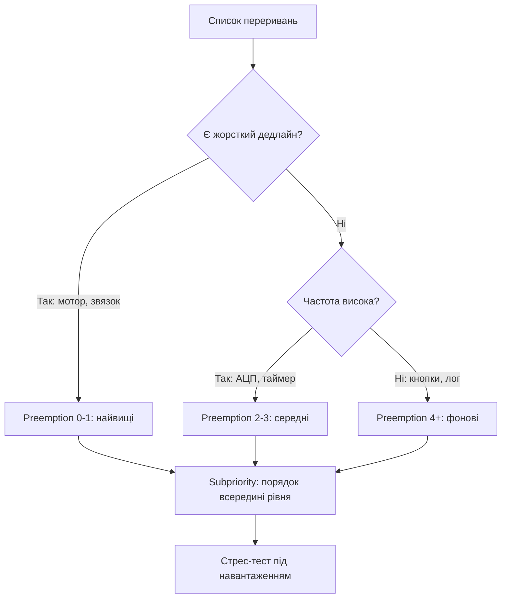

# NVIC STM32 - пріоритети, групування і затримки

![[assets/img/stm32-nvic-priority-scheme.png|600]]
*Рис. Хто кого перебиває: групування пріоритетів і черги.*

> [!tip] Призначення ноти
> Навчити розставляти пріоритети переривань так, щоб критичне встигало, а низьке не голодувало.

## 1. Призначення

NVIC керує всіма перериваннями ядра Cortex-M: вирішує, яке переривання виконується зараз, яке чекає, а яке перебиває інше. Неправильні пріоритети дають пропуски семплів, зірвані таймінги і зависання, які неможливо відтворити на столі. Правильні - детерміновану систему.

## Два види пріоритету

| Вид | Роль | Аналогія |
| --- | --- | --- |
| Preemption (перебивання) | Вищий перебиває нижчого прямо зараз | Дзвінок пожежної під час наради |
| Subpriority (підпорядок) | Черга серед рівних, коли обидва чекають | Хто перший прийшов до дверей |

```text
Важливо:
  preemption вирішує, ЧИ перебивати.
  subpriority вирішує, ХТО перший серед тих, що чекають.
  subpriority НІКОЛИ не перебиває виконуване переривання!
```

## Групування пріоритетів

| Група | Бітів preemption | Бітів subpriority | Коли брати |
| --- | --- | --- | --- |
| NVIC_PRIORITYGROUP_0 | 0 (всі рівні!) | 4 | Нічого не перебиває нічого - рідко треба |
| NVIC_PRIORITYGROUP_1 | 1 | 3 | Два рівні вкладеності |
| NVIC_PRIORITYGROUP_2 | 2 | 2 | Компроміс за замовчуванням у CubeMX |
| NVIC_PRIORITYGROUP_3 | 3 | 1 | Багато рівнів, мало черг |
| NVIC_PRIORITYGROUP_4 | 4 (все preemption!) | 0 | Жорсткий реалтайм, повний контроль |

```c
// Група задається ОДИН раз на старті:
HAL_NVIC_SetPriorityGrouping(NVIC_PRIORITYGROUP_4);
// Потім пріоритети для кожного джерела:
HAL_NVIC_SetPriority(TIM2_IRQn, 1, 0);   // preemption 1
HAL_NVIC_SetPriority(USART1_IRQn, 3, 0); // preemption 3 — нижчий
HAL_NVIC_EnableIRQ(TIM2_IRQn);
HAL_NVIC_EnableIRQ(USART1_IRQn);
```

## Таблиця: хто кого перебиває

| Виконується | Прийшло з preemption | Результат |
| --- | --- | --- |
| Пріоритет 3 | Пріоритет 1 | Перебиває: спочатку 1, потім повернення в 3 |
| Пріоритет 1 | Пріоритет 3 | Чекає: 3 виконається після 1 |
| Пріоритет 2 | Пріоритет 2 | Чекає в черзі за subpriority |
| Головний цикл | Будь-яке | Перебиває: main завжди найнижчий |

## Mermaid: вибір пріоритетів системи



## Затримки: звідки беруться мікросекунди

| Складова | Порядок | Як зменшити |
| --- | --- | --- |
| Вхід в обробник | 12 тактів ядра мінімум | Нічого не вдієш - це залізо |
| Очікування вищого | Від нуля до мілісекунд | Не тримати довгий код у високих пріоритетах |
| Збереження контексту FPU | Десятки тактів | Не чіпати float у низьких ISR без потреби |
| HAL-диспетчер | Десятки-сотні тактів | LL у гарячих місцях |
| Tail-chaining | Економія 6+ тактів | Залізо саме склеює сусідні ISR |

```c
// Вимір затримки: пін вгору на початку ISR, вниз в кінці:
void TIM2_IRQHandler(void)
{
  LL_GPIO_SetOutputPin(GPIOA, LL_GPIO_PIN_5);  // маркер
  // ... корисна робота ...
  LL_GPIO_ResetOutputPin(GPIOA, LL_GPIO_PIN_5);
  LL_TIM_ClearFlag_UPDATE(TIM2);
}
// Ширина імпульсу на осцилографі — час ISR.
```

## Правила для FreeRTOS

| Правило | Пояснення |
| --- | --- |
| ISR з викликами API ядра - не вище configMAX_SYSCALL_PRIORITY | Інакше пошкодиш черги ядра ОС |
| Найвищі пріоритети - тільки залізо без ОС | Моторний ШІМ, аварійний стоп |
| Відкладена обробка | ISR ставить прапорець, задача розбирає |
| Перевірка пріоритетів | Порт FreeRTOS має assert на невірні пріоритети |

## Типові помилки

| # | Помилка | Чому погано | Як правильно |
| --- | --- | --- | --- |
| 1 | Усі пріоритети за дефолтом | Все рівне - критичне чекає кнопки | Розставити свідомо за таблицею вище |
| 2 | Група міняється посеред роботи | Пріоритети перераховуються | Один раз на старті, більше не чіпати |
| 3 | Довгий код у високому ISR | Блокує все нижче на мілісекунди | Прапорець + обробка в main або задачі |
| 4 | HAL_Delay в обробнику | Система стоїть | Ніколи не чекати всередині ISR |
| 5 | Subpriority як preemption | Очікування перебивання, якого немає | Памятати: черга не перебиває! |
| 6 | FreeRTOS API з високого ISR | Псує внутрішні черги ОС | Тільки з пріоритетів нижче порога |
| 7 | Не скинуто прапорець джерела | Вічний вхід в той же ISR | Скидати прапорець периферії першим ділом |

## Офіційні джерела

- [PM0214 Cortex-M4 Programming Manual (ARM)](https://developer.arm.com/documentation/ddi0439/latest/) - NVIC, пріоритети, винятки.
- [AN4989 EXTI and NVIC (ST)](https://www.st.com/resource/en/application_note/an4989.pdf) - практика переривань STM32.

## Інверсія пріоритетів: класичний сценарій

| Крок | Що відбувається |
| --- | --- |
| 1 | Низький ISR захоплює спільний буфер |
| 2 | Приходить високий ISR, чекає той же буфер |
| 3 | Середній ISR крутиться довго і не дає низькому звільнити буфер |
| 4 | Високий чекає середнього - інверсія! |

```text
Ліки:
  критичні секції короткі і з вимкненими перериваннями;
  спільні дані між ISR — тільки lock-free черги;
  високий ISR ніколи не чекає низького.
```

```c
// Коротка критична секція навколо спільного лічильника:
__disable_irq();
shared_counter++;
__enable_irq();
```

## Див. також

- [[Home]]
- [[03-GPIO/03-EXTI-NVIC|зовнішні переривання]]
- [[03-GPIO/01-GPIO-rezhimi|режими пінів]]
- [[07-Timeri-Son/01-GPTIM-ADTIM|таймери і ШІМ]]
- [[09-Proshivka/02-HAL-LL|шари коду]]
