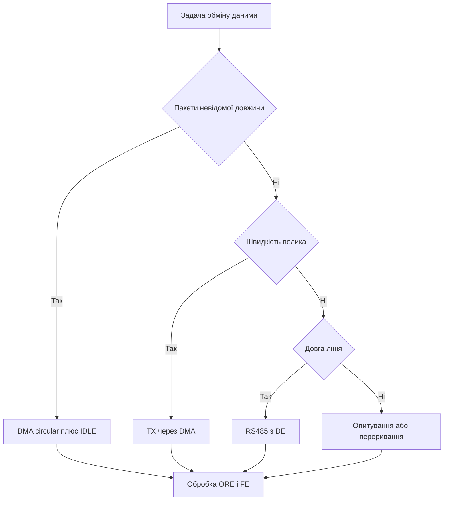

# UART STM32 - бодрейт, DMA-idle і помилки

![[assets/img/stm32-uart-scheme.png|600]]
*Рис. UART: лінії TX і RX, бодрейт, парність, DMA-прийом і вихід у RS485.*

> [!tip] Призначення ноти
> Дати повну картину послідовного порту: як порахувати бодрейт, як приймати пакети невідомої довжини через DMA, як гасити прапори помилок і як перейти на RS485.

## 1. Призначення

UART є базовим діагностичним інтерфейсом плати: виведення логів, керування через термінал, зв’язок з GPS-приймачем, зв’язок з радіомодемом, прошивка через заводський завантажувач. Два дроти TX і RX плюс спільна земля вирішують більшість задач обміну.

У STM32 порт називається USART або UART залежно від наявності синхронного тактового виходу. Логіка роботи однакова: кадр зі старт-бітом, бітами даних, бітом парності і стоп-бітами.

## 2. Кадр і параметри порту

| Параметр | Варіанти | Коментар |
| --- | --- | --- |
| Довжина слова | 7, 8, 9 біт | 9 біт потрібен для адресних схем і парності без втрати біта |
| Парність | Немає, парна, непарна | Парність займає один біт слова |
| Стоп-біти | 0.5, 1, 1.5, 2 | Приймач зазвичай чекає 1 стоп-біт |
| Порядок | Молодший біт першим | Старший біт першим тут не використовується |
| Інверсія | TXINV, RXINV, TXRXSWAP | Корисно для нестандартних рівнів без зовнішніх елементів |
| Апаратний контроль потоку | RTS, CTS | Зупиняє передавач коли приймач зайнятий |
| Синхронний режим | CK-вихід тільки у USART | Рідко потрібен, майже завжди працює асинхронний обмін |

```text
Кадр 8N1 на лінії TX:
  Стан простою .......... високий рівень
  Старт-біт ............. один біт низького рівня
  Дані .................. 8 біт, молодший першим
  Стоп-біт .............. один біт високого рівня
  Наступний байт ........ пауза або одразу старт-біт
```

| Режим 8N1 | Формула часу байта | Приклад на 115200 |
| --- | --- | --- |
| 1 старт плюс 8 даних плюс 1 стоп | 10 поділок на швидкість | 10 поділок на 115200 дає близько 86.8 мкс |
| Корисна швидкість | 80 відсотків від лінійної | 115200 дає близько 11.5 Кбайт за секунду |
| Передача 100 байт | 1000 поділок на швидкість | 100 байт на 115200 займають близько 8.7 мс |

## 3. Бодрейт і регістр BRR

Бодрейт задається дільником BRR від тактової частоти шини периферії. Помилка у частоті шини одразу дає помилку бодрейту, тому дерево тактування перевіряють першим.

| Поле | Зміст | Де шукати |
| --- | --- | --- |
| OVER8 | 0 дає передискретизацію 16, 1 дає передискретизацію 8 | Біт OVER8 регістра CR1 |
| BRR | Ціла плюс дробова частини дільника | Регістр BRR периферії USART |
| USARTDIV | Відношення частоти шини до бодрейту з урахуванням передискретизації | Довідник RM, розділ USART |
| Допуск | Приймач терпить близько 2 відсотків розбіжності | Передавач має триматися у межах 1 відсотка |

```text
Вибір джерела тактування:
  Точний кварц HSE ...... похибка частки відсотка, довгі лінії стабільні
  Внутрішній HSI ........ зручно, але похибка помітна на морозі і спеці
  LSE плюс калібрування . для малих швидкостей і режимів сну
  PLL від HSE ........... високі швидкості, уважно з дільниками шин
```

| Шина 72 МГц, OVER16 | USARTDIV | BRR | Похибка |
| --- | --- | --- | --- |
| 115200 | 39.0625 | 0x271 | Близько нуля |
| 9600 | 468.75 | 0x1D4C | Близько нуля |
| 1000000 | 4.5 | 0x48 | Близько нуля |

| Шина 16 МГц, OVER8 | USARTDIV | Коментар |
| --- | --- | --- |
| 115200 | 17.36 | Дробова частина округлюється, похибка частки відсотка |
| 9600 | 208.33 | Похибка мізерна |
| 3000000 | 0.66 | Межа діапазону, перевірити допуск приймача |

## 4. Режими роботи у HAL

| Режим | Виклик | Коли брати |
| --- | --- | --- |
| Опитування | HAL_UART_Transmit, HAL_UART_Receive | Налагодження, короткі команди, старт системи |
| Переривання | HAL_UART_Transmit_IT, HAL_UART_Receive_IT | Фонова робота без блокування циклу |
| DMA | HAL_UART_Transmit_DMA, HAL_UART_Receive_DMA | Потоки даних, прийом пакетів, виведення логів |
| Змішаний | TX через DMA, RX через переривання простою | Типова зв’язка для протокольних задач |

```c
UART_HandleTypeDef huart1;

int uart_init_115200(UART_HandleTypeDef *hu)
{
    hu->Instance = USART1;
    hu->Init.BaudRate = 115200;
    hu->Init.WordLength = UART_WORDLENGTH_8B;
    hu->Init.StopBits = UART_STOPBITS_1;
    hu->Init.Parity = UART_PARITY_NONE;
    hu->Init.Mode = UART_MODE_TX_RX;
    hu->Init.HwFlowCtl = UART_HWCONTROL_NONE;
    hu->Init.OverSampling = UART_OVERSAMPLING_16;
    return HAL_UART_Init(hu);
}

int uart_send_blocking(UART_HandleTypeDef *hu, const uint8_t *buf, uint16_t len)
{
    return HAL_UART_Transmit(hu, (uint8_t *)buf, len, 100);
}

int uart_send_async(UART_HandleTypeDef *hu, const uint8_t *buf, uint16_t len)
{
    return HAL_UART_Transmit_IT(hu, (uint8_t *)buf, len);
}
```

## 5. Прийом пакетів: DMA circular плюс простір лінії

Пакети невідомої довжини зручно приймати кільцевим буфером DMA. Передавач шле серію байт, потім лінія простоює. Прапор простою фіксує кінець пакета без таймерів у коді.

```text
Схема прийому:
  RX-пін ----> USART ----> DMA ----> кільцевий буфер у RAM
                  |
                  +---> прапор IDLE ---> переривання ---> розбір пакета
  CPU читає тільки готові шматки, байти не губляться на швидкості
```

```c
#define RX_BUF_LEN 256
uint8_t rx_buf[RX_BUF_LEN];
volatile uint16_t rx_old_pos = 0;

void uart_rx_dma_idle_start(UART_HandleTypeDef *hu)
{
    __HAL_UART_CLEAR_IDLEFLAG(hu);
    __HAL_UART_ENABLE_IT(hu, UART_IT_IDLE);
    HAL_UART_Receive_DMA(hu, rx_buf, RX_BUF_LEN);
}

uint16_t dma_current_pos(DMA_HandleTypeDef *hdma)
{
    return RX_BUF_LEN - (uint16_t)__HAL_DMA_GET_COUNTER(hdma);
}

void USART1_IRQHandler(void)
{
    if (__HAL_UART_GET_FLAG(&huart1, UART_FLAG_IDLE) != RESET)
    {
        __HAL_UART_CLEAR_IDLEFLAG(&huart1);
        uint16_t pos = dma_current_pos(huart1.hdmarx);
        packet_ready(rx_buf, rx_old_pos, pos);
        rx_old_pos = pos;
    }
    HAL_UART_IRQHandler(&huart1);
}
```

| Крок | Дія | Навіщо |
| --- | --- | --- |
| 1 | Запустити HAL_UART_Receive_DMA на весь буфер | DMA крутить байти без участі ядра |
| 2 | Увімкнути UART_IT_IDLE | Кінець пакета дає переривання |
| 3 | У обробнику читати лічильник DMA | Дізнатися скільки байт прийшло |
| 4 | Розібрати діапазон від старої позиції до нової | Врахувати заворот кільця через край буфера |
| 5 | Не зупиняти DMA між пакетами | Пауза між пакетами губить байти |

## 6. Прапори помилок ORE, FE, NE

| Прапор | Причина | Наслідок |
| --- | --- | --- |
| ORE | Новий байт прийшов раніше читання старого | Байт втрачено, потрібне скидання прапора читанням |
| FE | Стоп-біт прочитано як нуль | Обрив лінії або чужий бодрейт |
| NE | Шуми на лінії під час стробів | Біт нестабільний, байт під сумнівом |
| PE | Парність не зійшлася | Пошкодження або чужі налаштування слова |

```c
void USART1_IRQHandler_err(UART_HandleTypeDef *hu)
{
    uint32_t sr = hu->Instance->SR;
    if (sr & USART_SR_ORE)
    {
        (void)hu->Instance->DR;
        uart_stat.ore_cnt++;
    }
    if (sr & USART_SR_FE)
    {
        (void)hu->Instance->DR;
        uart_stat.fe_cnt++;
    }
    if (sr & USART_SR_NE)
    {
        (void)hu->Instance->DR;
        uart_stat.ne_cnt++;
    }
    HAL_UART_IRQHandler(hu);
}
```

| Дія | Старі родини F0 і F1 | Нові родини G0 і H5 |
| --- | --- | --- |
| Читання статусу | Регістр SR | Регістр ISR |
| Скидання ORE | Читання SR потім читання DR | Запис біта ORECF у ICR |
| Скидання FE | Читання SR потім читання DR | Запис біта FECF у ICR |
| Скидання NE | Читання SR потім читання DR | Запис біта NECF у ICR |
| Скидання IDLE | Читання SR потім читання DR | Запис біта IDLECF у ICR |

## 7. RS485 з керуванням DE

Диференційна пара дозволяє тягнути лінію на сотні метрів і вішати десятки вузлів. Напрям задає пін DE прийомопередавача. Периферія STM32 вміє керувати DE апаратно.

```text
Вузол RS485:
  TX ---> USART ---> DI драйвера
  DE ---> USART_DE ---> DE і RE драйвера
  RX <--- USART <--- RO драйвера
  A і B ---> вита пара з термінатором 120 Ом на кінцях
```

| Параметр | Зміст | Типове значення |
| --- | --- | --- |
| DEAT | Затримка від активації DE до першого біта | 1 або 2 бітові інтервали |
| DEDT | Затримка від останнього біта до зняття DE | 1 або 2 бітові інтервали |
| Термінатор | Резистор між A і B на кінцях шини | 120 Ом |
| Зміщення простою | Підтяжки A до живлення і B до землі | По 680 Ом на ведучому вузлі |
| Швидкість | Залежить від довжини кабелю | 115200 стабільно на сотнях метрів |

```c
void uart_rs485_init(UART_HandleTypeDef *hu)
{
    hu->Instance = USART2;
    hu->Init.BaudRate = 115200;
    hu->Init.WordLength = UART_WORDLENGTH_8B;
    hu->Init.StopBits = UART_STOPBITS_1;
    hu->Init.Parity = UART_PARITY_NONE;
    hu->Init.Mode = UART_MODE_TX_RX;
    HAL_UART_Init(hu);
    HAL_RS485Ex_Init(hu, UART_DE_POLARITY_HIGH, 16, 16);
}
```

## 8. LIN і напівдуплекс по одному дроту

| Режим | Піни | Застосування |
| --- | --- | --- |
| LIN | Один TX плюс один RX через трансивер | Кузовна електроніка, клімат, двері |
| Half-duplex | Один пін TXRX, напрям всередині | Однодротові датчики, економія роз’єму |
| Single-wire | TX і RX з’єднані зовні через резистор | Налагодження одним щупом |
| Smartcard | CK плюс дані за стандартом | Платіжні термінали, ідентифікація |

```c
void uart_half_duplex_init(UART_HandleTypeDef *hu)
{
    hu->Instance = USART3;
    hu->Init.BaudRate = 9600;
    hu->Init.WordLength = UART_WORDLENGTH_8B;
    hu->Init.StopBits = UART_STOPBITS_1;
    hu->Init.Parity = UART_PARITY_NONE;
    hu->Init.Mode = UART_MODE_TX_RX;
    HAL_UART_Init(hu);
    HAL_HalfDuplex_Init(hu);
}
```

## 9. FIFO у родинах G0 і H5

| Властивість | Без FIFO | З FIFO |
| --- | --- | --- |
| Глибина | Один байт регістра даних | 8 або 16 байт черги |
| Поріг переривання | Кожен байт будить ядро | Поріг 1/4, 1/2, 3/4 будить рідше |
| Втрати на швидкості | ORE при затримці обробника | Черга згладжує джитер обробника |
| DMA | Запит на кожен байт | Пакетний запит по порогу |

```text
Налаштування порогів:
  RXFIFO на 1/2 ......... баланс між затримкою і числом переривань
  TXFIFO на 1/4 ......... підкачка не чекає повного спорожнення
  Таймаут приймача ...... добирає хвіст пакета коротший за поріг
```

## 10. Виведення printf через _write

| Крок | Дія |
| --- | --- |
| 1 | Увімкнути TX-пін у CubeMX і згенерувати ініціалізацію |
| 2 | Додати _write що шле буфер через HAL_UART_Transmit |
| 3 | Вибрати малий буфер форматування щоб не забити стек |
| 4 | На швидкому виведенні перейти на кільцевий буфер плюс DMA |

```c
int _write(int file, char *ptr, int len)
{
    (void)file;
    HAL_UART_Transmit(&huart1, (uint8_t *)ptr, (uint16_t)len, 100);
    return len;
}
```

```c
void ll_usart_putc(USART_TypeDef *u, char c)
{
    while ((u->SR & USART_SR_TXE) == 0) { }
    u->DR = (uint16_t)c;
}

void ll_usart_puts(USART_TypeDef *u, const char *s)
{
    while (*s)
    {
        ll_usart_putc(u, *s);
        s++;
    }
}
```

## 11. Апаратний контроль потоку і VCP на Nucleo

| Сигнал | Напрям | Призначення |
| --- | --- | --- |
| RTS | Вихід нашого порту | Каже партнеру що готові приймати |
| CTS | Вхід нашого порту | Партнер дозволяє нам передавати |
| DTR і DSR | Службові віртуального порту | Скидання плати через термінал |

```text
Nucleo VCP через ST-Link:
  USART2 TX (PA2) ---> ST-Link ---> USB CDC ---> термінал на ПК
  USART2 RX (PA3) <--- ST-Link <--- USB CDC <--- клавіатура ПК
  Окремий перетворювач не потрібен, бодрейт ставить термінал
```

| Задача | Налаштування |
| --- | --- |
| Логи без втрат на 115200 | VCP вистачає, RTS і CTS не потрібні |
| Потік на 1 Мбод і вище | Вмикати RTS і CTS, інакше будуть втрати |
| Точний бодрейт | HSE або HSI з калібруванням, перевірити похибку BRR |

## Mermaid: вибір режиму UART



## Типові помилки

| # | Помилка | Чому погано | Як правильно |
| --- | --- | --- | --- |
| 1 | Бодрейт пораховано від невірної частоти шини | Фактична швидкість пливе, приймач дає FE | Звірити дерево тактування і поле USARTDIV |
| 2 | OVER8 переплутано з OVER16 | Похибка вдвічі більша за очікувану | Виставити біт OVER8 однаково у розрахунку і у CR1 |
| 3 | Прапор ORE не скидається | Порт зупиняється, дані стоять | Прочитати статус потім дані або записати ORECF |
| 4 | DMA зупиняють між пакетами | Байти початку наступного пакета губляться | Тримати кільце запущеним і читати лічильник |
| 5 | DE знімають одразу після останнього байта | Хвіст кадра обрізається на лінії | Задати DEAT і DEDT у 1 або 2 бітові інтервали |
| 6 | printf шле безпосередньо у перериванні | Блокування на мілісекунди ламає реальний час | Кільцевий буфер плюс TX через DMA |
| 7 | Немає спільної землі з партнером | Плаваючий нуль дає сміття замість байт | З’єднати землі або перейти на RS485 |

## Офіційні джерела

- [USART manual у RM0008 для STM32F1 (ST)](https://www.st.com/resource/en/reference_manual/rm0008-stm32f101xx-stm32f102xx-stm32f103xx-stm32f105xx-and-stm32f107xx-advanced-armbased-32bit-mcus-stmicroelectronics.pdf) - кадри, BRR, прапори ORE і FE.
- [USART manual у RM0444 для STM32G0 (ST)](https://www.st.com/resource/en/reference_manual/rm0444-stm32g0x1-advanced-armbased-32bit-mcus-stmicroelectronics.pdf) - FIFO, DEAT і DEDT, скидання через ICR.

## Див. також

- [[Home]]
- [[04-Shini/02-SPI|шина SPI]]
- [[04-Shini/03-I2C|шина I2C]]
- [[09-Proshivka/01-CubeIDE-CubeMX|налаштування CubeMX]]
- [[09-Proshivka/02-HAL-LL|шари HAL і LL]]
- [[03-GPIO/02-AF-maping|мапінг альтернативних функцій]]
- [[09-Proshivka/03-ST-Link-Proshivka|прошивка через ST-Link]]
