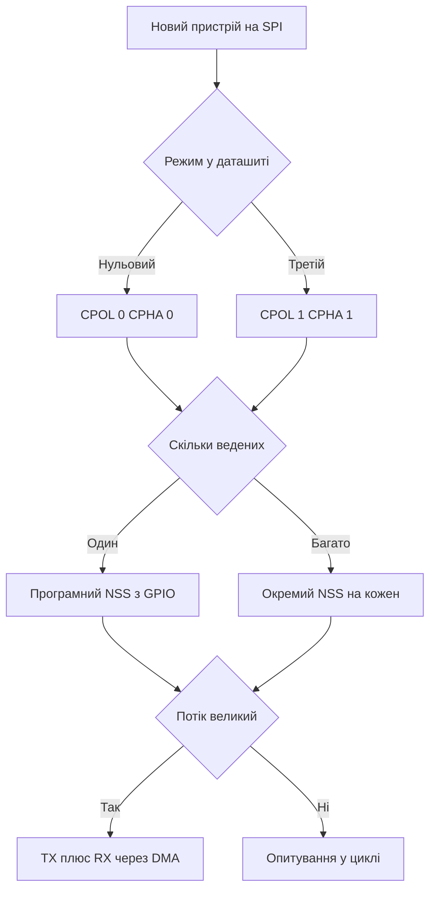

# SPI STM32 - режими, NSS і DMA

![[assets/img/stm32-spi-scheme.png|600]]
*Рис. SPI: лінії SCK, MOSI, MISO, вибір ведених, полярність і фаза тактів.*

> [!tip] Призначення ноти
> Навчити впевнено ганяти SPI: вибрати режим, не переплутати фронт, тримати chip select, качати кадри через DMA і підключати дисплей та флеш без магії.

## 1. Призначення

SPI є найшвидшою короткою шиною плати: дисплей, флешпам’ять, АЦП, радіомодуль, SD-карта. Один ведучий генерує такти SCK, вихід MOSI несе дані від ведучого, вхід MISO повертає дані від веденого.

Швидкість обмежена лише цілісністю сигналу і довжиною доріжок. На платі легко отримати десятки мегабіт за секунду, на шлейфі потрібна обережність.

## 2. Лінії і ролі

| Лінія | Напрям від ведучого | Призначення |
| --- | --- | --- |
| SCK | Вихід | Такти, дані читаються по фронту або спаду |
| MOSI | Вихід | Дані від ведучого до веденого |
| MISO | Вхід | Дані від веденого до ведучого |
| NSS | Вихід на кожен ведений | Вибір активного веденого низьким рівнем |
| DC | Вихід для дисплея | Команда або дані у графічному контролері |
| WP і HOLD | Службові флешпам’яті | Захист запису і пауза обміну |

```text
Зірка з трьома веденими:
  SCK ---> усім веденим паралельно
  MOSI --> усім веденим паралельно
  MISO <-- усі ведені через три стани, активний тільки вибраний
  NSS0 ---> тільки флеш, NSS1 ---> тільки дисплей, NSS2 ---> тільки АЦП
```

| Режим плати | Топологія | Коментар |
| --- | --- | --- |
| Один ведений | Один NSS | Найпростіше, дисплей або флеш |
| Кілька ведених | Окремий NSS на кожен | Ведучий вибирає з ким говорить |
| Каскад | Вихід одного у вхід іншого | Рідко, зсувні регістри світлодіодів |
| Ведені STM32 | Один чип ведучий, другий ведений | Тести і мости між платами |

## 3. Чотири режими CPOL і CPHA

| Режим | CPOL | CPHA | Строб даних |
| --- | --- | --- | --- |
| Режим 0 | 0 | 0 | Передній фронт захоплює, задній готує |
| Режим 1 | 0 | 1 | Задній фронт захоплює, передній готує |
| Режим 2 | 1 | 0 | Передній фронт захоплює при простої високим |
| Режим 3 | 1 | 1 | Задній фронт захоплює при простої високим |

```text
Полярність простим словами:
  CPOL 0 ............... SCK у простої низький, імпульси вгору
  CPOL 1 ............... SCK у простої високий, імпульси вниз
  CPHA 0 ............... вибірка по першому фронту після NSS
  CPHA 1 ............... вибірка по другому фронту, перший готує дані
```

| Пристрій | Типовий режим | Джерело |
| --- | --- | --- |
| Флеш W25Q | Режим 0 або 3 | Даташит пам’яті, обидва працюють |
| Дисплей ST7735 | Режим 0 | Даташит контролера |
| SD-карта | Режим 0 | Специфікація карт |
| АЦП MCP3208 | Режим 0 або 3 | Даташит перетворювача |
| Радіомодуль NRF24 | Режим 0 | Даташит модуля |

## 4. Ведучий і ведений

| Роль | SCK | NSS | Особливість |
| --- | --- | --- | --- |
| Ведучий | Генерує | Керує | Задає швидкість дільником шини |
| Ведений | Приймає | Слухає | Дані готує заздалегідь до фронту |

```text
Кадр обміну:
  NSS падає вниз ........ ведений прокидається і готує перший біт
  8 тактів SCK .......... біти йдуть в обидва боки одночасно
  NSS росте вгору ....... транзакція завершена, шина вільна
  Пауза між кадрами ..... ведений встигає обробити байт
```

| Параметр | Ведучий STM32 | Ведений STM32 |
| --- | --- | --- |
| Дільник | BR у CR1, степені двійки | Не використовується |
| NSS апаратний | Вихід NSS керує вибором | Вхід NSS скидає автомат |
| NSS програмний | Пін GPIO смикає код | Код стежить за фронтом |
| Швидкість | До половини частоти шини | До чверті частоти шини стабільно |

## 5. NSS апаратний проти програмного

| Варіант | Плюси | Мінуси |
| --- | --- | --- |
| Апаратний NSS | Чіткі фронти без джитера коду | Займає штатний пін, гнучкість менша |
| Програмний NSS | Будь-який пін GPIO на кожен пристрій | Код має тримати паузи між кадрами |
| Імпульс між кадрами | Ведений розрізняє транзакції | Потрібна пауза у тактах SCK |

```c
void spi_nss_gpio_pulse(GPIO_TypeDef *port, uint16_t pin)
{
    port->BSRR = (uint32_t)pin << 16;
    for (volatile int i = 0; i < 8; i++) { }
    port->BSRR = pin;
}

uint8_t spi_xfer_byte_poll(SPI_TypeDef *s, uint8_t out)
{
    while ((s->SR & SPI_SR_TXE) == 0) { }
    s->DR = out;
    while ((s->SR & SPI_SR_RXNE) == 0) { }
    return (uint8_t)s->DR;
}
```

| Помилка NSS | Симптом | Лікування |
| --- | --- | --- |
| NSS смикається всередині байта | Ведений рве кадр навпіл | Тримати низьким весь кадр |
| Немає паузи між кадрами | Ведений клеїть два кадри в один | Імпульс NSS вгору між транзакціями |
| Два ведені активні разом | MISO конфлікт, сміття на шині | Перевірити початковий рівень усіх NSS |

## 6. Дільник швидкості

| BR | Дільник | Шина 72 МГц | Шина 16 МГц |
| --- | --- | --- | --- |
| 000 | 2 | 36 МГц | 8 МГц |
| 001 | 4 | 18 МГц | 4 МГц |
| 010 | 8 | 9 МГц | 2 МГц |
| 011 | 16 | 4.5 МГц | 1 МГц |
| 100 | 32 | 2.25 МГц | 500 кГц |
| 101 | 64 | 1.125 МГц | 250 кГц |
| 110 | 128 | 562 кГц | 125 кГц |
| 111 | 256 | 281 кГц | 62 кГц |

```text
Вибір швидкості:
  Флеш читання ........... максимум з даташиту, часто 80 МГц і вище
  Дисплей ST7735 ......... 15 або 30 МГц по коротких доріжках
  Довгий шлейф ........... почати з 1 МГц і піднімати покроково
  Перша розмова .......... 500 кГц щоб виключити цілісність сигналу
```

## 7. Повний дуплекс з DMA

Головна особливість SPI: кожен такт штовхає біт в обидва боки. Прийом йде навіть коли потрібна тільки передача. Канал DMA на передачу і канал DMA на прийом працюють парою.

```text
Потік через DMA:
  RAM ---> DMA TX ---> SPI DR ---> MOSI ---> пристрій
  MISO ---> SPI DR ---> DMA RX ---> RAM
  Два канали стартують разом, кінець дає спільне переривання
```

```c
SPI_HandleTypeDef hspi1;
uint8_t spi_tx[256];
uint8_t spi_rx[256];

int spi_dma_xfer(SPI_HandleTypeDef *hs, uint16_t len)
{
    return HAL_SPI_TransmitReceive_DMA(hs, spi_tx, spi_rx, len);
}

void DMA1_Channel2_IRQHandler_dma(void)
{
    HAL_DMA_IRQHandler(hspi1.hdmatx);
}

void DMA1_Channel3_IRQHandler_dma(void)
{
    HAL_DMA_IRQHandler(hspi1.hdmarx);
}

void HAL_SPI_TxRxCpltCallback(SPI_HandleTypeDef *hs)
{
    (void)hs;
    spi_ready = 1;
}
```

| Сценарій | Налаштування DMA | Коментар |
| --- | --- | --- |
| Тільки передача | TX канал у пам’ять-передача, RX канал у заглушку | Прийняті байти ігноруються |
| Тільки прийом | TX шле заглушку 0xFF, RX складає у буфер | Такти потрібні для читання |
| Обмін | Обидва канали у кільцеві буфери | Дисплей і флеш на швидкості |
| Кінець | Прапор TC після останнього байта | NSS піднімати після TC, не раніше |

## 8. Дисплей ST7735: пін DC

| Сигнал | Рівень | Значення байта |
| --- | --- | --- |
| DC низький | Команда | Контролер тлумачить байт як інструкцію |
| DC високий | Дані | Контролер пише байт у пам’ять кадру |
| RESET | Імпульс низьким | Апаратне скидання контролера |
| BL | Підсвітка | Яскравість через ШІМ |

```c
void st7735_cmd(SPI_HandleTypeDef *hs, uint8_t cmd)
{
    HAL_GPIO_WritePin(DC_PORT, DC_PIN, GPIO_PIN_RESET);
    HAL_SPI_Transmit(hs, &cmd, 1, 10);
}

void st7735_data(SPI_HandleTypeDef *hs, const uint8_t *buf, uint16_t len)
{
    HAL_GPIO_WritePin(DC_PORT, DC_PIN, GPIO_PIN_SET);
    HAL_SPI_Transmit_DMA(hs, (uint8_t *)buf, len);
}

void st7735_window(SPI_HandleTypeDef *hs, uint8_t x0, uint8_t y0, uint8_t x1, uint8_t y1)
{
    uint8_t tmp[4];
    st7735_cmd(hs, 0x2A);
    tmp[0] = 0; tmp[1] = x0; tmp[2] = 0; tmp[3] = x1;
    st7735_data(hs, tmp, 4);
    st7735_cmd(hs, 0x2B);
    tmp[1] = y0; tmp[3] = y1;
    st7735_data(hs, tmp, 4);
    st7735_cmd(hs, 0x2C);
}
```

```text
Кадр на весь екран 128 на 160:
  Вікно CASET і RASET ... задати прямокутник
  Команда RAMWR ......... далі тільки дані
  DC вгору .............. потік пікселів через DMA
  16 біт на піксель ..... 40960 байт на кадр
```

## 9. Флеш W25Q: команди і сторінки

| Команда | Код | Призначення |
| --- | --- | --- |
| READ | 0x03 | Читання з довільної адреси |
| FAST READ | 0x0B | Швидке читання з фіктивним байтом |
| PAGE PROGRAM | 0x02 | Запис до 256 байт у межах сторінки |
| SECTOR ERASE | 0x20 | Стирання сектора 4 Кбайт |
| READ STATUS | 0x05 | Біт BUSY показує зайнятість |
| WRITE ENABLE | 0x06 | Дозвіл запису перед програмуванням |

```c
uint8_t w25q_status(SPI_HandleTypeDef *hs)
{
    uint8_t cmd = 0x05;
    uint8_t st = 0;
    HAL_GPIO_WritePin(NSS_PORT, NSS_PIN, GPIO_PIN_RESET);
    HAL_SPI_Transmit(hs, &cmd, 1, 10);
    HAL_SPI_Receive(hs, &st, 1, 10);
    HAL_GPIO_WritePin(NSS_PORT, NSS_PIN, GPIO_PIN_SET);
    return st;
}

void w25q_wait_ready(SPI_HandleTypeDef *hs)
{
    while (w25q_status(hs) & 0x01) { }
}

void w25q_page_program(SPI_HandleTypeDef *hs, uint32_t addr, const uint8_t *buf, uint16_t len)
{
    uint8_t hdr[4];
    uint8_t we = 0x06;
    hdr[0] = 0x02;
    hdr[1] = (uint8_t)(addr >> 16);
    hdr[2] = (uint8_t)(addr >> 8);
    hdr[3] = (uint8_t)addr;
    HAL_GPIO_WritePin(NSS_PORT, NSS_PIN, GPIO_PIN_RESET);
    HAL_SPI_Transmit(hs, &we, 1, 10);
    HAL_GPIO_WritePin(NSS_PORT, NSS_PIN, GPIO_PIN_SET);
    HAL_GPIO_WritePin(NSS_PORT, NSS_PIN, GPIO_PIN_RESET);
    HAL_SPI_Transmit(hs, hdr, 4, 10);
    HAL_SPI_Transmit(hs, (uint8_t *)buf, len, 100);
    HAL_GPIO_WritePin(NSS_PORT, NSS_PIN, GPIO_PIN_SET);
    w25q_wait_ready(hs);
}
```

| Правило сторінок | Чому |
| --- | --- |
| Запис не перетинає межу 256 байт | Контролер загортає адресу всередині сторінки |
| Перед записом сектор стерти | Біт можна тільки опустити, підняти дає стирання |
| BUSY чекати до кінця | Нова команда під час зайнятості ігнорується |
| Адреса 3 байти у молодших чипах | Старші обсяги вмикають 4-байтний режим |

## 10. Три дроти і TI-режим

| Варіант | Лінії | Коли брати |
| --- | --- | --- |
| Чотири дроти | SCK, MOSI, MISO, NSS | Повний дуплекс, стандарт |
| Три дроти | SCK, спільні дані, NSS | Економія піна, напівдуплекс |
| Один напрям | SCK, MOSI, NSS без MISO | Дисплей без читання |
| TI-режим | Кадровий імпульс замість NSS | Сумісність з контролерами TI |

```c
void ll_spi_master_init(SPI_TypeDef *s)
{
    s->CR1 = SPI_CR1_MSTR | SPI_CR1_SSM | SPI_CR1_SSI | SPI_CR1_BR_0 | SPI_CR1_SPE;
}

uint8_t ll_spi_xfer(SPI_TypeDef *s, uint8_t out)
{
    while ((s->SR & SPI_SR_TXE) == 0) { }
    s->DR = out;
    while ((s->SR & SPI_SR_RXNE) == 0) { }
    return (uint8_t)s->DR;
}
```

## 11. CRC і цілісність сигналу

| Засіб | Що дає |
| --- | --- |
| Апаратний CRC | Поліном контролює цілість кадра |
| Короткі доріжки | Менше дзвону на фронтах SCK |
| Послідовні резистори | Гасять викиди на довгих лініях |
| Земля поруч із SCK | Зворотний струм не гуляє платою |

```text
Діагностика шлейфа:
  Почати з 500 кГц ...... чисті прямокутники на осцилографі
  Підняти до 4 МГц ...... перевірити дзвін на фронтах
  Підняти до максимуму .. перевірити помилки читання флеш
  Додати 33 Ом у SCK .... якщо дзвін більше десяти відсотків живлення
```

## Mermaid: вибір конфігурації SPI



## Типові помилки

| # | Помилка | Чому погано | Як правильно |
| --- | --- | --- | --- |
| 1 | Режим 1 замість режиму 0 | Біти зсунуті на пів такту, сміття | Звірити CPOL і CPHA з даташитом пристрою |
| 2 | NSS піднімають до прапора TC | Останній байт обрізається | Чекати TC потім піднімати NSS |
| 3 | Запустили тільки TX канал DMA | Приймальний буфер переповнюється прапором OVR | Завжди запускати пару TX і RX разом |
| 4 | Запис через межу сторінки флеш | Дані загортаються на початок сторінки | Різати запис по межах 256 байт |
| 5 | DC дисплея не перемкнули | Команда малюється як пікселі | DC вниз на команду, DC вгору на дані |
| 6 | Швидкість одразу максимальна на шлейфі | Дзвін ламає стробування | Починати з 500 кГц і піднімати покроково |
| 7 | Два NSS активні одночасно | Конфлікт MISO, перегрів виходів | Тримати усі NSS високими крім одного |

## Офіційні джерела

- [SPI manual у RM0008 для STM32F1 (ST)](https://www.st.com/resource/en/reference_manual/rm0008-stm32f101xx-stm32f102xx-stm32f103xx-stm32f105xx-and-stm32f107xx-advanced-armbased-32bit-mcus-stmicroelectronics.pdf) - режими, дільник, прапори TXE і RXNE.
- [AN5546 SPI displays на STM32 (ST)](https://www.st.com/resource/en/application_note/an5546-spi-display-on-stm32-mcus-stmicroelectronics.pdf) - практика графічних контролерів через SPI.
- [W25Q128 datasheet (Winbond)](https://www.winbond.com/resource-files/w25q128jv_revg.pdf) - команди, сторінки, часові діаграми.

## Див. також

- [[Home]]
- [[04-Shini/01-UART|послідовний порт UART]]
- [[04-Shini/03-I2C|шина I2C]]
- [[09-Proshivka/01-CubeIDE-CubeMX|налаштування CubeMX]]
- [[09-Proshivka/02-HAL-LL|шари HAL і LL]]
- [[03-GPIO/01-GPIO-rezhimi|режими GPIO]]
- [[03-GPIO/02-AF-maping|мапінг альтернативних функцій]]
