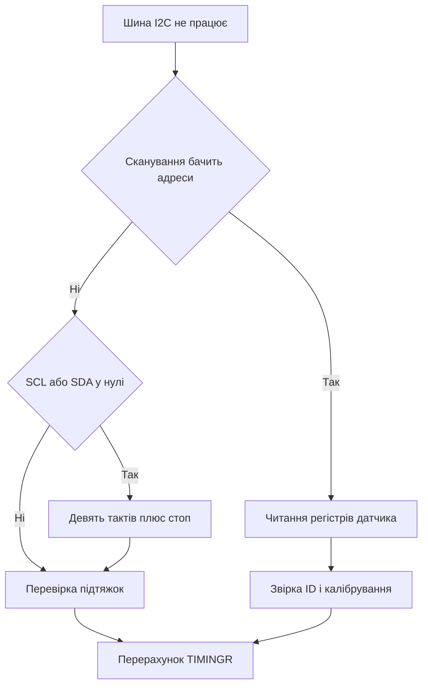

# I2C STM32 - таймінги, зависання і підтяжки

![[assets/img/stm32-i2c-scheme.png|600]]
*Рис. I2C: дві лінії SCL і SDA, підтяжки до живлення, адреси ведених.*

> [!tip] Призначення ноти
> Зібрати практику двопровідної шини: порахувати підтяжки, виставити таймінги, знайти датчик скануванням, пережити зависання шини і читати сенсори без танців.

## 1. Призначення

I2C з’єднує повільні датчики і мікросхеми двома дротами: такти SCL і дані SDA. На одній шині живуть десятки ведених, кожен має адресу. Ведучий починає обмін умовою старт і закінчує умовою стоп.

Шина з відкритим стоком не вміє сама піднімати рівень, тому обидві лінії підтягнуті резисторами до живлення. Будь-який учасник може тягнути лінію вниз, відпустити вгору може тільки резистор.

## 2. Фізика шини і рівні

| Елемент | Значення | Коментар |
| --- | --- | --- |
| Лінії | SCL і SDA | Двонапрямлені, відкритий стік |
| Підтяжки | 2.2 кОм або 4.7 кОм | Менше опору дає крутіші фронти |
| Ємність | Сума доріжок, пінів і корпусів | Головний ворог швидких фронтів |
| Рівні | Низький до 30 відсотків живлення | Високий від 70 відсотків живлення |
| Струм стоку | 3 мА у стандарті | Обмежує мінімальний опір підтяжки |

```text
Шина у простої:
  VDD --- Rp ---+--- SCL --- усі пристрої паралельно
                |
  VDD --- Rp ---+--- SDA --- усі пристрої паралельно
  Активний рівень нуль тягне транзистор, одиницю дає резистор
```

| Режим швидкості | Бітрейт | Допустима ємність |
| --- | --- | --- |
| Стандартний | 100 кГц | До 400 пФ |
| Швидкий | 400 кГц | До 400 пФ |
| Швидкий плюс | 1 МГц | До 550 пФ |
| Високошвидкісний | 3.4 МГц | До 100 пФ |

## 3. Адресація 7 і 10 біт

| Формат | Байт адреси | Діапазон |
| --- | --- | --- |
| 7 біт | 7 біт адреси плюс біт читання або запису | 8 до 119 для користувача |
| 10 біт | Два байти з префіксом | Рідкісні пристрої, мости і мультиплексори |
| Зарезервовані | 0 і 127 | Широкомовні і службові виклики |
| Конфлікт | Два пристрої з однією адресою | Міняти перемичками або розвести шинами |

```text
Кадр запису одного байта:
  СТАРТ -> адреса плюс 0 -> ACK -> байт даних -> ACK -> СТОП
Кадр читання одного байта:
  СТАРТ -> адреса плюс 1 -> ACK -> байт даних -> NACK -> СТОП
```

| Біт | Хто видає | Значення |
| --- | --- | --- |
| ACK | Приймач тягне SDA вниз | Байт прийнято |
| NACK | Приймач відпускає SDA | Кінець читання або помилка |
| СТАРТ | Ведучий опускає SDA при високому SCL | Початок транзакції |
| СТОП | Ведучий піднімає SDA при високому SCL | Кінець транзакції |
| Повторний старт | Ведучий дає старт без стопа | Читання регістра без втрати шини |

## 4. Регістр TIMINGR і калькулятор CubeMX

У сучасних родинах таймінги задає регістр TIMINGR: прескалер, затримки даних і фільтри. CubeMX має калькулятор під конкретну частоту шини периферії.

| Поле TIMINGR | Зміст | На що впливає |
| --- | --- | --- |
| PRESC | Дільник вхідних тактів | Базовий квант усіх затримок |
| SCLL | Тривалість низького рівня SCL | Період тактів |
| SCLH | Тривалість високого рівня SCL | Період тактів |
| SDADEL | Затримка даних після спаду SCL | Утримання SDA від гонок |
| SCLDEL | Затримка старту після фронту | Час встановлення перед стробом |
| DNF | Цифровий фільтр | Ріже короткі голки шумів |

```text
Порядок налаштування:
  Ввести частоту шини у калькулятор CubeMX
  Вибрати 100 кГц або 400 кГц або 1 МГц
  Забрати згенероване значення TIMINGR
  Перевірити осцилографом фронти і рівні
  Додати аналоговий фільтр при шумному живленні
```

| Шина 16 МГц | TIMINGR | Режим |
| --- | --- | --- |
| Стандартний 100 кГц | 0x00503D58 | Перевірочне значення, уточнити калькулятором |
| Швидкий 400 кГц | 0x00300B29 | Перевірочне значення, уточнити калькулятором |
| Швидкий плюс 1 МГц | 0x0010040D | Тільки коротка шина з малими підтяжками |

## 5. Розтягування тактів веденим

| Ситуація | Поведінка |
| --- | --- |
| Ведений не встигає | Тримає SCL низьким після 8 бітів |
| Ведучий чекає | Не генерує наступний такт поки SCL низький |
| АЦП думає | Розтягування на мілісекунди під час перетворення |
| Програмний ведений | Розтягування на час обробки переривання |

```text
Осцилограма розтягування:
  SCL мав піти вгору .... але ведений тримає нуль
  Ведучий чекає ......... пауза без таймауту
  Ведений відпускає ..... SCL росте через резистор
  Обмін продовжується ... наступний біт по плану
```

| Правило | Чому |
| --- | --- |
| Не ставити таймаут коротшим за даташит | Ведений встигає відпустити SCL |
| Не ігнорувати BUSY | Шина зайнята попередньою транзакцією |
| Не рвати стопом посеред розтягування | Ведений лишиться у невизначеному стані |

## 6. ACK, NACK і сканування шини

```c
int i2c_scan(I2C_HandleTypeDef *hi, uint8_t *found, int max_n)
{
    int n = 0;
    for (uint8_t a = 8; a < 120; a++)
    {
        if (HAL_I2C_IsDeviceReady(hi, (uint16_t)(a << 1), 2, 10) == HAL_OK)
        {
            if (n < max_n)
            {
                found[n] = a;
            }
            n++;
        }
    }
    return n;
}
```

| Адреса | Пристрій | Коментар |
| --- | --- | --- |
| 0x76 або 0x77 | BMP280 тиск | Вибір перемичкою SDO |
| 0x40 або 0x41 | INA219 струм | Вибір перемичками A0 і A1 |
| 0x68 або 0x69 | MPU6050 гіроскоп | Вибір рівнем AD0 |
| 0x3C або 0x3D | OLED SSD1306 | Вибір рівнем DC |
| 0x50 до 0x57 | EEPROM 24Cxx | Три біти адреси перемичками |

```c
int i2c_mem_read(I2C_HandleTypeDef *hi, uint8_t dev, uint8_t reg, uint8_t *buf, uint16_t len)
{
    return HAL_I2C_Mem_Read(hi, (uint16_t)(dev << 1), reg, I2C_MEMADD_SIZE_8BIT, buf, len, 100);
}

int i2c_mem_write(I2C_HandleTypeDef *hi, uint8_t dev, uint8_t reg, const uint8_t *buf, uint16_t len)
{
    return HAL_I2C_Mem_Write(hi, (uint16_t)(dev << 1), reg, I2C_MEMADD_SIZE_8BIT, (uint8_t *)buf, len, 100);
}
```

## 7. Режими HAL: опитування, переривання, DMA

| Режим | Виклик | Коли брати |
| --- | --- | --- |
| Блокувальний | HAL_I2C_Master_Transmit, HAL_I2C_Master_Receive | Короткі регістри датчиків |
| Неблокувальний | HAL_I2C_Master_Transmit_IT, HAL_I2C_Master_Receive_IT | Фонове опитування без пауз циклу |
| DMA | HAL_I2C_Master_Transmit_DMA, HAL_I2C_Master_Receive_DMA | Довгі масиви з EEPROM або дисплея |
| Пам’ять | HAL_I2C_Mem_Read, HAL_I2C_Mem_Write | Регістрові пристрої з адресою всередині |

```c
volatile int i2c_done = 0;

void HAL_I2C_MasterRxCpltCallback(I2C_HandleTypeDef *hi)
{
    (void)hi;
    i2c_done = 1;
}

int bmp280_start_read(I2C_HandleTypeDef *hi)
{
    static uint8_t raw[6];
    i2c_done = 0;
    int rc = HAL_I2C_Mem_Read_DMA(hi, (uint16_t)(0x76 << 1), 0xF7, I2C_MEMADD_SIZE_8BIT, raw, 6);
    return rc;
}
```

## 8. Зависання шини і відновлення дев’ятьма тактами

| Симптом | Причина |
| --- | --- |
| SCL у нулі постійно | Ведений завис посеред розтягування |
| SDA у нулі постійно | Ведений чекає 9 такт і тримає ACK |
| BUSY не скидається | Периферія бачить незавершений старт |
| NACK на відому адресу | Пристрій не вийшов зі скидання |

```text
Відновлення шини:
  Перемкнути SCL і SDA у GPIO з відкритим стоком
  Тримати SDA відпущеною вгору через підтяжку
  Видати 9 тактів SCL з паузою 5 мкс
  Видати СТОП: SDA вниз при високому SCL потім вгору
  Повернути піни в альтернативну функцію I2C
```

```c
void i2c_bus_recover(GPIO_TypeDef *scl_p, uint16_t scl_n, GPIO_TypeDef *sda_p, uint16_t sda_n)
{
    for (int i = 0; i < 9; i++)
    {
        scl_p->BSRR = (uint32_t)scl_n << 16;
        for (volatile int d = 0; d < 200; d++) { }
        scl_p->BSRR = scl_n;
        for (volatile int d = 0; d < 200; d++) { }
    }
    sda_p->BSRR = (uint32_t)sda_n << 16;
    for (volatile int d = 0; d < 200; d++) { }
    scl_p->BSRR = scl_n;
    for (volatile int d = 0; d < 200; d++) { }
    sda_p->BSRR = sda_n;
}
```

| Крок | Дія | Навіщо |
| --- | --- | --- |
| 1 | Дев’ять тактів SCL | Ведений віддає байт і відпускає SDA |
| 2 | Умова стоп | Скидає автомати усіх слухачів |
| 3 | Програмне скидання I2C | Чистить прапор BUSY периферії |
| 4 | Повторне сканування | Перевірка що пристрої відповідають |

## 9. Розрахунок підтяжок

| Параметр | Формула | Приклад |
| --- | --- | --- |
| Мінімум опору | Живлення поділити на 3 мА | 3.3 В дає 1.1 кОм |
| Максимум опору | Час фронту поділити на 0.8473 і ємність | 300 нс і 100 пФ дають близько 3.5 кОм |
| Стандарт | Між мінімумом і максимумом | 2.2 кОм або 4.7 кОм |
| Швидкий плюс | Жорсткіша межа фронту | 1 кОм або 2.2 кОм на короткій шині |

```text
Вибір на пальцях:
  Два датчики на платі ...... 4.7 кОм, фронти круті
  Півметра шлейфа ........... 2.2 кОм, ємність помітно гальмує
  Метр і більше ............. 1.5 кОм і швидкість 100 кГц
  Десять пристроїв .......... рахувати сумарну ємність пінів
```

| Помилка підтяжки | Симптом |
| --- | --- |
| Опір завеликий | Пологі фронти, NACK на швидкості |
| Опір замалий | Перегрів стоку, низький нуль зависокий |
| Підтяжка тільки всередині чипа | Слабкий струм, довга шина не працює |
| Дві пари підтяжок паралельно | Сумарний опір удвічі менший, перевірити струм |

## 10. Датчики BMP280 і INA219

| Крок BMP280 | Дія |
| --- | --- |
| 1 | Прочитати ID за адресою 0xD0, чекати 0x58 |
| 2 | Прочитати калібрування з 0x88 довжиною 24 байти |
| 3 | Записати конфігурацію у 0xF4 і 0xF5 |
| 4 | Читати 6 байт з 0xF7 потім рахувати компенсацію |

```c
int bmp280_id(I2C_HandleTypeDef *hi, uint8_t *id)
{
    return HAL_I2C_Mem_Read(hi, (uint16_t)(0x76 << 1), 0xD0, I2C_MEMADD_SIZE_8BIT, id, 1, 100);
}

int ina219_bus_mv(I2C_HandleTypeDef *hi, uint8_t dev, int *mv)
{
    uint8_t raw[2];
    int rc = HAL_I2C_Mem_Read(hi, (uint16_t)(dev << 1), 0x02, I2C_MEMADD_SIZE_8BIT, raw, 2, 100);
    if (rc != HAL_OK)
    {
        return rc;
    }
    uint16_t v = (uint16_t)((raw[0] << 8) | raw[1]);
    *mv = (int)((v >> 3) * 4);
    return HAL_OK;
}
```

| Регістр INA219 | Адреса | Призначення |
| --- | --- | --- |
| Конфігурація | 0x00 | Діапазони і усереднення |
| Шунт | 0x01 | Напруга на шунті |
| Шина | 0x02 | Напруга шини живлення |
| Потужність | 0x03 | Добуток струму і напруги |
| Струм | 0x04 | Результат після калібрування |
| Калібрування | 0x05 | Коефіцієнт під конкретний шунт |

## 11. П’ять вольт і узгодження рівнів

| Ситуація | Рішення |
| --- | --- |
| Датчик на 5 В без толерантності | Двонапрямлений транслятор на MOSFET |
| Пін STM32 толерантний до 5 В | Можна безпосередньо з підтяжкою до 3.3 В |
| Дві шини різних вольтажів | Транслятор з двома живленнями посередині |
| Довга лінія у шумі | Екранований шлейф і менші підтяжки |

```text
Транслятор на транзисторі:
  Затвор на 3.3 В ...... обидва боки бачать свій високий рівень
  Витік на бік 3.3 В ... стік на бік 5 В
  Два канали ........... окремо SCL і SDA
  PCA9306 .............. готовий корпус замість розсипухи
```

## 12. SMBus і multi-master

| Властивість SMBus | Відмінність від I2C |
| --- | --- |
| Таймаут 35 мс | Завислий ведений скидається |
| Мінімальна швидкість 10 кГц | Постійний контроль зависання |
| Контрольна сума PEC | Байт CRC у кінці пакета |
| Сигнал ALERT | Ведений просить обслуговування |

| Арбітраж двох ведучих | Поведінка |
| --- | --- |
| Обидва дали старт | Той хто першим відпустив SDA програє |
| Програш без помилки | Програлий стає веденим і слухає |
| Однакові адреси | Арбітраж триває до першого різного біта |
| Тактова синхронізація | Спільний SCL через монтажне АБО |

```text
Другий ведучий на шині:
  Перевірити BUSY перед стартом
  Програш арбітражу обробити повтором пізніше
  Не тримати SCL силою проти іншого ведучого
```

## 13. Швидкий плюс 1 МГц

| Умова | Значення |
| --- | --- |
| Ємність шини | Менше 550 пФ |
| Підтяжки | 1 кОм або 2.2 кОм |
| Фільтри | Цифровий фільтр мінімальний |
| Драйвери | Круті фронти без дзвону |

```text
Перехід з 400 кГц на 1 МГц:
  Заміряти ємність або оцінити довжину шлейфа
  Зменшити підтяжки і перевірити струм стоку
  Перерахувати TIMINGR у CubeMX
  Прогнати сканування і довге читання без NACK
```

## Mermaid: діагностика шини I2C



## Типові помилки

| # | Помилка | Чому погано | Як правильно |
| --- | --- | --- | --- |
| 1 | Немає зовнішніх підтяжок | Лінії висять у повітрі, старт не видно | Поставити 2.2 кОм або 4.7 кОм до живлення |
| 2 | TIMINGR з чужого прикладу | Період не збігається з частотою шини | Порахувати у CubeMX під свою частоту |
| 3 | Ігнорують NACK після адреси | Код чекає дані від мовчазного пристрою | Перевіряти HAL_OK і робити повтор або скидання |
| 4 | Запис через межу сторінки EEPROM | Байти загортаються на початок сторінки | Різати запис по межах сторінок даташиту |
| 5 | Розтягування приймають за зависання | Зайве скидання рве робочу транзакцію | Дочекатися відпускання SCL за даташитом |
| 6 | 5 В на нетолерантний пін | Пробій входу і деградація кристала | Перевірити колонку FT і поставити транслятор |
| 7 | Два набори підтяжок паралельно | Струм стоку перевищено, нуль зависокий | Залишити одну пару розрахованого номіналу |

## Офіційні джерела

- [I2C manual у RM0444 для STM32G0 (ST)](https://www.st.com/resource/en/reference_manual/rm0444-stm32g0x1-advanced-armbased-32bit-mcus-stmicroelectronics.pdf) - TIMINGR, фільтри, прапори і скидання.
- [AN2824 I2C optimized examples (ST)](https://www.st.com/resource/en/application_note/an2824-stm32f10xxx-ic-optimized-examples-stmicroelectronics.pdf) - приклади налаштувань периферії і типових зв’язок.
- [UM10204 I2C bus specification (NXP)](https://www.nxp.com/docs/en/user-guide/UM10204.pdf) - рівні, ємність, арбітраж і швидкісні режими.

## Див. також

- [[Home]]
- [[04-Shini/01-UART|послідовний порт UART]]
- [[04-Shini/02-SPI|шина SPI]]
- [[09-Proshivka/01-CubeIDE-CubeMX|налаштування CubeMX]]
- [[09-Proshivka/02-HAL-LL|шари HAL і LL]]
- [[03-GPIO/01-GPIO-rezhimi|режими GPIO]]
- [[09-Proshivka/03-ST-Link-Proshivka|прошивка через ST-Link]]
