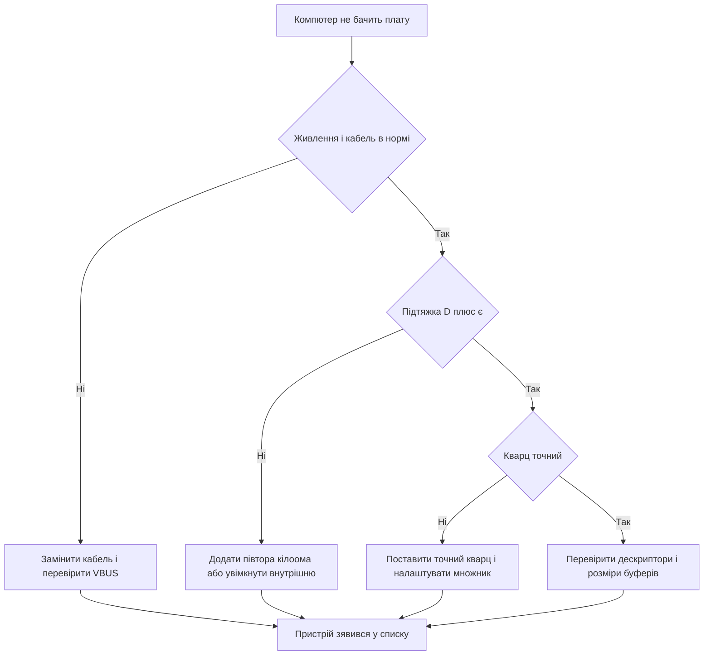

# USB STM32 - класи, дескриптори і DFU

![[assets/img/stm32-usb-scheme.png|600]]
*Рис. Пристрій USB: розєм, захист, підтяжка, контролер і класи в прошивці.*

> [!tip] Призначення ноти
> Пояснити USB як систему: фізика лінії, дескриптори, ендпоінти, різниця памяті на F1 і F4, класи CDC, HID, MSC, DFU і прошивка через BOOT0.

## 1. Призначення

Порт USB на STM32 перетворює мікроконтролер на зрозумілий компютеру пристрій: віртуальний COM-порт, клавіатуру, флешку або завантажувач прошивки. Компютер виступає хостом, мікроконтролер відповідає як пристрій, тому ініціатива опитування завжди на боці хоста.

Молодші чипи дають швидкість Full Speed дванадцять мегабіт без зовнішніх деталей, старші додають High Speed чотириста вісімдесят мегабіт через зовнішню фізику. Middleware USBD в CubeMX закриває протокольну рутину, розробнику лишаються дескриптори, ендпоінти і прикладна логіка.

Нота веде від розєму до класу: лінія і живлення, дескриптори, ендпоінти і пам'ять, класи пристроїв, режим DFU, типові схеми і налагодження.

## 2. Full Speed проти High Speed

| Параметр | Full Speed пристрій | High Speed пристрій |
| --- | --- | --- |
| Швидкість | Дванадцять мегабіт | Чотириста вісімдесят мегабіт |
| Фізика | Вбудована в кристал | Зовнішня мікросхема фізики через ULPI |
| Чипи приклад | F072, F103 з USB, G4, L4 | F4 з OTG HS, H7, U5 з HS |
| Розєм | USB-C або micro-B пристроєм | USB-C з перемиканням ролей або micro-AB для OTG |
| Кварц | Точний, допуск краще за чверть відсотка | Точний, плюс чисте живлення фізики |
| Застосування | Віртуальний порт, HID, налагодження | Аудіо, камера, швидка флешка |
| Складність | Мінімум деталей | Окреме живлення і трасування швидкої шини |

```text
Вибір швидкості простий:
  Термінал, датчики, HID ......... Full Speed, вбудована фізика
  Аудіо потік, відео, диск ........ High Speed, зовнішня фізика
  Живлення від батареї ............ Full Speed з suspend
  Невідомо що буде завтра ......... Чип з обома контролерами
```

Вбудована фізика тримає пару резисторів і конденсаторів навколо розєму. Зовнішня фізика вимагає уважного компонування: короткі доріжки ULPI однакової довжини, суцільна земля, окремий стабілізатор. Економія на живленні фізики перетворюється на випадкові вимкення на високій швидкості.

## 3. Лінія: підтяжка, живлення, захист

| Елемент | Значення | Пояснення |
| --- | --- | --- |
| Підтяжка на D плюс | Півтора кілоома до трьох вольтів | Сигнал хосту про Full Speed пристрій |
| Детект живлення | Дільник з VBUS на вхід sensing | Контролер розуміє, що кабель вставлено |
| ESD-захист | Спеціальна збірка на D плюс і D мінус | Гасить статику з пальців і розєму |
| Спільна земля | Товста коротка доріжка | Без неї пакети бються навіть на столі |
| Конденсатори | Кераміка біля розєму і біля чипа | Згладжують кидки при підключенні |
| Довжина кабелю | До пяти метрів на Full Speed | Довший кабель просить активний подовжувач |
| Живлення шини | Пять вольт, до пятисот міліампер | Потужне навантаження живлять окремо |

```text
Мінімальна обвязка пристрою Full Speed:

  USB РОЗЄМ                    STM32
  VBUS ----+---- дільник -----> PA9 sensing
            |
  D+ -------+----+----------------> USB_DP
            |    |
           1.5к ESD-збірка
            |    |
  D- ------------+---------------> USB_DM
            |
  GND -------+----+----------------> GND

  Підтяжка 1.5 кОм піднімає D+ і каже хосту:
  я пристрій Full Speed, опитуй мене.
```

Помилка класична: підтяжку вішають на пять вольт безпосередньо і перевищують допуск входу. Правильно: підтяжка до трьох вольтів або вбудована керована підтяжка кристала, якою керує прошивка. Керована підтяжка дозволяє робити програмне перепідключення для повторного переліку без висмикування кабелю.

## 4. Дескриптори: паспорт пристрою

Хост нічого не знає про пристрій, доки не прочитає дескриптори. Це таблиці в памяті мікроконтролера, які описують хто ти, скільки інтерфейсів маєш і куди слати дані. Одна помилка в довжині дескриптора зупиняє перелік.

| Дескриптор | Що описує | Типовий вміст |
| --- | --- | --- |
| Пристрою | Весь виріб | Клас, виробник, продукт, серійний номер |
| Конфігурації | Режим роботи | Кількість інтерфейсів, живлення від шини |
| Інтерфейсу | Функція | Клас CDC, HID, MSC, аудіо |
| Ендпоінта | Канал обміну | Номер, напрям, тип, розмір пакета |
| Рядка | Текст для людини | Назва виробника і продукту |
| HID-звіту | Формат звітів | Тільки для класу HID, опис кнопок і осей |
| DFU | Завантажувач | Ознака можливості прошивки через USB |

```text
Ієрархія дескрипторів зверху вниз:

  ПРИСТРІЙ (один)
   └─ КОНФІГУРАЦІЯ (одна активна)
       ├─ ІНТЕРФЕЙС керування (CDC control)
       │    └─ ЕНДПОІНТ вхідний переривань
       ├─ ІНТЕРФЕЙС даних (CDC data)
       │    ├─ ЕНДПОІНТ вихідний bulk
       │    └─ ЕНДПОІНТ вхідний bulk
       └─ ІНТЕРФЕЙС HID (кнопки)
            └─ ЕНДПОІНТ вхідний переривань
```

Ідентифікатори виробника і продукту беруть з пулу тестових або купують офіційні. Серійний номер роблять з унікального коду кристала, тоді кожна плата отримує свій номер і хост не плутає два однакові пристрої.

## 5. Класи пристроїв

| Клас | Що бачить компютер | Застосування |
| --- | --- | --- |
| CDC | Віртуальний COM-порт | Термінал, логи, команди, прошивка через термінал |
| HID | Клавіатура, миша, джойстик | Кнопки, енкодери, педалі, драйвера не потрібні |
| MSC | Знімний диск | Флешка на карті памяті, конфіги текстовими файлами |
| DFU | Завантажувач прошивки | Прошивка через USB без програматора |
| Аудіо | Мікрофон або динамік | Гарнітура, вимірювач шуму, синтезатор |
| Складений | Порт плюс HID разом | Термінал і кнопки в одному корпусі |

Складений пристрій зручний для стенда: один кабель дає термінал для команд і HID-кнопки для керування. Ціну платять складнішими дескрипторами, тому починають з одного класу, а другий додають після стабільної роботи першого.

## 6. Ендпоінти і пам'ять: F1 проти F4

| Параметр | Серія F1 | Серії F4 і новіші |
| --- | --- | --- |
| Пам'ять пакетів | Окрема PMA-пам'ять, пів кілобайта | FIFO в оперативній памяті, гнучкий поділ |
| Розподіл | Розміри ендпоінтів рахують вручну | Стек сам ділить FIFO між ендпоінтами |
| Типова помилка | Перетин буферів, мовчазна тиша | Нестача місця під великий bulk-пакет |
| Ендпоінт нуль | Керування, перелік, обов'язковий | Так само, керування завжди нульовий |
| Bulk | Великі дані без гарантії часу | Термінал, флешка, прошивка |
| Переривань | Малі звіти вчасно | HID-звіти, стан лінії CDC |
| Ізохронний | Обмежений, для звуку краще новіші | Аудіо потік з гарантованою швидкістю |

```text
Розрахунок PMA на F1 роблять на папері:

  EP0 керування .... 64 байти прийом + 64 байти передача
  EP1 bulk CDC ..... 64 + 64 байти
  EP2 переривань ... 16 байти вхідні
  РАЗОМ ............ влізти у 512 байтів PMA!

  Помилка: два bulk по 256 байтів на F1.
  Наслідок: буфери наклались, перелік падає.
  Лікування: bulk по 64 байти, цього досить для CDC.
```

Правило памяті: спочатку нульовий ендпоінт, потім великі bulk, залишок під переривання. Кожну зміну розміру перевіряють повторним переліком на компютері. Диспетчер пристроїв з жовтим знаком майже завжди означає помилку в дескрипторах або перетин буферів.

## 7. Middleware USBD в CubeMX

| Крок | Дія |
| --- | --- |
| Один | Увімкнути USB-пристрій і middleware USBD |
| Два | Вибрати клас: CDC, HID, MSC або DFU |
| Три | Перевірити тактування: точність і живлення фізики |
| Чотири | Задати рядки виробника, продукту, серійного номера |
| Пять | Згенерувати код і знайти колбеки прийому і передачі |
| Шість | Додати прикладну логіку поверх згенерованого каркаса |

Згенерований код ділять на системний і прикладний: системні файли не чіпають руками, свою логіку пишуть у відведених місцях. Оновлення CubeMX перезаписує системні файли, тому правки в них губляться. Свій код тримають окремо і викликають зі згенерованих колбеків.

## 8. Приклад CDC: друк через віртуальний порт

```c
extern USBD_HandleTypeDef hUsbDeviceFS;
uint8_t cdcBuf[64];

void cdc_print(const char *text)
{
  uint32_t len = 0;
  while (text[len] != 0 && len < sizeof(cdcBuf))
  {
    cdcBuf[len] = (uint8_t)text[len];
    len++;
  }
  CDC_Transmit_FS(cdcBuf, (uint16_t)len);
}

void cdc_echo_received(uint8_t *data, uint32_t len)
{
  CDC_Transmit_FS(data, (uint16_t)len);
}
```

| Прийом | Пояснення |
| --- | --- |
| Не блокуючий виклик | Передача стає в чергу, керування повертається одразу |
| Буфер живий до кінця | Не можна перезаписувати масив, доки стек його шле |
| Великий текст частинами | Ріжуть на пакети по шістдесят чотири байти |
| Прийом через колбек | Нові байти приходять у зворотний виклик, там тільки копія |

```c
void cdc_periodic_log(void)
{
  static uint32_t lastTick = 0;
  if (HAL_GetTick() - lastTick > 1000)
  {
    lastTick = HAL_GetTick();
    cdc_print("heartbeat: плата жива\r\n");
  }
}
```

Періодичний друк раз на секунду перевіряє весь тракт: стек, кабель, драйвер віртуального порту. Якщо heartbeat йде, а команди не приймаються, проблема в розборі прийому, а не в USB.

## 9. DFU-прошивка через BOOT0

| Крок | Дія |
| --- | --- |
| Один | Виставити BOOT0 в одиницю, натиснути скидання |
| Два | Підключити USB, компютер бачить пристрій DFU |
| Три | Відкрити CubeProgrammer і вибрати файл прошивки |
| Чотири | Записати, перевірити, повернути BOOT0 в нуль |
| Пять | Натиснути скидання, плата стартує з нової прошивки |

Заводський завантажувач в системній памяті завжди вміє DFU на чипах з USB. Свій DFU в прикладній прошивці дозволяє оновлення без перемичок: пристрій сам перезапускається в режим завантажувача за командою. Обидва варіанти вимагають стабільного живлення, обрив посеред запису лікується тільки повторною прошивкою.

## 10. OTG на F105, F107 і F4

| Режим | Пояснення |
| --- | --- |
| Пристрій | Мікроконтролер відповідає хосту, типовий випадок |
| Хост | Мікроконтролер опитує флешку або клавіатуру сам |
| OTG | Роль визначає кабель і переговори протоколом |
| Живлення хоста | Пять вольт на VBUS видає плата, потрібен ключ живлення |
| Розєм | Micro-AB або USB-C з визначенням орієнтації |

Хост на мікроконтролері беруть для автономних задач: писати логи на флешку без компютера, читати клавіатуру безпосередньо. Стек хоста важчий за стек пристрою, тому починають з готового прикладу MSC-хоста і додають свою логіку поверх.

## 11. Mermaid: чому не перелічується



## 12. Компонування плати

Розєм ставлять скраю плати, ESD-збірку одразу за ним, доріжки D плюс і D мінус ведуть парою однакової довжини без гострих кутів. Під парою тримають суцільну землю, поруч не ведуть швидкі цифрові сигнали. Керамічний конденсатор біля контролера і ферит на живленні зменшують дзвін, який хост сприймає як помилки пакетів.

## Типові помилки

| # | Помилка | Чому погано | Як правильно |
| --- | --- | --- | --- |
| 1 | PMA-буфери наклались на F1 | Перелік падає без зрозумілої причини | Порахувати кожен ендпоінт на папері і влізти у пів кілобайта |
| 2 | Підтяжка на пять вольт | Перевищення допуску входу, деградація | Підтяжка до трьох вольтів або внутрішня керована |
| 3 | Немає детекту живлення | Пристрій не бачить підключення кабелю | Дільник з VBUS на вхід sensing |
| 4 | Неточний внутрішній генератор | Хост рве з'єднання на довгих пакетах | Точний кварц або підстройка за кадрами |
| 5 | Блокуючий друк у перериванні | Зависання і пропущені пакети | Копія в буфер, передача у фоні |
| 6 | Довгий кабель з ринку | Падіння швидкості і вимкення | Короткий якісний кабель до пяти метрів |
| 7 | Немає ESD-захисту | Перша ж статика вибиває порт | Збірка захисту одразу за розємом |

## Офіційні джерела

- [USB on STM32 overview (ST)](https://www.st.com/en/interfaces-and-transceivers/usb.html) - контролери, фізика, класи.
- [AN4879 USB hardware design (ST)](https://www.st.com/resource/en/application_note/an4879-usb-hardware-and-pcb-guidelines-using-stm32-mcus-stmicroelectronics.pdf) - розєми, захист, трасування.
- [STM32Cube USB device library (ST)](https://www.st.com/en/embedded-software/stsw-stm32121.html) - middleware USBD і приклади класів.

## Див. також

- [[Home]]
- [[09-Proshivka/01-CubeIDE-CubeMX|налаштування CubeMX]]
- [[09-Proshivka/02-HAL-LL|шари HAL і LL]]
- [[09-Proshivka/03-ST-Link-Proshivka|прошивка через ST-Link]]
- [[03-GPIO/01-GPIO-rezhimi|режими GPIO]]
- [[04-Shini/04-FDCAN|шина FDCAN]]
- [[04-Shini/06-SDMMC-QUADSPI|карти і зовнішня флеш]]
