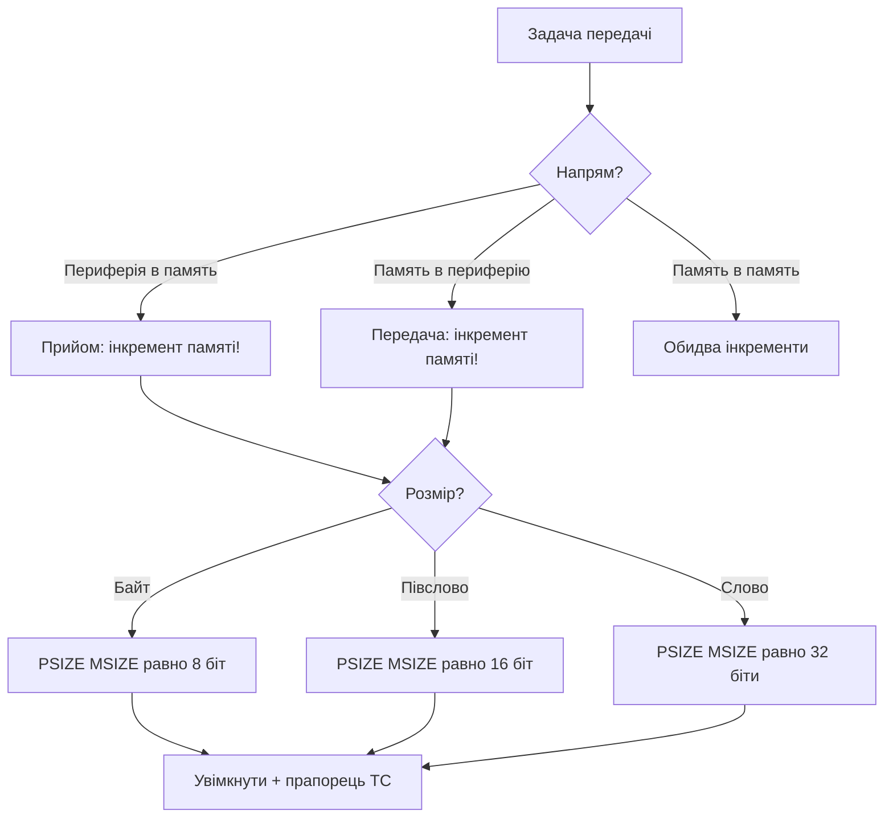

# DMA STM32 - режими, потоки і пастки

![[assets/img/stm32-dma-deepdive-scheme.png|600]]
*Рис. Режими DMA: куди дані течуть без участі ядра.*

> [!tip] Призначення ноти
> Навчити налаштовувати DMA так, щоб периферія обмінювалась даними без ядра: потоки, режими, FIFO і типові пастки.

## 1. Призначення

DMA (прямий доступ до памяті) копіює дані між периферією і памяттю поки ядро рахує корисне. Без DMA кожен байт UART чи семпл АЦП вимагав би переривання. З DMA ядро отримує готовий буфер і один прапорець. Ціна питання: правильна конфігурація безпосередньо, розмірів, інкрементів і вирівнювання.

## Режими роботи контролера

| Режим | Поведінка | Коли брати |
| --- | --- | --- |
| Normal | Зупиняється після N передач | Разові пакети, вивід кадру на дисплей |
| Circular | Починає з початку автоматично | Потоки: АЦП-скан, прийом UART, звук |
| Double buffer | Два буфери по черзі | Безрозривні потоки: поки один читаєш, другий пишеться |
| Peripheral-to-peripheral | Пам'ять не чіпається | Міст між периферіями, рідкісний кейс |

```text
Логіка вибору:
  один пакет іноді ............ Normal
  потік без пауз ............... Circular
  потік + обробка без гонок .... Double buffer
  міст SPI-в-UART ............... Peripheral-to-peripheral
```

## Потоки, канали і арбітраж

| Поняття | Суть | Практика |
| --- | --- | --- |
| Потік (stream) | Незалежний канал копіювання | Один потік - одна задача |
| Канал (channel) | Привязка потоку до периферії | Таблиця в Reference Manual! |
| Пріоритет | Хто перший при конфлікті | Аудіо вище за лог, критичне вище за все |
| Арбітраж | Round-robin всередині рівня | Два потоки одного рівня ділять шину чесно |

> Канал вибирається за таблицею DMA-запитів конкретного чипа. Помилка в номері каналу - тиша без жодної помилки компіляції.

## Mermaid: налаштування передачі



## Circular з половиною буфера

```c
// Прийом UART в кільцевий буфер, обробка половинами:
#define BUF_SZ 256
uint8_t rx_buf[BUF_SZ];
HAL_UART_Receive_DMA(&huart1, rx_buf, BUF_SZ);

void HAL_UART_RxHalfCpltCallback(UART_HandleTypeDef *huart)
{
  process_half(rx_buf, BUF_SZ / 2);   // перша половина готова
}

void HAL_UART_RxCpltCallback(UART_HandleTypeDef *huart)
{
  process_half(rx_buf + BUF_SZ / 2, BUF_SZ / 2);  // друга готова
}
```

| Правило | Пояснення |
| --- | --- |
| Обробка коротша за половину періоду | Інакше друга половина затре першу |
| Прапорці Half і Full обидва | Інакше пропустиш половину даних |
| Буфер вирівняний | Невірне вирівнювання ламає burst |

## FIFO і пакетні передачі

| Параметр | Варіанти | Практика |
| --- | --- | --- |
| FIFO | Вимкнено або 1/4, 1/2, 3/4, повний поріг | Вмикати для burst, інакше прямий режим |
| Burst | Single або INCR4/8/16 | Burst швидший, але вимагає вирівнювання |
| Поріг FIFO | Коли скидати в шину | Чим більший burst, тим вищий поріг |

```text
Прямий режим: кожен запит периферії одразу йде в шину.
Режим FIFO: накопичує до порога, потім летить пакетом.
Правило: burst довжиною N вимагає адресу, кратну N словам.
```

## Звязка з таймером і АЦП

```c
// АЦП сканує канали по тригеру таймера, DMA збирає:
HAL_ADC_Start_DMA(&hadc1, (uint32_t*)adc_buf, CH_NUM);
HAL_TIM_Base_Start(&htim2);   // тригер для АЦП
```

| Ланка | Роль |
| --- | --- |
| Таймер | Задає точний період вимірів |
| АЦП | Конвертує по тригеру без ядра |
| DMA | Складає результати в пам'ять |
| Ядро | Прокидається по прапорцю готовності |

## Кеш на H7: головна пастка DMA

| Тема | Практика |
| --- | --- |
| D-Cache | Ядро бачить кеш, DMA бачить пам'ять - розсинхронізація! |
| Перед передачею | Очистити кеш буфера (clean), щоб DMA взяло свіже |
| Після прийому | Інвалідувати кеш (invalidate), щоб ядро прочитало нове |
| Вирівнювання | Буфер кратний рядку кешу 32 байти |

```c
// Приклад для буфера прийому на H7:
SCB_InvalidateDCache_by_Addr((uint32_t*)rx_buf, sizeof(rx_buf));
HAL_UART_Receive_DMA(&huart1, rx_buf, sizeof(rx_buf));
```

## Типові помилки

| # | Помилка | Чому погано | Як правильно |
| --- | --- | --- | --- |
| 1 | Не той канал потоку | Тиша без помилок | Таблиця DMA-запитів з Reference Manual |
| 2 | Забутий інкремент памяті | Пише в одну комірку | MINC увімкнути для буферів |
| 3 | Невірний розмір даних | Половина байтів або сміття | PSIZE і MSIZE під ширину регістра |
| 4 | Обробка довша за півбуфера | Дані затираються | Коротка обробка або double buffer |
| 5 | DMA + D-Cache без чистки | Старі дані туди-сюди | Clean перед TX, invalidate після RX |
| 6 | Два потоки на один канал | Конфлікт запитів | Один запит - один потік |
| 7 | Прапорець TC не скинуто | Повторне спрацьовування | Скидати прапорець в обробнику |

## Офіційні джерела

- [AN4031 Using DMA controller (ST)](https://www.st.com/resource/en/application_note/an4031.pdf) - режими, FIFO, burst.
- [AN4666 DMA tutorial (ST)](https://www.st.com/resource/en/application_note/an4666.pdf) - приклади налаштування.

## Див. також

- [[Home]]
- [[04-Shini/01-UART|послідовний порт]]
- [[04-Shini/02-SPI|шина обміну]]
- [[06-Analog/01-ADC|вимірювання сигналу]]
- [[07-Timeri-Son/01-GPTIM-ADTIM|таймери і ШІМ]]
- [[09-Proshivka/02-HAL-LL|шари коду]]
