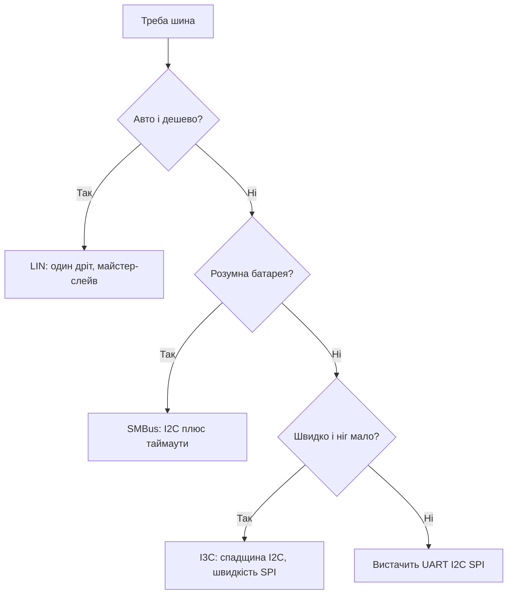

# LIN, SMBus і I3C - другий рівень шин

![[assets/img/stm32-lin-smbus-i3c-scheme.png|600]]
*Рис. Коли звичайних шин мало: хто для чого.*

> [!tip] Призначення ноти
> Навчити вибирати нішову шину: LIN для авто-дешево, SMBus для батарей, I3C для швидкості.

## 1. Призначення

UART, I2C і SPI закривають девяносто відсотків задач. Решта - це LIN (дешеві авто-вузли), SMBus (розумні батареї) і I3C (швидкі датчики зі спадщиною I2C). Кожна має свою пастку, через яку її плутають зі «звичайною» шиною.

## LIN поверх UART

| Тема | Практика |
| --- | --- |
| Фізика | Один дріт + земля, трансивер TJA1021 |
| Break | Довгий нуль 13+ біт - початок кадру! |
| Швидкість | До 20 кбіт, вистачає для кнопок і клімату |
| Майстер-слейв | Майстер шле заголовок, слейв відповідає |

```c
// Break засобами UART: шлемо нуль на низькій швидкості:
HAL_LIN_SendBreak(&huart1);   // апаратний break, де підтримується
```

## Mermaid: вибір нішової шини



## SMBus: I2C з характером

| Відмінність | Суть |
| --- | --- |
| Таймаути | Завислий слейв скидається за часом! |
| PEC-байт | CRC кожного пакета |
| Alert-лінія | Слейв сам кличе майстра |
| Рівні | Суворіші пороги, ніж у звичайного I2C |

| Тема | Практика |
| --- | --- |
| Периферія STM32 | SMBus-режим вмикається окремо! |
| Батарейні чипи | BQ-пакети читати за специфікацією SBS |
| Змішування | Звичайний I2C-девайс на SMBus-шині - обережно |

## I3C: спадкоємець I2C

| Тема | Практика |
| --- | --- |
| Швидкість | Мегагерци замість сотень кілогерців |
| Сумісність | Старі I2C-девайси працюють на шині |
| In-band переривання | Слейв сигналізує без зайвих пінів |
| Динамічні адреси | Майстер роздає адреси сам |

```text
Коли брати I3C:
  швидкий IMU з потоком даних;
  мало ніг, багато датчиків;
  чип підтримує (нові H5 і U5!).
Коли не брати:
  всі датчики старі I2C — виграшу нуль.
```

## Порівняльна таблиця

| Шина | Дроти | Швидкість | Майстер | Для чого |
| --- | --- | --- | --- | --- |
| LIN | 1 + GND | До 20 кбіт | Один | Авто-кнопки, клімат |
| SMBus | 2 | До 100 кГц | Один + alert | Батареї, моніторинг |
| I3C | 2 | До МГц | Один | Швидкі датчики |
| CAN | 2 диф. | До 8 Мбіт | Всі рівні | Авто-сила, промисловість |

## Типові помилки

| # | Помилка | Чому погано | Як правильно |
| --- | --- | --- | --- |
| 1 | LIN без трансивера | Рівні не ті, далекобійності немає | TJA1021 або аналог |
| 2 | Break звичайним байтом | Слейви не бачать старт | Апаратний break 13+ біт! |
| 3 | SMBus як звичайний I2C | Таймаути спрацьовують | Увімкнути SMBus-режим |
| 4 | PEC ігнорується | Биті пакети батареї | Перевіряти CRC завжди |
| 5 | I3C зі старими девайсами | Очікування швидкості | Виграш тільки з I3C-слейвами |
| 6 | Alert нікуди не підключено | Опитування в циклі | Вивести на EXTI! |
| 7 | Одна шина на все | Конфлікт швидкостей | Швидке і повільне окремо |

## Офіційні джерела

- [LIN standards (LIN Consortium)](https://lin-cia.org/standards/) - кадри, break, таймінги.
- [SMBus Specification (SBS Forum)](https://smbus.org/specs/) - таймаути, PEC, alert.
- [I3C Basic Specification (MIPI)](https://www.mipi.org/specifications/i3c-sensor-specification) - режими, адреси.
- [TJA1021 transceiver search (findchips)](https://findchips.com/search/TJA1021) - даташити і наявність.

## LIN-кадр по байтах

| Поле | Зміст |
| --- | --- |
| Break | 13+ нулів - увага всім! |
| Sync | Байт синхронізації швидкості |
| ID | Адреса слейва + контроль |
| Дані | 2-8 байт корисного |
| CRC | Класична або розширена |

```text
Ритм шини:
  майстер шле заголовок кожні N мілісекунд;
  слейв відповідає тільки на свій ID;
  тиша між кадрами — норма, не баг.
```

## PMBus: керування живленням

| Тема | Практика |
| --- | --- |
| База | SMBus з командами живлення |
| Vout і Iout | Читання напруги і струму перетворювача |
| Команди | Увімкнення, ліміти, аварії |
| Коли | Цифрові БЖ з моніторингом |

## Кейс: розумна батарея по SMBus

| Крок | Дія |
| --- | --- |
| 1 | Знайти SBS-чип батареї на шині скануванням |
| 2 | Прочитати ємність, струм, температуру |
| 3 | Підписатись на alert для аварій |
| 4 | Перевіряти PEC кожного пакета! |

```c
// Читання ємності батареї (SBS-команда):
HAL_SMBUS_Master_Receive(&hsmbus1, BAT_ADDR, buf, 2, 100);
// buf — відсотки, але тільки з коректним PEC!
```

## Див. також

- [[Home]]
- [[04-Shini/01-UART|послідовний порт]]
- [[04-Shini/03-I2C|шина обміну]]
- [[04-Shini/04-FDCAN|шина для авто]]
- [[02-Zhivlennya/02-Batareyne-zhivlennya|батарейне живлення]]
