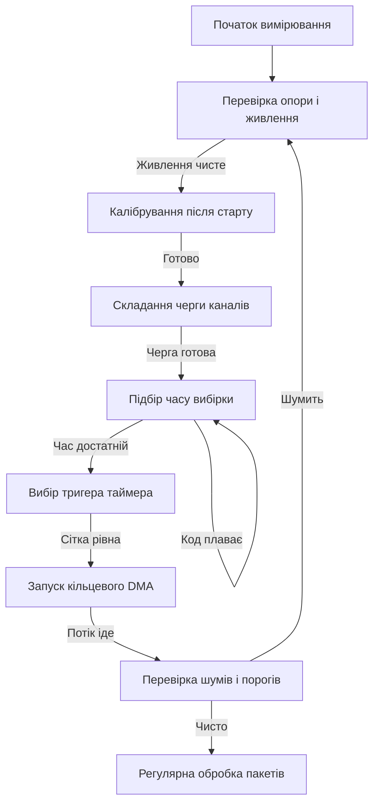

# АЦП STM32 - канали, калібрування і DMA

![[assets/img/stm32-adc-scheme.png|600]]
*Рис. Схема АЦП: джерело сигналу, час вибірки, канали, тригер, DMA і опора.*

> [!tip] Призначення ноти
> Дати повну картину вимірювання через вбудований перетворювач: як вибрати час вибірки під опір джерела, як скласти чергу каналів, коли робити калібрування, як запустити неперервний збір через DMA і як не зіпсувати точність шумом живлення.
> Нота закриває типові задачі від читання потенціометра до синхронного вимірювання струму мотора разом із ШІМ.

## 1. Призначення

Аналого цифровий перетворювач перетворює напругу на вході у цифровий код, з яким далі працює програма. У більшості родин це дванадцять біт послідовного наближення з частотою до кількох мільйонів вибірок за секунду. Один модуль обслуговує багато входів по черзі, тому правильне налаштування черги каналів визначає і швидкість опитування, і точність.

Нота потрібна всім, хто вимірює напругу батареї, положення ручки, температуру, струм або звук. Вона пояснює звідки береться похибка у молодших розрядах, чому перший замір після ввімкнення буває кривим, чому не можна ставити малий час вибірки на високоомному дільнику і як зробити так, щоб дані самі складалися у памʼять без участі ядра.

Окрема увага приділена звʼязці з таймером і прямим доступом до памʼяті. Саме ця звʼязка дає рівномірну сітку вимірів у часі, що важливо для фільтрів, регуляторів і керування двигунами. Програмне опитування у циклі такої рівномірності не дає.

## 2. Принцип послідовного наближення

Перетворювач послідовного наближення порівнює вхідну напругу з напругою внутрішнього цифро аналогового вузла, починаючи зі старшого розряду. Спочатку заряджається внутрішній конденсатор вибірки, потім ключ відʼєднується і починається процес зважування розрядів один за одним. Тому повний цикл складається з двох фаз: вибірка і перетворення.

| Фаза | Що відбувається | На що впливає |
| --- | --- | --- |
| Вибірка | Конденсатор заряджається до напруги джерела | Точність на високому опорі джерела |
| Утримання | Ключ розмикається, напруга заморожується | Початок перетворення |
| Зважування | Порівняння від старшого розряду до молодшого | Час перетворення і шуми |
| Збереження | Код пишеться у регістр даних | Момент готовності прапорця |

```text
Цикл одного виміру у часі:
  Джерело --Rвих--> [ключ] --Uвх--> [Cвиб] --заморожено--> [компаратор + ЦАП] --> код
  |<-- час вибірки -->|<-- час зважування розрядів -->|
  Довший час вибірки потрібен, коли опір джерела великий.
  Короткий час придатний лише для низькоомного джерела.
```

Час перетворення залежить від роздільності. Менша роздільність дає швидший результат, бо менше розрядів треба зважити. Повна дванадцять біт потребує найбільше тактів, вісім біт завершується швидше. Це корисно, коли швидкість важливіша за дрібні деталі сигналу.

## 3. Роздільність і час вибірки під опір джерела

Роздільність визначає крок молодшого розряду. При опорі два цілих три десятих вольта крок дванадцять біт становить приблизно пів мілівольта. Якщо шум плати більший за крок, молодші біти будуть мерехтіти. Тоді або треба чистити живлення і землю, або свідомо знижувати роздільність, або вмикати усереднення.

| Роздільність | Крок при опорі три вольта | Коли обирати |
| --- | --- | --- |
| Дванадцять біт | Приблизно нуль цілих сім мілівольта | Батарея, датчики, точні виміри |
| Десять біт | Приблизно два цілих девʼять мілівольта | Швидкі контури, грубі ручки |
| Вісім біт | Приблизно одинадцять цілих сім мілівольта | Пороги, детектори, індикація |
| Шість біт | Приблизно сорок шість цілих девʼять мілівольта | Дуже швидке порівняння рівнів |

Час вибірки задається у тактах синхронізації перетворювача. Внутрішній конденсатор має встигнути зарядитися через вихідний опір джерела. Дільник з десятками кілоом вимагає сотень тактів вибірки, а операційний повторювач з малим вихідним опором дозволяє ставити мінімальний час.

| Джерело сигналу | Опір джерела | Рекомендований час вибірки |
| --- | --- | --- |
| Операційний повторювач | Десятки ом | Мінімальний або малий |
| Дільник батареї десять кілоом | Десятки кілоом | Середній |
| Дільник сто кілоом | Сотня кілоом | Великий, сотні тактів |
| Термістор без буфера | Десятки кілоом і нелінійність | Великий плюс усереднення |
| Внутрішній датчик температури | Середній опір | За таблицею з даташиту |

Практичне правило просте: якщо код плаває при сталій напрузі, першим кроком збільшують час вибірки, а не шукають помилку у програмі. Другим кроком ставлять конденсатор десятки нанофарад біля входу, щоб джерело заряду було поруч.

## 4. Черга каналів і режим сканування

Один перетворювач має багато входів, але одне ядро перетворення. Канали вимірюються по черзі згідно зі списком регулярної групи. Режим сканування дозволяє пройти весь список за один запуск, а неперервний режим повторює прохід автоматично.

| Поняття | Зміст | Приклад |
| --- | --- | --- |
| Канал | Фізичний вхід або внутрішнє джерело | Вхід нуль, вхід пʼять, датчик температури |
| Ранг у черзі | Порядок вимірювання у проході | Перший ранг, другий ранг, третій ранг |
| Регулярна група | Основна черга для фонових вимірів | Батарея плюс температура по колу |
| Інжектована група | Позачерговий вимір за подією | Струм у момент відкриття ключа ШІМ |
| Довжина проходу | Кількість рангів у списку | Чотири канали за прохід |

```text
Черга регулярної групи з чотирьох входів:
  Тригер --> [канал 0] --> [канал 5] --> [температура] --> [опора] --> DMA --> пауза
  Наступний тригер починає новий прохід з каналу нуль.
  Порядок рангів задає порядок даних у буфері памʼяті.
```

Кожен канал може мати свій час вибірки. Це зручно: швидкий канал з буфером отримує короткий час, а високоомний дільник отримує довгий час у межах одного проходу. Не треба гальмувати весь прохід через один повільний вхід.

Внутрішні канали теж займають ранги: датчик температури, внутрішня опора, напруга батареї через дільник. Для них час вибірки беруть з рекомендацій виробника, зазвичай великий.

## 5. Калібрування при старті

Калібрування прибирає зсув нуля компаратора і підсилювача. Без нього перші виміри мають систематичну помилку у кілька молодших розрядів. Калібрування роблять один раз після ввімкнення і стабілізації опори, до першого запуску перетворень.

```c
void adc_calibrate_once(ADC_HandleTypeDef *hadc)
{
    /* Калібрування лише у зупиненому стані, до старту */
    if (HAL_ADCEx_Calibration_Start(hadc, ADC_SINGLE_ENDED) != HAL_OK)
    {
        /* Тут варто засвітити помилку і зупинити старт */
        Error_Handler();
    }
}
```

Послідовність правильного старту виглядає так: увімкнути тактування, налаштувати роздільність і чергу, дочекатися готовності регулятора напруги перетворювача, виконати калібрування, лише потім дозволяти перетворення. Пропуск очікування регулятора дає нестабільний результат калібрування.

Після зміни опорної напруги або суттєвої зміни температури кристала калібрування бажано повторити. У точних виробах його повторюють періодично у паузах між вимірами.

## 6. Збір через прямий доступ до памʼяті

Програмне читання кожного результату у прериванні навантажує ядро і дає нерівномірну сітку у часі. Кільцевий буфер прямого доступу вирішує обидві проблеми: дані самі складаються у памʼять, а програма читає готові пакети.

```c
#define ADC_BUF_LEN  64U
static uint16_t adc_buf[ADC_BUF_LEN];

void adc_scan_dma_start(ADC_HandleTypeDef *hadc)
{
    /* Неперервний прохід черги з кільцевим буфером */
    HAL_ADC_Start_DMA(hadc, (uint32_t *)adc_buf, ADC_BUF_LEN);
}

void HAL_ADC_ConvHalfCpltCallback(ADC_HandleTypeDef *hadc)
{
    (void)hadc;
    /* Перша половина готова: можна фільтрувати, друга пишеться */
}

void HAL_ADC_ConvCpltCallback(ADC_HandleTypeDef *hadc)
{
    (void)hadc;
    /* Друга половина готова: обробити і повернутися */
}
```

| Налаштування | Значення для скану | Чому так |
| --- | --- | --- |
| Режим роботи | Кільцевий | Потік без зупинок і перезапусків |
| Розмір даних | Половина слова | Код перетворювача шістнадцять біт |
| Інкремент памʼяті | Увімкнено | Кожен вимір у свою комірку |
| Інкремент периферії | Вимкнено | Адреса регістру даних одна |
| Пріоритет | Середній або високий | Не губити вибірки на швидкому потоці |

Низькорівневий варіант дає той же результат без надлишкової обгортки. Нижче увімкнення прапорця готовності і читання коду безпосередньо через структуру регістрів.

```c
uint16_t adc_read_polling_ll(void)
{
    LL_ADC_REG_StartConversionSWStart(ADC1);
    while (LL_ADC_IsActiveFlag_EOC(ADC1) == 0UL)
    {
        /* Чекаємо прапорець кінця перетворення */
    }
    LL_ADC_ClearFlag_EOC(ADC1);
    return (uint16_t)LL_ADC_REG_ReadConversionData32(ADC1);
}
```

Правило подвійного буфера: поки прямий доступ пише одну половину, програма обробляє іншу. Ніколи не можна читати ту половину, куди прямо зараз пише контролер, бо дані будуть рваними.

## 7. Передискретизація до шістнадцять біт

Апаратна передискретизація накопичує багато швидких вимірів і видає усереднений результат з більшою розрядністю. Знадцяти початкових дванадцять біт можна отримати до шістнадцять біт за рахунок часу. Це обмін швидкості на чистоту.

| Коефіцієнт усереднення | Додані біти | Ціна питання |
| --- | --- | --- |
| Без усереднення | Нуль | Максимальна швидкість |
| Шістнадцять вимірів | До двох біт | У шістнадцять разів повільніше |
| Двісті пʼятдесят шість вимірів | До чотирьох біт | Помітна затримка, чистий сигнал |
| Зсув праворуч | Вирівнювання результату | Збереження масштабу коду |

Усереднення прибирає випадковий шум, але не прибирає систематичний зсув і нелінійність. Якщо опора пливе від температури, усереднений код теж попливе. Тому спочатку чисте живлення і калібрування, потім усереднення.

## 8. Опора і живлення

Точність перетворювача дорівнює точності його опори. Зовнішній вивід опори задає верх шкали: код максимуму відповідає напрузі на цьому виводі. Внутрішній буфер опори у сучасних родинах дає стабільні рівні без зовнішніх деталей.

| Варіант опори | Коли брати | Зауваження |
| --- | --- | --- |
| Зовнішня точна опора | Вимірювання батареї, датчики | Найкраща стабільність, окрема мікросхема |
| Живлення як опора | Дешеві ручки, пороги | Пливе разом із живленням, для точних задач не годиться |
| Внутрішній буфер | Компактні плати без місця | Програмований рівень, потрібен конденсатор стабілізації |
| Внутрішня виміряна опора | Калібрування шкали у програмі | Канал опори у черзі дає поправку |

Домен аналогового живлення чутливий до цифрового шуму. Феритова намистина між цифровим і аналоговим живленням, окремі конденсатори сто нанофарад біля кожного виводу живлення і суцільний полігон землі під перетворювачем зменшують мерехтіння молодших біт у рази.

```text
Чисте аналогове живлення на платі:
  3V3 цифра --FB-- VDDA --+--100n-- земля аналогова
                          +--1u --- земля аналогова
  VREF+ ------+-----------100n-- земля аналогова
  Земля цифрова і аналогова сходяться в одній точці біля розʼєму живлення.
  Доріжки ШІМ і імпульсних перетворювачів тримати подалі від входів АЦП.
```

Конденсатор на вході опори обовʼязковий. Без нього будь-який кидок струму у момент зважування дає викид на опорі і помилку у коді.

## 9. Сторож порогів

Аналоговий сторож стежить за обраним каналом без участі ядра і піднімає прапорець виходу за межі. Це апаратний компаратор рівнів поверх перетворювача: верхній і нижній пороги задаються кодами.

| Налаштування сторожа | Зміст | Приклад |
| --- | --- | --- |
| Один канал під наглядом | Контроль батареї | Перевищення максимуму будить задачу |
| Усі канали під наглядом | Загальний нагляд | Будь-який вихід за межі дає сигнал |
| Верхній поріг | Код спрацювання вгору | Напруга вище норми |
| Нижній поріг | Код спрацювання вниз | Розряд або обрив датчика |
| Преривання або подія | Реакція без опитування | Пробудження зі сну за подією |

Сторож зручний для економії енергії: ядро спить, перетворювач періодично міряє, сторож будить лише при аварії. Без нього довелося б будити ядро на кожен вимір.

## 10. Тригер від таймера разом із ШІМ

Програмний старт дає джиттер у десятки мікросекунд, бо залежить від преривань і шин. Апаратний тригер від таймера дає точну сітку: кожен імпульс події таймера починає прохід черги. Для керування моторами вимір привʼязують до середини імпульсу ШІМ, де струм спокійний.

| Джерело тригера | Період вимірів | Застосування |
| --- | --- | --- |
| Програмний старт | Коли викликали | Налагодження, разові виміри |
| Таймер з періодом мілісекунда | Рівно одна мілісекунда | Фільтри, регулятори, логування |
| Подія оновлення ШІМ | Середина імпульсу | Струм мотора без комутаційних викидів |
| Інжектований тригер | Момент відкриття ключа | Миттєвий струм фази |

```text
Синхронізація з ШІМ для мотора:
  ШІМ:  _--_--_--_--_--_--_--_--_--_--_
  Струм має викиди на фронтах ключів.
  Вимір: ...........^...........^......
  Тригер ставлять у тиху середину імпульсу, подалі від фронтів.
```

Налагодження тригера перевіряють у такій послідовності: спочатку програмний старт і переконуються, що черга і DMA правильні, потім вмикають тригер від таймера з повільним періодом, потім пришвидшують до робочого. Якщо одразу вмикати швидкий тригер, важко зрозуміти, де помилка.

## 11. Чергування двох модулів

Старші родини мають два або три перетворювачі з режимом спільної роботи. У режимі чергування вони стартують зі зсувом у часі і подвоюють частоту вибірок для одного входу. Це спосіб отримати близько шести мільйонів вибірок там, де один модуль дає три.

| Режим спільної роботи | Результат | Коли потрібен |
| --- | --- | --- |
| Незалежні модулі | Два окремі потоки | Різні датчики без звʼязку |
| Чергування на один вхід | Подвоєна частота | Швидкий перехідний процес |
| Одночасний старт різних входів | Синхронна пара | Струм і напруга в один момент |

Чергування вимагає акуратного розведення плати: два модулі ділять один вхід, тому будь-який дзвін на доріжці видно обом. Коротка доріжка, земля поруч і конденсатор біля входу обовʼязкові.

## 12. Mermaid: шлях налаштування



## Типові помилки

| # | Помилка | Чому погано | Як правильно |
| --- | --- | --- | --- |
| 1 | Малий час вибірки на дільнику сто кілоом | Конденсатор не встигає зарядитися, код занижений і шумний | Ставити сотні тактів вибірки і конденсатор біля входу |
| 2 | Пропущене калібрування після ввімкнення | Систематичний зсув у кілька розрядів на всіх каналах | Викликати калібрування до першого старту і чекати готовність регулятора |
| 3 | Живлення плати як опора для точних вимірів | Код пливе разом із навантаженням цифри | Окрема точна опора або внутрішній буфер з конденсатором |
| 4 | Читання буфера DMA без поділу на половини | Програма читає комірки, куди прямо зараз пише контролер | Обробляти готову половину за прериванням, другу не чіпати |
| 5 | Програмний старт для регулятора струму | Джиттер у часі дає шум швидкості і струму | Тригер від таймера, для мотора у середину імпульсу ШІМ |
| 6 | Ігнорування шуму імпульсних вузлів поруч із входами | Викиди на фронтах псують молодші біти | Ферит на живлення, земля полігоном, доріжки ШІМ подалі від входів |

## Офіційні джерела

- [Посібник із застосування АЦП STM32 (ST)](https://www.st.com/resource/en/application_note/an2834-how-to-get-the-best-adc-accuracy-in-stm32-microcontrollers--stmicroelectronics.pdf) - точність, шуми, розведення плати і калібрування.
- [АЦП у RM0316 для STM32F3 (ST)](https://www.st.com/resource/en/reference_manual/rm0316-stm32f303xbcde-stm32f303x68-stm32f328x8-stm32f358xc-stm32f398xe-advanced-armbased-mcus-stmicroelectronics.pdf) - режими сканування, сторож, чергування модулів.
- [АЦП у RM0440 для STM32G4 (ST)](https://www.st.com/resource/en/reference_manual/rm0440-stm32g4-series-advanced-armbased-32bit-mcus-stmicroelectronics.pdf) - передискретизація, буфер опори, звʼязка з таймерами.

## Див. також

- [[Home]]
- [[01-Hardware/02-F3-F4|аналогові F3 і F4]]
- [[01-Hardware/03-G0-G4|аналог G4]]
- [[09-Proshivka/02-HAL-LL|шари HAL і LL]]
- [[03-GPIO/01-GPIO-rezhimi|режими GPIO]]
- [[06-Analog/02-DAC|генерація через ЦАП]]
- [[06-Analog/03-COMP-OPAMP|компаратори й операційники]]
- [[06-Analog/04-DFSDM|сигма-дельта фільтр]]
