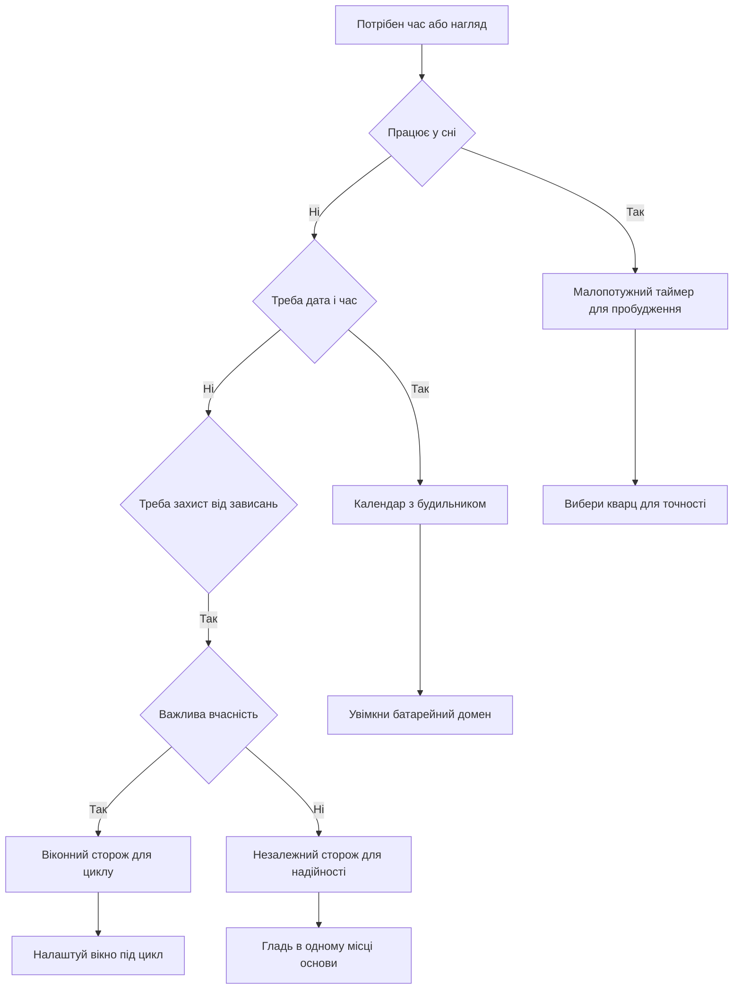

# LPTIM, RTC і WDT - час і нагляд

![[assets/img/stm32-lptim-rtc-wdt-scheme.png|600]]
*Рис. Схема нагляду за часом: малопотужний таймер, календар з будильниками, два сторожові таймери.*

> [!tip] Призначення ноти
> Пояснити три незалежні сутності: хто будить кристал зі сну, хто веде календар, хто перезапускає плату при зависанні.

## 1. Призначення

Звичайні таймери зупиняються у глибокому сні разом з основним тактуванням. Тому для батарейних задач є окрема трійця. Малопотужний таймер цокає від повільного генератора і вміє будити ядро за розкладом. Годинник реального часу веде дату і час роками від батарейки. Сторожові таймери перезапускають плату, якщо програма перестала їх гладити.

Логіка поділу проста: малопотужний таймер це будильник для періодичних вимірів, календар це облік часу подій і штампи для журналу, сторожі це страховка від зависань. Усі три працюють незалежно від основного коду і виживають там, де звичайний таймер вже спить.

## 2. Огляд трійці

| Блок | Тактування | Працює у сні | Задача |
| --- | --- | --- | --- |
| LPTIM | Повільні генератори або зовнішній вхід | Так | Періодичне пробудження, лічильник імпульсів |
| RTC | Повільний генератор, батарейний домен | Так | Дата, час, будильники, мітки подій |
| IWDG | Власний повільний генератор | Так | Перезапуск при зависанні будь-де |
| WWDG | Шина ядра | Ні, лише в роботі | Контроль вчасності у вікні |

Малопотужних таймерів у чипі може бути кілька. Один ставлять на пробудження, інший на підрахунок імпульсів витратоміра у сні. Календар один, але з двома будильниками і мітками часу. Сторожів два з різною філософією, їх можна вмикати разом.

## 3. Малопотужний таймер у сні

| Джерело такту | Точність | Коли брати |
| --- | --- | --- |
| Зовнішній кварц 32 кГц | Висока, одиниці секунд на добу | Точний розклад вимірів |
| Внутрішній повільний генератор | Низька, пливе від температури | Грубий інтервал без кварцу |
| Зовнішній вхід | Залежить від сенсора | Лічильник імпульсів без ядра |

Головна перевага це робота у режимі зупинки ядра, коли швидкі генератори вже вимкнені. Таймер продовжує рахувати від повільного джерела і видає переривання пробудження. Ядро прокидається, робить вимір, знову засинає. Середній струм падає до мікроамперів.

| Режим LPTIM | Що робить | Приклад |
| --- | --- | --- |
| Однократний | Рахує раз і спиняється | Прокинутись через 10 секунд |
| Періодичний | Перезапускається сам | Опитування датчика щосекунди |
| Лічильник | Рахує зовнішні фронти | Витратомір води у сні |
| ШІМ | Генерує повільний сигнал | Блимання маячка без ядра |

## 4. Календар і будильники

Календар веде секунди, хвилини, години, день, місяць і рік з урахуванням високосних років. Два будильники вміють будити у заданий час або за маскою, наприклад кожну хвилину або щодня о шостій. Мітка часу фіксує момент зовнішньої події з точністю до часток секунди.

| Можливість | Налаштування | Навіщо |
| --- | --- | --- |
| Поточний час | Дата і час у двійково-десятковому форматі | Журнал подій з реальними мітками |
| Будильник А | Час плюс маска днів | Щоденне пробудження вузла |
| Будильник Б | Інший час | Резервний розклад або тест |
| Мітка події | Фронт на спеціальному вході | Зафіксувати момент відкриття корпусу |
| Втручання | Контроль цілісності входів | Стерти ключі при зломі |

```text
Структура календаря:
  Час ....................... 12:34:56
  Дата ...................... 01.10.2026, четвер
  Будильник А ............... щодня о 06:00, будить зі сну
  Будильник Б ............... щогодини, короткий вимір
  Мітка часу ................ фронт на вході, зберігається окремо
  Захист .................... втручання стирає резервні регістри
```

## 5. Кварц проти внутрішнього генератора

| Джерело | Частота | Точність | Споживання | Коментар |
| --- | --- | --- | --- | --- |
| Зовнішній кварц | 32.768 кГц | Близько 20 одиниць на мільйон | Мікровати | Стабільний розклад роками |
| Внутрішній генератор | Близько 32 кГц | Пливе на відсотки | Ще менше | Годиться лише для грубих інтервалів |
| Резервний вхід | Залежить від плати | Залежить | Нуль | Сигнал ззовні як еталон |

Кварц на 32.768 кГц це двійкова зручність: ділення на два у п’ятнадцятому степені дає рівно одну секунду. Тому календар з кварцом йде рівно, а з внутрішнім генератором за добу може втекти на хвилини. Для лічильника платежів або обліку часу це неприпустимо.

Калібрування календаря підганяє хід додаванням або відніманням часток секунди. На платі міряють реальну частоту кварцу частотоміром і записують поправку у регістр згладжування. Після цього добова похибка падає до секунд. Температурний дрейф лишається, але для побутових задач його досить.

| Крок калібрування | Дія |
| --- | --- |
| 1 | Вивести сигнал калібрування на пін |
| 2 | Поміряти частоту точним приладом |
| 3 | Порахувати відхилення від номіналу |
| 4 | Записати поправку у регістр |
| 5 | Перевірити хід за добу |

## 6. Незалежний сторож

Незалежний сторож живиться від власного генератора і не залежить від шин ядра. Якщо програма перестала оновлювати лічильник, сторож перезапускає кристал. Це остання лінія оборони від зависань у нескінченному циклі або у хибному перериванні.

| Параметр | Значення | Пояснення |
| --- | --- | --- |
| Такт | Власний повільний генератор | Працює навіть при падінні основного такту |
| Період | Від мілісекунд до десятків секунд | Задається переддільником і порогом |
| Оновлення | Запис ключової послідовності | Погладити вчасно означає живий код |
| Запуск | Програмний або апаратний з опцій | Апаратний стартує сам після скидання |

Правило оновлення просте: гладити сторожа в одному місці головного циклу, а не у кожному перериванні. Тоді зависання будь-якої гілки призведе до перезапуску. Гладити з переривання таймера маскує зависання основи, бо переривання може жити, а основа вже стоїть.

## 7. Віконний сторож

Віконний сторож стежить не лише за фактом оновлення, а й за вчасністю. Рано теж погано, як і пізно. Якщо погладити занадто рано, поки попередній кадр ще не оброблений, буде скидання. Так ловиться код, який крутиться у хибному короткому циклі замість повної роботи.

| Відмінність | Незалежний | Віконний |
| --- | --- | --- |
| Такт | Власний генератор | Шина ядра |
| Вікно | Немає, лише верхня межа | Є нижня і верхня межа |
| Раннє оновлення | Дозволене | Викликає скидання |
| Застосування | Зависання будь-де | Контроль періоду суперциклу |

Типова настройка: період суперциклу 100 мс, вікно дозволяє гладити від 50 до 90 мс. Гладити ставлять у кінець циклу після всіх задач. Якщо задача не встигла, буде пізнє оновлення і скидання. Якщо код зірвався у короткий цикл, буде раннє оновлення і теж скидання.

```text
Вікно оновлення:
  Старт циклу ............... 0 мс
  Заборонена зона ............ 0 - 50 мс, гладити рано не можна
  Дозволена зона ............. 50 - 90 мс, гладити тут
  Крайня межа ................ 100 мс, далі скидання
  Висновок: погладив у кінці роботи, отже встиг.
```

## 8. Зупинка сторожів на налагодженні

Під зупинкою на точці зупину ядро стоїть, а сторожі тікають далі. Без спеціальної настройки плата буде постійно перезапускатись під налагодженням і не дасть спокійно пройтись по коду. Вихід це біт заморожування у блоці налагодження.

| Блок налагодження | Що морозить | Де вмикається |
| --- | --- | --- |
| Ядро на паузі | Зупинка ядра | Точка зупину у середовищі |
| Незалежний сторож | Рахунок сторожу | Біт зупинки у регістрі заморожування |
| Віконний сторож | Рахунок сторожу | Окремий біт того ж регістру |
| Малопотужні таймери | Рахунок часу | Біти зупинки для кожного |

У конфігураторі це прапорці зупинки при налагодженні. Детальніше про середовище дивись [[09-Proshivka/01-CubeIDE-CubeMX|налаштування CubeMX]]. У бойовій прошивці заморожування лишається, шкоди від нього немає, а розробнику спокійніше. Перевіряти треба лише, що сторожі реально працюють без налагоджувача.

## 9. Резервний домен і батарейка

Календар, частина налаштувань і резервні регістри живуть у окремому домені з власним живленням. Коли основне живлення зникає, домен переходить на батарейку і продовжує вести час. Резервні регістри зберігають лічильники і ключі.

| Елемент домену | Живлення | Що зберігає |
| --- | --- | --- |
| Календар | Основне або батарейка | Час іде без перерви |
| Резервні регістри | Те саме | Лічильники, прапорці, ключі |
| Налаштування джерела | Те саме | Вибір кварцу чи генератора |
| Захист від запису | Завжди | Блокує випадкову зміну часу |

Батарейка це зазвичай літієвий елемент на три вольти або суперконденсатор. Струм домену одиниці мікроамперів, тому елемента вистачає на роки. На платі без батарейки час скидається при кожному вимкненні, це нормально для тестів, але не для обліку.

## 10. Приклади коду

```c
LPTIM_HandleTypeDef hlptim1;
RTC_HandleTypeDef hrtc;
IWDG_HandleTypeDef hiwdg;
WWDG_HandleTypeDef hwwdg;

void lptim_wakeup_example(void)
{
    HAL_LPTIM_TimeOut_Start_IT(&hlptim1, 32768, 32768);
}

void rtc_alarm_example(void)
{
    RTC_AlarmTypeDef alarm = {0};
    alarm.AlarmTime.Hours = 6;
    alarm.AlarmTime.Minutes = 0;
    alarm.Alarm = RTC_ALARM_A;
    HAL_RTC_SetAlarm_IT(&hrtc, &alarm, RTC_FORMAT_BIN);
}

void iwdg_example(void)
{
    HAL_IWDG_Init(&hiwdg);
    HAL_IWDG_Refresh(&hiwdg);
}

void wwdg_example(void)
{
    HAL_WWDG_Init(&hwwdg);
    HAL_WWDG_Refresh(&hwwdg);
}

void backup_example(void)
{
    HAL_PWR_EnableBkUpAccess();
    HAL_RTCEx_BKUPWrite(&hrtc, RTC_BKP_DR1, 0xCAFE);
}
```

Нижчий рівень дає коротші виклики для пробудження. Докладніше про шари дивись [[09-Proshivka/02-HAL-LL|шари HAL і LL]].

```c
void ll_lptim_example(void)
{
    LL_LPTIM_Enable(LPTIM1);
    LL_LPTIM_StartCounter(LPTIM1, LL_LPTIM_OPERATING_MODE_ONESHOT);
}

void ll_rtc_example(void)
{
    LL_RTC_EnableIT_ALRA(RTC);
}
```

## 11. Схема вибору нагляду



## 12. Покрокова перевірка

```text
Перший запуск трійці:
  1. Запусти календар від внутрішнього генератора і виведи час у порт.
  2. Постав будильник на хвилину вперед і дочекайся переривання.
  3. Перемкни на кварц і поміряй точність за годину.
  4. Налаштуй малопотужний таймер на 10 секунд і зайди у сон.
  5. Увімкни незалежного сторожа і навмисно прибери оновлення.
  6. Перевір перезапуск і причину скидання у регістрі.
  7. Додай віконний сторож і перевір раннє оновлення.
  8. Увімкни заморожування при налагодженні.
```

## Типові помилки

| # | Помилка | Чому погано | Як правильно |
| --- | --- | --- | --- |
| 1 | Календар без батарейки в обліку | Час скидається при вимкненні | Поставити елемент живлення і перевірити домен |
| 2 | Внутрішній генератор для точного обліку | Похибка хвилини за добу | Тільки кварц плюс калібрування |
| 3 | Гладити сторожа у перериванні | Маскує зависання основи | Гладити в одному місці головного циклу |
| 4 | Без заморожування під налагодженням | Плата перезапускається на точці зупину | Увімкнути біти зупинки у блоці налагодження |
| 5 | Віконний сторож без вікна | Ранні оновлення не ловляться | Порахувати вікно під реальний цикл |
| 6 | Захист резервного домену не знято | Запис часу мовчки ігнорується | Дозволити доступ перед налаштуванням |

## Офіційні джерела

- [RTC cookbook AN4759 ST](https://www.st.com/resource/en/application_note/an4759-using-the-hardware-realtime-clock-rtc-and-the-tamper-management-unit-tamp-with-stm32-microcontrollers--stmicroelectronics.pdf) - календар будильники і захист.
- [IWDG and WWDG ST](https://www.st.com/en/microcontrollers-microprocessors/stm32-32-bit-arm-cortex-mcus.html) - вибір сторожового таймера під задачу.
- [LPTIM cookbook AN4861 ST](https://www.st.com/resource/en/application_note/an4861-introduction-to-the-lowpower-timer-lptim--stmicroelectronics.pdf) - малопотужні таймери і сон.

## Див. також

- [[Home]]
- [[07-Timeri-Son/01-GPTIM-ADTIM|таймери і ШІМ]]
- [[07-Timeri-Son/03-Sleep-Stop-Standby|режими сну]]
- [[09-Proshivka/01-CubeIDE-CubeMX|налаштування CubeMX]]
- [[09-Proshivka/02-HAL-LL|шари HAL і LL]]
- [[03-GPIO/03-EXTI-NVIC|переривання EXTI]]
