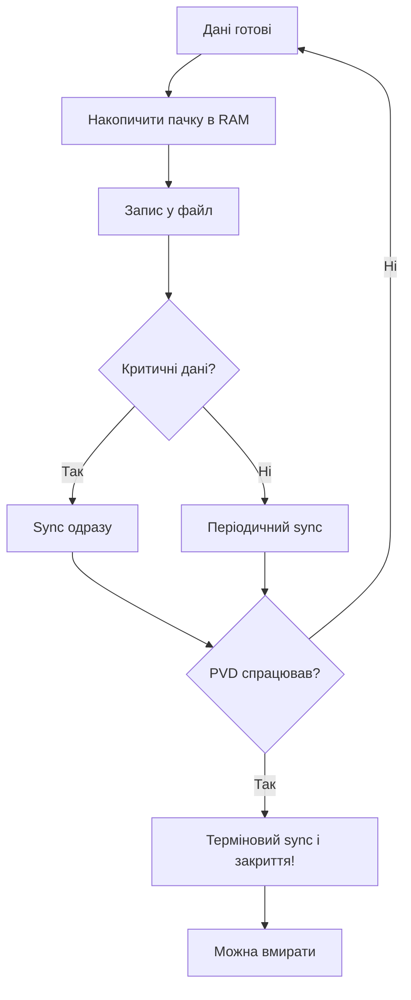

# Файлові системи - LittleFS і FATFS на практиці

![[assets/img/stm32-filesystem-scheme.png|600]]
*Рис. Від байта до файла: буфер, sync, вирівнювання зносу.*

> [!tip] Призначення ноти
> Навчити зберігати файли на флеші так, щоб пережити збій живлення і не вбити носій за рік.

## 1. Призначення

Голі сторінки Flash - це цеглинки без будинку. Файлова система дає імена, папки і атомарність: або записалось цілком, або ніби не писалось. LittleFS для внутрішньої і QSPI, FATFS для карт, що читає компютер. Вибір не за смаком, а за носієм.

## LittleFS проти FATFS

| Критерій | LittleFS | FATFS |
| --- | --- | --- |
| Носій | Внутрішня Flash, QSPI | SD-карти, USB-флешки |
| Збій живлення | Стійка за дизайном | Потрібен акуратний sync! |
| Wear-leveling | Вбудовано | Немає - покладається на карту |
| Читає ПК | Ні, тільки свій формат | Так, скрізь |
| RAM | Кілобайти | Десятки кілобайт |

```text
Правило:
  лог всередині виробу .... LittleFS;
  файли для людини ........ FATFS на карті.
```

## Геометрія: що знати про носій

| Параметр | Звідки |
| --- | --- |
| Розмір блока читання | Даташит флеші |
| Розмір сторінки запису | 256 байт типово |
| Розмір сектора стирання | 4 КБ типово |
| Знос | Десятки тисяч циклів |

> Невірна геометрія в конфігу - тиха корупція через місяці. Звірити з даташитом!

## Mermaid: безпечний запис



## PVD рятує останній запис

```c
// Переривання просідання: дописати і закритись:
void PVD_IRQHandler(void)
{
  emergency_sync_all();   // швидко, без malloc!
  close_files();
  enter_standby();        // вмерти красиво
}
```

| Правило | Пояснення |
| --- | --- |
| Конденсатор тримає мілісекунди | Вистачає на sync пачки |
| Без malloc в обробнику | Купа в аварії - розкіш |
| Тест просіданням | Висмикнути живлення при записі! |

## Wear-leveling: як не вбити носій

| Прийом | Ефект |
| --- | --- |
| Писати пачками | Менше циклів стирання |
| Ротація файлів | Знос розмазується |
| Не писати щосекунди | RAM-буфер + рідкісний скид |
| Запас місця | 20 відсотків вільного для рівняння! |

## Типові помилки

| # | Помилка | Чому погано | Як правильно |
| --- | --- | --- | --- |
| 1 | Запис по байту | Знос за місяці | Пачки через буфер! |
| 2 | Немає sync перед сном | Файл рваний | Sync завжди перед сном |
| 3 | Невірна геометрія | Тиха корупція | Даташит флеші! |
| 4 | Немає PVD-бекапу | Втрата останніх даних | Аварійний sync |
| 5 | FATFS без sync взагалі | Карта не читається | Періодичний sync |
| 6 | Носій забитий вщерть | Нікуди рівняти знос | Запас 20 відсотків |
| 7 | malloc в аварії | Зависання в PVD | Тільки статика! |

## Офіційні джерела

- [LittleFS design (ARM)](https://github.com/littlefs-project/littlefs) - COW, wear-leveling, геометрія.
- [FatFs module (ChaN)](http://elm-chan.org/fsw/ff/00index_e.html) - конфігурація, sync, носії.

## Монтування і перший запуск

| Крок | Дія |
| --- | --- |
| 1 | Спроба змонтувати існуючу |
| 2 | Невдача - форматування з геометрією |
| 3 | Створення службових файлів і версії |
| 4 | Перевірка читання назад |

```c
// Логіка старту сховища:
if (mount_fs() != FS_OK) {
  format_fs();        // чиста флеш або бита
  create_defaults();  // версія, конфіг за замовчуванням
}
```

## Версія формату і міграція

| Тема | Практика |
| --- | --- |
| Версія в корені | Число, що росте з прошивкою |
| Стара версія | Міграція при старті, не мовчки! |
| Бекап перед міграцією | Копія старих файлів поруч |
| Невдала міграція | Відкат і робота в read-only |

## Налагодження сховища

| Симптом | Куди дивитись |
| --- | --- |
| Монтування падає | Геометрія, живлення флеші, QSPI-частота |
| Файли рвані | Sync, PVD, конденсатор |
| Повільно пише | Пачки більші, менше sync |
| Знос за рік | Частота записів, запас місця |

## Див. також

- [[Home]]
- [[08-Pamyat/01-Flash-OTP-EEPROM|внутрішня память]]
- [[08-Pamyat/02-Zovnishni-Loadery|зовнішні лоадери]]
- [[04-Shini/06-SDMMC-QUADSPI|карти памяті]]
- [[16-Proekti/05-USB-Logger|логер даних]]
