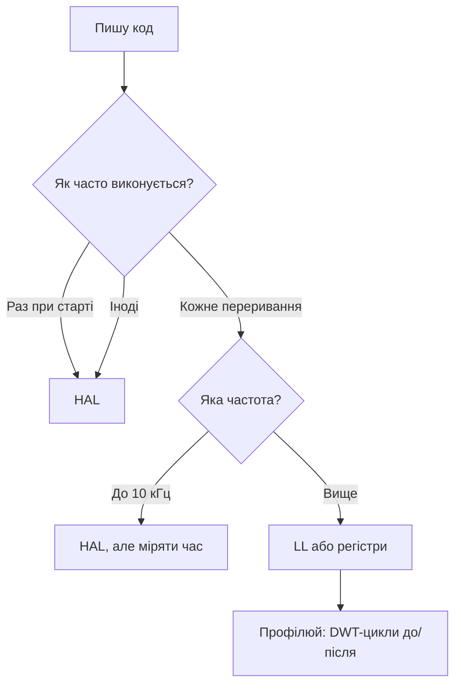

# HAL vs LL - шари коду на практиці

![[assets/img/stm32-hal-ll-layers-scheme.png|600]]
*Рис. Твій код → HAL/LL → CMSIS → регістри; гаряче - вниз, холодне - вгору.*

> [!tip] Призначення ноти
> Навчити вибирати шар під задачу: HAL для швидкості розробки, LL для швидкості виконання, регістри - для екстриму.

## 1. Призначення

HAL (Hardware Abstraction Layer) - функції з перевірками, таймаутами і станами: зручно, переносимо, повільно. LL (Low-Layer) - тонкі інлайни 1-в-1 до регістрів: швидко, компактно, прив'язано до чипа. Обидва генеруються CubeMX і живуть в одному проєкті поруч - змішувати нормально і правильно.

## Порівняння на одному прикладі (GPIO)

```c
// HAL: зручно читати
HAL_GPIO_WritePin(GPIOC, GPIO_PIN_13, GPIO_PIN_SET);
HAL_Delay(500);
// LL: те саме, в рази менше тактів
LL_GPIO_SetOutputPin(GPIOC, LL_GPIO_PIN_13);
LL_mDelay(500);
```

## Де що використовувати

| Місце | Шар | Чому |
| --- | --- | --- |
| Ініціалізація периферії | HAL | Один виклик замість 20 регістрів |
| Повільні опитування | HAL | Різниці не відчутно |
| ISR 1-10 кГц | HAL обережно | Працює, але дивись час |
| ISR 100 кГц+ / RMT-подібне | LL | HAL не встигає |
| Бітбенг-протоколи | LL + DMA | Джиттер мінімальний |
| Екстремальні таймінги | Регістри безпосередньо | Читати Reference Manual! |

```text
Правило великого пальця:
  пишеш рідко → HAL; виконується часто → LL.
  Сумніваєшся → HAL, профіль покаже гаряче — перепишеш точково.
```

## Mermaid: вибір шару



## MSP: де ховається залізна ініціалізація

HAL викликає `HAL_UART_MspInit()` подібні функції для пінів/тактувань/переривань - CubeMX їх генерує, але правити можна. Золоте правило: піни і NVIC - у MspInit, логіка - у `main`/задачах. Зламаний MspInit = «HAL не працює», хоча винен не HAL.

## Типові помилки

| # | Помилка | Чому погано | Як правильно |
| --- | --- | --- | --- |
| 1 | HAL_Delay в ISR | Блокує систему, зриває таймінги | Прапорці + обробка в main loop |
| 2 | HAL в 100 кГц ISR | Не встигає, пропуски | LL-версія того ж |
| 3 | Змішані HAL і LL на один регістр | Конфлікт станів | Одна периферія - один шар |
| 4 | `HAL_Init` не викликано | SysTick мовчить, Delay висить | Першим рядком main |
| 5 | Ігнор кодів повернення HAL | `HAL_TIMEOUT`/`HAL_ERROR` губляться | Перевіряти `HAL_StatusTypeDef` у критичному |

## Офіційні джерела

- [STM32 HAL User Manual UM1905 (ST)](https://www.st.com/resource/en/user_manual/um1905-description-of-stm32f7-hal-and-lowlayer-drivers-stmicroelectronics.pdf) - структура HAL/LL.
- [CMSIS Documentation (ARM)](https://www.keil.arm.com/components/cmsis/) - базовий стандарт.

## UART поруч: HAL vs LL

```c
// HAL: блокуюча передача (просто, але чекає)
HAL_UART_Transmit(&huart1, buf, len, 100);

// HAL: неблокуюча через переривання (колбек!)
HAL_UART_Transmit_IT(&huart1, buf, len);
// ... в іншому місці:
void HAL_UART_TxCpltCallback(UART_HandleTypeDef *huart) { ready = 1; }

// LL: ручний цикл (максимум контролю)
while (len--) {
  while (!LL_USART_IsActiveFlag_TXE(USART1));
  LL_USART_TransmitData8(USART1, *buf++);
}
while (!LL_USART_IsActiveFlag_TC(USART1));
```

| Варіант | Плюс | Мінус |
| --- | --- | --- |
| HAL блокуючий | Один рядок | Висить в очікуванні - не в ISR! |
| HAL IT/DMA | Не блокує | Колбеки + стани, складніше дебаг |
| LL ручний | Швидко, прозоро | Сам стежиш за прапорцями |

## Таймер-ПWM поруч: HAL vs LL

```c
// HAL: старт PWM
HAL_TIM_PWM_Start(&htim1, TIM_CHANNEL_1);
__HAL_TIM_SET_COMPARE(&htim1, TIM_CHANNEL_1, 500);

// LL: те саме
LL_TIM_EnableCounter(TIM1);
LL_TIM_CC_EnableChannel(TIM1, LL_TIM_CHANNEL_CH1);
LL_TIM_OC_SetCompareCH1(TIM1, 500);
```

## Скільки коштує HAL: порядок цифр

| Операція | HAL | LL | Висновок |
| --- | --- | --- | --- |
| GPIO toggle | ~20-50 тактів | 1-2 такти | В ISR 100 кГц - тільки LL |
| UART байт (polling) | +перевірки стану | голий прапорець | Різниця в рази на потоці |
| ADC старт + опитування | +timeout-логіка | 3 рядки | HAL зручніший на старті |
| ISR накладні | диспетчеризація колбеків | прямий виклик | Виміряй DWT - здивуєшся |

```c
// Вимір часу ділянки цикломірниками DWT (будь-який M3/M4/M7):
DWT->CTRL |= DWT_CTRL_CYCCNTENA_Msk;
uint32_t t0 = DWT->CYCCNT;
HAL_GPIO_TogglePin(GPIOC, GPIO_PIN_13);
uint32_t hal_cost = DWT->CYCCNT - t0;
```

## LL-ініціалізація периферії (як виглядає)

```c
// CubeMX генерує таке для LL_GPIO — читати вміти обов'язково:
LL_AHB1_GRP1_EnableClock(LL_AHB1_GRP1_PERIPH_GPIOC);
LL_GPIO_SetPinMode(GPIOC, LL_GPIO_PIN_13, LL_GPIO_MODE_OUTPUT);
LL_GPIO_SetPinOutputType(GPIOC, LL_GPIO_PIN_13, LL_GPIO_OUTPUT_PUSHPULL);
LL_GPIO_SetPinSpeed(GPIOC, LL_GPIO_PIN_13, LL_GPIO_SPEED_FREQ_LOW);
```

| Правило змішування | Пояснення |
| --- | --- |
| Одна периферія - один шар | HAL-UART + LL-UART на той же USART = конфлікт станів |
| Різні периферії - різні шари | UART на HAL + таймер на LL - нормально! |
| MSP лишається HAL-овим | Навіть з LL-периферією тактування/піни може робити HAL |
| Починай з HAL | Переписуй гаряче точково після профілювання |

## CMSIS безпосередньо: коли і як

```c
// Регістри без обгорток (приклад: увімкнути GPIOC-13):
RCC->AHB1ENR |= RCC_AHB1ENR_GPIOCEN;
GPIOC->MODER |= GPIO_MODER_MODE13_0;
GPIOC->ODR ^= GPIO_ODR_OD13;
```

| Коли | Чому |
| --- | --- |
| Стартап-код | До HAL ще далеко, треба мінімум |
| Екстремальний бітбенг | Кожен такт на рахунку |
| Нерозуміння HAL | Прочитати регістри - зрозуміти, що HAL робить |
| Навчання | Reference Manual + регістри = глибина |

## Глосарій кодів повернення HAL

| Код | Значення | Що робити |
| --- | --- | --- |
| HAL_OK | Успіх | Нічого |
| HAL_ERROR | Загальна помилка | Дивитись стан периферії |
| HAL_BUSY | Зайнято попередньою | Чекати готовності або скасувати |
| HAL_TIMEOUT | Час вийшов | Збільшити таймаут або чинити шину |

| Стан периферії | Де дивитись |
| --- | --- |
| ErrorCode в хендлі | Біти ORE, FE, NE для UART |
| HAL_X_GetError | Розшифровка останньої помилки |
| HAL_X_GetState | READY, BUSY_TX, BUSY_RX, ERROR |

```text
Золоте правило:
  критичні виклики перевіряти завжди;
  init без перевірки — мовчазна смерть;
  помилку логувати з іменем функції і кодом.
```

## Див. також

- [[Home]]
- [[09-Proshivka/01-CubeIDE-CubeMX|CubeIDE]]
- [[09-Proshivka/03-ST-Link-Proshivka|ST-Link]]
- [[00-Start/05-Vibir-seredovischa|Вибір середовища]]
