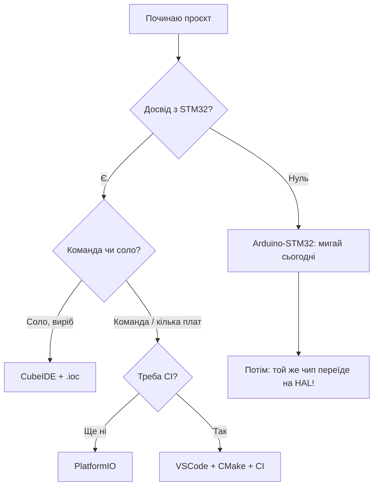

# Без CubeIDE - VSCode, CMake, Arduino і PlatformIO

![[assets/img/stm32-toolchain-alt-scheme.png|600]]
*Рис. CubeMX генерує код, а збирати можна чим завгодно: IDE, CMake, PIO, CI.*

> [!tip] Призначення ноти
> Вибрати середовище під свій стиль: швидкий старт, командна робота чи повний контроль збірки.

## 1. Призначення

CubeIDE - не єдиний шлях. Arduino дає старт за вечір, PlatformIO - зручну роботу з бібліотеками і платами, VSCode + CMake - повний контроль і нормальний CI. HAL/LL-код скрізь той же - міняється тільки обгортка збірки і завантаження.

## Порівняння середовищ чесно

| Середовище | Старт | Контроль | Бібліотеки | CI | Коли брати |
| --- | --- | --- | --- | --- | --- |
| Arduino-STM32 | Вечір | Низький | Тисячі скетчів | Погано | Прототип, навчання |
| CubeIDE | День | Середній | Cube-екосистема | Headless | Серійний виріб соло |
| PlatformIO | Година | Середній+ | PIO-реестр | Добре | Команда, кілька плат |
| VSCode + CMake | Дні | Повний | Вручну | Ідеально | Досвідчені, свій пайплайн |
| Чистий Makefile | Тиждень | Абсолют | Вручну | Ідеально | Мінімалісти, legacy |

```text
Правило вибору:
  один вечір і миготіти → Arduino
  виріб на рік → CubeIDE або PIO
  команда + тести + CI → VSCode + CMake
```

## Mermaid: вибір шляху



## Arduino-STM32: швидкий старт

| Тема | Практика |
| --- | --- |
| Ядро | STM32duino (офіційне!) через Board Manager |
| Плати | Blue Pill, Black Pill, Nucleo - з коробки |
| Завантаження | ST-Link, DFU (F072/F105), Serial (bootloader) |
| Піни | Arduino-номери + STM-номери поруч (PA9 = TX1) |

```c
// Той самий Blink, вид Arduino:
void setup() { pinMode(PC13, OUTPUT); }
void loop() { digitalToggle(PC13); delay(500); }
```

| Обмеження | Що означає |
| --- | --- |
| HAL під капотом, але спрощений | Гарячі ISR писати важче |
| Таймінги приблизні | delay() не для точного |
| Перехід на HAL потім | Піни і логіка переносяться, скетч-структура - ні |

## PlatformIO: золота середина

```text
platformio.ini для Blue Pill:
  [env:bluepill_f103c8]
  platform = ststm32
  board = bluepill_f103c8
  framework = stm32cube    ; або arduino!
  upload_protocol = stlink
```

| Тема | Практика |
| --- | --- |
| Фреймворк на вибір | arduino або stm32cube в одному конфігу! |
| Бібліотеки | Залежності в .ini, версії зафіксовані |
| Монітор порту | Вбудований serial monitor |
| Дебаг | PIO Unified Debugger (GDB під капотом) |
| CI | pio run з консолі - той же конфіг |

## VSCode + CMake: повний контроль

```text
Типова структура:
  проєкт/
    CMakeLists.txt ......... тулчейн + цілі
    cmake/gcc-arm-none-eabi.cmake .. компілятор, прапорці
    Core/ .................. код з CubeMX (скопійовано!)
    Drivers/ ............... HAL (сабмодуль або копія)
    build/ ................. артефакти (в .gitignore!)
```

```text
# Збірка:
cmake -B build -DCMAKE_BUILD_TYPE=Release
cmake --build build -j
# Прошивка:
openocd -f interface/stlink.cfg -f target/stm32f1x.cfg \
  -c "program build/firmware.elf verify reset exit"
```

| Тема | Практика |
| --- | --- |
| Тулчейн-файл | Шляхи до arm-none-eabi-gcc, прапорці CPU (-mcpu=cortex-m4 -mfpu=fpv4-sp-d16 -mfloat-abi=hard!) |
| CubeMX + CMake | Генерувати код CubeMX-ом, збирати CMake-ом - нормальна практика |
| Сабмодулі | HAL як git-submodule - версія зафіксована для всієї команди |
| Тести | Host-тести логіки на GCC + Unity/Ceedling окремо від прошивки |

## Прапорці FPU: класична пастка CMake

| Чип | Прапорці |
| --- | --- |
| Без FPU (F0/F1/L0) | -mcpu=cortex-m0/m3 -mfloat-abi=soft |
| З FPU (F4/G4/H7) | -mcpu=cortex-m4 -mfloat-abi=hard -mfpu=fpv4-sp-d16 |
| Помилка лінковки float | Невідповідність прапорців бібліотеки і коду! |

> Змішав soft і hard float в одному проєкті - отримаєш загадкові падіння. Перевіряй прапорці всієї команди однаково.

## CI-пайплайн: мінімум для команди

```text
1. Чек-аут + сабмодулі (HAL!).
2. cmake -B build + cmake --build build.
3. Артефакт: firmware.elf + firmware.hex.
4. Опційно: cppcheck, clang-format --dry-run.
5. Реліз: прикріпити .hex до тегу.
```

| Сервіс | Нотатка |
| --- | --- |
| GitHub Actions | arm-none-eabi-gcc з apt, кеш build/ |
| GitLab CI | docker-образ з тулчейном |
| Секрети | Ніяких ключів підпису в логах! |

## Типові помилки

| # | Помилка | Чому погано | Як правильно |
| --- | --- | --- | --- |
| 1 | Arduino-піни в HAL-коді | Різні системи нумерації | Таблиця відповідності перед портом |
| 2 | FPU-прапорці навмання | Падіння на float | За даташитом ядра чипа! |
| 3 | HAL копіюють кусками | Версії розходяться | Сабмодуль або повна копія пакета |
| 4 | build/ в git | Сміття в репозиторії | .gitignore з першого дня |
| 5 | CI збирає інакше ніж локально | Не відтворюваність | Той же CMake + зафіксовані версії |
| 6 | Плата в .ini не та | Мовчання або глюки | Точний партномер плати! |

## Офіційні джерела

- [STM32duino Wiki (GitHub)](https://github.com/stm32duino/Arduino_Core_STM32) - Arduino-ядро для STM32.
- [PlatformIO ST STM32 Docs](https://docs.platformio.org/en/latest/platforms/ststm32.html) - плати і протоколи.

## Див. також

- [[Home]]
- [[09-Proshivka/01-CubeIDE-CubeMX|CubeIDE]]
- [[09-Proshivka/03-ST-Link-Proshivka|ST-Link]]
- [[00-Start/05-Vibir-seredovischa|Вибір середовища]]
