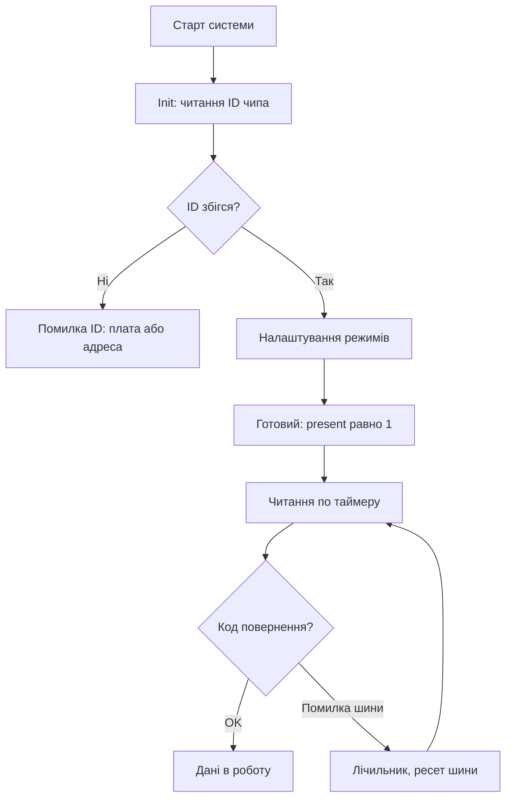

# Шаблон HAL-драйвера - структура і коди помилок

![[assets/img/stm32-driver-template-scheme.png|600]]
*Рис. Шари драйвера: залізо внизу, логіка вгорі, помилки назовні.*

> [!tip] Призначення ноти
> Дати єдиний скелет драйвера, щоб усі датчики в проєкті виглядали однаково і помилялись однаково.

## 1. Призначення

Кожен драйвер без шаблону - це новий діалект: різні імена, різні коди помилок, різна ініціалізація. Єдиний шаблон прибирає це: init завжди перевіряє звязок, читання завжди повертає код, пристрій завжди описується дескриптором. Новий датчик підключається копіюванням скелета.

## Структура файлів

| Файл | Вміст |
| --- | --- |
| sensor.h | Дескриптор, коди помилок, прототипи |
| sensor.c | Init, читання, запис, колбеки |
| sensor_cfg.h | Адреса, піни, таймаути під плату |

```text
Правило шарів:
  верхній код не знає, I2C там чи SPI;
  драйвер не знає, яка плата;
  плата описана тільки в cfg.
```

## Дескриптор пристрою

```c
// Опис екземпляра: все станово в одному місці:
typedef struct {
  I2C_HandleTypeDef *bus;   // яка шина
  uint8_t addr;             // адреса на шині
  uint32_t timeout;         // таймаут операцій
  int32_t calib[3];         // калібрування з OTP
  uint8_t present;          // чип відповідає
} sensor_t;
```

## Init з перевіркою звязку

```c
// Init завжди читає ID чипа — мовчазний старт заборонено:
int sensor_init(sensor_t *dev)
{
  uint8_t id = 0;
  if (HAL_I2C_Mem_Read(dev->bus, dev->addr, REG_ID,
                       1, &id, 1, dev->timeout) != HAL_OK)
    return SENSOR_ERR_BUS;
  if (id != EXPECTED_ID)
    return SENSOR_ERR_ID;
  // ... налаштування режимів ...
  dev->present = 1;
  return SENSOR_OK;
}
```

## Mermaid: життєвий цикл драйвера



## Коди помилок: єдині на проєкт

| Код | Значення |
| --- | --- |
| SENSOR_OK | Успіх |
| SENSOR_ERR_BUS | Шина не відповідає |
| SENSOR_ERR_ID | Чужий ID чипа |
| SENSOR_ERR_TIMEOUT | Перевищено таймаут |
| SENSOR_ERR_CRC | Дані биті |
| SENSOR_ERR_ARG | Невірний аргумент |

```text
Правила:
  нуль — завжди успіх;
  верхній код логує, а не мовчить;
  повторні помилки шини рахуються лічильником.
```

## Читання з повторними спробами

```c
// Читання з повтором: одна глітч-передача не вбиває вимір:
int sensor_read(sensor_t *dev, int32_t *out)
{
  for (int i = 0; i < 3; i++) {
    if (HAL_I2C_Mem_Read(dev->bus, dev->addr, REG_DATA,
                         1, (uint8_t*)out, 4, dev->timeout) == HAL_OK)
      return SENSOR_OK;
  }
  return SENSOR_ERR_BUS;
}
```

## Типові помилки

| # | Помилка | Чому погано | Як правильно |
| --- | --- | --- | --- |
| 1 | Init без читання ID | Мертвий чип видно лише в роботі | ID при кожному старті! |
| 2 | Глобальні змінні замість дескриптора | Два датчики не уживуться | Стан тільки в структурі |
| 3 | Адреса зашита в коді | Плата з іншою адресою - правити код | Адреса в cfg |
| 4 | Блокуючі цикли без таймауту | Висне вся система | Таймаут на кожну операцію |
| 5 | Помилки мовчать | Баг видно через місяць | Коди наверх, лог одразу |
| 6 | Драйвер знає номер плати | Копіпаста на кожну плату | Плата тільки в cfg-файлі |
| 7 | Магічні числа регістрів | Ніхто не розуміє через рік | Іменовані константи з даташита |

## Офіційні джерела

- [UM1905 HAL drivers (ST)](https://www.st.com/resource/en/user_manual/um1905.pdf) - стиль і конвенції HAL.
- [MISRA C guidelines (MISRA)](https://www.misra.org.uk/misra-c) - безпечний стиль вбудованого коду.

## Конфіг плати: приклад

```c
// sensor_cfg.h для конкретної плати:
#define SENSOR_I2C        (&hi2c1)
#define SENSOR_ADDR       (0x76 << 1)
#define SENSOR_TIMEOUT    100
#define SENSOR_POLL_MS    1000

// main.c: звязка за секунду:
static sensor_t env = {
  .bus = SENSOR_I2C, .addr = SENSOR_ADDR,
  .timeout = SENSOR_TIMEOUT, .present = 0,
};
```

| Правило | Пояснення |
| --- | --- |
| Версія драйвера в заголовку | DRIVER_VERSION видно в логах |
| Зміна API - новий мажор | Сумісність не ламати мовчки |
| Один драйвер - один cfg | Плати не змішуються |

## Див. також

- [[Home]]
- [[09-Proshivka/02-HAL-LL|шари коду]]
- [[09-Proshivka/01-CubeIDE-CubeMX|налаштування збірки]]
- [[04-Shini/03-I2C|шина обміну]]
- [[10-Sensori/02-BME280-SHT3x|приклад драйвера]]
