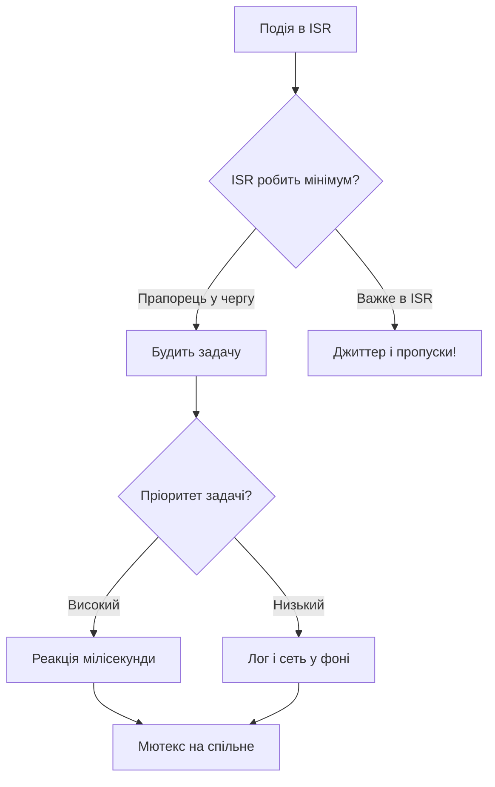

# FreeRTOS на STM32 - задачі, черги і ISR

![[assets/img/stm32-freertos-scheme.png|600]]
*Рис. Потік даних: ISR будить, черга несе, задача розбирає.*

> [!tip] Призначення ноти
> Навчити ділити прошивку на задачі так, щоб ISR лишались короткими, а дані не губились.

## 1. Призначення

Голий цикл не масштабується: додав WiFi-логіку до мотора - все смикається. FreeRTOS дає задачі з пріоритетами, черги між ними і таймери ядра. ISR тільки будить, важке робить задача з низьким пріоритетом. Результат - детермінована система замість спагеті з прапорців.

## Задачі: мінімум

| Тема | Практика |
| --- | --- |
| Створення | xTaskCreate з функцією, стеком і пріоритетом |
| Стек задачі | З запасом: переповнення ламає сусідню пам'ять! |
| Пріоритети | Вище число - важливіша; idle завжди найнижчий |
| Затримка | vTaskDelay замість HAL_Delay - віддає ядро іншим |

```c
// Задача вимірів раз на секунду:
void meas_task(void *arg)
{
  for (;;) {
    read_sensors();
    xQueueSend(data_q, &sample, 0);
    vTaskDelay(pdMS_TO_TICKS(1000));
  }
}
```

## Черги і семафори

| Примітив | Коли |
| --- | --- |
| Черга | Потік даних ISR-задача або задача-задача |
| Бінарний семафор | Подія сталася - буди! |
| Мютекс | Спільний ресурс: UART-лог, шина |
| Пряме сповіщення | Легша альтернатива семафору для однієї задачі |

```c
// ISR кладе подію, задача забирає:
void EXTI0_IRQHandler(void)
{
  BaseType_t woken = pdFALSE;
  xQueueSendFromISR(btn_q, &evt, &woken);
  portYIELD_FROM_ISR(woken);
}
```

## Mermaid: розподіл роботи



## ISR і пріоритети NVIC: залізне правило

| Тема | Практика |
| --- | --- |
| Поріг ядра | configMAX_SYSCALL_PRIORITY - межа викликів API |
| ISR з API | Пріоритет ЧИСЛОВО більший (логічно нижчий!) за поріг |
| ISR без ОС | Найвищі пріоритети, тільки залізо |
| Перевірка | Assert порту ловить порушення - не вимикати! |

> Плутанина: у Cortex-M МЕНШЕ число - ВАЖЛИВІШЕ переривання. Поріг ОС означає «ці ISR вище заліза ОС не чіпають».

## Пам'ять і стек

| Тема | Практика |
| --- | --- |
| Heap ядра | Схема 4 за замовчуванням у CubeMX вистачає |
| Переповнення стека | Hook vApplicationStackOverflowHook - блимати SOS! |
| Вимір запасу | uxTaskGetStackHighWaterMark показує мінімум |
| Купа під буфери | Великі кадри - статикою, не стеком задачі |
| Статика задач | xTaskCreateStatic - без купи взагалі |

## Типові помилки

| # | Помилка | Чому погано | Як правильно |
| --- | --- | --- | --- |
| 1 | Важке в ISR | Джиттер, пропуски | Черга + задача |
| 2 | Звичайний виклик з ISR | Псує черги ядра | Тільки FromISR-версії! |
| 3 | Забутий YIELD | Задача прокинеться пізно | portYIELD_FROM_ISR |
| 4 | Малий стек задачі | Тихе псування памяті | Запас + hook + вимір |
| 5 | Мютекс з ISR | Блокування назавжди | Семафор замість мютекса |
| 6 | Пріоритет ISR вище порога з API | Крах ядра | Звірити числа з конфігом! |
| 7 | HAL_Delay у задачі | Блокує тільки задачу, але марнує | vTaskDelay для пауз |

## Офіційні джерела

- [FreeRTOS on STM32 (ST)](https://www.st.com/en/development-tools/stm32cube-mcu-packages.html) - порт у Cube-пакетах.
- [Mastering the FreeRTOS Kernel (AWS)](https://www.freertos.org/Documentation/RTOS_book.html) - задачі, черги, пам'ять.

## Програмні таймери і сон ядра

| Тема | Практика |
| --- | --- |
| Таймер ядра | Періодичні дії без окремої задачі |
| Daemon-задача | Колбеки таймерів виконуються в ній - короткі! |
| Tickless idle | Ядро спить між тіками замість холостого циклу |
| Сон і радіо | Tickless + Stop - роки від батареї |

```c
// Таймер раз на хвилину: скинути watchdog-лічильник:
TimerHandle_t t = xTimerCreate("wd", pdMS_TO_TICKS(60000),
                               pdTRUE, NULL, wd_callback);
xTimerStart(t, 0);
```

## Idle-hook: що робити у простої

| Тема | Практика |
| --- | --- |
| Hook простою | vApplicationIdleHook - тільки швидке! |
| Вимір завантаження | Лічильник простою показує вільне ядро |
| Сон у hook | WFI з tickless для економії |

```text
Орієнтир завантаження:
  простій понад 70 відсотків — запас є;
  простій близько нуля — ядро на межі, різати роботу.
```

## Пріоритети задач: карта системи

| Задача | Пріоритет | Чому |
| --- | --- | --- |
| Аварійна (мотор, захист) | Найвищий | Дедлайн мілісекунди |
| Виміри і керування | Середній | Періодика з джиттером мінімум |
| Звязок і лог | Низький | Затримки терпимі |
| Фон і статистика | Найнижчий | Коли всі сплять |

```text
Правило: високі задачі короткі і без блокувань;
довге чекання — тільки в низьких;
інверсія через мютекс лікується наслідуванням пріоритету.
```

## Вимір завантаження ядра

| Метод | Як |
| --- | --- |
| Лічильник простою | Вільні відсотки ядра |
| GPIO-маркер | Осцилограф на вході і виході задачі |
| Trace | SEGGER SystemView для картини цілком |

## Див. також

- [[Home]]
- [[09-Proshivka/02-HAL-LL|шари коду]]
- [[03-GPIO/04-NVIC-Priority-DeepDive|пріоритети NVIC]]
- [[03-GPIO/03-EXTI-NVIC|зовнішні переривання]]
- [[07-Timeri-Son/02-LPTIM-RTC-WDT|сторожові таймери]]
