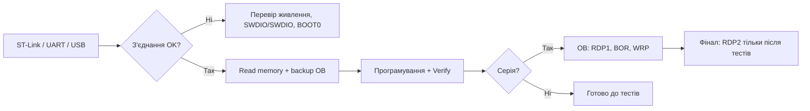

# STM32CubeProgrammer - flash, Option Bytes і масове шиття

![[assets/img/stm32-cubeprogrammer-scheme.png|600]]
*Рис. CubeProgrammer: підключення ST-Link → читання OB → програмування → верифікація → масове шиття через CLI.*

> [!tip] Призначення ноти
> Навчити інженера не лише прошивати, але й захищати чип (RDP) та масштабувати виробництво без ручних кліків.

## 1. Підключення

- **ST-Link V2 / V3 / V4** — USB → SWD (SWCLK + SWDIO) + GND + 3.3V;
- **UART-BOOT (DFU)** — на F1/F4 через USART1 + BOOT0 = 1; на G0/G4 — USB-DFU;
- **USB-OTG / DFU** — на H5/U5 з вбудованим USB;
- Перевіряйте `Target` → `Connection` → `Read Memory` — має бути `OK`.

## 2. Читання / запис

- `Erasing & Programming` → вибір `.hex` / `.bin` → `Programming -> Verify`;
- `External Loaders` — якщо зовнішня флеш (QSPI / SPI-NOR);
- Кількість байтів для `Flash` = розмір сектора × кількість; не переповнюйте.

## 3. Option Bytes (OB)

| Біт / група | Значення 0 | Значення 1 | Небезпека |
| --- | --- | --- | --- |
| RDP Level 0 | Читання/запис відкриті | Читання/запис відкриті | Нема (за замовч.) |
| RDP Level 1 | Читання заблоковано, дебаг доступний | Читання заблоковано, дебаг доступний | Повернення до 0 потребує стирання |
| RDP Level 2 | **НЕОБОРОТНІСТЬ** | не підтримується | **Після встановлення — чип безповоротно захищено** |
| nBOOT0 | Boot з Flash | Boot з System Memory | Без пінів BOOT0 може не стартувати |
| nBOOT1 | Boot з Flash | Boot з SRAM | Використовуйте з обережністю |
| WRP (Write Protection) | Сектори відкриті | Сектори захищені від запису | Безповоротно без стирання |

- `STM32CubeProgrammer` → `OB` → `Read`, потім `Modify` тільки після резервної копії `Read`;
- **Ніколи не ставте RDP2 до фінального тестування** — це фінальна печатка.

## 4. Масове шиття (CLI)

```bash
# Один чип через ST-Link
STM32_Programmer_CLI -c port=SWD -p file.hex 0x08000000 -v -rst

# Багато через скрипт + log
for dev in /dev/ttyACM{0..3}; do
  STM32_Programmer_CLI -c port=SWD -p fw.hex 0x08000000 -v >> deploy.log 2>&1
done
```

- `-rst` — перезапуск після програмирования;
- `-v` — верифікація (обов'язково!);
- Під час виробництва: `-no-progress` + `-log` для аудиту.

## 5. Оновлення ST-Link

- `ST-LINK Firmware Update` в GUI або `ST_Programmer_CLI -c port=USB -update`;
- Не обновлюйте під час прошивки — ризик зупинки.

## Mermaid: шлях від підключення до захисту



## 7. CLI коди виходу і автоматизація

- `STM32_Programmer_CLI` повертає 0 при успіху, ненульовий код при помилці з'єднання, невірній адресі або проваленій верифікації;
- у скриптах масового шиття перевіряти код виходу після кожного пристрою і писати рядок у журнал з серійним номером програматора;
- опція `-v` (verify) обов'язкова у виробництві: програмування без верифікації не зараховується;
- для зовнішньої флеші додавати `-el` лоадер у кожен виклик CLI, інакше запис мовчки піде у внутрішню;
- ST-Link-прошивку програматора оновлювати окремим кроком до зміни партії, не посеред зміни.

## 8. Швидка шпаргалка CubeProgrammer

- З'єднання: SWD (SWCLK + SWDIO) + GND + 3V3; для UART-boot: BOOT0 = 1 + USART1;
- Обов'язковий порядок: Read memory, backup OB, Erase там де треба, Program, Verify, Reset;
- RDP1 знімається тільки повним стиранням; RDP2 не знімається ніколи;
- BOR рівень вибирати під просідання живлення плати, а не за замовчуванням;
- WRP ставити на бутлоадер-сектори перед відвантаженням партії;
- CLI для серії, GUI для розвідки; журнал кожного пристрою зберігати.

## 6. Типові помилки

| Симптом | Причина | Лікування |
| --- | --- | --- |
| Target not found | Неправильний порт / живлення / кабель | Перевірте 3.3В, GND, SWDIO/SWCLK; спробуйте інший ST-Link |
| Readout protection error | RDP1/2 встановлено | Якщо RDP1 — стирайте + перепрошивйте; якщо RDP2 — чип безповоротно захищено |
| OB не зберігаються | MIT-тест: не натиснута кнопка Apply | Натисніть `Modify` → `Apply`; перевірте `Read` після |
| Flash не відповідає | Зовнішня QSPI — не вибрано External Loader | Додайте loader у `External Loaders`; перевірте `Memory` → `Add` |
| CLI код 1 | Файл не знайдено / адреса поза діапазоном | Перевірте `0x08000000`; перевірте розмір `.hex`; перевірте `ls` |

## 9. Діагностика з'єднання покроково

- Крок 1: живлення цілі 3V3 на піні VDD мультиметром; без живлення далі нічого не буде;
- Крок 2: цілісність SWDIO/SWCLK продзвонкою від програматора до пінів чипа, обривів і коротких на землю бути не повинно;
- Крок 3: NRST підтягнутий до VDD через 10 кОм; завислий у нулі NRST тримає чип у ресеті;
- Крок 4: BOOT0 = 0 для SWD-роботи; BOOT0 = 1 відправляє у System Memory і SWD мовчить;
- Крок 5: частота SWD нижче при довгих шлейфах (950 кГц замість 4 МГц) - дзвін на фронтах ламає пакети;
- Крок 6: інший USB-порт/кабель без хаба; ST-Link клони вередують на довгих кабелях.

## 10. Gang-програмування партії без зупинок

- Один хост тягне 4-8 ST-Link через активні USB-хаби з окремим живленням; пасивний хаб просаджує шину;
- кожному програматору свій серійний номер у журналі: прошивка, OB-бекап, verify-статус, час;
- OB-бекап читати ДО першого стирання: заводські калібрувальні байти не відновити;
- партію не відвантажувати без 100% verify: один неперевірений чип повертається ремонтом;
- RDP1 ставити тільки після фінального функціонального тесту плати, не до нього.

## 11. Версії CubeProgrammer і сумісність

- CLI-синтаксис стабільний між мажорними версіями: скрипти масового шиття не ламаються при оновленні;
- GUI 2.x вимагає Java-рантайм з пакета; portable-версія несе свій;
- старі ST-Link V2 з прошивкою до J28 можуть не бачити H5/U5 - оновити прошивку програматора першою;
- CubeProgrammer і CubeIDE ділять драйвери ST-Link: одночасне підключення з двох програм конфліктує;
- external loaders лежать окремо під кожну серію; лоадер від F4 не підійде H7.

## 12. Чек-лист перед незворотним RDP2

- Функціональний тест плати пройдено на 100% партії, не на зразку;
- OB-бекапи всіх пристроїв лежать у двох місцях (локально + сервер);
- WRP на бутлоадер-сектори перевірено читанням OB назад;
- BOR рівень відповідає мінімуму живлення в полі, а не на столі;
- журнал verify кожного серійника підписано і заархівовано.

## Див. також

- [[01-Hardware/01-F0-F1-Classic | F0/F1-класика]] - де починати;
- [[09-Proshivka/01-CubeIDE-CubeMX | CubeIDE/CubeMX]] - середовище до CubeProgrammer;
- [[09-Proshivka/03-ST-Link-Proshivka | ST-Link]] - підключення та прошивка.

## Офіційні джерела

- [STM32CubeProgrammer (ST)](https://www.st.com/content/st_com/en/stm32cubeprogrammer.html) - GUI + CLI + документація.
- [Option bytes (ST docs)](https://dev.st.com/stm32cube-docs/prog/2.23.0/en/docs/markup/CubeProg_UserManual/Option_bytes.html) - RDP/BOR/WRP детально.
- [ST-Link firmware update (ST docs)](https://dev.st.com/stm32cube-docs/prog/2.23.0/en/_pdf/STM32CubeProgrammer_en.pdf) - оновлення, CLI-довідник.
- [RM0316 для STM32F3 (ST)](https://www.st.com/resource/en/reference_manual/rm0316-stm32f303xbcde-stm32f303x68-stm32f328x8-stm32f358xc-stm32f398xe-advanced-armbased-mcus-stmicroelectronics.pdf) - Option Byte регістри (FLASH_OPTR/WRPRA).
