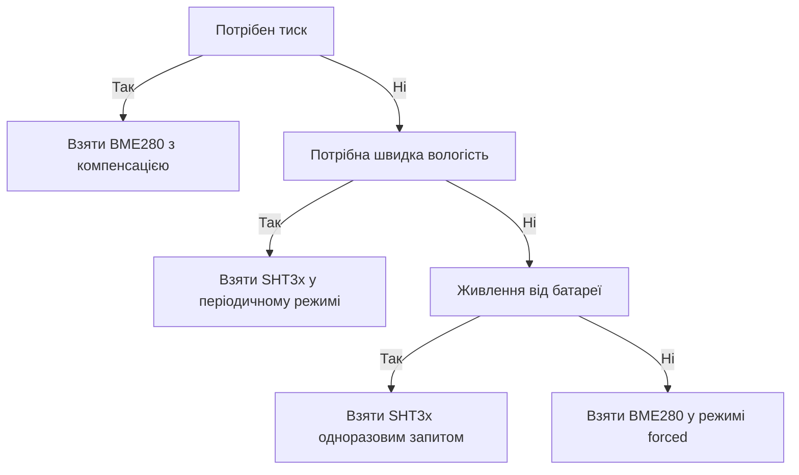

# BME280 і SHT3x - клімат по I2C

![[assets/img/stm32-bme-sht-scheme.png|600]]
*Рис. Підключення BME280 і SHT3x до STM32 по шині I2C з підтяжками і вибором адреси.*

> [!tip] Призначення ноти
> Дати повний цикл роботи з кліматичними датчиками на шині: читання калібрувальних коефіцієнтів, налаштування режимів, компенсація сирих кодів і готові функції HAL.

## 1. Призначення

BME280 вимірює температуру, вологість і тиск одним чипом і віддає висоту над рівнем моря після перерахунку. SHT3x вимірює температуру і вологість з заводським калібруванням і циклічним кодом кожного результату. Обидва датчики працюють по шині з двома дротами, тому легко ділять шину з дисплеєм, годинником і памʼяттю.

BME280 ставлять у метеостанції, де потрібен тиск і висота. SHT3x ставлять у кімнатні регулятори вологості, де важливі точність вологості і швидкий відгук. Обидва датчики живляться від 1.8-3.6 В, тому на платі з живленням 5 В потрібен стабілізатор або живлення від виводу контролера.

## 2. Карти регістрів

| Блок BME280 | Адреси | Призначення |
| --- | --- | --- |
| Ідентифікатор чипа | 0xD0 | Має читатися як 0x60, перевірка звʼязку |
| Скидання | 0xE0 | Запис коду скидання перезапускає логіку |
| Калібрування температури і тиску | 0x88-0xA1 | Коефіцієнти першого блоку |
| Калібрування вологості | 0xE1-0xE7 | Коефіцієнти другого блоку |
| Керування вологістю | 0xF2 | Передискретизація вологості |
| Статус | 0xF3 | Прапорці виміру і копіювання даних |
| Керування виміром | 0xF4 | Передискретизація температури і тиску плюс режим |
| Конфігурація | 0xF5 | Фільтр, час очікування, інтерфейс |
| Дані тиску | 0xF7-0xF9 | Сирий код тиску, старший біт уперед |
| Дані температури | 0xFA-0xFC | Сирий код температури |
| Дані вологості | 0xFD-0xFE | Сирий код вологості |

| Команда SHT3x | Код | Призначення |
| --- | --- | --- |
| Одноразовий вимір, висока точність | 0x2C06 | Стандартний запит для кімнатного регулятора |
| Одноразовий вимір, середня точність | 0x2C0D | Швидше, менше споживання |
| Одноразовий вимір, низька точність | 0x2C10 | Найшвидший, для грубих оцінок |
| Періодичний вимір | 0x2130 та сусідні | Датчик міряє сам з заданою частотою |
| Читання результату | 0xE000 | Забір даних періодичного режиму |
| Перезапуск | 0x30A2 | Програмне скидання датчика |
| Нагрівач | 0x306D | Увімкнення вбудованого нагрівача для просушки |
| Статус | 0xF32D | Прапорці стану і контрольної суми |

## 3. Обмін по шині через HAL

| Операція | Функція HAL | Нотатка |
| --- | --- | --- |
| Запис регістра BME280 | Запис у памʼять за адресою | Адреса чипа, адреса регістра, байти даних |
| Читання регістрів BME280 | Читання з памʼяті за адресою | Один виклик читає весь блок калібрування |
| Команда SHT3x | Запис двох байтів команди | Без адреси регістра, тільки код команди |
| Читання результату SHT3x | Прийом шести байтів | Два байти температури, код, два байти вологості, код |
| Перевірка готовності | Опитування статусу | BME280 повідомляє про кінець виміру прапорцем |
| Таймаут шини | Параметр виклику | 100 мс достатньо для всіх операцій ноти |

```text
Підключення кліматичних датчиків до шини:
  Лінія тактів через підтяжку 4.7 кОм до живлення 3.3 В
  Лінія даних через підтяжку 4.7 кОм до живлення 3.3 В
  Адреса BME280 вибирається рівнем виводу вибору адреси
  Адреса SHT3x вибирається рівнем виводу вибору адреси
  Конденсатор 100 нФ біля кожного корпусу датчика
  Довжина шлейфа до метра без зниження швидкості шини
```

## 4. Калібрувальні коефіцієнти з памʼяті

Головна особливість BME280 полягає в тому, що сирі коди без компенсації нічого не означають. Кожен чип має власний набір коефіцієнтів, записаних на заводі в незалежну памʼять. Драйвер зчитує ці коефіцієнти один раз після скидання і зберігає у структурі стану. Формули компенсації бере з довідника виробника без спрощень, бо спрощення дають похибку в одиниці градусів.

| Коефіцієнт | Регістри | Тип | Для чого |
| --- | --- | --- | --- |
| Перший температурний | 0x88-0x89 | Беззнаковий | Базова точка температури |
| Другий температурний | 0x8A-0x8B | Знаковий | Нахил характеристики |
| Третій температурний | 0x8C-0x8D | Знаковий | Кривизна характеристики |
| Тиск перший-третій | 0x8E-0x93 | Змішані | Базова точка тиску |
| Тиск четвертий-восьмий | 0x94-0x9F | Змішані | Нахил і кривизна тиску |
| Вологість перший | 0xA1 | Беззнаковий | Базова точка вологості |
| Вологість другий-третій | 0xE1-0xE3 | Змішані | Нахил вологості |
| Вологість четвертий-шостий | 0xE4-0xE7 | Змішані | Кривизна і зсув |

```c
#include "stm32f1xx_hal.h"

#define BME_ADDR (0x76 << 1) // адреса залежить від виводу вибору, буває 0x77

typedef struct
{
    uint16_t t1;
    int16_t t2, t3;
    uint16_t p1;
    int16_t p2, p3, p4, p5, p6, p7, p8, p9;
    uint8_t h1, h3;
    int16_t h2, h4, h5, h6;
    int32_t t_fine; // проміжна величина формул виробника
} bme_calib_t;

// Читання всього блоку калібрування одним пакетом шини.
int bme_read_calib(I2C_HandleTypeDef *hi2c, bme_calib_t *c)
{
    uint8_t b1[26];
    uint8_t b2[8];
    uint8_t h1;
    if (HAL_I2C_Mem_Read(hi2c, BME_ADDR, 0x88, 1, b1, 26, 100) != HAL_OK) return -1;
    if (HAL_I2C_Mem_Read(hi2c, BME_ADDR, 0xE1, 1, b2, 8, 100) != HAL_OK) return -2;
    if (HAL_I2C_Mem_Read(hi2c, BME_ADDR, 0xA1, 1, &h1, 1, 100) != HAL_OK) return -3;

    c->t1 = (uint16_t)(b1[1] << 8 | b1[0]);
    c->t2 = (int16_t)(b1[3] << 8 | b1[2]);
    c->t3 = (int16_t)(b1[5] << 8 | b1[4]);
    c->p1 = (uint16_t)(b1[7] << 8 | b1[6]);
    c->p2 = (int16_t)(b1[9] << 8 | b1[8]);
    c->p3 = (int16_t)(b1[11] << 8 | b1[10]);
    c->p4 = (int16_t)(b1[13] << 8 | b1[12]);
    c->p5 = (int16_t)(b1[15] << 8 | b1[14]);
    c->p6 = (int16_t)(b1[17] << 8 | b1[16]);
    c->p7 = (int16_t)(b1[19] << 8 | b1[18]);
    c->p8 = (int16_t)(b1[21] << 8 | b1[20]);
    c->p9 = (int16_t)(b1[23] << 8 | b1[22]);
    c->h1 = h1;
    c->h2 = (int16_t)(b2[1] << 8 | b2[0]);
    c->h3 = b2[2];
    c->h4 = (int16_t)((b2[3] << 4) | (b2[4] & 0x0F));
    c->h5 = (int16_t)((b2[5] << 4) | (b2[4] >> 4));
    c->h6 = (int8_t)b2[6];
    return 0;
}

// Компенсація температури за формулою виробника, соті частки градуса.
int32_t bme_comp_temp(bme_calib_t *c, int32_t adc)
{
    int32_t v1 = ((((adc >> 3) - ((int32_t)c->t1 << 1))) * c->t2) >> 11;
    int32_t v2 = (((((adc >> 4) - c->t1) * ((adc >> 4) - c->t1)) >> 12) * c->t3) >> 14;
    c->t_fine = v1 + v2;
    return (c->t_fine * 5 + 128) >> 8;
}
```

## 5. Режими forced і normal

| Режим | Як працює | Коли брати |
| --- | --- | --- |
| Сон | Виміри зупинені, споживання мікроампери | Живлення від батареї між вимірами |
| Forced | Один вимір за запитом, потім сон | Метеостанція раз на хвилину |
| Normal | Циклічні виміри з паузою | Кімнатний регулятор з частим оновленням |

У режимі forced контролер записує налаштування і режим, чекає за таблицею часу і читає блок даних. У режимі normal датчик міряє сам, а контролер забирає готові дані за перериванням готовності або опитуванням статусу. Порядок запису важливий: спочатку регістр вологості, потім регістр виміру, бо вологість фіксується разом із запуском.

## 6. Передискретизація

| Налаштування | Коефіцієнт | Ефект |
| --- | --- | --- |
| Пропуск | 0 | Канал вимкнено, швидше і менше споживання |
| Один вимір | 1 | Базова точність без усереднення |
| Подвійна | 2 | Менше шуму температури |
| Чотирикратна | 4 | Стандарт для вуличних станцій |
| Восьмикратна | 8 | Тиха вологість у приміщенні |
| Шістнадцятикратна | 16 | Максимальне усереднення тиску |

Фільтр нижніх частот згладжує стрибки тиску від протягів і дверей. Час очікування між вимірами в режимі normal підбирають так, щоб датчик встигав заснути: надто короткий період тримає чип активним і гріє кристал власним теплом. Самонагрів дає похибку до градуса, тому для точних вимірів беруть forced і паузи.

## 7. BME280 проти BMP280

| Питання | BMP280 | BME280 |
| --- | --- | --- |
| Температура | Так | Так |
| Тиск | Так | Так |
| Вологість | Немає | Так, окремий канал |
| Ідентифікатор | 0x58 | 0x60 |
| Калібрування вологості | Відсутнє | Другий блок коефіцієнтів |
| Ціна | Дешевше | Дорожче на різницю каналу вологості |
| Коли брати | Тільки тиск і висота | Повна метеостанція одним чипом |

Пастка сумісності полягає в тому, що карти регістрів схожі, і драйвер BMP280 частково читає BME280. Без другого блоку калібрування вологість виходить сміттям, а тиск зміщується. Перевірка ідентифікатора після скидання відсікає переплутані корпуси на етапі старту.

## 8. SHT3x: одноразовий і періодичний режими

| Режим SHT3x | Команда | Частота | Коли брати |
| --- | --- | --- | --- |
| Одноразовий точний | 0x2C06 | За запитом | Рідкісні виміри з батареєю |
| Одноразовий середній | 0x2C0D | За запитом | Баланс швидкості і точності |
| Одноразовий швидкий | 0x2C10 | За запитом | Грубий контроль вологості |
| Періодичний повільний | Серія 0x20xx | Раз на секунду і рідше | Логер клімату |
| Періодичний швидкий | Серія 0x27xx | До 10 разів на секунду | Регулятор з швидким контуром |

Періодичний режим зручний тим, що датчик сам тримає темп, а контролер спить між заборами даних. Кожна пара байтів результату має власний циклічний код, тому биті кадри відсікаються до перерахунку у фізичні величини. Нагрівач вмикають коротко для просушки після конденсату, а не тримають постійно.

```c
#include "stm32f1xx_hal.h"

#define SHT_ADDR (0x44 << 1) // адреса залежить від виводу вибору

// Циклічний код результату SHT3x, поліном x^8 + x^5 + x^4 + 1, старт 0xFF.
static uint8_t sht_crc(const uint8_t *d)
{
    uint8_t crc = 0xFF;
    for (int i = 0; i < 2; i++)
    {
        crc ^= d[i];
        for (int b = 0; b < 8; b++)
            crc = (crc & 0x80) ? (crc << 1) ^ 0x31 : (crc << 1);
    }
    return crc;
}

// Одноразовий вимір SHT3x. Повертає нуль при успіху.
// temp_c — соті частки градуса, rh_p/mille — тисячні частки відсотка.
int sht_single(I2C_HandleTypeDef *hi2c, int32_t *temp_centi, int32_t *rh_mille)
{
    uint8_t cmd[2] = {0x2C, 0x06};
    uint8_t rx[6];
    if (HAL_I2C_Master_Transmit(hi2c, SHT_ADDR, cmd, 2, 100) != HAL_OK) return -1;
    HAL_Delay(20);
    if (HAL_I2C_Master_Receive(hi2c, SHT_ADDR, rx, 6, 100) != HAL_OK) return -2;
    if (sht_crc(&rx[0]) != rx[2]) return -3;
    if (sht_crc(&rx[3]) != rx[5]) return -4;
    uint16_t t = (uint16_t)(rx[0] << 8 | rx[1]);
    uint16_t h = (uint16_t)(rx[3] << 8 | rx[4]);
    *temp_centi = ((int32_t)t * 17500) / 65535 - 4500;
    *rh_mille = ((int32_t)h * 100000) / 65535;
    return 0;
}
```

## 9. Висота з тиску

| Крок | Дія | Нотатка |
| --- | --- | --- |
| 1 | Виміряти тиск у гектопаскалях | Компенсований формулою виробника |
| 2 | Взяти опорний тиск на рівні моря | З місцевої метеостанції або калібрування |
| 3 | Застосувати барометричну формулу | Ступінь 0.19 для тропосфери |
| 4 | Згладити фільтром | Тиск шумить від вітру і дверей |

```text
Барометрична формула одним поглядом:
  Відношення тисків у ступені дає частку висоти
  Множник 44330 переводить частку у метри
  Опорний тиск оновлювати щодня, бо погода пливе
  Точність метри, а не сантиметри, без диференціального калібрування
```

## 10. Драйвер BME280: ініціалізація і цикл

```c
#include "stm32f1xx_hal.h"

// Налаштування forced-виміру: вологість, потім вимір.
int bme_start_forced(I2C_HandleTypeDef *hi2c)
{
    uint8_t hum = 0x01;   // передискретизація вологості
    uint8_t meas = 0x27;  // тиск і температура, режим forced
    uint8_t cfg = 0x00;   // фільтр вимкнено для одиничних вимірів
    if (HAL_I2C_Mem_Write(hi2c, BME_ADDR, 0xF2, 1, &hum, 1, 100) != HAL_OK) return -1;
    if (HAL_I2C_Mem_Write(hi2c, BME_ADDR, 0xF5, 1, &cfg, 1, 100) != HAL_OK) return -2;
    if (HAL_I2C_Mem_Write(hi2c, BME_ADDR, 0xF4, 1, &meas, 1, 100) != HAL_OK) return -3;
    return 0;
}

// Очікування готовності за прапорцем статусу.
int bme_wait_ready(I2C_HandleTypeDef *hi2c)
{
    uint8_t st;
    for (int i = 0; i < 50; i++)
    {
        if (HAL_I2C_Mem_Read(hi2c, BME_ADDR, 0xF3, 1, &st, 1, 100) != HAL_OK) return -1;
        if ((st & 0x08) == 0) return 0; // вимір завершено
        HAL_Delay(10);
    }
    return -2;
}

// Читання сирих кодів тиску, температури і вологості.
int bme_read_raw(I2C_HandleTypeDef *hi2c, int32_t *p, int32_t *t, int32_t *h)
{
    uint8_t d[8];
    if (HAL_I2C_Mem_Read(hi2c, BME_ADDR, 0xF7, 1, d, 8, 100) != HAL_OK) return -1;
    *p = ((int32_t)d[0] << 12) | ((int32_t)d[1] << 4) | (d[2] >> 4);
    *t = ((int32_t)d[3] << 12) | ((int32_t)d[4] << 4) | (d[5] >> 4);
    *h = ((int32_t)d[6] << 8) | d[7];
    return 0;
}
```

## Mermaid: вибір кліматичного датчика



## Типові помилки

| # | Помилка | Чому погано | Як правильно |
| --- | --- | --- | --- |
| 1 | Сирі коди без компенсації | Значення не мають фізичного змісту | Зчитати коефіцієнти і застосувати формули виробника |
| 2 | Запис регістра виміру перед вологістю | Вологість фіксується старою | Спочатку регістр вологості, потім регістр виміру |
| 3 | Ігнорування ідентифікатора чипа | BMP280 маскується під BME280 | Перевірити код чипа після скидання |
| 4 | Пропуск циклічного коду SHT3x | Биті кадри псують статистику | Перевіряти код кожної пари байтів |
| 5 | Часті виміри без пауз | Самонагрів кристала до градуса | Режим forced з паузами або періодичний повільний |
| 6 | Підтяжки шини до 5 В | Перевищення живлення входів датчика | Підтяжки тільки до 3.3 В, узгодження рівнів |

## Офіційні джерела

- [BME280 datasheet (Bosch Sensortec)](https://www.bosch-sensortec.com/products/environmental-sensors/humidity-sensors-bme280/) - карти регістрів, формули компенсації, режими.
- [SHT3x datasheet (Sensirion)](https://sensirion.com/products/catalog/SHT30-DIS-B) - команди виміру, циклічний код, періодичний режим.
- [BME280 driver (Bosch Sensortec software)](https://github.com/bosch-sensortec/BME280_driver) - еталонні формули компенсації для перевірки свого коду.

## Див. також

- [[Home]]
- [[04-Shini/03-I2C|шина I2C]]
- [[10-Sensori/01-DHT11-DS18B20|температура по одному дроту]]
- [[10-Sensori/03-MPU6050-IMU|рух і орієнтація]]
