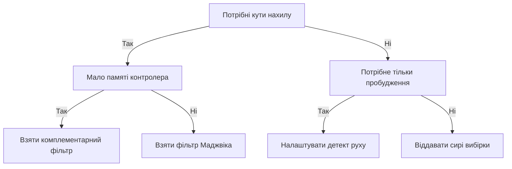

# MPU6050 і IMU - рух і орієнтація

![[assets/img/stm32-mpu-imu-scheme.png|600]]
*Рис. Підключення MPU6050 до STM32 по шині I2C з перериванням готовності даних і розвʼязкою живлення.*

> [!tip] Призначення ноти
> Дати робочу схему інерціального вузла: ініціалізація MPU6050, калібрування зсуву нуля, читання з частотою кілогерц і обчислення орієнтації на контролері.

## 1. Призначення

Акселерометр вимірює прискорення разом із силою тяжіння, тому в спокої показує вертикаль. Гіроскоп вимірює кутову швидкість обертання навколо трьох осей. Разом пара дає повну картину руху: акселерометр тримає довгострокову вертикаль, гіроскоп точно відпрацьовує швидкі повороти. MPU6050 тримає обидва сенсори в одному корпусі з цифровим виходом по шині.

Типове застосування: стабілізація платформ, керування балансом, детект падіння і пробудження за рухом. STM32 опитує датчик з частотою сотні герц або кілогерц, калібрує зсув нуля і рахує кути нахилу фільтром. Для польотних контролерів беруть вищі частоти і апаратний потік через прямий доступ до памʼяті.

## 2. Склад вузла виміру руху

| Блок | Що робить | Нотатка |
| --- | --- | --- |
| Акселерометр | Три осі прискорення з силою тяжіння | У спокої модуль вектора дорівнює одиниці |
| Гіроскоп | Три осі кутової швидкості | Нуль пливе, потрібне калібрування |
| Датчик температури | Температура кристала | Компенсація дрейфу нуля |
| Логіка переривань | Готовність даних, рух, падіння | Будить контролер без опитування |
| Допоміжна шина | Підключення магнітометра | Розширення до девʼяти осей |
| Буфер черги | Пакетне зчитування вибірок | Менше звернень по шині |

## 3. Шкали і чутливість

| Шкала акселерометра | Чутливість | Коли брати |
| --- | --- | --- |
| 2 g | 16384 одиниць на g | Нахиломір, повільні рухи, максимум точності |
| 4 g | 8192 одиниці на g | Ручне керування, різкі рухи |
| 8 g | 4096 одиниць на g | Вібрація, удари середньої сили |
| 16 g | 2048 одиниці на g | Падіння, зіткнення, спортивні снаряди |

| Шкала гіроскопа | Чутливість | Коли брати |
| --- | --- | --- |
| 250 градусів на секунду | 131 одиниця на градус | Плавні повороти платформи |
| 500 градусів на секунду | 65.5 одиниці на градус | Ручні маніпулятори |
| 1000 градусів на секунду | 32.8 одиниці на градус | Швидкі розвороти |
| 2000 градусів на секунду | 16.4 одиниці на градус | Вільне падіння з обертанням |

Чутливість читають з довідника і зберігають у константах драйвера. Перемикання шкали міняє тільки коефіцієнт перерахунку, сирі коди лишаються цілими зі знаком. Вузька шкала дає точніший нахил у спокої, широка шкала не зрізає піки при ударах.

```text
Вибір шкали одним поглядом:
  Нахил у спокої ................ акселерометр 2 g, гіроскоп 250
  Ручне керування ............... акселерометр 4 g, гіроскоп 500
  Вібрація і стрибки ............ акселерометр 8 g, гіроскоп 1000
  Падіння і удари ............... акселерометр 16 g, гіроскоп 2000
  Після зміни шкали перерахувати коефіцієнти у драйвері
```

## 4. Карта регістрів MPU6050

| Регістр | Адреса | Призначення |
| --- | --- | --- |
| Ідентифікатор | 0x75 | Має читатися як 0x68, перевірка звʼязку |
| Керування живленням | 0x6B | Вихід зі сну, вибір джерела тактування |
| Конфігурація фільтра | 0x1A | Смуга цифрового фільтра нижніх частот |
| Частота вибірок | 0x19 | Дільник частоти внутрішнього циклу |
| Конфігурація гіроскопа | 0x1B | Шкала кутової швидкості |
| Конфігурація акселерометра | 0x1C | Шкала прискорення |
| Дозвіл переривань | 0x38 | Готовність даних, рух, падіння |
| Статус переривань | 0x3A | Прапорці подій для обробника |
| Дані акселерометра | 0x3B-0x40 | Три осі старшим байтом уперед |
| Температура | 0x41-0x42 | Температура кристала |
| Дані гіроскопа | 0x43-0x48 | Три осі старшим байтом уперед |
| Керування живленням окремих осей | 0x6C | Вимкнення непотрібних каналів |

## 5. Калібрування зсуву нуля

| Крок | Дія | Нотатка |
| --- | --- | --- |
| 1 | Покласти плату нерухомо горизонтально | Будь-яка вібрація псує калібрування |
| 2 | Зібрати сотню вибірок з кожного каналу | Усереднення прибирає шум |
| 3 | Порахувати середнє гіроскопа | Це і є зсув нуля кожної осі |
| 4 | Порахувати середнє акселерометра | Вертикальна вісь має показати одиницю |
| 5 | Записати зсуви у структуру стану | Віднімати з кожної нової вибірки |
| 6 | Перевірити модуль вектора | У спокої має дорівнювати одиниці |

Калібрування повторюють після зміни живлення і при помітній зміні температури. Зсув нуля гіроскопа пливе з теплом кристала, тому вузли точної стабілізації калібрують періодично у паузах роботи. Акселерометр калібрують рідше, бо його нуль стабільніший за нуль гіроскопа.

## 6. Фільтри орієнтації: процесор датчика чи контролер

| Варіант | Де рахується | Плюси | Мінуси |
| --- | --- | --- | --- |
| Вбудований процесор руху | Усередині датчика | Готові кути, контролер вільний | Закрита логіка, складна прошивка |
| Комплементарний фільтр | На контролері | Десяток рядків коду, передбачуваний | Один коефіцієнт на всі режими |
| Фільтр Маджвіка | На контролері | Швидка збіжність, мало памʼяті | Потрібне налаштування посилення |
| Фільтр Калмана | На контролері | Найкраще при шумах | Важчий для процесора без обчислень з плавучою комою |

Комплементарний фільтр зливає швидкий гіроскоп і повільний акселерометр одним рівнянням: кут дорівнює сумі інтегрованого гіроскопа з вагою і кута акселерометра з малою вагою. Коефіцієнт близько 0.98 дає плавний нахил без ривків. Фільтр Маджвіка краще тримає швидкі розвороти, тому його беруть для ручного керування.

```c
#include <math.h>

// Комплементарний фільтр одного кута.
// angle — поточна оцінка, gyro_rate — градуси на секунду,
// acc_angle — кут з акселерометра, dt — період у секундах.
float compl_angle(float angle, float gyro_rate, float acc_angle, float dt)
{
    const float alpha = 0.98f;
    float gyro_part = angle + gyro_rate * dt;
    return alpha * gyro_part + (1.0f - alpha) * acc_angle;
}

// Кут нахилу з акселерометра, градуси.
// ax, ay, az — прискорення в одиницях сили тяжіння.
float acc_pitch(float ax, float ay, float az)
{
    return atan2f(-ax, sqrtf(ay * ay + az * az)) * 57.2958f;
}

float acc_roll(float ay, float az)
{
    return atan2f(ay, az) * 57.2958f;
}
```

## 7. Опитування 1 кГц: таймер і прямий доступ до памʼяті

| Елемент | Налаштування | Нотатка |
| --- | --- | --- |
| Таймер | Переривання 1 кГц | Стабільний період вибірок |
| Шина | Швидкість 400 кГц | Встигає забрати 14 байтів за період |
| Прямий доступ | Прийом у кільцевий буфер | Процесор не чекає кожен байт |
| Переривання готовності | Пін датчика на вхід зовнішніх переривань | Альтернатива таймеру, синхронно з чипом |
| Пріоритети | Вибірки вище телеметрії | Дані руху важливіші за вивід |

Читання одним пакетом забирає всі 14 байтів даних починаючи з адреси акселерометра. Такий пакет містить акселерометр, температуру і гіроскоп без розривів між осями. Обробник переривання таймера тільки забирає готову вибірку з буфера і ставить прапорець для фільтра.

```text
Потік вибірок 1 кГц одним поглядом:
  Таймер дає імпульс кожну мілісекунду
  Прямий доступ забирає 14 байтів з датчика у буфер
  Переривання завершення ставить прапорець готовності
  Основний цикл рахує фільтр і керування
  Телеметрія відправляється окремо з нижчим пріоритетом
```

## 8. Детект руху і вільного падіння

| Подія | Регістри порогів | Як реагувати |
| --- | --- | --- |
| Рух | Поріг і тривалість руху | Пробудження контролера зі сну |
| Вільне падіння | Поріг і мінімальна тривалість | Захист механіки, запис у журнал |
| Готовність даних | Дозвіл переривання | Синхронний забір вибірки |
| Переповнення черги | Статус черги | Збільшити частоту забирання |

Детект руху дозволяє спати роками на батареї: контролер у глибокому сні, датчик стежить за порогом і будить перериванням. Поріг ставлять вище рівня вібрації корпусу, інакше будуть хибні пробудження. Вільне падіння розпізнають за невагомістю на всіх осях одночасно протягом заданого часу.

## 9. Ініціалізація і читання через HAL

```c
#include "stm32f1xx_hal.h"

#define MPU_ADDR (0x68 << 1) // адреса залежить від виводу вибору

typedef struct
{
    int16_t ax, ay, az;
    int16_t temp;
    int16_t gx, gy, gz;
} mpu_raw_t;

typedef struct
{
    int32_t gx_off, gy_off, gz_off;
    int32_t ax_off, ay_off, az_off;
} mpu_off_t;

static int mpu_write_reg(I2C_HandleTypeDef *hi2c, uint8_t reg, uint8_t val)
{
    return (HAL_I2C_Mem_Write(hi2c, MPU_ADDR, reg, 1, &val, 1, 100) == HAL_OK) ? 0 : -1;
}

// Вихід зі сну, тактування від гіроскопа, шкали і фільтр.
int mpu_init(I2C_HandleTypeDef *hi2c)
{
    uint8_t id;
    if (HAL_I2C_Mem_Read(hi2c, MPU_ADDR, 0x75, 1, &id, 1, 100) != HAL_OK) return -1;
    if (id != 0x68) return -2; // датчик не відповідає
    if (mpu_write_reg(hi2c, 0x6B, 0x01)) return -3; // вихід зі сну
    HAL_Delay(100);
    if (mpu_write_reg(hi2c, 0x1A, 0x03)) return -4; // фільтр 44 Гц
    if (mpu_write_reg(hi2c, 0x1B, 0x00)) return -5; // гіроскоп 250
    if (mpu_write_reg(hi2c, 0x1C, 0x00)) return -6; // акселерометр 2 g
    if (mpu_write_reg(hi2c, 0x19, 0x07)) return -7; // дільник вибірок
    if (mpu_write_reg(hi2c, 0x38, 0x01)) return -8; // переривання готовності
    return 0;
}

// Пакетне читання всіх каналів одним викликом шини.
int mpu_read_raw(I2C_HandleTypeDef *hi2c, mpu_raw_t *r)
{
    uint8_t d[14];
    if (HAL_I2C_Mem_Read(hi2c, MPU_ADDR, 0x3B, 1, d, 14, 100) != HAL_OK) return -1;
    r->ax = (int16_t)(d[0] << 8 | d[1]);
    r->ay = (int16_t)(d[2] << 8 | d[3]);
    r->az = (int16_t)(d[4] << 8 | d[5]);
    r->temp = (int16_t)(d[6] << 8 | d[7]);
    r->gx = (int16_t)(d[8] << 8 | d[9]);
    r->gy = (int16_t)(d[10] << 8 | d[11]);
    r->gz = (int16_t)(d[12] << 8 | d[13]);
    return 0;
}

// Калібрування нуля по нерухомому датчику. N — кількість вибірок.
int mpu_calibrate(I2C_HandleTypeDef *hi2c, mpu_off_t *off, int n)
{
    int64_t sx = 0, sy = 0, sz = 0, px = 0, py = 0, pz = 0;
    mpu_raw_t r;
    for (int i = 0; i < n; i++)
    {
        if (mpu_read_raw(hi2c, &r)) return -1;
        sx += r.gx; sy += r.gy; sz += r.gz;
        px += r.ax; py += r.ay; pz += r.az;
        HAL_Delay(5);
    }
    off->gx_off = (int32_t)(sx / n);
    off->gy_off = (int32_t)(sy / n);
    off->gz_off = (int32_t)(sz / n);
    off->ax_off = (int32_t)(px / n);
    off->ay_off = (int32_t)(py / n);
    // Вертикальна вісь лишає одиницю тяжіння: віднімаємо тільки відхилення.
    off->az_off = (int32_t)(pz / n) - 16384;
    return 0;
}
```

## Mermaid: вибір обробки руху



## Типові помилки

| # | Помилка | Чому погано | Як правильно |
| --- | --- | --- | --- |
| 1 | Забутий вихід зі сну після живлення | Датчик мовчить, шина віддає нулі | Записати вибір тактування і почекати 100 мс |
| 2 | Читання осей окремими викликами | Осі з різних моментів, кути стрибають | Один пакет 14 байтів за раз |
| 3 | Нуль гіроскопа без калібрування | Кут пливе градусами за хвилину | Калібрувати у спокої, віднімати зсув |
| 4 | Вузька шкала при ударах | Піки зрізаються, детект падіння сліпий | Шкала за найсильнішим очікуваним рухом |
| 5 | Інтегрування гіроскопа без акселерометра | Дрейф не компенсується нічим | Зливати через комплементарний фільтр або Маджвік |
| 6 | Опитування у вільному циклі без таймера | Період плаває, інтегрування бреше | Таймер або переривання готовності з фіксованою частотою |

## Офіційні джерела

- [MPU-6050 product page (TDK InvenSense)](https://invensense.tdk.com/products/motion-tracking/6-axis/mpu-6050/) - характеристики, шкали, режими живлення.
- [MPU-6000 and MPU-6050 register map (TDK InvenSense)](https://invensense.tdk.com/wp-content/uploads/2015/02/MPU-6000-Register-Map1.pdf) - повна карта регістрів і бітів.
- [AN-Madgwick filter report (x-io)](https://x-io.co.uk/res/doc/madgwick_internal_report.pdf) - виведення фільтра орієнтації для контролера.

## Див. також

- [[Home]]
- [[04-Shini/03-I2C|шина I2C]]
- [[07-Timeri-Son/01-GPTIM-ADTIM|таймери і ШІМ]]
- [[10-Sensori/01-DHT11-DS18B20|температура по одному дроту]]
- [[10-Sensori/04-INA219-HX711|струм і вага]]
