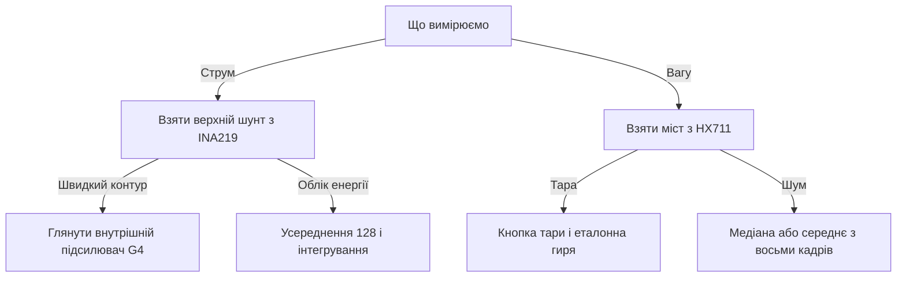

# INA219 і HX711 - струм і вага

![[assets/img/stm32-ina-hx711-scheme.png|600]]
*Рис. Вимір струму верхнім шунтом через INA219 і ваги через тензодавач з HX711 біля STM32.*

> [!tip] Призначення ноти
> Дати два точні канали малих величин: струм навантаження через шунт з цифровим виходом і вагу через міст з повільним точним перетворювачем.

## 1. Призначення

INA219 вимірює спад напруги на шунті у колі живлення і одразу віддає струм, напругу і потужність по шині. HX711 підсилює мілівольти тензодавача і віддає 24-бітний код ваги по простому двопровідному інтерфейсу. Обидва вузли закривають облік енергії і дозування: перший стежить за споживанням, другий зважує продукт.

Типова звʼязка виглядає так: STM32 читає струм десятки разів на секунду і інтегрує енергію, а вагу читає десять разів на секунду і згладжує фільтром. INA219 ставлять у розрив плюсового дроту навантаження. HX711 ставлять поруч із тензодавачем короткими дротами, щоб не збирати завади.

## 2. Порівняння каналів

| Параметр | INA219 | HX711 |
| --- | --- | --- |
| Що вимірює | Струм, напруга, потужність | Сигнал тензомоста, вага після калібрування |
| Інтерфейс | Шина з адресою | Два дроти: такти і дані |
| Розрядність | 12 біт на канал | 24 біти |
| Швидкість | Сотні вибірок на секунду | 10 або 80 вибірок на секунду |
| Живлення | 3.0-5.5 В логіки | 2.6-5.5 В, аналогова частина окремо |
| Калібрування | Один регістр під шунт | Тара і масштаб за еталонною вагою |
| Точність | Відсотки без калібрування, краще після | Проміле після калібрування гирею |
| Ціна | Недорогий модуль | Недорогий модуль з тензодавачем |

## 3. Верхній шунт: чому плюс, а не земля

| Варіант | Де стоїть шунт | Плюси | Мінуси |
| --- | --- | --- | --- |
| Верхній | У плюсовому дроті | Бачить короткі замикання на землю | Потрібен вхід з високою синфазною напругою |
| Нижній | У земляному дроті | Простий підсилювач біля нуля | Земля навантаження пливе, небезпечно для цифри |

INA219 створений саме для верхнього шунта: входи витримують синфазну напругу до 26 В при живленні логіки 3.3 В. Шунт беруть з малим опором, щоб спад не грів плату і не просаджував навантаження. Опір 0.1 Ом при струмі 2 А дає спад 0.2 В і тепло 0.4 Вт, що вже відчутно.

```text
Верхній шунт одним поглядом:
  Джерело плюс через шунт до навантаження
  Входи датчика до обох виводів шунта короткими доріжками
  Земля датчика спільна з контролером
  Фільтр 100 нФ між входами при довгих дротах
  Потужність шунта з запасом удвічі від робочої
```

## 4. Калібрувальний регістр INA219

| Регістр | Адреса | Призначення |
| --- | --- | --- |
| Конфігурація | 0x00 | Діапазони, усереднення, режими |
| Шунт | 0x01 | Сирий спад на шунті зі знаком |
| Шина | 0x02 | Напруга навантаження |
| Потужність | 0x03 | Обчислена чипом за калібруванням |
| Струм | 0x04 | Обчислений чипом за калібруванням |
| Калібрування | 0x05 | Масштаб під конкретний шунт |

Калібрувальний регістр задає, як чип перераховує коди шунта у міліампери. Формула виробника бере молодший біт струму за бажаною роздільною здатністю і ділить на опір шунта з константою. Після запису регістра регістри струму і потужності починають видавати готові фізичні величини без математики на контролері.

| Крок | Дія | Нотатка |
| --- | --- | --- |
| 1 | Вибрати шунт під максимальний струм | Спад не більше десятих вольта |
| 2 | Вибрати молодший біт струму | Наприклад 0.1 мА для малих струмів |
| 3 | Порахувати калібрувальне значення | Формула довідника з опором шунта |
| 4 | Записати регістр калібрування | Одразу після скидання чипа |
| 5 | Налаштувати усереднення | 128 вибірок для тихих вимірів |
| 6 | Перевірити на відомому навантаженні | Резистор відомого опору як еталон |

```c
#include "stm32f1xx_hal.h"

#define INA_ADDR (0x40 << 1) // адреса залежить від виводів вибору

// Запис 16-бітного регістра старшим байтом уперед.
static int ina_write(I2C_HandleTypeDef *hi2c, uint8_t reg, uint16_t val)
{
    uint8_t d[2] = {(uint8_t)(val >> 8), (uint8_t)val};
    return (HAL_I2C_Mem_Write(hi2c, INA_ADDR, reg, 1, d, 2, 100) == HAL_OK) ? 0 : -1;
}

// Читання 16-бітного регістра старшим байтом уперед.
static int ina_read(I2C_HandleTypeDef *hi2c, uint8_t reg, uint16_t *val)
{
    uint8_t d[2];
    if (HAL_I2C_Mem_Read(hi2c, INA_ADDR, reg, 1, d, 2, 100) != HAL_OK) return -1;
    *val = (uint16_t)(d[0] << 8 | d[1]);
    return 0;
}

// Калібрування під шунт 0.1 Ом, молодший біт струму 0.1 мА.
// Значення 4096 випливає з формули довідника для цих параметрів.
int ina_calib_100mohm(I2C_HandleTypeDef *hi2c)
{
    // Конфігурація: діапазон 32 В, підсилення вісім, 12 біт, усереднення 128.
    if (ina_write(hi2c, 0x00, 0x1FFF)) return -1;
    if (ina_write(hi2c, 0x05, 4096)) return -2;
    return 0;
}

// Читання струму у десятих частках міліампера і напруги у мілівольтах.
int ina_read_power(I2C_HandleTypeDef *hi2c, int32_t *current_01ma, int32_t *bus_mv)
{
    uint16_t raw_i, raw_v;
    if (ina_read(hi2c, 0x04, &raw_i)) return -1;
    if (ina_read(hi2c, 0x02, &raw_v)) return -2;
    *current_01ma = (int16_t)raw_i; // молодший біт 0.1 мА
    *bus_mv = (int32_t)((raw_v >> 3) * 4); // молодший біт 4 мВ
    return 0;
}
```

## 5. Усереднення і режими INA219

| Налаштування | Ефект | Коли брати |
| --- | --- | --- |
| Один вимір без усереднення | Швидко, шумно | Захист від перевантаження |
| Усереднення 16 | Тише у рази | Керування зарядом |
| Усереднення 128 | Тиха лабораторна точність | Облік енергії |
| Тільки шунт | Економія часу | Струм без напруги |
| Тільки шина | Економія часу | Напруга без струму |
| Циклічно обидва | Повна потужність | Постійний моніторинг |

## 6. Тензодавач і підсилення HX711

| Елемент | Опис | Нотатка |
| --- | --- | --- |
| Міст | Чотири тензорезистори | Діагональ дає мілівольти пропорційно вазі |
| Збудження | Живлення моста від чипа | Окремий стабілізований вихід |
| Канал А | Підсилення 128 або 64 | Основний канал ваги |
| Канал Б | Підсилення 32 | Допоміжний, грубіший |
| Швидкість 10 | 10 вибірок на секунду | Тихий режим за замовчуванням |
| Швидкість 80 | 80 вибірок на секунду | Швидкий режим, більше шуму |

Підсилення 128 перетворює мілівольти моста у повну шкалу перетворювача. Канал вибирається кількістю тактових імпульсів після читання: 25 імпульсів лишають канал А на 128, 26 імпульсів дають канал А на 64, 27 імпульсів перемикають на канал Б. Швидкість перемикається рівнем окремого виводу чипа.

```text
Тензодавач одним поглядом:
  Чотири дроти моста до відповідних входів чипа
  Екран кабелю на землю тільки з одного боку
  Чип біля давача, цифрові дроти до контролера довгі
  Механіка без люфтів, платформа на одному давача
  Гиря еталонна для масштабу після тари
```

## 7. Повільні 24 біти: чому так мало і так точно

| Питання | Відповідь | Нотатка |
| --- | --- | --- |
| Чому 10 вибірок | Сигма-дельта усереднює шум | Кожна вибірка вже тиха |
| Чому 24 біти | Мілівольти ділять на мільйони | Молодші біти шумлять, старші стабільні |
| Дрижання останніх цифр | Теплові шуми і вібрація | Фільтр середнім або медіаною |
| Довгі дроти аналога | Антена завад 50 Гц | Вита пара, екран, чип біля моста |
| Стрибки при вмиканні | Прогрів моста і чипа | Перші секунди відкидати |

## 8. Тара і калібрування ваги

| Крок | Дія | Нотатка |
| --- | --- | --- |
| 1 | Прогріти вузол кілька хвилин | Нуль пливе на старті |
| 2 | Прочитати нуль без навантаження | Це тара платформи |
| 3 | Покласти еталонну вагу | Гиря відомої маси по центру |
| 4 | Порахувати масштаб | Код мінус тара поділити на грами |
| 5 | Зберегти тару і масштаб | Незалежна памʼять контролера |
| 6 | Перевірити середину шкали | Лінійність моста підтверджується |

Тару оновлюють кнопкою або командою, бо пил і тара накопичуються. Масштаб зберігають після першого калібрування і не чіпають без зміни механіки. Перевірку роблять двома гирями: малою і великою, щоб побачити нелінійність кріплення.

## 9. Звʼязка з внутрішнім підсилювачем серії G4

| Питання | HX711 | Внутрішній підсилювач G4 |
| --- | --- | --- |
| Де стоїть | Окремий чип біля давача | Усередині контролера |
| Розрядність ланцюга | 24 біти повільно | 12-16 біт швидко через АЦП |
| Швидкість | 10 або 80 на секунду | Кілогерци |
| Коли брати окремий | Точні ваги, довгі дроти | Динамометр з швидкою реакцією |
| Коли брати внутрішній | Швидкий контур регулювання | Струм мотора без зовнішніх чипів |
| Комбінація | Вага повільно, струм швидко | Енергія і маса в одному вузлі |

Серія G4 має вбудовані операційні підсилювачі з виходом на внутрішній АЦП. Така звʼязка міряє струм мотора через шунт без зовнішнього чипа з частотою кілогерц. Для вагів лишають HX711, бо 24 біти повільного перетворення недосяжні для вбудованого тракту.

## 10. Читання HX711 через HAL

Інтерфейс чипа простий: лінія даних падає у низький рівень при готовності, контролер дає 24 такти і забирає біти старшим уперед. Додаткові такти вибирають канал наступного виміру. Усі операції роблять звичайними виводами без апаратної шини.

```c
#include "stm32f1xx_hal.h"

#define HX_SCK_PORT  GPIOB
#define HX_SCK_PIN   GPIO_PIN_0
#define HX_DATA_PORT GPIOB
#define HX_DATA_PIN  GPIO_PIN_1

// Чекати готовності даних з таймаутом у мілісекундах.
static int hx_wait_ready(uint32_t timeout_ms)
{
    uint32_t t0 = HAL_GetTick();
    while (HAL_GPIO_ReadPin(HX_DATA_PORT, HX_DATA_PIN) == GPIO_PIN_SET)
    {
        if ((HAL_GetTick() - t0) > timeout_ms) return -1;
    }
    return 0;
}

// Прочитати сирий 24-бітний код, старшим бітом уперед.
// pulses: 25 — канал А 128, 26 — канал А 64, 27 — канал Б 32.
int32_t hx_read_raw(int pulses)
{
    int32_t v = 0;
    for (int i = 0; i < 24; i++)
    {
        HAL_GPIO_WritePin(HX_SCK_PORT, HX_SCK_PIN, GPIO_PIN_SET);
        v = (v << 1);
        if (HAL_GPIO_ReadPin(HX_DATA_PORT, HX_DATA_PIN) == GPIO_PIN_SET) v |= 1;
        HAL_GPIO_WritePin(HX_SCK_PORT, HX_SCK_PIN, GPIO_PIN_RESET);
    }
    for (int i = 0; i < pulses - 24; i++)
    {
        HAL_GPIO_WritePin(HX_SCK_PORT, HX_SCK_PIN, GPIO_PIN_SET);
        HAL_GPIO_WritePin(HX_SCK_PORT, HX_SCK_PIN, GPIO_PIN_RESET);
    }
    // Розширення знака з 24 біт до 32 біт.
    if (v & 0x800000) v |= (int32_t)0xFF000000;
    return v;
}

// Ваги: усереднення кількох кадрів, віднімання тари, масштаб.
// scale_lsbs_per_gram — кодів на грам з калібрування.
int hx_weight(int32_t tare, int32_t scale_lsbs_per_gram, int32_t *grams)
{
    if (hx_wait_ready(500)) return -1;
    int64_t acc = 0;
    const int n = 8;
    for (int i = 0; i < n; i++)
    {
        if (hx_wait_ready(500)) return -2;
        acc += hx_read_raw(25);
    }
    int32_t avg = (int32_t)(acc / n);
    *grams = (avg - tare) / scale_lsbs_per_gram;
    return 0;
}
```

## Mermaid: вибір тракту малих величин



## Типові помилки

| # | Помилка | Чому погано | Як правильно |
| --- | --- | --- | --- |
| 1 | Шунт у земляному дроті | Земля навантаження пливе, цифра глючить | Верхній шунт з входами на високу синфазну напругу |
| 2 | Порожній калібрувальний регістр | Регістри струму і потужності стоять на нулі | Записати калібрування одразу після скидання |
| 3 | Шунт без запасу потужності | Нагрів і дрейф опору | Потужність шунта удвічі більша за робочу |
| 4 | Довгі аналогові дроти моста | Завади мережі топлять молодші біти | Чип біля давача, вита пара з екраном |
| 5 | Вага без тари і масштабу | Сирі коди не означають грами | Тара кнопкою, масштаб еталонною гирею |
| 6 | Читання HX711 без очікування готовності | Старі біти змішуються з новими | Чекати спаду лінії даних з таймаутом |

## Офіційні джерела

- [INA219 datasheet (Texas Instruments)](https://www.ti.com/product/INA219) - калібрувальний регістр, формати даних, режими усереднення.
- [HX711 datasheet (Avia Semiconductor)](https://www.aviyan.com/hx711-datasheet/) - тактування, вибір каналу, швидкості перетворення.
- [OPAMP STM32G4 reference (STMicroelectronics)](https://www.st.com/en/microcontrollers-microprocessors/stm32g4-series.html) - внутрішні підсилювачі для швидких контурів струму.

## Див. також

- [[Home]]
- [[04-Shini/03-I2C|шина I2C]]
- [[06-Analog/01-ADC|вимірювання через АЦП]]
- [[10-Sensori/02-BME280-SHT3x|клімат по I2C]]
- [[10-Sensori/03-MPU6050-IMU|рух і орієнтація]]
