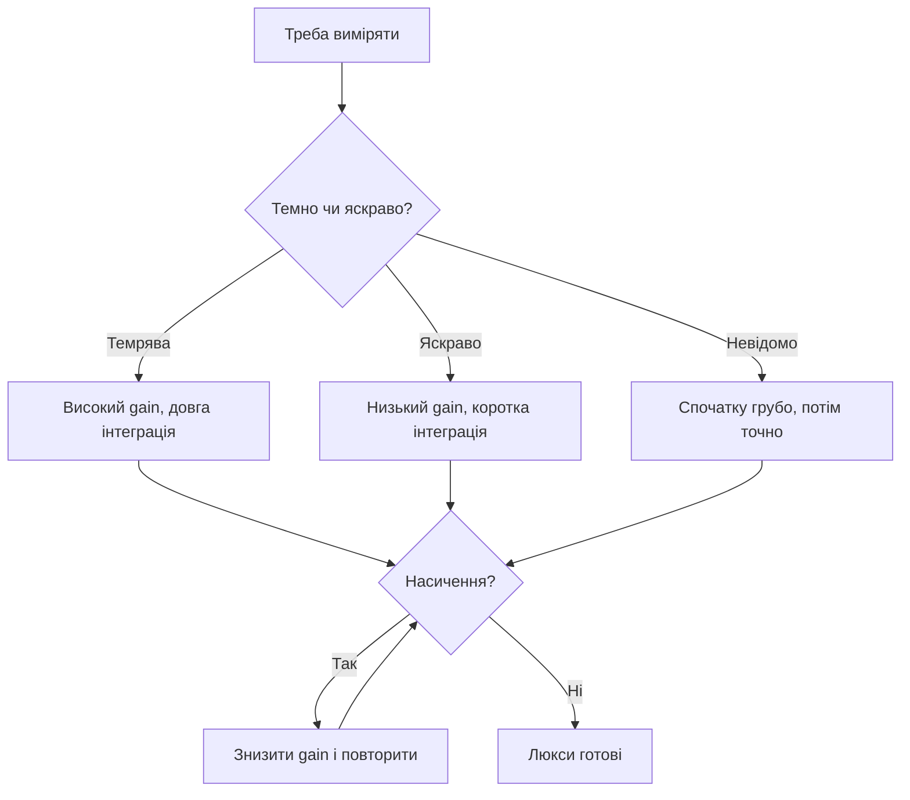

# Світло BH1750 і TSL2591 - люкси і спектр

![[assets/img/stm32-light-scheme.png|600]]
*Рис. Від фотонів до люксів: інтеграція, підсилення, спектр.*

> [!tip] Призначення ноти
> Навчити міряти освітленість чесно: діапазони, час інтеграції і вплив скла.

## 1. Призначення

Люкси керують підсвіткою, теплицями і вуличним освітленням. BH1750 простий і дешевий для «світло-темно», TSL2591 бачить видимий і інфрачервоний канали окремо для точного люксметра. Обидва вимагають правильного часу інтеграції: короткий сліпне на сонці, довгий шумить у темряві.

## Порівняння датчиків

| Параметр | BH1750 | TSL2591 |
| --- | --- | --- |
| Інтерфейс | I2C | I2C |
| Діапазон | До 65535 люкс | 188 мк - 88000 люкс |
| Канали | Один широкосмуговий | Видимий + ІЧ окремо |
| Роздільність | 1 люкс типово | Налаштовується |
| Для чого | Вулиця, теплиця | Люксметр, адаптивна підсвітка |

## Час інтеграції і підсилення

| Параметр | Ефект |
| --- | --- |
| Довга інтеграція | Точніше в темряві, повільніше |
| Коротка інтеграція | Швидше, але шумить |
| Gain високий | Темні кімнати |
| Gain низький | Пряме сонце без насичення |

```c
// BH1750: одноразовий вимір високої роздільності:
uint8_t cmd = 0x20;
HAL_I2C_Master_Transmit(&hi2c1, BH_ADDR, &cmd, 1, 100);
HAL_Delay(180);   // чекати інтеграцію!
uint8_t buf[2];
HAL_I2C_Master_Receive(&hi2c1, BH_ADDR, buf, 2, 100);
lux = ((buf[0] << 8) | buf[1]) / 1.2;
```

## Mermaid: вибір режиму



## Скло і корпус: невидимий ворог

| Проблема | Рішення |
| --- | --- |
| Тоноване скло ріже спектр | Калібрування під конкретне скло! |
| Пил на віконці | Періодично протирати |
| Вікно над датчиком маленьке | Косинус-на характеристика пливе |
| Свій пластик | Виміряти пропускання люксметром |

## ІЧ-канал TSL2591: навіщо два ока

| Тема | Практика |
| --- | --- |
| Видимий канал | Люкси для ока |
| ІЧ-канал | Тепло ламп розжарювання |
| Різниця | Розпізнає тип джерела світла |
| Формула люксів | З даташита, з обома каналами! |

## Типові помилки

| # | Помилка | Чому погано | Як правильно |
| --- | --- | --- | --- |
| 1 | Читання до кінця інтеграції | Старі або нульові дані | Чекати час з даташита! |
| 2 | Один gain на все | Насичення на сонці | Автодіапазон |
| 3 | Скло без калібрування | Мінус десятки відсотків | Калібрувати у зборі |
| 4 | Датчик у тіні корпусу | Міряє тінь, не кімнату | Вікно назовні |
| 5 | Часті виміри без потреби | Світло повільне | Раз на секунду вистачає |
| 6 | Ігнор ІЧ-каналу | Лампи брешуть у люксах | Формула з обома каналами |
| 7 | Адреса BH1750 навмання | Два варіанти піном | ADDR на землю або живлення |

## Монтаж: куди дивиться око

| Правило | Пояснення |
| --- | --- |
| Вгору або назовні | Не на стіну і не в підлогу |
| Подалі від свого LED | Своя підсвітка засліплює вимір |
| Рівень очей для кімнати | Міряємо там, де люди |

## Офіційні джерела

- [BH1750 datasheet (ROHM)](https://www.rohm.com/products/sensors-mems/ambient-light-sensor/bh1750fvi-product) - режими, таймінги.
- [TSL2591 datasheet (ams OSRAM)](https://ams-osram.com/products/sensor-solutions/ambient-light-sensors) - канали, формули.

## Калібрування під свій корпус

| Крок | Дія |
| --- | --- |
| 1 | Еталонний люксметр поруч з датчиком |
| 2 | Заміри від темряви до сонця, десяток точок |
| 3 | Коефіцієнт поправки в EEPROM вузла |
| 4 | Перевірка раз на рік - пластик жовтіє! |

## Режими виміру BH1750

| Режим | Код | Коли |
| --- | --- | --- |
| Безперервний | 0x10-0x13 | Потік для регулювання |
| Одноразовий | 0x20-0x23 | Прокинувся, виміряв, заснув |
| Сон між вимірами | Команда power down | Батарея на роки |

```c
// Економний цикл: вимір і назад у сон:
uint8_t once = 0x20;   // одноразово, висока роздільність
HAL_I2C_Master_Transmit(&hi2c1, BH_ADDR, &once, 1, 100);
HAL_Delay(180);
HAL_I2C_Master_Receive(&hi2c1, BH_ADDR, buf, 2, 100);
uint8_t down = 0x00;   // power down до наступного разу
HAL_I2C_Master_Transmit(&hi2c1, BH_ADDR, &down, 1, 100);
```

## Кейс: адаптивна підсвітка

| Поріг | Дія |
| --- | --- |
| Темніше 50 люкс | Підсвітка 100 відсотків |
| 50-300 люкс | Пропорційно менше |
| Яскравіше 500 | Вимкнено |
| Гістерезис | 20 люкс проти миготіння на межі |

## Див. також

- [[Home]]
- [[10-Sensori/02-BME280-SHT3x|клімат по I2C]]
- [[10-Sensori/06-Pressure-BMP-MS|тиск і висота]]
- [[04-Shini/03-I2C|шина обміну]]
- [[16-Proekti/01-Meteostantsiya|погодний вузол]]
