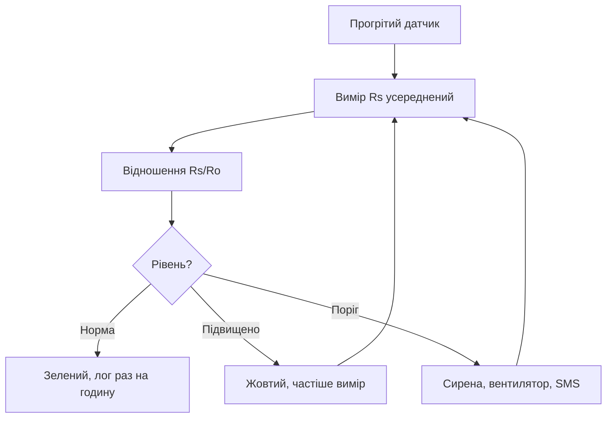

# MQ-гази - датчики диму і парів

![[assets/img/stm32-mq-gas-scheme.png|600]]
*Рис. Від опору до тривоги: прогрів, опора, пороги.*

> [!tip] Призначення ноти
> Навчити використовувати MQ як сигналізатор: прогрів, опора чистого повітря, пороги замість ppm.

## 1. Призначення

MQ-датчики чують дим, пари і витоки: MQ2 - дим і LPG, MQ7 - CO, MQ135 - якість повітря. Дешеві і всеїдні, але не вимірювальні прилади: точні ppm з них не витягти. Роль - поріг «норма/тривога» для вентиляції і сигналізації.

## Порівняння датчиків

| Датчик | Ціль | Нюанс |
| --- | --- | --- |
| MQ2 | Дим, LPG, метан | Найпоширеніший для дому |
| MQ7 | CO | Циклічний нагрів: 5 В і 1.4 В! |
| MQ135 | CO2-еквівалент, аміак | Не плутати з точним CO2! |
| MQ3 | Алкоголь | Алкотестери |

## Прогрів: доба, не хвилини

| Тема | Практика |
| --- | --- |
| Перший старт | 24+ годин прогріву перед калібруванням! |
| Нагрівач | Десятки мА постійно - бюджет батареї |
| Режим сну | Вимикати нагрівач, але потім знову прогрів |
| Зберігання | Без агресивних парів, інакше отруєння сенсора |

## Калібрування по чистому повітрю

| Крок | Дія |
| --- | --- |
| 1 | Винести на вулицю після прогріву |
| 2 | Заміряти опір Ro чистого повітря |
| 3 | Записати Ro в EEPROM вузла |
| 4 | Пороги як відношення Rs/Ro! |

```c
// Читання з усередненням (шум нагрівача!):
uint32_t sum = 0;
for (int i = 0; i < 64; i++) {
  HAL_ADC_Start(&hadc1);
  HAL_ADC_PollForConversion(&hadc1, 10);
  sum += HAL_ADC_GetValue(&hadc1);
}
uint16_t adc = sum / 64;
```

## Mermaid: від виміру до тривоги



## Пороги, не ppm

| Тема | Практика |
| --- | --- |
| Крива з даташита | Логарифмічна, приблизна |
| Температура і вологість | Зсувають показання - поправка з BME! |
| Два пороги | Попередження і тривога з гістерезисом |
| Тест димом | Перевірка спрацьовування при монтажі |

## Типові помилки

| # | Помилка | Чому погано | Як правильно |
| --- | --- | --- | --- |
| 1 | Без прогріву | Бреше в рази | 24+ годин перед калібруванням |
| 2 | Точні ppm з MQ | Фізика не дає | Пороги норма/тривога |
| 3 | Нагрівач від батареї постійно | Батарея сідає | Мережеве живлення або рідкісні цикли |
| 4 | Ro з кімнати | Опора брудна | Тільки вулиця! |
| 5 | MQ135 як CO2-метр | Еквівалент, не ppm | Точний CO2 - SCD40 |
| 6 | Без гістерезису | Реле смикається | Два пороги |
| 7 | MQ7 на постійних 5 В | Перегрів чутливого шару | Цикл 5 В / 1.4 В за даташитом! |

| Цикл MQ7 | 60 с на 5 В, 90 с на 1.4 В - вимір наприкінці низької фази |

## Живлення нагрівача: струм і ключ

| Тема | Практика |
| --- | --- |
| Струм нагрівача | 150+ мА на датчик - рахувати в бюджет! |
| Ключ MOSFET | Вимикати між циклами виміру |
| Прогрів після сну | Хвилини, не секунди |
| USB вистачає | Один-два датчики, не грядка |

## Офіційні джерела

- [MQ-2 sensor (Winsen)](https://www.winsen-sensor.com/product/mq-2.html) - криві, прогрів, схема.
- [MQ-7B sensor (Winsen)](https://www.winsen-sensor.com/sensors/co-sensor/mq-7b.html) - циклічний нагрів.

## Модуль чи голий датчик

| Варіант | Плюси | Мінуси |
| --- | --- | --- |
| Модуль з компаратором | Поріг крутилкою, цифра одразу | Немає точності, тільки факт |
| Голий + АЦП чипа | Аналог і два пороги в коді | Треба дільник і фільтр |
| Модуль + аналоговий вихід | Обидва світи | Найкраще для старту |

## Керування вентиляцією за MQ

| Рівень | Дія |
| --- | --- |
| Норма | Вентилятор мінімум |
| Підвищено | Оберти вгору, лог частіше |
| Тривога | Сирена, максимум, повідомлення |

```text
Логіка з гістерезисом:
  тривога при Rs/Ro нижче порога;
  скидання тільки коли повернулось з запасом;
  без запасу реле клацає на межі.
```

## Довговічність: коли міняти

| Тема | Практика |
| --- | --- |
| Життя сенсора | Роки в чистому, місяці в агресії |
| Перевірка чутливості | Тестовий газ раз на півроку |
| Зберігання запасних | Герметично, без парів |
| Дата встановлення | На корпусі маркером! |
| Запасний датчик | Прогріти до встановлення, не в день монтажу |

## Див. також

- [[Home]]
- [[10-Sensori/07-CO2-SCD-MHZ|точний вуглекислий газ]]
- [[06-Analog/01-ADC|вимірювання сигналу]]
- [[02-Zhivlennya/01-Lancjugi-zhivlennya|ланцюги живлення]]
- [[16-Proekti/01-Meteostantsiya|погодний вузол]]
