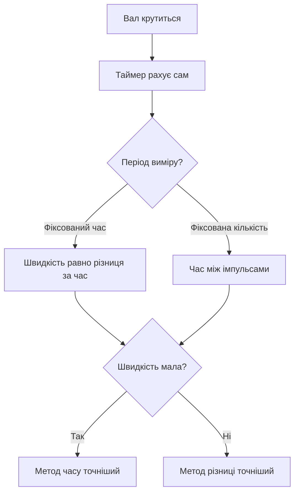

# Енкодери - квадратура, швидкість і позиція

![[assets/img/stm32-encoder-scheme.png|600]]
*Рис. Два канали зі зсувом: напрям з фази, позиція з підрахунку.*

> [!tip] Призначення ноти
> Навчити читати оберти залізом: таймер рахує сам, ядро лише знімає значення.

## 1. Призначення

Енкодер каже, куди і як швидко крутиться вал: мотори, ручки, лінійні осі. Два канали A і B зі зсувом 90 градусів дають напрям, їхні фронти - позицію. Таймер STM32 в encoder-режимі рахує все сам: ні переривань на кожен імпульс, ні пропущених кроків.

## Сигнали A, B, Z

| Сигнал | Роль |
| --- | --- |
| A | Імпульси позиції |
| B | Той же, зі зсувом - напрям зі зсуву фаз! |
| Z (індекс) | Один імпульс на оберт - нульова мітка |

```text
Напрям за 10 секунд:
  A випереджає B — крутиться в один бік;
  B випереджає A — у протилежний.
  Таймер розбирає сам, код лише читає напрям бітом.
```

## Encoder-режим таймера

| Налаштування | Значення |
| --- | --- |
| Режим | Encoder mode 3: рахує по обох фронтах обох каналів |
| Роздільність | Імпульси енкодера помножити на 4! |
| Фільтр входів | Від дребезгу механіки |
| Переповнення | 16-біт вистачає між опитуваннями |

```c
// Старт підрахунку:
HAL_TIM_Encoder_Start(&htim3, TIM_CHANNEL_ALL);
// Читання позиції будь-коли:
int32_t pos = (int32_t)__HAL_TIM_GET_COUNTER(&htim3);
```

## Mermaid: від імпульсів до швидкості



## Швидкість двома методами

| Метод | Формула | Коли точніший |
| --- | --- | --- |
| Різниця за час | (pos2-pos1) / dt | Швидкі оберти |
| Час між імпульсами | 1 / dt_імпульсу | Повільні оберти |
| Комбінація | Перемикання за порогом | Широкий діапазон |

## Дребезг і завади: фільтр заліза

| Тема | Практика |
| --- | --- |
| Механічний дребезг | Цифровий фільтр таймера, не код! |
| Довгі лінії | Диференційний драйвер або екран |
| Підтяжки | Щоб входи не висіли в повітрі |
| Z-мітка | Скидання позиції раз на оберт |

## Абсолютні енкодери: коротко

| Тип | Відмінність |
| --- | --- |
| Інкрементальний | Рахує від ввімкнення, Z дає нуль |
| Абсолютний SSI/BiSS | Позиція одразу, протокол послідовний |
| Магнітний AS5600 | 12 біт по I2C або ШІМ-вихід |

## Типові помилки

| # | Помилка | Чому погано | Як правильно |
| --- | --- | --- | --- |
| 1 | Рахунок перериваннями | Пропуски на швидкості | Encoder-режим таймера! |
| 2 | Без фільтра на механіці | Дребезг множить кроки | Фільтр входів таймера |
| 3 | 16 біт без обробки переповнення | Стрибок позиції | 32-бітний накопичувач у коді |
| 4 | Швидкість одним методом | Бреше на краях діапазону | Два методи з перемиканням |
| 5 | Входи без підтяжок | Ложні імпульси | Підтяжки завжди |
| 6 | Z ігнорується | Дрейф нуля | Скидання по індексу |
| 7 | Довгі неекрановані лінії | Завади як кроки | Екран і фільтр |

## Офіційні джерела

- [AN4013 Timers overview (ST)](https://www.st.com/resource/en/application_note/an4013.pdf) - encoder-режим таймерів.
- [AS5600 datasheet (ams OSRAM)](https://ams-osram.com/products/sensor-solutions/position-sensors) - магнітний енкодер.

## 32-бітний накопичувач поверх 16 біт

```c
// Розширення лічильника без втрат:
static int32_t pos32 = 0;
static uint16_t prev = 0;
void encoder_poll(void)
{
  uint16_t cur = __HAL_TIM_GET_COUNTER(&htim3);
  int16_t delta = (int16_t)(cur - prev);  // знаковий!
  pos32 += delta;
  prev = cur;
}
```

> Опитувати частіше, ніж лічильник робить півоберта, інакше знакова різниця бреше!

## Ручка-регулятор для HMI

| Тема | Практика |
| --- | --- |
| Крок ручки | Клацання енкодера - подія, не позиція |
| Прискорення | Швидке крутіння - більший крок |
| Кнопка в осі | Натискання - ввід, крутіння - вибір |
| Дребезг дешевих | Фільтр плюс антидребезг за часом |

## Лінійні енкодери: та сама квадратура

| Тема | Практика |
| --- | --- |
| Лінійка замість диска | Позиція в міліметрах |
| Крок лінійки | Мікрометри в прецизійних |
| Бруд на лінійці | Пропуски - чистити і закривати |
| Той же таймер | Режим не міняється! |

## Див. також

- [[Home]]
- [[07-Timeri-Son/01-GPTIM-ADTIM|таймери і ШІМ]]
- [[10-Sensori/03-MPU6050-IMU|рух і орієнтація]]
- [[03-GPIO/01-GPIO-rezhimi|режими пінів]]
- [[11-Vivid/03-Servo-Rele-MOSFET-WS2812|силові виходи]]
