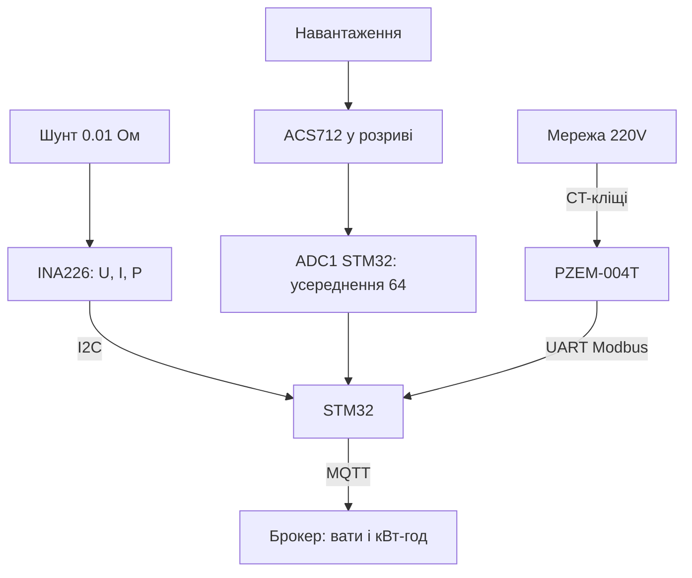

# STM32 міряє струм і потужність - ACS712, INA226, PZEM-004T

![[assets/img/stm32-strum-power-scheme.png|600]]
*Рис. Три рівні вимірювання: ACS712 в розрив кола, INA226 на шунті по I2C, PZEM-004T як готовий лічильник.*

> [!tip] Що це за нота
> Від «скільки вольт» до «скільки ват-годин»: три перевірені способи міряти струм з STM32 - від копійчаного Холла до лічильника з екраном. База: [[10-Sensori/04-INA219-HX711|INA219 і тензодатчики]], [[06-Analog/01-ADC|АЦП STM32]], [[06-Analog/05-Shunt-OPAMP|шунт і операційний підсилювач]].

## 1. Мета

Закрити вимірювання струму для трьох сценаріїв:

- DC до 30 А з гальванічною розв'язкою - ACS712;
- точний облік малої потужності (сонячні вузли, батареї) - INA226;
- мережа 220V без паяння високовольтної частини - PZEM-004T;
- з усього цього - вати, ампер-години і MQTT-телеметрія.

| Датчик | Діапазон | Точність | Інтерфейс |
| --- | --- | --- | --- |
| ACS712-05/20/30 | 5/20/30 А DC+AC | ~1.5 %, шум ~20 мА | аналог, 185/100/66 мВ/А |
| INA226 | 0-36V, шунт на вибір | 0.1 %, 16 біт | I2C, алерти |
| PZEM-004T | 220V, до 100 А з CT | ~1 % | UART Modbus, готовий |

## 2. Архітектура



Правило безпеки: STM32 і низьковольтна частина гальванічно відділені від 220V тільки через CT-кліщі PZEM. Жодних «шунтів у фазі».

## 3. ACS712: Холл у розриві

- нуль струму - VCC/2 (2.5V при 5V живленні), чутливість за версією: 185, 100 або 66 мВ/А;
- модуль живимо 5V, вихід читаємо АЦП 3.3V - дільника не треба, бо 2.5V + пік влізає;
- смуга 80 кГц, але нам треба DC: усереднюємо 64 виміри, викидаємо min/max;
- калібрування нуля - при вимкеному навантаженні, зберігаємо в EEPROM.

## 4. INA226: прецизійний облік

- шунт 0.01 Ом / 2W на 3 А: падіння 30 мВ, втрати 90 мВт;
- адреса 0x40-0x4F перемичками A0/A1, на одній шині до 16 штук;
- усереднення х64 і час конверсії 1.1 мс - шум падає до мікровольтів;
- регістр MASK/ENABLE - апаратний алерт при перевищенні струму, ведемо на EXTI;
- рахуємо заряд: інтегруємо струм по часу в RTC-домені.

## 5. Робочий код HAL

```c
float acs_read_amps(void) {
  uint32_t sum = 0, mn = 4096, mx = 0;
  for (int i = 0; i < 64; i++) {
    HAL_ADC_Start(&hadc1);
    HAL_ADC_PollForConversion(&hadc1, 10);
    uint32_t v = HAL_ADC_GetValue(&hadc1);
    sum += v;
    if (v < mn) mn = v;
    if (v > mx) mx = v;
  }
  sum -= mn + mx;
  float mv = (sum / 62.0f) * 3300.0f / 4095.0f;
  return (mv - acs_zero_mv) / 66.0f;
}

float ina_read_amps(void) {
  uint8_t reg = 0x04;
  uint8_t buf[2];
  HAL_I2C_Master_Transmit(&hi2c1, 0x80, &reg, 1, 50);
  HAL_I2C_Master_Receive(&hi2c1, 0x80, buf, 2, 50);
  int16_t raw = (buf[0] << 8) | buf[1];
  return raw * 0.0005f;
}
```

Коефіцієнт 66.0 - для версії 30 А; для 5 А ставимо 185.0, для 20 А - 100.0. `acs_zero_mv` калібруємо при нулі.

## 5.1 Облік енергії: ампер-години в коді

```c
static float ah_acc = 0;
static uint32_t ah_last = 0;

void energy_tick(float amps) {
  uint32_t now = HAL_GetTick();
  float dt_h = (now - ah_last) / 3600000.0f;
  ah_last = now;
  ah_acc += amps * dt_h;
  if (amps < 0.02f) return;
  mqtt_publish_float("energy/ah", ah_acc);
}
```

Викликаємо раз на секунду з усередненим струмом. Нульовий поріг 20 мА відсікає шум Холла. Раз на годину пишемо `ah_acc` у flash - після ребута облік продовжується.

## 6. PZEM-004T по Modbus

| Крок | Дія |
| --- | --- |
| Підключення | CT-кліщі на фазу, живлення модуля 5V, UART 9600 |
| Запит | `B0 C0 A8 01 00 00 1D 94` - читання регістрів |
| Відповідь | напруга, струм, потужність, енергія, частота, PF |
| Адреса | одна на шині за замовчуванням, міняється командою |
| Міст | далі публікуємо через [[12-Moduli-zvyazku/06-WiFi-ESP-AT | WiFi-модем]] або [[15-Protokoli/01-Modbus | Modbus-шину]] |

Енергію (кВт-год) рахує сам модуль і не скидає при перезавантаженні - лічильник готовий з коробки.

## 7. Калібрування і повірка

- ACS712: нуль без навантаження, масштаб - еталонним навантаженням 1 А (лампа + мультиметр);
- INA226: калібрувальний регістр = 0.00512 / (Rшунт × Imax), перевірка лабораторним БЖ;
- PZEM: звірка з побутовим лічильником за добу, розбіжність до 2 % - норма;
- температурний дрейф Холла - перекалібрування нуля раз на сезон.

## 8. Типові помилки

| Симптом | Причина | Лікування |
| --- | --- | --- |
| ACS712 показує 0.5 А без навантаження | не знятий зсув нуля | калібрування нуля, зберегти в EEPROM |
| Стрибки ±200 мА | шум ШІМ і сусідніх кіл | кручена пара, RC-фільтр 1 кОм + 100 нФ, усереднення |
| INA226 читає нулі | не та адреса (A0/A1) | сканер I2C, перевірити перемички 0x40-0x4F |
| PZEM мовчить | не той бод або адреса | 9600 8N1, запит читання за мануалом |
| Вати не сходяться з лічильником | CT-кліщі не на тій фазі або відкриті | кліщі щільно, стрілка за струмом |
| Дрейф нуля в спеку | нагрів Холла | перекалібрування, або перехід на INA226 |

## 9. Суміжні ноти

- [[10-Sensori/04-INA219-HX711|INA219 і тензодатчики]] - молодший брат INA226.
- [[06-Analog/05-Shunt-OPAMP|шунт і операційний підсилювач]] - аналоговий фронт-енд.
- [[06-Analog/01-ADC|АЦП STM32]] - розрядність, VREF, DMA.
- [[16-Proekti/03-Energomonitor|монітор енергії]] - готовий проєкт.
- [[15-Protokoli/01-Modbus|протокол Modbus]] - PZEM як слейв.

## Офіційні джерела

- [ACS712 Current Sensor Carrier (Pololu)](https://www.pololu.com/product/2198) - версії 5/20/30 А, чутливість.
- [INA226 (Texas Instruments)](https://www.ti.com/product/INA226) - регістри, калібрування, алерти.
- [PZEM-004T (Peacefair)](https://peacefair.cn/product/pzem-004t/) - протокол, CT-кліщі.
- [Arduino-INA226 (jarzebski, GitHub)](https://github.com/jarzebski/Arduino-INA226) - еталонна математика драйвера.
